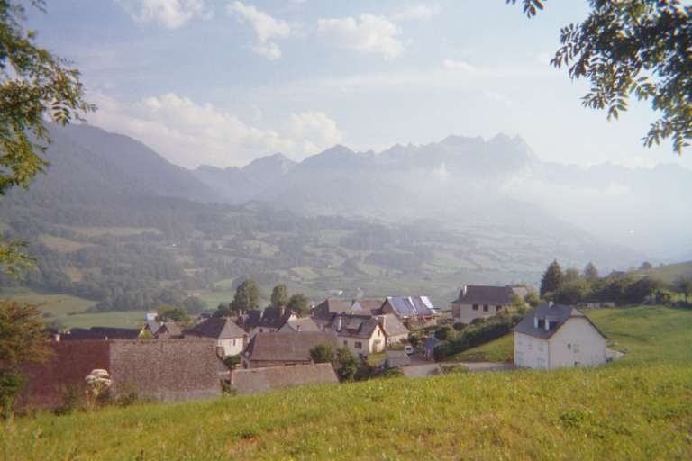
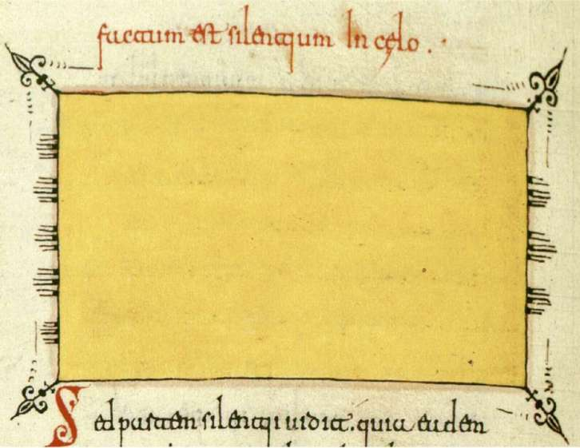
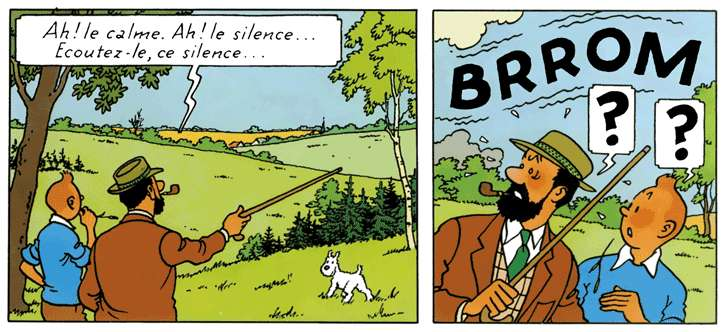

 
<h1 style="font-size: 1.3rem;">836 descriptions de paysage sonore trouvées dans la littérature.</h1>
 

<a
href="https://fr.wikipedia.org/wiki/Mythologie_m%C3%A9sopotamienne"
target="_blank">Mythologie mésopotamienne</a> 
<a
href="https://fr.wikipedia.org/wiki/%C3%89pop%C3%A9e_de_Gilgamesh#Cinqui%C3%A8me_tablette_:_le_combat_contre_Humbaba"
target="_blank">Épopée de Gilgamesh - Tablette V</a> - Traduction à
partir de <a href="https://fr.wikipedia.org/wiki/Andrew_R._George"
target="_blank">Andrew R. George</a> 
2003 .. 1595 av. J.-C. 
 
"À travers toute la forêt, un oiseau commence à chanter : 
... se répondent les uns aux autres, le bruit était un vacarme
incessant, 
Un grillon solitaire entame un chœur bruyant, 
... chantent une chanson, faisant la ... flûte fort. 
Une palombe gazouille, une tourterelle lui répond. 
À l'appel de la cigogne, la forêt jubile, 
Au cri du francolin, la forêt jubile pleinement. 
Les mères-singe chantent à haute voix, un jeune singe crie : 
Tel un orchestre de musiciens et de percussionnistes, 
Chaque jour ils font retentir cette symphonie devant Humbaba." 

 

<a
href="https://fr.wikipedia.org/wiki/Mythologie_m%C3%A9sopotamienne"
target="_blank">Mythologie mésopotamienne</a> 
<a href="https://fr.wikipedia.org/wiki/Mythe_d%27Atrahasis"
target="_blank">Mythe d'Atrahasis</a> - Traduction de Jean Bottéro et
Samuel Noah Kramer 
cité dans : <a
href="https://theses.hal.science/tel-00770955v1/document"
target="_blank">Bruit et émotion dans la littérature akkadienne</a> de
Anne-Caroline Rendu Loisel 
1600 av. J.-C. 
 
"Il ne s’était pas encore écoulé 1200 ans, que le pays augmenta, et le
peuple devint trop nombreux. Comme un boeuf, le pays mugissait. Par
leur
vacarme, le dieu fut troublé. Enlil, ayant entendu leur tapage, déclara
aux grands dieux : « le tapage de l’humanité est devenu trop pesant
pour moi. Par leur vacarme, je suis privé de sommeil... qu’il y ait une
peste. » " 
 
"On ne se voyait plus l’un l’autre, on ne se reconnaissait plus dans la
destruction. Le déluge mugissait comme un taureau, le vent braillait
comme une mule sauvage. Les ténèbres étaient denses. Il n’y avait plus
de soleil !" 

 

<a
href="https://fr.wikipedia.org/wiki/Litt%C3%A9rature_de_l%27%C3%89gypte_antique"
target="_blank">Égypte antique</a> 
Anonyme - <a href="https://fr.wikipedia.org/wiki/Papyrus_Ebers"
target="_blank">Papyrus Ebers</a> - Traduction (1956) de Gustave
Lefebvre dans <a href="https://archive.org/details/Lefebvre1956/"
target="_blank">Essai sur la médecine égyptienne de l'époque
pharaonique</a> 
16e siècle av. J.-C. 
 
"... le souffle de la vie entrant par l'oreille droite et le souffle de
la mort entrant par l'oreille gauche." 

 

<a
href="https://fr.wikipedia.org/wiki/Mythologie_m%C3%A9sopotamienne"
target="_blank">Mythologie mésopotamienne</a> 
Anonyme - <a href="https://fr.wikipedia.org/wiki/Enuma_Anu_Enlil"
target="_blank">Enuma
Anu Enlil</a> - Tablette 44 - <a
href="https://revues.droz.org/RR/article/view/RR_31_197-209/html"
target="_blank">Traduction (2011) de Anne-Caroline Rendu Loisel</a> 
1600 .. 1200 av. J.-C. 
 
Adad, le tonnerre 
 
"Si Adad tonne comme un dragon... 
Si Adad tonne comme un scorpion... 
Si Adad tonne comme un serpent de chemin ? ... 
Si Adad tonne comme un francolin, Adad détruira la récolte. 
Si Adad tonne comme un chien, Adad détruira l’armée. 
Si Adad tonne comme un chiot, la débilité / mollesse... 
Si Adad tonne comme une souris, le roi, une rébellion l'a capturé. 
Si Adad tonne comme une martre, le roi son fils l’assassinera. 
Si Adad tonne comme un lion, levée de la troupe d’Ummān-manda qui n’a
pas de rival. 
Si Adad tonne comme un tambour-halhallatu,
Adad frappera. 
Si Adad tonne comme un lion, le roi disparaîtra. 
Si Adad tonne comme un loup, le fils du roi sera assassiné. 
Si Adad tonne comme le beuglement d’un bœuf, le roi ses biens
disparaîtront. 
Si Adad tonne comme un bouc, sceptre de Nissaba, la descendance sera
détruite. 
Si Adad tonne comme un taureau / tambour-alû, un roi absolu, son pays sera
conquis. 
Si Adad tonne comme une timbale-lilissu,
le fils du roi se révoltera contre son père. 
Si Adad tonne comme un cheval, ce pays ira droit devant lui. 
Si Adad tonne comme un âne, la mesure du gur sera divisée dans la ville
et les champs cultivés diminueront. 
Si Adad tonne comme une oie, le pays connaîtra la famine. 
Si Adad tonne comme un ramier, le pays vendra ses (ressources de) base
pour de l’argent." 

 

<a
href="https://fr.wikipedia.org/wiki/Litt%C3%A9rature_de_l%27%C3%89gypte_antique"
target="_blank">Égypte antique</a> 
Anonyme - <a href="https://fr.wikipedia.org/wiki/Papyrus_Westcar"
target="_blank">Papyrus Westcar</a> 
<a href="https://gallica.bnf.fr/ark:/12148/bpt6k36147z/f118.item"
target="_blank">Le Roi Khoufouî et les Magiciens - Traduction (1911)
de Gaston Maspero</a> 
1550 .. 1292 av. J.-C.&nbsp; (XVIIIe dynastie) 
 
"La servante alla et elle ouvrit la chambre ; elle entendit des voix,
du chant, de la musique, des danses, du zaggarit, tout ce qu’on fait à
un roi, dans la chambre. Elle revint, elle rapporta tout ce qu’elle
avait entendu à Roudîtdidît. Celle-ci parcourut la chambre et elle ne
trouva point la place d’où le bruit venait. Elle appliqua sa tempe
contre la huche et elle trouva que le bruit était à l’intérieur : elle
mit donc la huche dans un coffre en bois, elle apposa un autre sceau,
elle l’entoura de cuir, elle plaça le tout dans la chambre où étaient
ses vases et elle ferma celle-ci de son sceau." 

 

<a
href="https://fr.wikipedia.org/wiki/Hom%C3%A8re" target="_blank">Homère</a> 
<a
href="https://www.academia.edu/69615506/Hom%C3%A8re_LIliade_et_LOdyss%C3%A9e_tr_Robert_Flaceli%C3%A8re_et_Victor_B%C3%A9rard_1955_"
target="_blank">L'Iliade - Traduction (1955) de Robert Flacelière</a> 
8e siècle av. J.-C. 
 
Chant II - Catalogue achéen 
 
"&nbsp;&nbsp;&nbsp; L'armée avance à la façon d'un incendie qui se
déchaînerait dans toute
la contrée. Et la terre gémit, comme autrefois sous le courroux de Zeus
Tonnant, quand la foudre cingla le sol près de Typhée, au pays des
Arimes, où se trouve, dit-on, le gîte de ce monstre. Ainsi gémit la
terre à grand bruit sous leurs pas, tandis qu'en marchant vite ils
traversent la plaine." 
 
Chant IV - DÉBUT DE LA BATAILLE 
 
"&nbsp;&nbsp;&nbsp; Quand la houle marine en flots pressés déferle au
souffle du Zéphyr
sur la grève sonore, les vagues tout d'abord se soulèvent au large,
puis viennent se briser sur la terre à grand bruit ; on les voit se
gonfler autour des promontoires, dresser haut dans les airs leur crête,
puis cracher l'écume de la mer : de même, en flots pressés, les
bataillons argiens marchant vers le combat s'ébranlent sans répit.
Chaque chef exhortant sa troupe, les soldats avancent en silence. On ne
croirait jamais que cheminent ensemble un si grand nombre d'hommes,
dont chacun, dans sa gorge, est doué d'une voix. Ils vont, silencieux,
par crainte de leurs chefs. 
... 
&nbsp;&nbsp;&nbsp; Les Troyens font penser, en revanche, aux brebis
qui, très nombreuses,
dans l'enclos d'un homme riche, quand on trait leur lait blanc,
poussent, en écoutant l'appel de leurs agneaux, des bêlements sans fin
: pareille est la clameur qui monte de l'armée immense des Troyens.
Tous n'ont pas même accent ni semblable parler ; leurs langues sont
diverses : ce sont des gens venus de pays si nombreux !" 
 
Chant XVI - MORT DE SARPÉDON 
 
"Comme monte, dans les vallons d'une montagne, le bruit des bûcherons,
que l'on entend de loin : tel monte, de la terre immense, le fracas que
font les combattants avec l'airain, le cuir et les peaux travaillées,
sous le choc des épieux, des piques à deux pointes. Même un homme avisé
ne reconnaîtrait plus le divin Sarpédon, car, de la tête aux pieds, il
est couvert de plaies, de sang et de poussière. Et sans relâche autour
du cadavre ils se pressent, comme, aux jours du printemps, les mouches
qui bourdonnent, dans une étable, autour des vases pleins de lait :
ainsi les combattants autour du corps se pressent." 
 
Chant XXI - LA LUTTE DES DIEUX 
 
"Alors à grand fracas l'un sur l'autre ils se ruent. La terre immense
gronde. Le ciel vaste à l'entour claironne la bataille. Zeus, assis sur
l'Olympe, entend, et son coeur rit, joyeux de voir les dieux entrer
dans la mêlée."

 

<a
href="https://fr.wikipedia.org/wiki/Hom%C3%A8re" target="_blank">Homère</a> 
<a href="https://fr.wikipedia.org/wiki/Odyss%C3%A9e" target="_blank">L'Odyssée</a> 
VIIIe siècle av. J.-C. 
 
<a
href="https://www.academia.edu/69615506/Hom%C3%A8re_LIliade_et_LOdyss%C3%A9e_tr_Robert_Flaceli%C3%A8re_et_Victor_B%C3%A9rard_1955"
target="_blank">Traduction (1955) de Victor Bérard</a> 
 
Chant IX - LE CYCLOPE 
 
"... C'est ainsi qu'en son oeil, nous tenions et tournions notre pointe
de feu, et le sang bouillonnait autour du pieu brûlant : paupière et
sourcils n'étaient plus que vapeurs de la prunelle en flammes, tandis
qu'en grésillant, les racines flambaient... [Dans l'eau froide du bain
qui trempe le métal, quand le maître bronzier plonge une grosse hache
ou bien une doloire, le fer crie et gémit. C'est ainsi qu'en son oeil,
notre olivier sifflait...] Il eut un cri de fauve. La roche retentit.
Mais nous, épouvantés, nous étions déjà loin." 
 
<a
href="https://fr.wikisource.org/wiki/L%E2%80%99Odyss%C3%A9e/Traduction_Bareste"
target="_blank">Traduction (1842) de Eugène Bareste</a> 
 
Livre XII - Charybde, Scylla 
 
"&nbsp;&nbsp;&nbsp; Enfin nous entrons en gémissant dans le détroit.
D'un côté se trouve Scylla, et de l'autre la redoutable Charybde qui
dévore avec fracas l'onde amère. Quand celle-ci vomit les vagues
qu'elle vient d'engloutir, la mer murmure en bouillonnant comme l'eau
d'un bassin placé sur un ardent foyer, et l'écume jaillit dans les airs
jusque sur les sommets élevés des deux écueils. Mais lorsque Charybde
absorbe l'onde, la mer se creuse avec bruit ; les flots se brisent en
mugissant autour du rocher, et dans le fond de l'abîme la terre laisse
apparaître une arène bleuâtre : mes compagnons sont saisis d'épouvante." 

 

<a
href="https://fr.wikipedia.org/wiki/H%C3%A9siode" target="_blank">Hésiode</a> 
<a
href="https://fr.wikipedia.org/wiki/Th%C3%A9ogonie_%28H%C3%A9siode%29"
target="_blank">La Théogonie</a> 
8e siècle av. J.-C. 
 
<a href="https://www.laviedesclassiques.fr/anthologie-theogonique"
target="_blank">Traduction (1928) de Paul Mazon</a> 
 
La prison infernale 
 
"Terriblement, à l’entour, grondait la mer infinie. La terre soudain
mugit à grande voix, et le vaste ciel, ébranlé, lui répondait en
gémissant. Le haut Olympe chancelait sur sa base à l’élan des
Immortels. Un lourd tremblement parvenait jusqu’au Tartare brumeux,
mêlé à l’immense fracas de pas lancés dans une ruée indicible, ainsi
que de puissants jets d’armes. Ils allaient ainsi se lançant des traits
chargés de sanglots, et, des deux côtés, les voix en s’appelant
montaient jusqu’au ciel étoilé, tandis que tous se heurtaient en un
tumulte effrayant." 
 
<a
href="https://fr.wikisource.org/wiki/La_Th%C3%A9ogonie_%28traduction_Leconte_de_Lisle%29"
target="_blank">Traduction (1869) de Leconte de Lisle</a> 
 
"Et de ses épaules sortaient cinquante têtes d’un horrible Dragon,
dardant des langues noires. Et des yeux de ces têtes monstrueuses, à
travers les sourcils, flambait du feu, et de toutes ces têtes qui
regardaient, jaillissait ce feu. Et des voix sortaient de toutes ces
têtes affreuses, rendant des sons de toutes sortes, ineffables,
semblables aux voix mêmes des Dieux, ou à la voix énorme d’un taureau
mugissant et féroce, ou à celle d’un lion à l’âme farouche, ou, chose
prodigieuse, à l’aboiement des petits chiens, ou au bruit strident des
hautes montagnes." 

 

<a
href="https://fr.wikipedia.org/wiki/Bible" target="_blank">La Bible</a> 
<a href="https://fr.wikipedia.org/wiki/Isa%C3%AFe" target="_blank">Isaïe
ou Ésaïe</a> 
8e .. 7e siècle av. J.-C. 
 
<a href="https://www.bible.com/fr/bible/106/ISA.13.NEG79"
target="_blank">Ésaïe 13 - Prophétie contre Babylone - Nouvelle
Edition de Genève (1979)</a> 
 
"&nbsp;&nbsp;&nbsp; On entend une rumeur sur les montagnes, Comme
celle d’un peuple nombreux ; On entend un tumulte de royaumes, de
nations rassemblées : L’Eternel des armées passe en revue l’armée qui
va combattre." 
 
<a href="https://www.bible.com/fr/bible/106/ISA.24.NEG79"
target="_blank">Ésaïe 24 - Jugement universel - Nouvelle Edition de
Genève (1979)</a> 
 
"&nbsp;&nbsp; Le moût est triste, la vigne est flétrie ; Tous ceux qui
avaient le cœur joyeux soupirent. 
&nbsp;&nbsp;&nbsp; La joie des tambourins a cessé, la gaité bruyante a
pris fin, La joie de la harpe a cessé. 
&nbsp;&nbsp;&nbsp; On ne boit plus de vin en chantant ; Les liqueurs
fortes sont amères au buveur. 
&nbsp;&nbsp;&nbsp; La ville déserte est en ruines ; Toutes les maisons
sont fermées, on n’y entre plus. 
&nbsp;&nbsp;&nbsp; On crie dans les rues, parce que le vin manque ;
Toute réjouissance a disparu, L'allégresse est bannie du pays." 

 

<a
href="https://fr.wikipedia.org/wiki/Bible" target="_blank">La Bible</a> 
<a href="https://fr.wikipedia.org/wiki/J%C3%A9r%C3%A9mie"
target="_blank">Jérémie</a> 
650 av. J.-C. 
 
<a href="http://www.sefarim.fr/Proph%E8tes_J%E9r%E9mie_47_2.aspx"
target="_blank">Jérémie 47 - Traduction du Rabbinat</a> 
 
"Voici que des flots s'avancent du Nord et deviennent un torrent
impétueux, submergeant la terre et ce qu'elle renferme, les villes et
ceux qui y demeurent. Les hommes poussent des cris et tous les
habitants du pays se lamentent. 
Au trot bruyant des sabots des fiers coursiers, au roulement des chars,
au fracas de leurs roues, les pères n'ont plus de regard pour leurs
enfants, tant ils sont abattus..."

 

<a
href="https://fr.wikipedia.org/wiki/Bible" target="_blank">La Bible</a> 
<a href="https://fr.wikipedia.org/wiki/Livre_d%27%C3%89z%C3%A9chiel"
target="_blank">Ezéchiel</a> 
6e siècle av. J.-C. 
 
<a href="http://www.sefarim.fr/Proph%E8tes_Ez%E9chiel_1_24.aspx"
target="_blank">Ezéchiel 1 - Traduction du Rabbinat</a> 
"Et j'entendais le bruit de leurs ailes, pareil, quand ils
s'avançaient, au murmure d'eaux puissantes, à la voix du Tout-Puissant
; un bruit tumultueux comme celui d'un campement : quand ils
s'arrêtaient, leurs ailes pendaient immobiles. 
Puis, il y eut une voix au-dessus du firmament qui dominait leur
tête..." 
 
<a href="http://www.sefarim.fr/Proph%E8tes_Ez%E9chiel_3_12.aspx"
target="_blank">Ezéchiel 3 - Traduction du Rabbinat</a> 
"Et l'esprit m'emporta et j'entendis derrière moi le bruit d'un grand
tumulte : « Bénie soit la gloire de l'Eternel en son lieu ! » 
Et le bruit des ailes des Haïot qui se joignaient l'une l'autre et le
bruit des roues vis-à-vis d'elles et le bruit d'un grand tumulte."

 

<a
href="https://fr.wikipedia.org/wiki/Bible" target="_blank">La Bible</a> 
<a href="https://fr.wikipedia.org/wiki/Livre_des_Psaumes"
target="_blank">Livre des Psaumes</a> 
460 av. J.-C. 
 
<a
href="https://livres-mystiques.com/partieTEXTES/Bibliques/Bible_de_Jerusalem.pdf"
target="_blank">Psaume
93 - Bible de Jerusalem</a> 
"Les fleuves déchaînent, ô Yahvé, les fleuves déchaînent leur voix,
les fleuves déchaînent leur fracas ;  
plus que la voix des eaux
innombrables, plus superbe que le ressac de la mer ; superbe est Yahvé
dans les hauteurs."

 

<a
href="https://fr.wikipedia.org/wiki/Aristophane" target="_blank">Aristophane</a> 
<a
href="https://fr.wikisource.org/wiki/Les_Grenouilles_%28trad._Eug%C3%A8ne_Talbot%29"
target="_blank">Les Grenouilles - Traduction (1897) de Eugène Talbot</a> 
405 av. J.-C. 
 

"LES GRENOUILLES. 

&nbsp;&nbsp;&nbsp; Brekekekex coax coax, brekekekex coax coax ! Filles
marécageuses des eaux, unissons les accents de nos hymnes aux sons de
la flûte, le chant harmonieux coax coax, que nous entonnons dans le
marais, en l’honneur de Dionysos Nysèïen, fils de Zeus, lorsque la
foule enivrée, le jour de la fête des Marmites, se porte vers notre
temple. Brekekekex coax coax ! 
 

DIONYSOS. 

&nbsp;&nbsp;&nbsp; Moi, je commence à avoir mal aux fesses. Oh ! coax
coax ! Mais vous n’en avez sans doute nul souci. 
 

LES GRENOUILLES. 

&nbsp;&nbsp;&nbsp; Brekekekex coax coax ! 
 

DIONYSOS. 

&nbsp;&nbsp;&nbsp; Foin de vous avec votre coax ! Vous n’avez pas autre
chose que coax ? 
 

LES GRENOUILLES. 

&nbsp;&nbsp;&nbsp; Et c’est tout naturel, faiseur d’embarras ! car je
suis aimée des Muses à la lyre mélodieuse, de Pan aux pieds de corne,
qui se plaît aux sons du chalumeau. Je suis chérie du Dieu de la
kithare, Apollôn, à cause des roseaux que je nourris dans les marais,
pour être les chevalets de la lyre. Brekekekex coax coax !" 

 

<a
href="https://fr.wikipedia.org/wiki/Platon" target="_blank">Platon</a> 
<a
href="https://fr.wikisource.org/wiki/La_R%C3%A9publique_%28trad._Chambry%29"
target="_blank">La République - Traduction (1934) de Émile Chambry</a> 
387 .. 370 av. J.-C. 
 
"Et les hennissements des chevaux, les mugissements des taureaux, le
murmure des rivières, le fracas de la mer, le tonnerre et tous les
bruits du même genre, imiteront-ils tout cela&nbsp;?" 
 
"... il imitera même ce dont nous parlions tout à l’heure, le bruit du
tonnerre, des vents, de la grêle, des essieux, des poulies, des
trompettes, des flûtes, des chalumeaux et le son de tous les
instruments, et en outre la voix des chiens, des moutons, des oiseaux.
Tout son discours ne sera qu’imitation de voix et de gestes&nbsp;; à
peine y
entrera-t-il quelque portion de récit."

 

<a
href="https://fr.wikipedia.org/wiki/Aristote" target="_blank">Aristote</a> 
<a
href="https://remacle.org/bloodwolf/philosophes/Aristote/tableanimaux.htm"
target="_blank">Histoire des animaux - Traduction (1892) de Jules
Barthélemy-Saint-Hilaire</a> 
343 av. J.-C. 
 
<a
href="https://remacle.org/bloodwolf/philosophes/Aristote/animaux9ab.htm#XXVII"
target="_blank">Tome 3 Livre IX Chapitre XXVII</a> 
 
"&nbsp;&nbsp;&nbsp; Il semble que les abeilles aiment le bruit ; et
aussi, on les rassemble, dit-on, dans la ruche en frappant bruyamment
des coquilles ou des vases de terre, les uns contre les autres.
Toutefois on ne sait pas du tout si elles ont la faculté de l'ouïe, ou
si elles ne l'ont pas ; et si quand elles se rassemblent ainsi, c'est
par plaisir ou par peur. 
... Le matin, elles dorment en silence, jusqu'à ce que l'une d'elles
réveille les autres en bourdonnant deux ou trois fois ; et
sur-le-champ, elles volent toutes à l'ouvrage. En rentrant, elles font
d'abord grand bruit ; et petit à petit, elles en font de moins en
moins, jusqu'à ce que l'une d'entre elles bourdonne, comme pour le
signal du sommeil ; et toutes alors gardent le silence à l'instant
même. On reconnaît la santé de la ruche au bruit énorme qu'elle fait,
et au mouvement des entrées et des sorties des abeilles, parce que
c'est à ce moment qu'elles font leur couvain." 

 

<a
href="https://fr.wikipedia.org/wiki/Bible" target="_blank">La Bible</a> 
<a href="https://fr.wikipedia.org/wiki/Esther_%28Bible%29"
target="_blank">Esther</a> 
4e .. 2e siècle av. J.-C. 
 
<a
href="https://livres-mystiques.com/partieTEXTES/Bibliques/Bible_de_Jerusalem.pdf"
target="_blank">Esther - Bible de Jerusalem</a> 
 
"Or, voici quel fut ce songe. Cris et fracas, le tonnerre gronde, le
sol tremble, bouleversement sur toute la terre. 
Deux énormes dragons s'avancent, l'un et l'autre prêts au combat. Ils
poussent un hurlement ; 
il n'a pas plus tôt retenti que toutes les nations se préparent à la
guerre contre le peuple des justes." 

 

<a
href="https://fr.wikipedia.org/wiki/Sima_Xiangru" target="_blank">Sima
Xiangru (ou Sseu-ma Siang-jou)</a> 
Fou de Tch’ang-men 
<a
href="https://psychaanalyse.com/pdf/ANTHOLOGIE%20DE%20LA%20LITTERATURE%20CHINOISE%20-%20BIBLIO%201932%20par%20SUNG%20NIEN%20HSU%20%28527%20pages%20-%204,9%20mo%29.pdf"
target="_blank">Anthologie de la Littérature Chinoise</a> (1932) de
Sung-Nien Hsu 
130 av. J.-C. 
 
"Elle se plonge dans le néant, elle ne songe qu’à son époux. 
L’aquilon siffle. 
Elle monte sur la terrasse d’Orchidée, regarde au loin, 
ses pensées s’envolent. 
Les nuages flottants s’épaississent, assombrissent le ciel ; 
même à midi, il fait noir. 
Le tonnerre gronde, 
on le prendrait pour le bruit du char impérial. 
Le tourbillon pénètre dans le palais, 
il soulève les rideaux. 
Les branches de l’arbre kouei s’entrechoquent, 
en semant le puissant arôme de ses fleurs. 
... 
La grue blanche crie tristement ; 
sans compagnon, elle se dresse sur un saule mort. 
Le crépuscule tombe, l’empereur n’est pas venu ; 
la belle s’attriste dans un salon vide. 
La lune, suspendue au firmament, l’éclaire, 
elle va passer la nuit dans sa chambre. 
Pour chasser sa tristesse trop pesante, 
elle joue sur le k’in. 
Les notes s’égrènent, sa voix s’abaisse et se relève. 
En écoutant ses morceaux de musique, 
on entrevoit la dignité et la fermeté de ses sentiments. 
Les personnes de son entourage, saisies, 
pleurent abondamment." 

 

<a
href="https://fr.wikipedia.org/wiki/Bible" target="_blank">La Bible</a> 
<a href="https://fr.wikipedia.org/wiki/Livre_de_la_Sagesse"
target="_blank">Livre de la Sagesse</a> 
1er siècle av. J.-C. 
 
<a
href="https://livres-mystiques.com/partieTEXTES/Bibliques/Bible_de_Jerusalem.pdf"
target="_blank">Livre de la Sagesse - Bible de Jerusalem</a> 
 
"... Le vent qui siffle, le chant mélodieux des oiseaux dans les
rameaux touffus, le bruit cadencé d'une eau coulant avec violence, 
le
rude fracas des pierres dégringolant, la course invisible d'animaux
bondissants, le rugissement des bêtes les plus sauvages, l'écho se
répercutant au creux des montagnes, tout les terrorisait et les
paralysait." 

 

<a
href="https://fr.wikipedia.org/wiki/Virgile" target="_blank">Virgile</a> 
<a
href="https://fr.wikisource.org/wiki/Les_G%C3%A9orgiques_%28trad._Charpentier%29/Livre_I"
target="_blank">Les Géorgiques - Traduction (1859) de Jean-Pierre
Charpentier</a> 
30 av. J.-C. 
&nbsp; 
"Les vents sont-ils prêts à se lever ? aussitôt la mer s’agite et
commence à enfler ses vagues : sur le sommet des montagnes un bruit sec
éclate, les rivages retentissent au loin d’un sourd mugissement, et le
murmure des forêts ne cesse de s’accroître." 
 
"Alors aussi et la terre et la mer, et les hurlements des chiens, et
les cris sinistres des oiseaux annoncèrent nos malheurs. Combien de
fois nous vîmes l’Etna, brisant ses voûtes profondes, inonder les
campagnes des Cyclopes, et rouler des tourbillons de flammes et des
rochers liquéfiés ! La Germanie entendit de toutes parts retentir dans
les airs le bruit des armes. Les Alpes ressentirent des secousses
jusque-là inconnues ; dans les bois sacrés, au milieu du silence de la
nuit, on entendit des voix lamentables. Des fantômes d’une effrayante
pâleur se montrèrent à l’entrée de la nuit, et, pour comble d’horreur,
les animaux parlèrent !" 
 
"... accoutume le cheval à la vue des armes et des combats, au bruit de
la trompette, au roulement des roues qui crient sur le sable, et au
cliquetis des freins."

 

<a
href="https://fr.wikipedia.org/wiki/Virgile" target="_blank">Virgile</a> 
<a href="https://www.atramenta.net/lire/eneide/36302" target="_blank">L'Énéide
- Traduction&nbsp; (1825) de Jean-Nicolas-Marie Deguerle</a> 
19 av. J.-C. 
 
"Sous leurs voûtes minées par les feux des Cyclopes, d’immenses
cavernes et des antres sans fond tonnent sans cesse à l’instar de
l’Etna&nbsp;; sans cesse, aux coups pesants des marteaux, on entend
gémir
les enclumes&nbsp;; le fer ardent étincelle sous le fer qui le dompte,
et la
flamme rugit en fureur dans ses brasiers." 
 
"Un cri s’élève des remparts, et se prolonge au loin à l’entour des
murailles. Soudain, les arcs meurtriers sont tendus, et les dards
sifflent dans les airs : la plaine est jonchée de traits : l’airain des
boucliers et les casques sonores retentissent de mille coups : la mort
vole dans tous les rangs. Telle, vomie du couchant par les humides
Chevreaux, une pluie orageuse bat la terre inondée : telles, condensées
en grêle épaisse, les nues se précipitent sur les mers, quand, escorté
des noirs autans, Jupiter en courroux déchaîne la tempête, et tonne
dans les cieux au sein de la nuit profonde." 
 
"Telles des légions d’oiseaux remplissent de leurs voix confuses le
bois profond qui les rassemble&nbsp;; tels, attroupés sur les rives du
Pô,
des cygnes au chant rauque font retentir les bords poissonneux du
fleuve et ses bruyants marais." 
 
"Tout à coup les vents ont apporté jusqu’à lui les cris tumultueux
d’une aveugle terreur : il écoute ; et son oreille attentive frémit au
bruit confus, au lugubre murmure de la ville en alarmes. « Dieux !
qu’entends-je ? Pourquoi ce trouble affreux dans la triste Laurente ?
Quelles horribles clameurs s’en élèvent de toutes parts ? »"

 

<a
href="https://fr.wikipedia.org/wiki/Ovide" target="_blank">Ovide</a>
(43 av. J.-C. .. 18 ap. J.-C.) 
<a href="https://www.ebooksgratuits.com/pdf/ovide_metamorphoses.pdf"
target="_blank">Métamorphoses - Traduction (1806) de G.T. Villenave</a> 
 
"L'air retentit des cris des matelots, du bruit sifflant des cordages,
du choc des flots contre les flots, des éclats de la foudre qu'allument
les vents." 
 
"Tel que les sifflements de l'Eurus dans une forêt de pins, ou tel que
le bruit sourd des flots de la mer, entendu dans le lointain&nbsp;; tel
est
le murmure qui s'élève dans l'assemblée du peuple romain." 
 
"Jamais le chant du coq n'y appelle l'aurore. Jamais le silence n'y est
troublé par la voix des chiens vigilants, par celle de l'oiseau qui,
plus fidèle encore, sauva le Capitole. On n'y entend jamais le lion
rugissant, l'agneau bêlant, ni l'aquilon sifflant dans le feuillage, ni
l'homme et ses clameurs. Le repos muet habite ce désert. Seulement du
fond de la caverne obscure, sort un ruisseau, image du Léthé, qui, sur
les cailloux roulant une onde paresseuse, par son doux murmure appelle
le sommeil." 
 
"Ses murs sont un airain sonore qui frémit au moindre son, le répète et
le répète encore. Le repos est banni de ce palais&nbsp;; on n'y connaît
point le silence. Ce ne sont point cependant des cris, mais les
murmures confus de plusieurs voix légères, pareils aux frémissements
lointains de la mer mugissante&nbsp;; pareils au roulement sourd qui,
dans
les noires nuées de la tempête, lorsque Jupiter les agite et les
presse, prolonge les derniers éclats de la foudre mourante. Une foule
empressée sans cesse assiège ces portiques, sans cesse va, revient,
semant mille rumeurs, amas confus de confuses paroles, mélange obscur
du mensonge et de la vérité."

 

<a
href="https://fr.wikipedia.org/wiki/V%C3%A2lm%C3%AEki" target="_blank">Vālmīki</a> 
<a href="https://archive.org/details/lermyanadev01valm" target="_blank">Le
Râmâyana - Traduction (1903) de Alfred Roussel Vol I</a>&nbsp; <a
href="https://archive.org/details/lermyanadev02valm" target="_blank">Vol
II</a>&nbsp; <a target="_blank"
href="https://archive.org/details/lermyanadev03valm">Vol III</a> 
3e siècle av. J.-C. .. 3e siècle ap. J.-C. 
 
"Le choc de ses eaux ressemblait à un bruyant éclat de rire&nbsp;; leur
écume était comme un limpide sourire ; tantôt elles coulaient pareilles
à des tresses, tantôt elles brillaient en tourbillonnant. 
Ici elles glissaient paisibles sur un lit profond ; là, elles étaient
tumultueuses ; elles faisaient entendre tantôt un bruit sourd, tantôt
d'horribles clameurs&nbsp;!" 
 
"Eh quoi&nbsp;! l'on n'entend plus comme autrefois, dans Ayodhyâ, le
bruit
sonore, éclatant, des chants et des instruments de musique&nbsp;! 
... 
Le bruit des véhicules de prix, les hennissements des chevaux luisants
d'embonpoint, le barrit des éléphants ivres de Mada, le roulement
formidable des chars, on n'entend plus rien, maintenant dans cette
ville, depuis que Râma est exilé&nbsp;!" 
 
"... au milieu des cascades dont le bruit les affole, les Indras des
éléphants mêlent leur barrit amoureux au cri des paons." 
 
"Mêlé au bruit des roseaux en guise d'instruments de musique, lorsque
point l'aurore, et grossi par le vent, le mugissement sonore des
cavernes et celui des taureaux semblent se compléter l'un l'autre."

 

<a
href="https://fr.wikipedia.org/wiki/S%C3%A9n%C3%A8que" target="_blank">Sénèque</a> 
<a
href="https://fr.wikisource.org/wiki/Lettres_%C3%A0_Lucilius/Lettre_56"
target="_blank">Lettre 56 à Lucilius - Bruits divers d'un bain public
-
Traduction (1861) de Joseph Baillard</a> 
64 ap. J.-C. 
 
"Voici mille cris divers qui de toute part retentissent autour de moi :
j'habite juste au-dessus d'un bain. Imagine tout ce que le gosier
humain peut produire de sons antipathiques à l'oreille : quand des
forts du gymnase s'escriment et battent l'air de leurs bras chargés de
plomb, qu'ils soient ou qu'ils feignent d'être à bout de forces, je les
entends geindre ; et chaque fois que leur souffle longtemps retenu
s'échappe, c'est une respiration sifflante et saccadée, du mode le plus
aigu. Quand le hasard m'envoie un de ces garçons maladroits qui se
bornent à frictionner, vaille que vaille, les petites gens, j'entends
claquer une lourde main sur des épaules ; et selon que le creux ou le
plat a porté, le son est différent. Mais qu'un joueur de paume
survienne et se mette à compter les points, c'en est fait. Ajoutes-y un
querelleur, un filou pris sur le fait, un chanteur qui trouve que dans
le bain sa voix a plus de charme, puis encore ceux qui font rejaillir
avec fracas l'eau du bassin où ils s'élancent. Outre ces gens dont les
éclats de voix, à défaut d'autre mérite, sont du moins naturels,
figure-toi l'épileur qui, pour mieux provoquer l'attention, pousse par
intervalles son glapissement grêle, sans jamais se taire que quand il
épile des aisselles et fait crier un patient à sa place. Puis les
intonations diverses du pâtissier, du charcutier, du confiseur, de tous
les brocanteurs de tavernes, ayant chacun certaine modulation toute
spéciale pour annoncer leur marchandise. 
... 
Parmi les bruits qui retentissent autour de moi sans me distraire, je
mets celui des chariots qui passent, du forgeron logé sous mon toit, du
serrurier voisin, ou de cet autre qui, près de la Meta sudans, essaye
ses trompettes et ses flûtes, et beugle plutôt qu'il ne joue."

 

<a
href="https://fr.wikipedia.org/wiki/H%C3%A9raclite_%28commentateur%29"
target="_blank">Héraclite</a> (ne pas confondre avec <a
href="https://fr.wikipedia.org/wiki/H%C3%A9raclite" target="_blank">Héraclite</a>) 
<a
href="https://www.academia.edu/80210986/F%C3%A9lix_Buffi%C3%A8re_%C3%A9d_H%C3%A9raclite_All%C3%A9gories_d_Hom%C3%A8re_1962_"
target="_blank">Allégories d'Homère - Traduction (1962) de Félix
Buffière</a> 
1er siècle 
 
"&nbsp;&nbsp;&nbsp; Il est, en effet, il est dans le ciel des sons
mélodieux et pleins d'harmonie, produits par le mouvement éternel des
sphères, et surtout quand la course du soleil est « tendue ». 
&nbsp;&nbsp;&nbsp; Alors qu'un coup de baguette flexible, frappant
l'air au hasard, ou une pierre lancée à la fronde produisent un
bruissement et des sifflements qui résonnent si fort, comment imaginer
que de si grandes masses, dans l'élan de leurs révolutions du levant au
couchant, puissent faire rouler leur char dans le silence, pour
parcourir la route formidable qui leur est assignée ? 
&nbsp;&nbsp;&nbsp; Ces sons qui sans arrêt retentissent dans le ciel,
nous ne les percevons pas : soit que nous y soyons habitués depuis
notre plus tendre enfance, soit que la distance incommensurable qui
nous en sépare fasse évanouir tout bruit dans l'espace. 
&nbsp;&nbsp;&nbsp; Pythagore, pourtant, au dire de ses biographes... ,
eut l'ineffable privilège d'entendre cette harmonie. Ulysse aussi la
perçut, lorsqu'il prêta l'oreille au chant des Sirènes." 

 

<a
href="https://fr.wikipedia.org/wiki/Martial_%28po%C3%A8te%29"
target="_blank">Martial</a> (40 .. 104) 
<a href="https://remacle.org/bloodwolf/satire/Martial/table.htm"
target="_blank">Épigrammes </a> 
<a target="_blank"
href="https://remacle.org/bloodwolf/satire/Martial/livre12.htm">Livre
XII - LVII - A Sparsus-&nbsp; Traduction (1864) de V. Verger, N.-A.
Dubois et J. Mangeart</a> 
 
"Tu demandes pourquoi je vais si souvent à ma modeste villa, à cette
humble campagne de l'aride pays de Nomentum. C'est qu'à Rome, Sparsus,
l'homme pauvre ne peut ni penser ni dormir. Comment vivre, dis-moi,
avec les maîtres d'école le matin, les boulangers la nuit, et le
marteau des chaudronniers pendant tout le jour ? Ici, c'est un changeur
qui s'amuse à faire sonner sur son sale comptoir des pièces marquées au
coin de Néron ; là, un batteur de chanvre dont le fléau luisant brise à
coups redoublés sur la pierre le lin que nous fournit l'Espagne. A
chaque instant du jour, vous entendez crier ou les prêtres fanatiques
de Bellone ou le naufragé babillard qui porte avec lui sa tirelire ou
le Juif instruit par sa mère à mendier ou le chassieux débitant
d'allumettes."

 

<a
href="https://fr.wikipedia.org/wiki/Bible" target="_blank">La Bible</a> 
<a href="https://fr.wikipedia.org/wiki/Apocalypse" target="_blank">Apocalypse</a> 
1er siècle 
 
<a href="https://www.scrutatio.it/bibbia/lettura/fr/jerusalem/73/8"
target="_blank">Apocalypse 8 - Bible de Jerusalem</a> 
 
"Et lorsque l'Agneau ouvrit le septième sceau, il se fit un silence
dans le ciel, environ une demi-heure... 
Et je vis les sept Anges qui se tiennent devant Dieu; on leur remit
sept trompettes." 
 
<a href="https://www.scrutatio.it/bibbia/lettura/fr/jerusalem/73/14"
target="_blank">Apocalypse 14 - Bible de Jerusalem</a> 
 
"Et j'entendis un bruit venant du ciel, comme le mugissement des
grandes eaux ou le grondement d'un orage violent, et ce bruit me
faisait songer à des joueurs de harpe touchant de leurs instruments ;  
ils chantent un cantique nouveau devant le trône et devant les quatre
Vivants et les Vieillards." 
 
<a href="https://www.scrutatio.it/bibbia/lettura/fr/jerusalem/73/19"
target="_blank">Apocalypse 19 - Bible de Jerusalem</a> 
 
"Alors j'entendis comme le bruit d'une foule immense, comme le
mugissement des grandes eaux, comme le grondement de violents tonnerres
; on clamait : "Alleluia ! Car il a pris possession de son règne, le
Seigneur, le Dieu Maître-de-tout."

 

<a
href="https://fr.wikipedia.org/wiki/Apul%C3%A9e" target="_blank">Apulée</a> 
<a
href="https://www.lesbelleslettres.com/livre/9782251010076/apologie-florides"
target="_blank">Florides - Traduction (1924) de Paul Vallette</a> 
2e siècle 
 
"Et je ne parle pas des nombreux animaux qui, sans l’avoir appris, ont
chacun, admirables dans leur diversité, le cri qui leur est propre :
tel le mugissement grave des taureaux, le hurlement aigu des loups, le
triste barrissement des éléphants, le gai hennissement des chevaux, et
les clameurs ravies des oiseaux, et les rugissements indignés des
lions, et tant d’autres voix d’animaux, qui menaçantes ou limpides,
expriment soit la rage hostile, soit le contentement bienveillant. 
&nbsp;&nbsp;&nbsp; À
défaut, l’homme a reçu de dieu une voix moins ample à la vérité, mais
plus utile pour l’esprit qu’elle n’est propre à plaire aux oreilles"  
 
<a
href="https://fr.wikisource.org/wiki/L%E2%80%99%C3%82ne_d%E2%80%99or_ou_les_M%C3%A9tamorphoses/Texte_entier"
target="_blank">L’Âne d’or ou les Métamorphoses - Traduction (1865) de
Désiré Nisard</a> 
2e siècle 
 
"Le chant des oiselets égayés, par les émanations printanières, saluait
d’un concert mélodieux la puissance créatrice des astres, mère des
temps, souveraine de l’univers. Les arbres même, et ceux qui produisent
des fruits, et ceux qui se contentent de nous offrir de l’ombre,
s’épanouissaient au souffle du midi, et, se parant de leur naissant
feuillage, envoyaient de joyeux murmures au travers de leurs rameaux.
La tempête avait cessé de mugir, les vagues de s’enfler. Le flot venait
paisiblement expirer sur la grève. Pas un nuage n’altérait l’azur
éclatant de la voûte des cieux."

 

<a
href="https://fr.wikipedia.org/wiki/Alexandre_de_Bernay"
target="_blank">Alexandre de Paris</a> 
<a href="https://fr.wikipedia.org/wiki/Roman_d%27Alexandre"
target="_blank">Roman d’Alexandre</a> 
cité dans : <a
href="https://publications-romanes-francaises.droz.org/book/9782600014748/body-1-1"
target="_blank">La Cloche et la lyre. Pour une poétique médiévale du
paysage sonore</a> de Jean-Marie Fritz 
3e siècle 
 
"Les jongleurs jouent de la vièle et font un tel tapage 
qu’on peut les entendre à plus de quatre lieues, 
jusqu’à la percée de l’aube et à la lumière du soleil. 
Au matin, dès l’aube, au chant de l’alouette, toute 
l’armée monte à cheval, le son des cors est puissant. 
Les olifants y sonnent dans un grand vacarme, 
retentissant à plus de cinq lieues."

 

<a
href="https://fr.wikipedia.org/wiki/Lu_Ji" target="_blank">Lu Ji (ou
Lou Ki)</a> (261 .. 303) 
Oh tristesse ! - Traduction de Sung-Nien Hsu 
<a
href="https://psychaanalyse.com/pdf/ANTHOLOGIE%20DE%20LA%20LITTERATURE%20CHINOISE%20-%20BIBLIO%201932%20par%20SUNG%20NIEN%20HSU%20%28527%20pages%20-%204,9%20mo%29.pdf"
target="_blank">Anthologie de la Littérature Chinoise</a> (1932) de
Sung-Nien Hsu 
 
"Le voyageur flâne dans la forêt printanière, les fleurs printanières
attristent le coeur du voyageur. 
La douce brise emporte les bruits clairs ; quelques rares nuages
mettent une ombre sur le ciel. 
Les orchidées exhalent un arôme suave ; les oiseaux gazouillent
mélodieusement. 
Les pigeons roucoulent en volant, les loriots chantent en se répondant. 
Les orchis pullulent dans le vallon ; les longues plantes escaladent
les pics. 
Et les cuscutes et les vrilles y trouvent leurs appuis, leurs soutiens. 
Que la pensée mélancolique du voyageur est profonde ! 
Les plantes verdoyantes et le concert des oiseaux l’affligent." 

 

<a
href="https://fr.wikipedia.org/wiki/Ausone" target="_blank">Ausone</a>
(310 .. 395) 
<a href="https://remacle.org/bloodwolf/historiens/ausone/epigrammes.htm"
target="_blank">Epigrammes - Traduction (1843) de Étienne-François
Corpet</a> 
 
XI. L'Écho à un peintre 
 
"Pourquoi, peintre insensé, essayer de fixer mes traits, et tenter
l'image d'une déesse inconnue aux yeux ? Je suis fille de l'air et de
la voix, et mère d'un langage vain, car j'ai la parole sans
l'intelligence. Ranimant les derniers bruits d'une phrase mourante, mon
mot suit l'autre mot qu'il répète en jouant. J'habite en vos oreilles
où pénètre l'écho ; et, si tu veux peindre ma ressemblance, peins un
son." 

 

<a
href="https://fr.wikipedia.org/wiki/Jean_Chrysostome" target="_blank">Jean
Chrysostome</a> (entre 344 et 349 .. 407) 
<a
href="https://fr.wikisource.org/wiki/Trait%C3%A9_de_la_componction/Livre_deuxi%C3%A8me."
target="_blank">Traité de la componction - Traduction (1864) de M.
Jeannin.</a> 
 
Livre deuxième. — Au moine Stéléchius. 
 
"&nbsp;&nbsp;&nbsp; C’est qu’en effet il y a ici-bas tant de choses qui
obscurcissent la vue, tant d’objets qui assourdissent les oreilles et
qui embarrassent la langue, qu’il faut nécessairement nous soustraire à
ce tumulte, nous dérober à cette fumée ; puis ensuite, nous réfugier
dans ce lieu solitaire où règne un calme profond, et une sérénité
parfaite ; où l’on n’entend aucun bruit ; où les yeux demeurent fixés
sur le grand Dieu, seul objet de leurs regards ; où les oreilles, que
rien ne trouble, ne sont attentives qu’à une seule chose, écouter les
divins oracles, s’enivrer de la ravissante harmonie des célestes
concerts, harmonie spirituelle qui exerce un tel empire sur l’âme que,
quiconque en a une fois goûté les charmes, trouve désormais insipide et
le manger, et le boire, et le dormir ; tant sont invincibles les
attraits de cette divine mélodie ! Ni le fracas des affaires
séculières, ni la multitude innombrable des choses corporelles ne
saurait faire cesser cette sorte de ravissement. Le bruit des tempêtes
qui règnent dans ce bas-monde, ne monte pas jusqu’à la hauteur où cette
âme réside. De même que ceux qui se sont retirés sur les sommets des
montagnes, ne voient et n’entendent plus rien de ce qui se passe ni de
ce qui se dit dans la cité, excepté peut-être un bruit confus, et aussi
peu agréable que des bourdonnements d’insectes : de même, ceux qui se
sont dégagés des choses de cette vie, et qui, prenant un essor sublime,
ont pu parvenir au sommet de la vraie philosophie, sont entièrement
étrangers à tout, ce qui se passe parmi nous ; nul objet terrestre ne
les touche plus." 

 

<a
href="https://fr.wikipedia.org/wiki/Augustin_d%27Hippone"
target="_blank">Augustin d'Hippone (Saint Augustin)</a> 
<a href="http://www.augustinus.it/latino/" target="_blank">S. Aurelii
Augustini opera omnia</a> 
 
<a
href="https://fr.wikisource.org/wiki/De_l%E2%80%99Ordre/Livre_premier"
target="_blank">De l'ordre - Traduction (1864) de Jean-Baptiste Raulx</a> 
387 
 
"... Donc je veillais, ai-je dit, et voilà que le son de l'eau qui
coulait près des bains captiva mon oreille, et je le remarquai plus
attentivement que de coutume. Je trouvais tout à fait étrange que la
même eau heurtant les mêmes cailloux, rendît un son tantôt plus doux et
tantôt plus éclatant. Je commençai à m'en demander la cause, et rien,
je l'avoue , ne se présentait. Mais Licentius frappant de son lit la
boiserie voisine, effraya des souris qui l'importunaient ; je sus ainsi
qu'il était éveillé. Licentius, lui dis-je, as-tu remarqué, car je vois
que ta muse t'a allumé un flambeau pour travailler, le son inégal de
cette eau ? Oui, dit-il, cela n'est point nouveau pour moi. Une nuit,
en m'éveillant, le désir du beau temps me faisait prêter l'oreille,
j'écoutais si la pluie tombait, et cette eau murmurait comme à
présent..." 
 
<a
href="https://fr.wikisource.org/wiki/Discours_sur_les_psaumes_%28Augustin%29/Psaumes_XLI_%C3%A0_L#DISCOURS_SUR_LE_PSAUME_41"
target="_blank">Discours sur le psaume 41 - Traduction (1864) de
Jean-Baptiste Raulx</a> 
405 
 
"Cette fête éternelle et sans fin a, pour les oreilles du coeur, je ne
sais quoi de sonore et de ravissant, si toutefois cela n’est couvert
par le bruit du monde. Pour celui qui marche dans ce tabernacle, et qui
médite sur les merveilles de Dieu pour la rédemption des fidèles, il y
a dans le concert de cette fête, un charme d’oreille qui l’entraîne
comme le cerf aux sources d’eau vive." 
 
<a
href="https://fr.wikisource.org/wiki/Discours_sur_les_psaumes_%28Augustin%29/Psaumes_XLI_%C3%A0_L#DISCOURS_SUR_LE_PSAUME_45"
target="_blank">Discours sur le psaume 45 - Traduction (1864) de
Jean-Baptiste Raulx</a> 
405 
 
"Mais de ces montagnes, les unes ont été ébranlées par les autres.
C’est alors qu’elles ont élevé leurs voix et leurs cris contre les
chrétiens quand montaient leurs flots en courroux. Oui, ces montagnes
furent ébranlées, et il se fit un grand bruit sur la terre et sur les
flots. Mais contre qui toutes ces clameurs ? Contre cette ville bâtie
sur la pierre. Les eaux mugissent, les montagnes se troublent à la
prédication de l’Évangile. Que deviens-tu, cité de Dieu ? Écoutez ce
qui suit. 
« Les bonds du fleuve portent la joie dans la cité de Dieu ». Lorsque
les montagnes sont ébranlées, et que la mer s’élève en courroux, Dieu
témoigne par l’impétuosité du fleuve qu’il n’abandonne point sa cité." 

 

<a
href="https://fr.wikipedia.org/wiki/Sidoine_Apollinaire"
target="_blank">Sidoine Apollinaire</a> (430 .. 486) 
Lettres 
 
<table style="text-align: left; width: 100%;" border="0" cellpadding="2"
cellspacing="2">
<tbody>
<tr>
<td style="vertical-align: top; width: 50%; text-align: left;"> <a
href="https://remacle.org/bloodwolf/historiens/sidoine/lettres2.htm"
target="_blank">Traduction (1836) de Jean-François Grégoire et
François-Zénon Collombet</a> 
 
"Qu'il est doux ici d'entendre, vers le midi, le bruit des cigales ;
sur le soir, le coassement des grenouilles ; dans le plus profond
silence de la nuit, le chant des cygnes, des oies et des coqs, puis les
cris des corbeaux, saluant trois fois le flambeau pompeux de la
naissante aurore, et, au point du jour, la voix de Philomèle cachée
sous le feuillage, les gazouillements de Progné sur les branches
touffues ! A ce concert viennent se mêler encore les sons rustiques de
la flûte à sept trous, avec laquelle les vigilants Tityres de nos
montagnes se disputent le prix du chant durant la nuit, au milieu des
troupeaux qui font retentir leurs sonnettes en beuglant dans la prairie
; ces voix, ces sons divers, favoriseront encore plus ton sommeil." </td>
<td style="vertical-align: top; width: 50%; text-align: left;"> <a
href="https://www.lesbelleslettres.com/livre/9782251012483/tome-ii-correspondance-livres-i-v"
target="_blank">Traduction (1970) de André Loyen</a> 
 
 
"Quel plaisir pour les oreilles que d'entendre de ce lieu résonner à
midi le chant des cigales, au crépuscule le coassement des grenouilles,
au début de la nuit le cri des cygnes et des oies, dans la nuit encore
profonde les accords des coqs, le croassement trois fois répété des
corbeaux prophétiques saluant, à son lever, la torche pourpre de
l'Aurore, au point du jour enfin les roulades de Philomèle dans les
buissons et le gazouillis de Procné sur les charpentes ! Encore
pourras-tu ajouter à ce concert la muse pastorale de la flûte à sept
trous que tourmentent souvent, dans les contours nocturnes, les Tityres
de nos montagnes oublieux du sommeil, au milieu de leurs troupeaux
porteurs de cloches, dont les mugissements se répondent à travers les
pacages où ils paissent. Et pourtant, ces harmonies variées des voix et
des instruments se mettront à ton service pour te faire goûter un
sommeil plus profond." </td>
</tr>
</tbody>
</table>

 

Li
Daoyuan (<a href="https://en.wikipedia.org/wiki/Li_Daoyuan"
target="_blank">anglais</a>) (vers 470 .. 527) 
<a href="https://zh.wikisource.org/wiki/%E6%B0%B4%E7%B6%93%E6%B3%A8"
target="_blank">水经注</a> 
Shui Jing Zhu (<a
href="https://en.wikipedia.org/wiki/Commentary_on_the_Water_Classic"
target="_blank">anglais</a>) 
Commentaire du Livre des rivières 
cité dans : <a
href="https://theses.hal.science/tel-03480904v1/file/2015EPHE4082.pdf"
target="_blank">Représenter l’espace dans les textes du haut Moyen Âge
chinois</a> d'Alexis Lycas 
 
"Aux premières éclaircies comme aux aubes givrées, la forêt se mure
dans un froid silence et les torrents restent cois. Souvent les gibbons
hurlent depuis les hauteurs leur plainte tragique. C’est un cri
particulièrement déchirant dont l’écho longtemps résonne dans la
vallée, et qui ne s’estompe qu’au loin. Voilà pourquoi les pêcheurs
chantaient : « haute est la gorge Wu des Trois gorges du Badong, les
trois cris mélodieux du gibbon font pleurer à s’en tremper les
vêtements. »" 

 

<a
href="https://fr.wikipedia.org/wiki/Venance_Fortunat" target="_blank">Venance
Fortunat</a> (530 .. 609) 
<a href="https://remacle.org/bloodwolf/eglise/fortunat/poesies3.htm"
target="_blank">Poèmes - Traduction (1887) de Charles Nisard</a> 
 
"L’abeille, pour construire ses rayons, quitte sa ruche, va bourdonner
autour des fleurs auxquelles elle dérobe leurs sucs pour en charger ses
cuisses. L’oiseau reprend sa chanson que, rendu paresseux et muet par
le froid de l’hiver, il avait interrompue. Philomèle prélude à ses
roulades sonores, et l’écho qui les répercute en est ravi. La beauté du
monde renaissant atteste que tous les biens qu’il avait perdus lui sont
revenus avec son divin maître. 
... 
Les feuilles des arbres de la forêt, les épis dont les guérets sont
chargés t’applaudissent par leurs frémissements, et dans le silence
même où ils se développent les rejets de la vigne te rendent des
actions de grâce. Si les halliers retentissent en ton honneur du ramage
des oiseaux, moi, humble passereau, je mêle à leurs concerts mon chant
d’amour."

 

<a
href="https://fr.wikipedia.org/wiki/Gr%C3%A9goire_Ier" target="_blank">Grégoire
le Grand</a> 
<a href="https://sourceschretiennes.org/collection/SC-260"
target="_blank">Dialogues - Traduction (1979) de Paul Antin</a>
 
cité dans : <a
href="https://shs.cairn.info/revue-annales-2017-3-page-659"
target="_blank">Le silencement du monde Paysages sonores au haut Moyen
Âge et nouvelle culture aurale</a> de Nira Pancer 
594 
 
"Ainsi, au cours d'une nuit paisible où l’évêque Datius repose
tranquillement, le diable fait entendre des cris prolongés et de
bruyantes clameurs : le rugissement du lion, le bêlement de la brebis,
le braiment de l’âne, le sifflement du serpent, le grognement du
pourceau ou le cri perçant de la souris. L’évêque, réveillé par le
bruit, au lieu de trembler de peur, crie plein de colère : « Voilà que
ton orgueil t'a rendu semblable aux souris et aux pourceaux ! Toi qui
as refusé si indignement d'imiter Dieu, te voilà digne d'imiter les
bêtes ! »"

 

<a
href="https://fr.wikipedia.org/wiki/Isidore_de_S%C3%A9ville"
target="_blank">Isidore de Séville</a> 
<a
href="https://www.librest.com/livres/traite-de-la-nature-isidore-de-seville_0-148866_9782851211958.html"
target="_blank">Traité de la nature - Traduction (1982) de Jacques
Fontaine</a> 
cité dans : <a
href="https://shs.cairn.info/revue-annales-2017-3-page-659"
target="_blank">Le silencement du monde Paysages sonores au haut Moyen
Âge et nouvelle culture aurale</a> de Nira Pancer 
613 
 
"Le tonnerre est un reproche adressé d'en haut par la voix divine, ou
encore l’éclatante prédication des saints qui retentit en une clameur
puissante aux oreilles des fidèles, à travers l'univers entier, afin
que le monde averti puisse reconnaître sa culpabilité."

 

<a
href="https://fr.wikipedia.org/wiki/Coran" target="_blank">Le Coran</a> 
<a
href="https://ar.wikipedia.org/wiki/%D8%A7%D9%84%D9%82%D8%B1%D8%A2%D9%86"
target="_blank">القُرْآن</a> 
<a href="https://coran-seul.com/index.php/verset?sourate=69&amp;verset=5"
target="_blank">Sourate 69 Al-Haqqah / Celle qui montre la vérité -
Traduction (1959) de Muhammad Hamidullah</a> 
632 .. 634 
 
"... 
5 Quant aux Tamud, ils furent détruits par le [bruit] excessivement
fort. 
6 Et quant aux Aad, ils furent détruits par un vent mugissant et furieux 
7 qu'[Allah] déchaîna contre eux pendant sept nuits et huit jours
consécutifs ; tu voyais alors les gens renversés par terre comme des
souches de palmiers évidées. 
..."

 

<a
href="https://fr.wikipedia.org/wiki/Meng_Haoran" target="_blank">Meng
Haoran</a> (689 .. 740) 
<a href="https://zh.wikipedia.org/wiki/%E5%AD%9F%E6%B5%A9%E7%84%B6"
target="_blank">孟浩然</a> 
<a
href="https://www.albin-michel.fr/entre-source-et-nuage-voix-de-poetes-dans-la-chine-dhier-et-daujourdhui-9782226131607"
target="_blank">Aube de Printemps - Traduction (1990) de François
Cheng dans : Entre source et nuage</a> 
 
"Le sommeil printanier ignore l’aube 
On se réveille aux appels des oiseaux. 
Nuit passée, bruissement de vent, de pluie : 
Que de pétales, déjà, ont du tomber..."

 

<a
href="https://en.wikipedia.org/wiki/Li_Qi_%28poet%29" target="_blank">Li
Qi</a> (690 .. 751) 
<a href="https://zh.wikipedia.org/wiki/%E6%9D%8E%E9%A2%80"
target="_blank">李颀</a> 
“Écoutant Dong jouer de la flûte jia des Hu...” - Traduction (1997) de
Maurice Coyaud 
cité dans : <a target="_blank"
href="https://shs.hal.science/halshs-01251599/document">De vent et
d’eau. Quelques paysages à écouter dans la littérature chinoise</a> de
Hervé Brunon 
 
"Les ondes du cours d’eau se calment 
Les oiseaux cessent leurs chants... 
Un air triste et calme soudain se mue en tempête 
Longtemps le vent souffle sur les bois, la pluie arrose les tuiles 
La fontaine tombe avec fracas, vole sur la cime des arbres 
Les cerfs farouches se lamentent, errant au pied du temple.”

 

<a
href="https://fr.wikipedia.org/wiki/Chang_Jian" target="_blank">Chang
Jian</a> (708 .. 765) 
<a
href="https://zh.wikisource.org/zh-hans/%E9%A1%8C%E7%A0%B4%E5%B1%B1%E5%AF%BA%E5%BE%8C%E7%A6%AA%E9%99%A2"
target="_blank">题破山寺后禅院</a> 
<a href="https://www.barapoemes.net/archives/2017/11/21/35885396.html"
target="_blank">Inscrit dans la salle de méditation - Traduction de
Jean-Pierre Diény</a> 
 
"... 
Clarté des monts où s'égaient les oiseaux 
Reflets des eaux où s'épurent les coeurs, 
Toute rumeur du monde ici s'est tue, 
Rien que le son de la cloche et du gong." 

 

<a
href="https://fr.wikipedia.org/wiki/Du_Fu" target="_blank">Du Fu (ou
Tou Fou ou Thou-Fou)</a> (712 .. 770) 
<a href="https://zh.wikipedia.org/wiki/%E6%9D%9C%E7%94%AB"
target="_blank">杜甫</a> 
<a
href="https://www.chineancienne.fr/traductions/po%C3%A9sies-de-l-%C3%A9poque-des-thang/"
target="_blank">Devant les ruines d'un vieux palais - Traduction
(1862) de Léon d'Hervey de Saint-Denys</a> 
 
"Le ruisseau s'éloigne en bouillonnant, le vent mugit avec violence à
travers les pins ; 
Les rats gris s'enfuient à mon approche et vont se cacher sous les
vieilles tuiles. 
Aujourd'hui sait-on quel prince éleva jadis ce palais ? 
Sait-on qui nous légua ces ruines, au pied d'une montagne abrupte ? 
 
Sous forme de flammes bleuâtres, on y voit des esprits dans les
profondeurs sombres ; 
Et, sur la route défoncée, on entend des bruits qui ressemblent à des
gémissements. 
Ces dix mille voix de la nature ont un ensemble plein d'harmonie, 
Et le spectacle de l'automne s'harmonise aussi avec ce triste tableau." 

 

Thao-han
(ou T'ao Han) 
<a href="http://wengu.tartarie.com/Tang/Autres1.php#p70" target="_blank">Le
poète passe la nuit au couvent de Tien-tcho - Traduction (1862) de Léon
Hervey-Saint-Denys</a> 
8e siècle 
 
"La nuit vient ; les singes et les oiseaux se taisent, 
Le son des cloches et le chant des bonzes pénètrent au-delà des nuages
froids. 
Je contemple les pics bleus, et la lune qui se mire dans les eaux du
lac ; 
J'écoute le bruit des sources, et le vent qui tourmente les feuilles
sur les bords du torrent. 
Mon âme s'est élancée en dehors des choses visibles, 
Errante et captive, tout à la fois, dans un merveilleux ravissement." 

 

Anonyme 
<a href="https://fr.wikipedia.org/wiki/Man%27y%C5%8Dsh%C5%AB"
target="_blank">Man'yōshū</a> 
Chōka 3223 - Traduction de Claude Péronny 
cité dans : <a
href="http://www.dominiquechipot.fr/haikus/historique/Manyoshu.html"
target="_blank">Le haïku : le temps d'un instant </a>de Dominique
Chipot 
8e siècle 
 
"D'un ciel où roule le fracas 
Du tonnerre, 
Au neuvième mois, 
Tombent les giboulées 
Avant que n'arrivent, en criant, 
Les oies sauvages. 
Près des rizières closes 
Que gardent les loges sacrées 
De Kamunabi, 
Sur les levées de l'étang 
Les branches des zelkovas 
[si nombreuses] 
Portent leurs feuilles d'automne 
Aux fraîches couleurs. 
Si fort, que sonnent les clochettes 
A mes bras enroulées, 
Bien que moi-même ne sois 
Qu'une faible femme, 
(Ces branches) j'ai saisi 
Par le bout en les ployant 
Pour les rompre, 
Et, les portant, suis allée 
Vers mon amant pour l'en parer." 
 
&nbsp;&nbsp;&nbsp; zelkovas : sorte d'orme 

 

Anonyme 
<a href="https://fr.wikipedia.org/wiki/Man%27y%C5%8Dsh%C5%AB"
target="_blank">Man'yōshū</a> 
Poème VI-1062 - Traduction de Jacqueline Pigeot 
cité dans : <a
href="https://www.editions-hermann.fr/livre/la-mer-dans-la-litterature-japonaise-ancienne-viiie-xvie-siecles-jacqueline-pigeot"
target="_blank">La mer dans la littérature japonaise ancienne (VIIIe –
XVIe siècles)</a> 
744 
 
"Le palais de Naniwa où notre Prince au règne pacifique se plaît à
résider 
voisine la mer – la mer où l’on chasse la baleine – 
Il est proche du rivage – le rivage où l’on ramasse de jolis galets. 
Au matin souffle le vent : rumeur des vagues. 
Accalmie du soir : on entend le bruit des rames. 
Au réveil, à l’aurore, quand on prête l’oreille 
sur la grève, avec la marée basse qui découvre les récifs, 
les pluviers appellent leurs compagnons ; 
dans les roselières, tapage que fait le craquètement des grues. 
Les gens qui regardent vont le racontant ; 
ceux qui les écoutent le voudraient voir. 
Ce palais d’Adjifu où l’on porte redevance 
on ne se lasse pas de le contempler !" 

 

<a
href="https://fr.wikipedia.org/wiki/Jiaoran" target="_blank">Jiaoran</a>
(730 .. 799) 
<a href="https://zh.wikipedia.org/wiki/%E7%9A%8E%E7%84%B6"
target="_blank">皎然</a> 
Le son de la cloche - Traduction de Jean-Pierre Diény 
cité dans : <a href="https://shs.hal.science/halshs-01251599/document"
target="_blank">De vent et d’eau. Quelques paysages à écouter dans la
littérature chinoise</a> de Hervé Brunon 
 
“Il est un temple ancien 
&nbsp; sur la montagne froide, 
Dont la cloche lointaine 
&nbsp; exhale un souffle pur. 
Un écho de sa voix 
&nbsp; émeut l’arbre lunaire, 
Le son expire enfin 
&nbsp; dans le Vide glacé. 
Pour un maître de Chan, 
&nbsp; c’est l’éternelle nuit, 
Qui comble de fraîcheur 
&nbsp; tout l’espace et son cœur.”

 

<a
href="https://fr.wikipedia.org/wiki/Bai_Juyi" target="_blank">Bai Juyi
(ou Po Kiu-yi)</a> 
La femme de Chang-yang. (Lamentation sur les femmes délaissées.)  
<a
href="https://psychaanalyse.com/pdf/ANTHOLOGIE%20DE%20LA%20LITTERATURE%20CHINOISE%20-%20BIBLIO%201932%20par%20SUNG%20NIEN%20HSU%20%28527%20pages%20-%204,9%20mo%29.pdf"
target="_blank">Anthologie de la Littérature Chinoise</a> (1932) de
Sung-Nien Hsu 
809 
 
"La faible lueur de la lampe projetait sur les murs des ombres, et la
pluie, dans les ténèbres, bruissait et tambourinait contre la fenêtre. 
Quand, au printemps, le soleil se lève tard, assise, solitaire,
j’attendais impatiemment l’arrivée du soir. 
Je m’ennuyais d’entendre les chants répétés des loriots du palais ; 
et, vieille, je prends garde à ne pas jalouser les couples
d’hirondelles ; 
mais le départ des loriots et des hirondelles amène souvent un silence
effroyable !"

 

<a
href="https://fr.wikipedia.org/wiki/Ouyang_Xiu" target="_blank">Ouyang
Xiu</a>&nbsp; (1007 .. 1072) 
Oiseaux chanteurs 
cité dans : <a href="https://shs.hal.science/halshs-01251599/document"
target="_blank">De vent et d’eau. Quelques paysages à écouter dans la
littérature chinoise</a> de Hervé Brunon 
 
“Sur les fleurs lointaines et les feuilles obscures rayonne le soleil
du matin ; 
Dans sa tiédeur, toutes espèces d’oiseaux pépient et chantent. 
Leur langue, comment la comprendrais-je ? 
Mais j’aime leur ramage aux mélodies plaisantes. 
À la fenêtre sud, sous le feu des étoiles, quel merveilleux printemps ! 
Un merle avant l’aube exhorte le jour à la lumière. 
Le loriot aux couleurs si charmantes 
Babille de la pointe de sa langue, pareil à un poupon. 
Dans les bambouseraies de noirs bruants gazouillent, 
En des lieux profonds, invisibles, on n’entend que leur voix. 
Sur les rizières en terrasse, lointaines, vastes et en eau, 
Des huppes chantent et invitent aux labours du printemps. 
Pourquoi dit-on les tourterelles gauches et inutiles ? 
Le mâle et la femelle savent l’un le ciel noir et l’autre le temps
clair. 
Comme pluie qui crépite, le chant des bambusicoles 
Dans les herbes hautes et les mousses vertes que personne ne foule. 
Seul parmi les fleurs un pélican me conseille 
D’acheter de l’alcool et de tanguer sous les pétales. 
Cent autres espèces encore jacassent, 
En ces contrées étranges aux mœurs si différentes, leur nom m’est
inconnu.”

 

<a
href="https://fr.wikipedia.org/wiki/Su_Shi" target="_blank">Su Shi (ou
Sou Tong-pho ou Su Dongpo)</a> (1037 .. 1101) 
<a
href="https://seaa27112b412afb2.jimcontent.com/download/version/1355740852/module/5702284662/name/tsentsongming_essai.pdf"
target="_blank">Essai historique sur la poésie chinoise</a> (1922) de
Tsen Tsonming 
 
"<a href="https://fr.wikipedia.org/wiki/Wang_Wei" target="_blank">Wang
Wei</a> qui était connu également sous le nom de Wang Mo-khi doit sa
notoriété à ses talents littéraires autant qu'à son génie de peintre ;
on disait de lui que « ses poèmes étaient des tableaux et ses tableaux
des poésies ». Voici ce qu'en dit le poète Sou Tong-pho&nbsp;: 

« Écoutez les odes de Mo-khi, et vous
verrez ses tableaux. 
Regardez les tableaux de Mo-khi et vous entendrez ses odes. »" 

 

<a
href="https://fr.wikipedia.org/wiki/Su_Shi" target="_blank">Su Shi (ou
Sou Tong-pho ou Su Dongpo)</a> (1037 .. 1101) 
<a
href="https://zh.wikisource.org/zh-hant/%E5%BE%8C%E8%B5%A4%E5%A3%81%E8%B3%A6"
target="_blank">後赤壁賦</a> 
<a href="https://www.albin-michel.fr/les-formes-du-vent-9782226178312"
target="_blank">Seconde promenade à la Falaise Rouge - Traduction
(1987) de Martine Vallette-Hémery</a> 
1083 
 
"Le fleuve bruissait entre ses rives déchiquetées de mille pieds de
haut. 
... j'étais seul et poussai le long cri strident des adeptes du dao
; les arbres frémirent et l'herbe trembla, les montagnes gémirent et
les vallées leur firent écho, le vent se leva et l'eau s'enfla. Accablé
d'une soudaine tristesse et saisi d'effroi, je trouvai ce lieu trop
désolé pour m'y attarder. 
... 
&nbsp;&nbsp;&nbsp; Il était près de minuit, tout était silencieux
autour de nous. Soudain nous vîmes venir à l'est au-dessus du fleuve
une grue solitaire aux ailes grandes comme des roues de char, au
plumage comme une robe blanche et noire. Elle frôla notre bateau avec
un long cri rauque et s'en alla vers l'ouest." 

 

<a
href="https://fr.wikipedia.org/wiki/Marbode" target="_blank">Marbode
de Rennes</a> (1040 .. 1123) 
<a href="https://remacle.org/bloodwolf/eglise/marbode/poesies.htm"
target="_blank">Méditation - Traduction (1873) de Sigismond Ropartz</a> 
 
"Prés toujours verdoyants, silencieux bosquet, 
Doux zéphir, tour-à-tour babillard ou discret, 
Ruisselet enchanteur, qui chante et qui murmure 
Dans son lit tout rempli de fleurs et de verdure, 
Tout cela qui respire et qui peint le bonheur, 
Tout me rend à moi-même et me refait le cœur. 
Qui pourrait vivre en soi, patient et tranquille 
Au milieu du tumulte enivrant de la ville ? 
Entraîné hors de soi, qui ne remplirait pas 
Le vain écho du bruit de ses propres ébats ?"

 

<a
href="https://fr.wikipedia.org/wiki/Baudri_de_Bourgueil"
target="_blank">Baudri de Bourgueil</a> (1045 .. 1130) 
<a
href="https://www.lesbelleslettres.com/livre/9782251336404/carmina-tome-ii"
target="_blank">Poèmes - Traduction (2002) de Jean-Yves Tilliette et
Jacques Fontaine</a> 
cité dans : <a
href="https://publications-romanes-francaises.droz.org/book/9782600014748/body-1-1"
target="_blank">La Cloche et la lyre. Pour une poétique médiévale du
paysage sonore</a> de Jean-Marie Fritz 
 
"Nous faisons notre joie du babil divers des oiseaux, 
nous connaissons le cri des brebis et des bœufs, 
parfois nous nous délassons en écoutant un joueur de flûte, 
parfois nous effaçons nos tablettes de cire avec notre calame, 
souvent nous prenons du plaisir au son du pipeau des bergers, 
qui charme aussi les paysans de nos régions."

 

<a
href="https://fr.wikipedia.org/wiki/Beatus_de_Li%C3%A9bana"
target="_blank">Beatus de Liébana ou San Beato</a> (8e siècle) 
<a href="https://fr.wikipedia.org/wiki/Beatus_de_Silos" target="_blank">Beatus
de Silos</a> - Commentaire sur l’Apocalypse 
1109 
 
"Factum est silentium in celo." : "Il se fit un silence dans le ciel." 
 
 
 
"Sed partem silentii uidit.quia eadem" : "Mais il percevait une partie
de ce silence, car..." 

 

<a
href="https://fr.wikipedia.org/wiki/Marcabru" target="_blank">Marcabru</a>
(vers 1110 .. vers 1150) 
<a href="https://gallica.bnf.fr/ark:/12148/bpt6k4240c/" target="_blank">Poésies
complètes du troubadour Marcabru - Traduction (1909) de
Jean-Marie-Lucien Dejeanne</a> 
 
XXI 
"I. J'aime quand la feuille paraît orgueilleuse sur la haute petite
branche (?) et que le rossignolet s'épuise sous la ramille, car il lui
plaît, au clair de lune, de faire vibrer son chant qui pétille. 
II. Chaque oiseau qui a la voix saine se dispose à chanter ; la
grenouille fait aussi ses efforts le long de la petite fontaine, et le
hibou avec sa femelle, s'il ne peut autre chose, grogne. 
III. Ces simples créatures s'accouplent pour l'amour ; leur joie suit
le droit chemin et la nôtre est chancelante, car nous trompons à qui
mieux mieux; aussi chacun de nous bousille (ne fait rien qui vaille)." 
 
XXXVI 
"I. Par la froide bise qui guide l'hiver plein de colère, les oiseaux,
dont pas un ne peut brailler ni crier sous la feuillée ou dans la
verdure, entremêlent l'été en grande allégresse leur joie certaine. 
II. Je n'entends chant ni fredon et ne vois rameau avec des fleurs,
mais j'ai entendu une clameur étrange c'est Joie qui se plaint, sans
forfanterie, de la contrainte que lui impose Mauvaiseté." 
 
XXXVIII 
"I. Le pic et la femelle du rossignol, au lieu de chanter, se taisent ;
de même font le geai et la femelle du loriot, dont l'hiver fait ce
qu'il veut ; et il est endigué (réfréné), l'orgueil des goujats
pleins de grognements, tandis qu'en été il montre les dents. 
II. Crapaud et serpent qui se pelotonnent ne me font épouvante ni mal,
non plus que la mouche et le taon qui volent ; les scarabées et les
frelons, ces ailés maudits, je ne les entends bruire ni ne sens leur
mauvaise odeur, car le franc hiver nous en délivre."

 

<a
href="https://fr.wikipedia.org/wiki/Bernard_de_Ventadour"
target="_blank">Bernard de Ventadour</a> (1120 .. 1195) 
cité dans : <a
href="https://publications-romanes-francaises.droz.org/book/9782600014748/body-1-1"
target="_blank">La Cloche et la lyre. Pour une poétique médiévale du
paysage sonore</a> de Jean-Marie Fritz 
 
"Mieux vaut une eau qui bruit qu’une eau qui dort" 

 

Anonyme 
<a href="https://fr.wikipedia.org/wiki/Prise_d%27Orange" target="_blank">La
Prise d’Orange</a> 
cité dans : <a
href="https://publications-romanes-francaises.droz.org/book/9782600014748/body-1-1"
target="_blank">La Cloche et la lyre. Pour une poétique médiévale du
paysage sonore</a> de Jean-Marie Fritz 
12e siècle 
 
"Si vous y aviez été le premier jour d’été 
vous auriez entendu les oisillons chanter, 
les faucons et les autours mués crier, 
les chevaux hennir et les mulets braire, 
les Sarrasins se divertir et s’égayer."

 

Anonyme 
<a href="https://fr.wikipedia.org/wiki/Renaud_de_Montauban"
target="_blank">Renaud de Montauban</a> 
cité dans : <a
href="https://publications-romanes-francaises.droz.org/book/9782600014748/body-1-1"
target="_blank">La Cloche et la lyre. Pour une poétique médiévale du
paysage sonore</a> de Jean-Marie Fritz 
12e siècle 
 
"Les chevaux parcourent la plaine fort rapidement, 
dans un tel fracas que l’on n’y entendrait pas Dieu tonner ; 
le monde en résonne et la vallée retentit." 

 

Anonyme 
<a href="https://fr.wikipedia.org/wiki/Charroi_de_N%C3%AEmes"
target="_blank">Charroi de Nîmes</a> 
cité dans : <a
href="https://publications-romanes-francaises.droz.org/book/9782600014748/body-1-2"
target="_blank">La Cloche et la lyre. Pour une poétique médiévale du
paysage sonore</a> de Jean-Marie Fritz 
12e siècle 
 
"Ils entendent la rumeur de la bonne cité 
et les destriers hennir et gratter 
et les faucons crier sur les perches."

 

<a
href="https://fr.wikipedia.org/wiki/Jean_Renart" target="_blank">Jean
Renart</a> 
<a
href="https://www.honorechampion.com/fr/editions-honore-champion/7199-book-08531961-9782745319616.html"
target="_blank">Galeran de Bretagne - Traduction de Jean Dufournet</a> 
cité dans : <a
href="https://publications-romanes-francaises.droz.org/book/9782600014748/body-1-2"
target="_blank">La Cloche et la lyre. Pour une poétique médiévale du
paysage sonore</a> de Jean-Marie Fritz 
vers 1205 .. 1220 
 
"Ici vous entendriez cors et trompettes, 
et les couteaux dans les cuisines 
avec lesquels les cuisiniers découpent la viande 
en se réservant les meilleurs morceaux, 
dans le vacarme des mortiers 
et des cloches des églises 
qu’on sonne toutes en même temps."

 

<a
href="https://fr.wikipedia.org/wiki/Guillaume_de_Tud%C3%A8le"
target="_blank">Guillaume de Tudèle</a> et Anonyme 
<a
href="https://fr.wikisource.org/wiki/La_Chanson_de_la_croisade_contre_les_albigeois"
target="_blank">La Chanson de la croisade contre les Albigeois -
Traduction (1875) de Paul Meyer</a> 
1219 
 
"Mais le cri et la noise et le frémissement des enseignes, et
l’agitation de l’air font trembler les rameaux. Tel est le bruit des
cors et des trompes que la terre en retentit et que tout le ciel en
frémit." 
 
"Le craquement des lances et le froissement des clavains produisent un
bruit semblable à la tempête, ou à des marteaux frappant sur l’enclume." 
 
"Et on entendait crier : Toulouse ! Montfort ! Craon ! et trompes et
grêles font retentir le ciel, lances, dards, piques, masses, brandons,
guizarmes, pierres, haches, javelots, flèches, carreaux, massues
pleuvent de toutes parts, de sorte que les hauberts, les heaumes, les
écus, les arçons, les insignes admirables, les bordures, les boutons,
les chevaux, les tresses, l’or, le ciclaton, étaient rouges de sang.
Tels furent la noise, le bruit, le tumulte, que beaucoup de ceux de la
ville rentrèrent à la dérobée, ..."

 

<a
href="https://fr.wikipedia.org/wiki/Carmina_Burana" target="_blank">Carmina
Burana</a> 
Poème 132 
cité dans : <a
href="https://shs.cairn.info/revue-societes-et-representations-2020-1-page-27"
target="_blank">Crieurs, cloches, chants et voix d’outre-tombe : les
sons au Moyen Âge</a> de Jean-Claude Schmitt 
1225 .. 1250 
 
"les abeilles vrombissent 
les ânes braient 
les bœufs mugissent 
les cigales frétillent 
les éléphants barrissent 
les chevaux hennissent 
les poules caquettent 
les coqs chantent 
les brebis bêlent 
les porcs grognent 
les grenouilles coassent 
... 
les armes retentissent 
la cloche tinte 
l’amphore qui s’écoule fait glouglou" 
 
Traduction de Wolff - cité dans : <a
href="https://publications-romanes-francaises.droz.org/book/9782600014748/body-3-1"
target="_blank">La Cloche et la lyre. Pour une poétique médiévale du
paysage sonore</a>&nbsp; de Jean-Marie Fritz 
 
"Le hibou hulule, 
le coucou coucoule, 
le moineau pépie, 
le corbeau croasse, 
le vautour jabote, 
l’épervier lamente."

 

<a
href="https://www.erudit.org/fr/revues/topiques/2022-v6-topiques07705/1096695ar.pdf"
target="_blank">La
Riote du monde (Le Tumulte du monde) - Traduction de Jean-Marie Fritz</a>
 
13e siècle 
 
"1 Concile de pape 
&nbsp;2 Parlement de roi 
&nbsp;3 Accord de mariage 
&nbsp;4 Assemblée de chevaliers 
&nbsp;5 Compagnies de clercs 
&nbsp;6 Beuverie de bourgeois 
&nbsp;7 Foule de vilains 
&nbsp;8 Cohue de garçons 
&nbsp;9 Caquetages de femmes 
10 Aboiements de chiens 
11 Gloussements de poules 
12 Sonneries de cloches 
13 Martèlements de forgerons 
14 Cris de moulins 
15 Bêlements de brebis 
16 Braiements d’ânes 
17 Ecoulements d’eau dans les gouttières 
18 Renversements de charrettes 
19 Coups de massues 
20 Coups de bâtons 
21 Crépitements de braises 
22 Miaulements de chats 
23 Hurlements de loups 
24 Pépiements d’oiseaux 
25 Coups de tonnerre 
..." 
 
<a href="https://www.champ-vallon.com/leonard-dauphant-geographies/"
target="_blank">Traduction de Léonard Dauphant</a> 
 
"1 Concile de pape 
&nbsp;2 Parlement de roi 
&nbsp;3 Assemblée de chevaliers 
&nbsp;4 Compagnie de clercs 
&nbsp;5 Beuverie de citadins 
&nbsp;6 Foule de paysans 
&nbsp;7 Bande de gars 
&nbsp;8 Bruit de femmes 
&nbsp;9 Aboiement de chiens 
10 Grattement de poule 
11 Tintement de cloche 
12 Martellement de forgeron 
13 Renversement de charrettes 
14 Pipi de gouttières 
15 Braiement d’ânes 
16 Hurlement de loups 
17 Miaulement de chats 
18 Pépiement d’oiseaux 
19 Eclat du tonnerre 
..." 

 

<a
href="https://fr.wikipedia.org/wiki/Jacques_de_Voragine"
target="_blank">Jacques de Voragine</a> 
<a href="https://www.gpsdf.org/religions/La%20Legende%20Doree%201.pdf"
target="_blank">La Légende dorée - Traduction (1902) de
Jean-Baptiste-Marie ROZE Partie 1</a> - <a target="_blank"
href="https://www.gpsdf.org/religions/La%20Legende%20Doree%202.pdf">Partie
2</a> - <a
href="https://www.gpsdf.org/religions/La%20Legende%20Doree%203.pdf"
target="_blank">Partie 3</a>&nbsp;  
1261 .. 1266 
 
"Marcellus vient de arcens malum a se, qui éloigne le mal de soi, ou de
maria percellens qui frappe la mer, c'est-à-dire, qui éloigne et foule
aux pieds les adversités du monde, le monde étant comparé à la mer ;
car, comme dit saint Chrysostome sur saint Mathieu : « Sur la mer, il y
a un bruit confus, une crainte continuelle, l’image de la mort, une
véhémence infatigable des eaux, et une agitation constante »." 

 

<a
href="https://fr.wikipedia.org/wiki/Guillaume_de_Villeneuve"
target="_blank">Guillaume de La Villeneuve</a> 
<a
href="https://sites.uwm.edu/carlin/guillaume-de-la-villeneuve-les-crieries-de-paris/"
target="_blank">Les Crieries de Paris - Traduction de Madeleine Jeay</a> 
1265 
 
" ... 
138. L’autre crie : “Du chaume ! J’ai du chaume ! 
139. J’ai du jonc préparé pour mettre dans les lampes, 
140. De bonnes échalotes d’Etampes. 
141. J’ai du savon d’au-delà la mer, du savon. 
142. Nous avons des poires de Saint-Rieul.” 
143. L’autre crie sans attendre : 
144. ”J’offre des peignes pour faire des filets !” 
145. Quand il y a mort d’homme ou de femme, 
146. Vous entendrez crier : “Priez pour son âme”, 
147. A coups de sonnette par les rues. 
148. Vous entendrez d’autres petites gens 
149. Crier fort les poires d’angoisse. 
150. L’autre : “Des pommes rouges pour qui en a besoin !” 
151. On crie : “De l’églantier pour du pain, 
152. Du verjus de grain pour la sauce à l’ail !” 
... " 

 

<a
href="https://fr.wikipedia.org/wiki/Gautier_d%27%C3%89pinal"
target="_blank">Gautier d'Épinal</a> (? .. 1272) 
cité dans : <a
href="https://publications-romanes-francaises.droz.org/book/9782600014748/body-1-1"
target="_blank">La Cloche et la lyre. Pour une poétique médiévale du
paysage sonore</a> de Jean-Marie Fritz 
 
"Le commencement de la douce et belle saison 
dont je vois le retour, 
le souvenir d’amour qui me rappelle 
celle que je ne veux quitter 
Et la grive qui commence à se faire entendre 
Et le doux son du ruisseau sur les
cailloux, 
que je vois à nouveau transparent, 
me rappellent 
là où sont et seront 
tous mes charmants désirs jusqu’à la mort." 

 

<a
href="https://fr.wikipedia.org/wiki/Salimbene_de_Adam" target="_blank">Salimbene
de Adam</a> (1221 .. 1288) 
<a href="http://www.bibliotecaitaliana.it/testo/si220" target="_blank">Cronica</a> 
<a
href="https://www.honorechampion.com/gb/champion/8934-book-08532713-9782745327130.html"
target="_blank">Chronique - Traduction (2016) sous la direction de
Gisèle Besson et Michèle Brossard-Dandré</a> 
cité dans : <a
href="https://shs.cairn.info/revue-societes-et-representations-2020-1-page-27"
target="_blank">Crieurs, cloches, chants et voix d’outre-tombe : les
sons au Moyen Âge</a> de Jean-Claude Schmitt 
1283 .. 1285 
 
"(le frère Hugues de Digne était) un prédicateur exceptionnel qui
parlait d’abondance, d’une voix semblable à une trompette
retentissante, au fracas du tonnerre ou au grondement des eaux qui se
précipitent dans l’abîme. Jamais il ne marquait le pas, jamais il ne
trébuchait ; il était toujours prêt à répondre à tout. Il disait des
merveilles de la cour céleste, c’est-à-dire de la gloire du paradis et
des choses terrifiantes des peines de l’enfer." 

 

<a
href="https://fr.wikipedia.org/wiki/Ma_Zhiyuan" target="_blank">Ma
Zhiyuan (ou Ma Tche-yuan)</a>&nbsp; (vers 1250 .. vers 1321) 
L’automne dans le palais des Han 
<a
href="https://psychaanalyse.com/pdf/ANTHOLOGIE%20DE%20LA%20LITTERATURE%20CHINOISE%20-%20BIBLIO%201932%20par%20SUNG%20NIEN%20HSU%20%28527%20pages%20-%204,9%20mo%29.pdf"
target="_blank">Anthologie de la Littérature Chinoise</a> (1932) de
Sung-Nien Hsu 
 
"En poussant des « ya ! ya ! », elle passe par-dessus l’îlot aux
poiriers d’eau fleuris ; 
cette oie sauvage solitaire ne quittera pas la Cité des Phénix. 
Sous la gouttière décorée, les chevaux en fer tintent, secoués par le
vent. 
A l’intérieur du palais précieux, sur ma couche, je sens l’étreinte de
la solitude ! 
Qu’il fait froid ! 
Les bruissements des feuilles qui tombent, 
la bougie qui baisse et le
silence qui enveloppe la longue porte, augmentent ma tristesse." 

 

<a
href="https://fr.wikipedia.org/wiki/Marco_Polo" target="_blank">Marco
Polo</a> 
<a
href="https://fr.wikisource.org/wiki/Les_Merveilleux_Voyages_de_Marco_Polo_dans_l%E2%80%99Asie_du_XIIIe_si%C3%A8cle/Texte_entier"
target="_blank">Les Merveilleux Voyages de Marco Polo dans l’Asie du
XIIIe siècle - Publiés (1929) par Maurice Turpaud</a> 
1298 
 
"Quand on chevauche de nuit dans ce désert, il arrive qu’un voyageur
reste en arrière et s’écarte pour dormir ou pour tout autre motif.
Quand il veut rejoindre la caravane, il entend des voix qui lui
semblent être celles de ses compagnons. Parfois elles l’appellent par
son nom : il change ainsi de direction à plusieurs reprises et finit
par s’égarer complètement. De nombreux voyageurs ont péri de cette
manière. Je vous dis que même de nos jours, ces voix ont été entendues.
D’autres fois, on entend jouer des instruments de musique,
particulièrement du tambour." 

Voir : <a
href="https://fr.wikipedia.org/wiki/Chant_des_dunes" target="_blank">Le
chant des dunes</a> 

 

<a
href="https://fr.wikipedia.org/wiki/Codex_Runicus" target="_blank">Codex
Runensis</a> 
Traduction dans <a
href="https://www.honorechampion.com/fr/editions-honore-champion/7050-book-08531745-9782745317452.html"
target="_blank">La « Mesnie Hellequin » en conte et en rime</a> de
Karin Ueltschi 
cité dans : <a href="https://books.openedition.org/pur/47110"
target="_blank">Les paysages sonores - Oui ou non, les morts font-ils
du bruit</a> de Karin Ueltschi 
vers 1300 
 
"À ces mots, on commença soudain à entendre le tumulte et les cris
d’une foule nombreuse qui s’avançait en faisant un grand vacarme. À ce
bruit, le jeune homme fut troublé, et il éprouva une grande peur, cette
peur qu’on ressent la nuit. Alors, ayant fait le signe de la Croix et
invoqué le nom du Christ, il attendit la fin du phénomène en restant au
même endroit. Ceux qui arrivaient avec grand bruit passaient devant lui
en courant. Tous ces gens se déplaçaient suspendus dans les airs et
leurs pieds ne touchaient pas la terre. En outre, chose étonnante, on
comprenait par les bruits que dans cette foule désordonnée et confuse
se trouvaient des charpentiers, des mineurs, des tailleurs de pierre,
donnant des coups avec leurs haches et leurs marteaux, et aussi des
cordonniers, des tanneurs, des tisserands, et des foulons, ainsi que
les artisans de tous les autres métiers et arts mécaniques. Évidemment,
agités et affairés chacun à son travail, ils faisaient du bruit et,
comme s’ils se trouvaient vraiment dans leur atelier, ils travaillaient
dans le tourment et la détresse, en courant sans cesse de-ci de-là dans
les airs." 

 

<a
href="https://fr.wikipedia.org/wiki/Gervais_du_Bus" target="_blank">Gervais
de Bus</a> et Raoul Chaillou de Pesstain  
<a
href="https://www.livredepoche.com/livre/le-roman-de-fauvel-9782253082583/"
target="_blank">Le Roman de Fauvel - Traduction (2012) de Armand
Strubel</a> 
vers 1317 .. 1321 
 
"L'un brandissait une grande poêle, 
L'autre un crochet de cuisine, un gril et 
Un pilon, et le troisième un pot de cuivre, 
Et tous contrefaisaient l'ivrogne ; 
Un autre tenait une bassine, et ils frappaient dessus 
Si fort qu'ils étourdissaient tout, comme le tonnerre. 
L'un avait des clochettes de vaches 
Cousues sur les cuisses et les fesses, 
Et au-dessus de grands grelots qui rendaient 
Quand on les secouait et faisait sonner, un son clair ; 
Les autres avaient des tambours et des cymbales, 
Et de grands instruments ignobles et sales, 
Des castagnettes et des « macequotes » 
Dont ils tiraient des sons et des notes 
Si aigus que personne ne saurait les décrire." 

 

<a
href="https://fr.wikipedia.org/wiki/Dante_Alighieri" target="_blank">Dante
Alighieri</a> 
<a
href="https://www.academia.edu/112741375/Dante_Alighieri_La_Divine_Com%C3%A9die_Traduction_introduction_et_commentaire_par_Alexandre_Cioranescu_Texte"
target="_blank">La Divine Comédie - Traduction (1968) de Alexandre
Cioranescu</a> 
1321 
 
<a
href="https://www.ebooksgratuits.com/pdf/dante_alighieri_divine_comedie_enfer.pdf"
target="_blank">L’enfer</a> 
 
"Nous étions à l'endroit où parvenait le bruit 
de l'eau qui dévalait dans le cercle suivant, 
pareil au bruissement d'un grand essaim d'abeilles, 
..." 
 
<a
href="https://www.ebooksgratuits.com/pdf/dante_alighieri_divine_comedie_paradis.pdf">Le
paradis</a> 
 
"je crus entendre au loin le bruit d’une rivière 
dont le flot transparent descend de pierre en pierre, 
de sa veine première indiquant l’abondance. 
 
De même que le son prend forme sur le cou 
du rebec, ou dans l’air que l’on fait pénétrer 
par l’étroit embouchoir de quelque chalumeau, 
 
de même, impatient, ne voulant plus attendre, 
ce murmure montait et s’échappait de l’aigle 
et sortait de son cou comme d’un tuyau d’orgue. 
 
Par la suite il devint une voix qui sortit 
hors de son bec ouvert, sous forme de propos, 
tels que les attendait mon coeur, où je les mis : 
..." 

 

<a
href="https://fr.wikipedia.org/wiki/Fran%C3%A7ois_d%27Assise"
target="_blank">François d'Assise</a> 
<a
href="https://payot.ch/p/les-fioretti-de-saint-francois-d-assise-9782204101721"
target="_blank">Les Fioretti de saint François d'Assise - Traduction
(2013) de Armelle Le Huërou</a> 
1327 .. 1337 
 
"Saint François dit aux oiseaux : « Vous êtes tenus à beaucoup envers
Dieu, oiseaux mes frères, et vous devez toujours et partout le louer
pour la liberté de voler partout que vous avez, pour votre vêtement
double et triple, pour votre habit coloré et orné, pour la nourriture
préparée sans votre travail, pour le chant à vous octroyé par le
Créateur, pour votre nombre qui s’est multiplié par la bénédiction de
Dieu, pour votre semence préservée par Dieu dans l’arche de Noé, pour
l’élément de l’air qui vous a été confié... »  
A ces paroles du très saint père, tous les oiseaux commencèrent à
ouvrir le bec, déployer les ailes, tendre le cou, incliner la tête avec
révérence jusqu’à terre et montrer par leurs chants et mouvements que
les paroles qu'avait dites le saint père leur plaisaient à tous égards. 
... Alors tous les oiseaux s’élevèrent ensemble en altitude et firent
ensemble en l’air un grand et merveilleux chant ; le chant terminé,
suivant la croix faite par le saint père, ils se répartirent en formant
une croix et partirent en quatre directions. En s’élevant en hauteur
avec un chant merveilleux, chaque groupe se dirigea vers une des quatre
parties du monde : un vers l’orient, un vers l’occident, le troisième
vers le midi et le quatrième vers le nord, ..." 
 
"... en excellent pasteur, il s’employait davantage à repaître
intérieurement l’âme par des sensations divines qu’à faire bruisser des
sons extérieurs aux oreilles de la chair, car le royaume de Dieu n’est
pas dans les choses extérieures mais dans les choses intimes." 
 
"... des oiseaux, appelés corneilles, l’importunaient de la pire
manière par leur très grande rumeur et leurs cris. Alors, au nom du
Seigneur Jésus, il ordonna à ces oiseaux de ne plus venir. Merveilleux
à dire ! Alors que le lieu de Brunforte, de la custodie de Fermo,
existe depuis plus de cinquante ans, jamais on ne vit ni n’entendit de
tels oiseaux dans tout le périmètre du lieu ni partout alentour ; ..." 

 

<a
href="https://fr.wikipedia.org/wiki/P%C3%A9trarque" target="_blank">Pétrarque</a>
(1304 .. 1374) 
<a
href="https://fr.wikisource.org/wiki/Livre:P%C3%A9trarque_-_Lettres_de_Vaucluse,_trad._Develay,_1899.pdf"
target="_blank"> Lettres de Vaucluse - Traduction (1899) de Victor
Develay</a> 
 
<a
href="https://fr.wikisource.org/wiki/Lettres_de_Vaucluse,_trad._Develay,_1899/Lettre-pr%C3%A9face"
target="_blank">Lettre-préface à Guido Sette</a> 
 
"Mais pourquoi vous retracer maintenant ce silence des champs, ce
murmure continuel du fleuve le plus limpide, ce mugissement des boeufs
dans les vallées sonores, ces concerts non seulement diurnes mais
nocturnes des oiseaux sous la ramée&nbsp;?" 
 
<a
href="https://fr.wikisource.org/wiki/Lettres_de_Vaucluse,_trad._Develay,_1899/Premi%C3%A8re_partie/III._%C3%80_Jacopo_Colonna"
target="_blank">À Jacopo Colonna</a> 
1338 
 
"J’aime à savourer le silence d’une vaste forêt. Le moindre bruit
m’incommode, si ce n’est quand un ruisseau limpide bondit sur le sable
ou qu’un léger zéphyr fouette le papier et que mes vers agités
produisent un doux murmure." 
 
<a
href="https://fr.wikisource.org/w/index.php?title=Page:P%C3%A9trarque_-_Lettres_de_Vaucluse,_trad._Develay,_1899.pdf/157&amp;action=edit&amp;redlink=1"
target="_blank">A Francesco Nelli</a> 
 
"Que dirai-je de mes oreilles ? Le chant et les délicieux accords
de la flûte et du luth, qui ont coutume de me ravir hors de moi-même,
n'existent plus pour moi ; tout ce charme s'est dissipé dans l'air. Ici
je n'entends absolument que les rares mugissements des boeufs, le
bêlement des troupeaux, le&nbsp; chant des oiseaux et le murmure
continuel des eaux. Et ma langue, avec laquelle j'ai souvent rendu le
courage à moi-même et peut-être quelquefois aux autres, elle est
maintenant immobile et se tait souvent du matin au soir, car elle n'a
que moi à qui parler." 

 

<a
href="https://fr.wikipedia.org/wiki/P%C3%A9trarque" target="_blank">Pétrarque</a> 
<a
href="https://books.google.fr/books?id=Lmo9AAAAYAAJ&amp;hl=fr&amp;pg=PP8#v=onepage&amp;q&amp;f=false"
target="_blank">De Vita Solitaria</a> 
<a href="https://www.millon.fr/livres/260" target="_blank">La vie
solitaire - Traduction (1999) de Christophe Carraud</a> 
1346 
 
"T’écrivant pour cela, j’avais l’âme ainsi disposée que le bruit des
feuillages agités par le vent, le murmure des eaux qui sourdent
alentour me semblaient faire entendre ces seuls mots : tes conseils
sont bons, tes décisions sont droites, tes paroles sont vraies." 

 

<a
href="https://en.wikipedia.org/wiki/Liu_Bowen" target="_blank">Liu Ji</a>
(1311 .. 1375) 
<a href="https://www.albin-michel.fr/les-formes-du-vent-9782226178312"
target="_blank">Le pavillon du vent dans les pins - Traduction (1987)
de Martine Vallette-Hémery</a> 
1355 
 
“&nbsp;&nbsp;&nbsp; La pluie, le vent, la rosée, le tonnerre sont
d’origine céleste. On peut voir la pluie et la rosée, dont toute chose
attend l’eau qui la vivifie. Le tonnerre, on ne le voit pas, on
l’entend ; il en est de même pour le vent. 
&nbsp;&nbsp;&nbsp; Mais, à la différence du tonnerre, le vent ne peut
produire de sons par lui-même, il dépend pour cela des choses. Les sons
qu’il produit, faibles ou forts, purs ou troubles, agréables ou
irritants, varient selon les choses. Il ne pourrait tirer un son d’une
stèle massive. Mais il gronde lorsqu’il se déchaîne dans une vide et
profonde vallée, il mugit quand il soulève des eaux mouvantes et
dociles. Ici comme là, il ne parvient pas à un accord paisible et fait
trembler d’effroi ceux qui l’entendent. C’est seulement avec les
plantes et les arbres que son accord est harmonieux. Mais si les
feuilles sont trop grandes, le son est émoussé ; si elles sont trop
sèches, le son est triste ; si elles sont malingres, le son est grêle.
Aussi rien ne s’accorde mieux au vent que les pins. 
&nbsp;&nbsp;&nbsp; Les pins ont un tronc droit et des branches
recourbées, aux rameaux déliés et aux feuilles effilées. ... Le vent
souffle sans obstacle à travers eux et produit une musique qui est
celle de la nature même. À l’écouter, on est délivré de ses tourments
et purifié de ses humeurs troubles. On se sent apaisé et détaché,
l’esprit dilaté et le cœur léger. ... 
&nbsp;&nbsp;&nbsp; Sur le Pic du Coq d’Or, il y a trois pins on ne sait
combien de fois centenaires. Quand une brise les caresse, c’est une
source qui chante, enfouie dans des galets. Quand le vent est un peu
plus fort, c’est une musique noble et solennelle. Quand il souffle en
tempête, c’est un déferlement de vagues ou un roulement de tambours au
rythme grave et triste. Le moine Fangzhou a construit sous ces pins un
ermitage qu’il a nommé le Pavillon du Vent dans les Pins. Passant un
jour par là, je m’y arrêtai et y fus si heureux que je ne pus songer au
retour. ... 
&nbsp;&nbsp;&nbsp; Le pic, derrière le Pavillon, est plus haut que tous
les autres. Il est couvert jusqu’à sa cime de pins qui semblent autant
de colonnes ou de dais suspendus au-dessus de nos têtes. ... Quand ils
bruissent, on entend comme un chant d’ocarina ou de flûte, une pluie
battante, un jet d’eau sur une paroi rocheuse, un galop de chevaux
cuirassés ; ou encore, comme un bourdonnement d’insectes cachés dans
les herbes, tour à tour ample ou ténu, proche ou lointain. Je ne trouve
pas de mots plus justes pour le décrire. À l’écouter, l’oreille se fait
plus subtile.” 

 

<a
href="https://fr.wikipedia.org/wiki/Charles_Ier_d%27Orl%C3%A9ans"
target="_blank">Charles d’Orléans</a> (1394 .. 1465) 
<a target="_blank"
href="https://fr.wikisource.org/wiki/Po%C3%A8me_de_la_prison">Poème de
la prison</a> 
<a
href="https://fr.wikisource.org/wiki/Po%C3%A8me_de_la_prison/Ballade_LXVI"
target="_blank">Ballade 66</a> 
 
"Tous les oyseaulx, qui parlans leur latin, 
Crioyent fort, demandans la livrée 
Que Nature leur avoit ordonnée. 
C’estoit d’un per, comme chascun choisy 
Si ne me peu rendormir, pour leur cry, 
Sur le dur lit d’Ennuieuse Pensée." 
&nbsp;&nbsp;&nbsp; per : compagnon 
&nbsp;
&nbsp; <a href="https://www.cnrtl.fr/definition/livr%C3%A9e"
target="_blank">livrée</a>: couleurs distinctes d'une chose 

 

<a
href="https://fr.wikipedia.org/wiki/Michault_Taillevent"
target="_blank">Michault Taillevent</a> 
Dialogue de son voyage de Saint-Claude 
cité dans : <a
href="https://publications-romanes-francaises.droz.org/book/9782600014748/body-1-2"
target="_blank">La Cloche et la lyre. Pour une poétique médiévale du
paysage sonore</a> de Jean-Marie Fritz 
vers 1430 
 
"Parle-moi donc, au nom de Dieu, 
de l’eau qui surgit de maintes roches. 
– C’est une eau bruyante qui jaillit 
plus rapidement qu’un trait d’arbalète ; 
on l’entendrait bien de l’intérieur d’un coche : 
on croirait le tonnerre ou la tempête. 
Un tel bruit fait mal à la tête" 

 

Anonyme 
<a
href="https://fr.wikisource.org/wiki/Il_fait_bon_voir_ces_hommes_d%E2%80%99armes"
target="_blank">Il fait bon voir ces hommes d’armes</a> 
15e siècle 
 
"Ruez, faucons, ruez, bombardes, 
Serpentines et gros canons ; 
Et montés sur chevaux et bardes, 
Sonnez, trompettes et clairons ; 
Afin que bon butin gagnons, 
Et que puissions bon bruit acquerre. 
Entre nous, gentils compagnons, 
Suivons la guerre." 

 

<a
href="https://fr.wikipedia.org/wiki/Martial_d%27Auvergne"
target="_blank">Martial d'Auvergne</a> (vers 1420 .. 1508) 
L'amant rendu cordelier à l’observance d’Amour 
cité dans : <a
href="https://publications-romanes-francaises.droz.org/book/9782600014748/body-1-2"
target="_blank">La Cloche et la lyre. Pour une poétique médiévale du
paysage sonore</a> de Jean-Marie Fritz 
avant 1440 
 
"Au claquement d’un battoir 
d’une très belle chambrière 
à la voix cinglante et cliquetante 
comme une claire sirène, 
dans un pré jouxtant la rivière, 
je m’endormis si rapidement..." 

 

<a
href="https://fr.wikipedia.org/wiki/L%C3%A9onard_de_Vinci"
target="_blank">Léonard de Vinci</a> (1452 .. 1519) 
<a
href="https://fr.wikisource.org/wiki/Textes_choisis_%28L%C3%A9onard_de_Vinci,_1907%29/Descriptions_et_paysages"
target="_blank">Représentation du déluge - Traduction (1907) de
Joséphin Péladan</a> 
 
"&nbsp;&nbsp;&nbsp; Oh ! quelles rumeurs effrayantes on entend dans
l’air obscur, déchiré
par la fureur du tonnerre et les fulgurances de ces secousses qui
dévastent et passent, frappant tout ce qui leur fait obstacle ! Oh !
combien vous en auriez vu boucher leurs oreilles avec leurs mains pour
ne pas entendre l’immense rumeur qui emplit l’air ténébreux de la
fureur des vents mêlés a la pluie, aux tonnerres célestes et à la
fureur de la foudre. 
&nbsp;&nbsp;&nbsp; D’autres ne se bornent pas à fermer leurs yeux, ils
y posent leurs
mains superposées et les serrent pour ne pas voir le cruel destin que
la colère de Dieu fait à l’espèce humaine." 
 
<a href="https://archive.org/details/trattatodellapit00leon_0/"
target="_blank">Trattato della pittura</a> 
<a href="https://fr.wikiquote.org/wiki/Trait%C3%A9_de_la_peinture"
target="_blank">Traité de la peinture - Traduction (1987) de André
Chastel</a> 
 
"Si tu regardes des murs souillés de beaucoup de taches, ou faits de
pierres multicolores, avec l’idée d’imaginer quelque scène, tu y
trouveras l’analogie de paysages au décor de montagnes, rivières,
rochers, arbres, plaines, larges vallées et collines de toutes sortes.
Tu pourras y voir aussi des batailles et des figures aux gestes vifs et
d’étranges visages et costumes et une infinité de choses que tu
pourras ramener à une forme nette et compléter. Et il en va de ces murs
et couleurs comme du son des cloches ; dans leurs battements tu
trouveras tous les sons et les mots que tu voudras imaginer." 

 

<a
href="https://fr.wikipedia.org/wiki/Cl%C3%A9ment_Marot" target="_blank">Clément
Marot</a> 
<a href="https://resources.warburg.sas.ac.uk/pdf/ebh542b2452723A.pdf"
target="_blank">De Madame Loyse de Savoye, mère du Roy, en forme
d’eglogue</a> 
1531 
 
"En ce beau val sont plaisirs excellens. 
Un cler ruisseau bruyant près de l'umbrage, 
L'herbe à souhait, les ventz non violens, 
Puis toy. Colin, qui de chanter fais rage." 

 

<a
href="https://fr.wikipedia.org/wiki/Fran%C3%A7ois_Rabelais"
target="_blank">François
Rabelais</a> 
Gargantua et Pantagruel 
<a
href="https://fr.wikisource.org/wiki/Gargantua_et_Pantagruel,_Tome_II_%28Texte_transcrit_et_annot%C3%A9_par_Clouzot%29/Texte_entier"
target="_blank"> TiersLivre - Transcrit et annoté (1913) par Clouzot</a> 
1546 
 
"&nbsp;&nbsp;&nbsp; Quand tu vois le heurt de deux armées, penses-tu,
couillasse, que le
bruit si grand et horrible que l’on y ouît provienne des voix humaines,
du hurtis des harnois, du cliquetis des bardes, du
chaplis des masses, du froissis des piques, du bris des lances, du
cri des navrés, du son des tambours et trompettes, du
hennissement des chevaux, du tonnerre des escopettes et canons&nbsp;?
Il en
est véritablement quelque chose, force est que le confesse. Mais le
grand effroi et vacarme principal provient du deuil et ullement
des diables, qui là, guettant pêle-mêle les pauvres âmes des blessés,
reçoivent coups d’épée à l’improviste, et pâtissent solution en
la continuité de leurs substances aérées et invisibles, comme si, à
quelque laquais croquant les lardons de la broche, maître Hordoux
donnait un coup de lardon sur les doigts&nbsp;; puis crient et
ullent
comme diables, comme Mars, quand il fut blessé par Diomèdes devant
Troie, Homère dit avoir crié en plus haut ton et plus horrifique
effroi que ne feraient dix-mille hommes ensemble. Mais quoi&nbsp;? Nous
parlons de harnois fourbis et d’épées resplendissantes." 
&nbsp;&nbsp;&nbsp; hurtis : choc 
&nbsp;&nbsp;&nbsp; harnois : armures 
&nbsp;&nbsp;&nbsp; bardes : armures de cheval 
&nbsp;&nbsp;&nbsp; chaplis : fracas 
&nbsp;&nbsp;&nbsp; navrés : blessés 
&nbsp;&nbsp;&nbsp; ullement : hurlement 
&nbsp;&nbsp;&nbsp; pâtissent : souffrent 
&nbsp;&nbsp;&nbsp; ullent : hurlent 

 

<a
href="https://fr.wikipedia.org/wiki/Fran%C3%A7ois_Rabelais"
target="_blank">François
Rabelais</a> 
Gargantua et Pantagruel 
<a
href="https://fr.wikisource.org/wiki/Gargantua_et_Pantagruel_%28Texte_transcrit_et_annot%C3%A9_par_Clouzot%29/QuartLivre"
target="_blank"> Quart Livre - Transcrit et annoté (1913) par Clouzot</a> 
1548 
 
"COMMENT ENTRE LES PAROLES DÉGELÉES PANTAGRUEL TROUVA DES MOTS DE
GUEULES. 
... Lors gelèrent en l’air les paroles et cris des hommes et femmes,
les chaplis des masses, les hurtis des harnois, des
bardes, les hennissements des chevaux, et tout autre effroi de combat.
À cette heure, la rigueur de l’hiver passée, advenant la sérénité
et tempérie du bon temps, elles fondent et sont ouîes. 
&nbsp;&nbsp;&nbsp; — Par Dieu, dit Panurge, je l’en crois. Mais en
pourrions-nous voir
quelqu’une&nbsp;? Me souvient avoir lu que l’orée de la montagne
en
laquelle Moses reçut la loi des Juifs, le peuple voyait les voix
sensiblement. 
&nbsp;&nbsp;&nbsp; — Tenez, tenez, dit Pantagruel, voyez-en ci qui
encore ne sont
dégelées. 
Lors nous jeta sur le tillac pleines mains de paroles gelées, et
semblaient dragées perlées de diverses couleurs. Nous y vîmes des
mots de gueule, des mots de sinople, des mots d’azur, des mots de
sable, des mots dorés. Lesquels, tre quelque peu échauffés
entre nos mains, fondaient comme neiges, et les oyons réellement, mais
ne les entendions, car c’était langage barbare. Excepté un assez
grosset, lequel ayant frère Jean échauffé entre ses mains, fit un
son tel que font les châtaignes jetées en la braise sans être
entommées lorsque s’éclatent, et nous fit tous de peur
tressaillir. « C’était, dit frère Jean, un coup de faucon en son
temps. » Panurge requit Pantagruel lui en donner encore. Pantagruel lui
répondit que donner paroles était acte des amoureux. « Vendez-m’en
donc, disait Panurge. 
&nbsp;&nbsp;&nbsp; — C’est acte d’avocats, répondit Pantagruel, vendre
paroles. Je vous
vendrais plutôt silence et plus chèrement, ainsi que quelquefois le
vendit Démosthènes moyennant son argentangine. » 
&nbsp;&nbsp;&nbsp; Ce nonobstant il en jeta sur le tillac trois ou
quatre poignées Et y
vis des paroles bien piquantes, des paroles sanglantes, (lesquelles le
pilote nous disait quelquefois retourner on lieu duquel étaient
proférées, mais c’était la gorge coupée), des paroles horrifiques,
et autres assez mal plaisantes à voir. Lesquelles ensemblement fondues
oumes, hin, hin, hin, hin, his, ticque, torche, lorgne, brededin,
brededac, frr, frrr, frrrr, bou, bou, bou, bou, bou, bou, bou, bou,
tracc, tracc, trr, trr, trr, trrrrrr, on, on, on, on, ououououon, goth,
magoth, et ne sais quels autres mots barbares, et disait que c’était
vocables du hourt et hennissement des chevaux à l’heure qu’on
choque. Puis en oumes d’autres grosses, et rendaient son en dégelant,
les unes comme de tambours et fifres, les autres comme de clairons et
trompettes." 
&nbsp;&nbsp;&nbsp; chaplis : cliquetis 
&nbsp;&nbsp;&nbsp; hurtis : chocs 
&nbsp;&nbsp;&nbsp; harnois : armures 
&nbsp;&nbsp;&nbsp; orée : le long 
&nbsp;&nbsp;&nbsp; sable : noirs (en blason) 
&nbsp;&nbsp;&nbsp; tre : après l’être 
&nbsp;&nbsp;&nbsp; entommées : entamées 
&nbsp;&nbsp;&nbsp; on : au 
&nbsp;&nbsp;&nbsp; hourt : choc 

 

<a
href="https://fr.wikipedia.org/wiki/Joachim_du_Bellay" target="_blank">Joachim
du Bellay</a> 
<a
href="https://reseauxpoetes16e.huma-num.fr/data/1558%20Divers%20jeux%20rustiques%20-%20Hymne%20de%20la%20surdite%20a%20Pierre%20de%20Ronsard.pdf"
target="_blank">Hymne à la surdité</a> 
1556 
 
"&nbsp;&nbsp;&nbsp; Or celuy qui est sourd, si tel default luy nie 
Le plaisir qui provient d'une doulce armonie, 
Aussi est-il privé de sentir maintefois 
L'ennuy d'un faulx accord, une mauvaise voix, 
Un fascheux instrument, un bruit, une tempeste, 
Une cloche, une forge, un rompement de teste, 
Le bruit d'une charrete, &amp; la doulce chanson 
D'un asne, qui se plaingt en effroyable son. " 

 

<a
href="https://fr.wikipedia.org/wiki/Pierre_de_Ronsard" target="_blank">Pierre
de Ronsard</a> 
<a href="https://resources.warburg.sas.ac.uk/pdf/ebh590b2455282A.pdf"
target="_blank">Pièces retranchées des amours</a> - XXV 
1560 
 
"&nbsp;&nbsp;&nbsp; Hé ! que me sert, Pasquier, ceste belle verdure 
Qui rit parmy les prez, et d'ouïr les oiseaux, 
D'ouïr en-contre-val le gazouillis des eaux, 
Et des vents printanniers le gracieux murmure, 
&nbsp;&nbsp;&nbsp; Quand celle qui me blesse et de mon mal n'a cure 
..." 

 

<a
href="https://fr.wikipedia.org/wiki/Fran%C3%A7ois_Rabelais"
target="_blank">François
Rabelais</a> 
Gargantua et Pantagruel 
<a
href="https://fr.wikisource.org/wiki/Gargantua_et_Pantagruel_%28Texte_transcrit_et_annot%C3%A9_par_Clouzot%29/Cinqui%C3%A8meLivre"
target="_blank"> Cinquième Livre - Transcrit et annoté (1913) par
Clouzot</a> 
1564 
 
"... et nous fut dit par notre pilote que c’était l’île Sonnante, et
entendîmes un bruit de loin venant, fréquent et tumultueux, et nous
semblait à l’ouîr que fussent cloches grosses, petites et médiocres,
ensemble sonnantes comme l’on fait à Paris, à Tours, Gergeau,
Nantes et ailleurs, ès jours de grandes fêtes. Plus approchions, plus
entendions cette sonnerie renforcée. 
Nous doutions que fut Dodone avec ses chaudrons, ou le portique dit
Heptaphone en Olympie, ou bien le bruit sempiternel du colosse érigé
sur la sépulture de Memnon en Thèbes d’Égypte, ou les tintamarres
que jadis on oyait autour d’un sépulcre en l’île Lipara, l’une des
Éolides&nbsp;; mais la chorographie n’y consentait. « Je doute, dit
Pantagruel, que là quelque compagnie d’abeilles aient commencé
prendre vol en l’air, pour lesquelles révoquer le voisinage fait ce
triballement de poêles, chaudrons, bassins, cymbales corybantiques
de Cybèle, mère grande des dieux. Entendons. » Approchants davantage,
entendîmes, entre la perpétuelle sonnerie des cloches, chant
infatigable des hommes là résidants, comme était notre avis." 
&nbsp;&nbsp;&nbsp; doutions : craignions 
&nbsp;&nbsp;&nbsp; révoquer : rappeler 
&nbsp;&nbsp;&nbsp; triballement : agitation 
 
"&nbsp;&nbsp;&nbsp; Cherchants donc par ledit pays si viandes aucunes
trouverions,
entendîmes un bruit strident et divers, comme si fussent femmes lavant
la buée ou traquets du moulin du Bazacle-lez-Toulouse." 
&nbsp;&nbsp;&nbsp; buée : lessive 
 
"&nbsp;&nbsp;&nbsp; Soudainement les deux portes, sans que personne y
touchât, de soi-même
s’ouvrirent, et, s’ouvrant, firent non bruit strident, non
frémissement horrible, comme font ordinairement portes de bronze rudes
et pesantes, mais doux et gracieux murmure, retentissant par la voûte
du temple, duquel soudain Pantagruel entendit la cause, voyant sous
l’extrémité de l’une et l’autre porte un petit cylindre, lequel, par
sus l’esseuil joignait la porte, et se tournant selon qu’elle se tirait
vers le mur, dessus une dure pierre d’ophite, bien torse et
également polie, par son frottement faisait ce doux et harmonieux
murmure." 
 
"... Panurge écoutait d’une
oreille en silence, Bacbuc se tenait près de lui agenouillée, quand
de la sacrée bouteille issit un bruit tel que font les abeilles
naissantes de la chair d’un jeune taureau occis et accoutré selon
l’art et invention d’Aristéus, ou tel que fait un garot
débandant l’arbalète, ou en été une forte pluie soudainement
tombant. Lors fut ouï ce mot : Trinc.
« Elle est, s’écria Panurge, par
la vertu Dieu, rompue ou fêlée, que je ne mente : ainsi parlent les
bouteilles cristallines de nos pays, quand elles près du feu
éclatent. »" 
&nbsp;&nbsp;&nbsp; issit : sortit 
&nbsp;&nbsp;&nbsp; garot : gros trait 

 

<a
href="https://fr.wikipedia.org/wiki/Pierre_de_Ronsard" target="_blank">Pierre
de Ronsard</a> 
<a href="https://resources.warburg.sas.ac.uk/pdf/ebh590b2455282D.pdf"
target="_blank">Eglogue 1 - Bergerie</a> 
1567 
 
"Icy le gazouillis enroué des ruisseaux 
S’accorde doucement aux plaintes des oiseaux ; 
Icy entre les pins les Zéphyres s’entendent. 
&nbsp;&nbsp;&nbsp; Nos flutes cependant trop paresseuses pendent 
A nos cols endormis, et semble que ce temps 
Soit à nous un hyver, aux autres un printemps." 

 

<a
target="_blank" href="https://en.wikipedia.org/wiki/Yuan_Zhongdao">Yuan
Zhongdao</a> (1570 .. 1624) 
<a href="https://www.albin-michel.fr/les-formes-du-vent-9782226178312"
target="_blank">Le kiosque des accords parfaits - Traduction (1987) de
Martine Vallette-Hémery</a> 
 
“&nbsp;&nbsp;&nbsp; La Fontaine de Jade sourd en une pluie de
perles pour se déverser dans un canal obstrué de grosses pierres. L’eau
tombe d’une hauteur de plus de dix pieds avec un bruit si fort qu’il
s’entend à plusieurs li à la ronde. J’aime à venir l’écouter quand je
séjourne sur la montagne. 
&nbsp;&nbsp;&nbsp; La fontaine est bordée de pierres sur lesquelles je
peux déposer un coussin et passer la journée en posture de méditation.
Tout d’abord, mon esprit reste fluctuant et mes pensées tumultueuses.
Mes oreilles ne sont pas à l’unisson de la fontaine, encore distraites
par le chant du vent dans les branches ou des oiseaux dans la vallée.
Je ferme les yeux et respire à fond, soustrais ma vue et mon ouïe aux
sollicitations extérieures. J’oublie les dix mille causes de la
destinée et suis soudain envahi de solitude. 
&nbsp;&nbsp;&nbsp; Alors la fontaine se manifeste à moi dans toutes ses
métamorphoses. Elle est tour à tour un pin qui se lamente, un jade qui
se brise, un luth pincé avec un plectre de fer, de fulgurants
roulements de tonnerre qui ébranlent les monts et les eaux. Plus mon
esprit s’apaise, plus fort est le bruit de la fontaine, et il me
pénètre jusqu’au cœur. Une calme fraîcheur ruisselle dans mes
entrailles et les lave de leurs souillures, me baigne dans l’oubli du
monde qui m’emprisonnait, dans l’indifférence à la vie et à la mort.
Ainsi, plus fort est le bruit de la fontaine, plus profonde est la paix
de mon esprit.” 

 

<a
target="_blank"
href="https://fr.wikipedia.org/wiki/William_Shakespeare">William
Shakespeare</a> 
<a
href="https://en.wikisource.org/wiki/Hamlet,_First_Quarto,_1603_%28Huntington_Shelfmark_69304%29"
target="_blank">The Tragicall Historie of Hamlet Prince of Denmarke
(1603)</a> 
<a href="https://fr.wikipedia.org/wiki/Hamlet" target="_blank">Hamlet</a>
- <a href="https://www.gallimard.fr/catalogue/hamlet/9782070468508"
target="_blank">Traduction (1957) de Yves Bonnefoy</a> 
1603 
 
Acte II Scène II 
 
&nbsp;&nbsp;&nbsp; LE PREMIER COMEDIEN 
 
"Mais comme avant l'orage le silence 
Emplit le ciel, comme les nues s’apaisent, 
Comme les vents impétueux restent sans voix 
Au-dessus de la terre comme morte — et le tonnerre 
Déchire alors affreusement le ciel, ainsi Pyrrhus 
S'éveille après sa pause a la vengeance." 
 
Acte V Scene II  
 
&nbsp;&nbsp;&nbsp; HAMLET 
 
"... Mais le reste est silence. 
&nbsp;&nbsp;&nbsp; &nbsp;&nbsp;&nbsp; &nbsp;&nbsp; &nbsp;&nbsp;
&nbsp;&nbsp;&nbsp; &nbsp;&nbsp;&nbsp; &nbsp; &nbsp;&nbsp;&nbsp; Il meurt." 

 

<a
href="https://fr.wikipedia.org/wiki/Miguel_de_Cervantes"
target="_blank">Miguel de Cervantes</a> 
<a
href="https://parnaseo.uv.es/Lemir/Revista/Revista19/Textos/Quijote_1.pdf"
target="_blank">El ingenioso hidalgo Don Quijote de la Mancha - 1ª
Parte</a> - <a
href="https://parnaseo.uv.es/Lemir/Revista/Revista19/Textos/Quijote_2.pdf"
target="_blank">2ª Parte</a> 
<a href="https://beq.ebooksgratuits.com/cervantes/Cervantes-x1.pdf"
target="_blank">L’ingénieux
hidalgo Don Quichotte de la Manche - Traduction (1837) de Louis Viardot
- Tome 1</a> - <a
href="https://beq.ebooksgratuits.com/cervantes/Cervantes-x2.pdf"
target="_blank">Tome 2</a> 
1605 
 
"Écoute donc, et prête une oreille attentive, non pas au son
harmonieux, mais au bruit confus qui, pour ma satisfaction et pour ton
dépit, s’exhale du fond de ma poitrine amère : 
&nbsp;&nbsp;&nbsp; « Que le rugissement du lion, le féroce hurlement du
loup, le
sifflement horrible du serpent écailleux, l’effroyable cri de quelque
monstre, le croassement augural de la corneille, le vacarme du vent qui
agite la mer, l’implacable mugissement du taureau vaincu, le plaintif
roucoulement de la tourterelle veuve, le chant sinistre du hibou, et
les gémissements de toute la noire troupe de l’enfer accompagnent la
plainte de mon âme, et se mêlent en un son qui trouble tous les sens ;
car la peine qui me déchire a besoin, pour être contée, de moyens
nouveaux. »" 
 
"Ils n’eurent pas fait deux cents pas que leurs oreilles furent
frappées par un grand bruit d’eau, comme serait celui d’une cascade qui
tomberait du haut d’un rocher. Ils sentirent à ce bruit une joie
infinie, et s’étant arrêtés pour écouter attentivement d’où il partait,
ils entendirent tout à coup un autre vacarme qui calma tout à la fois
leur joie et leur soif, surtout pour Sancho, naturellement poltron. Ils
entendirent de grands coups sourds, frappés en cadence, et accompagnés
d’un certain cliquetis de fer et de chaînes, qui, joint au bruit du
torrent, aurait jeté l’effroi dans tout autre coeur que celui de don
Quichotte. La nuit, comme je viens de le dire, était très obscure, et
le hasard les avait amenés sous un bouquet de grands arbres, dont les
feuilles, agitées par la brise, faisaient un autre bruit à la fois doux
et effrayant&nbsp;; si bien que la solitude, le site, l’obscurité, le
bruit
de l’eau et le murmure des feuilles, tout répandait l’horreur et
l’épouvante. Ce fut pis encore quand ils virent que les coups ne
cessaient de frapper, ni le vent de souffler, et que le jour tardait à
poindre pour leur apprendre du moins où ils se trouvaient. 
... 
Remarque bien, écuyer loyal et fidèle, les ténèbres de cette nuit et
son profond silence, le bruit sourd et confus de ces arbres,
l’effroyable tapage de cette eau que nous étions venus chercher, et qui
semble se précipiter du haut des montagnes de la Lune&nbsp;; enfin le
vacarme incessant de ces coups redoublés qui nous déchirent les
oreilles&nbsp;; toutes choses qui, non-seulement ensemble, mais chacune
en
particulier, sont capables de jeter la surprise, la peur et l’effroi
dans l’âme même du dieu Mars, à plus forte raison de celui qui n’est
pas fait à de tels événements." 
 
"Le village était enseveli dans le repos et le silence, car tous les
habitants dormaient comme des souches. 
... 
On n’entendait dans tout le pays que des aboiements de chiens, qui
assourdissaient don Quichotte et troublaient le coeur de Sancho. De
temps en temps, un âne se mettait à braire, des cochons à grogner, des
chats à miauler, et tous les bruits de ces voix différentes
s’augmentaient par le silence de la nuit." 
 
"On entendit en même temps un bruit épouvantable, dans le genre de
celui que produisent les roues massives des charrettes à boeufs, bruit
aigu, criard, continuel, qui fait, dit-on, fuir les loups et les ours,
s’il y en a sur leur passage. À toutes ces tempêtes s’en ajouta une
autre, qui les accrut encore&nbsp;; il semblait véritablement qu’aux
quatre
coins du bois on livrât en même temps quatre batailles. Là, résonnait
le bruit sourd et effroyable de l’artillerie&nbsp;; ici, partaient une
infinité d’arquebuses&nbsp;; tout près, on entendait les cris des
combattants&nbsp;; plus loin, les hélélis
sarrasins. Finalement, les
cornets, les cors de chasse, les clairons, les trompettes, les
tambours, l’artillerie, les coups d’arquebuse, et par-dessus tout
l’épouvantable cliquetis des charrettes, tout cela formait à la fois un
bruit si confus, si horrible, que don Quichotte eut besoin de
rassembler tout son courage pour l’entendre sans effroi." 

 

<a
href="https://fr.wikipedia.org/wiki/Jean_Vauquelin_de_La_Fresnaye"
target="_blank">Jean Vauquelin de La Fresnaye</a> 
Satyres françoises - cité dans <a
href="https://obtic.huma-num.fr/obvil-web/corpus/ecole/marcou_morceaux-classes-superieures-poetes_1881"
target="_blank">Morceaux choisis des classiques français</a> de
François-Léopold Marcou 
1605 ? 
 
La vie champêtre 
 
"Il oit dans les forests des vents le doux murmure, 
Qui semble caqueter avecques la verdure ; 
Il oit le gazouillis de ces mille ruisseaux 
Dont les Naïades font parler les claires eaux ; 
Il oit mille oisillons qui sans cesse jargonnent, 
Et les gais rossignols qui par dessus fredonnent ; 
Il oit un escadron, un essaim bourdonnant 
D’abeilles qui là vont un grand bruit demenant ; 
Il oit sourdre à bouillons les sources fontainieres ; 
Il contemple le cours des bruyantes rivieres : 
Ce qui lui fait alors un tel desir venir 
De sommeiller un peu, qu’il ne s’en peut, tenir..." 

 

<a
href="https://fr.wikipedia.org/wiki/William_Shakespeare"
target="_blank">William Shakespeare</a> 
<a href="https://en.wikisource.org/wiki/Macbeth_%281918%29_Yale"
target="_blank">The Tragedy of Macbeth</a> 
<a href="https://fr.wikipedia.org/wiki/Macbeth_%28Shakespeare%29"
target="_blank">Macbeth</a> - <a
href="https://editions.flammarion.com/macbeth/9782080712950"
target="_blank">Traduction de Pierre Jean Jouve</a> 
1606 
 
Acte II Scene II 
 
"&nbsp;&nbsp;&nbsp; MACBETH 
 
J'ai fait l’action... Pas entendu de bruit ? 
 
&nbsp;&nbsp;&nbsp; LADY MACBETH 
 
J'ai entendu 
La chouette ululer et les criquets crier. 
N’avez-vous pas parlé ?" 

 

<a
href="https://fr.wikipedia.org/wiki/Francis_Bacon_%28philosophe%29"
target="_blank">Francis Bacon</a> 
<a href="https://www.gutenberg.org/files/2434/2434-h/2434-h.htm"
target="_blank">The New Atlantis</a> 
<a
href="https://fr.wikisource.org/wiki/La_Nouvelle_Atlantide_%28trad._Raguet%29"
target="_blank">La Nouvelle Atlantide - Traduction (1702) de Gilles
Bernard Raguet</a> 
1624 
 
"&nbsp;&nbsp;&nbsp; Nous avons aussi des maisons destinées aux
expériences, et aux
démonstrations qui se peuvent faire sur les sons et leur production.
Nous composons des harmonies dont l’usage est inconnu parmi vous, dans
lesquelles nous joignons à votre bécarre, à votre bémol, quelques
tremblements fort doux, et certains quarts de tons. Nous avons des
instruments de musique que vous ne connaissez pas encore, dont
quelques-uns sont meilleurs que les vôtres pour la symphonie ; nous
avons aussi des cloches et des clochettes d’un son très agréable ; nous
donnons aux sons aigus le même corps que s’ils étaient graves ; et aux
graves, le même éclat que s’ils étaient aigus. Nous formons des
tremblements avec des sons qui dans leur première origine sont pleins
et entiers ; nous imitons tous les sons articulés, la puissance des
lettres, les voix des animaux, et le chant des oiseaux. Nous faisons
des instruments qui approchés de l’oreille, fortifient l’ouïe et
ramassent les sons d’une manière merveilleuse. Nous avons de ces
réflexions à qui vous donnez le nom d’écho, d’un artifice surprenant ;
car non seulement elles multiplient la voix en la renvoyant ; mais
aussi il y en a qui l’augmentent : d’autres la rendent toute différente
de ce qu’elle était en elle-même pour l’articulation. Nous avons, en
dernier lieu, des trompettes et d’autres instruments creux qui portent
les sons à une grande distance, suivant des lignes tordues." 

 

<a
href="https://fr.wikipedia.org/wiki/Marin_Mersenne" target="_blank">Marin
Mersenne</a> 
<a target="_blank"
href="https://fr.wikipedia.org/wiki/Harmonie_universelle">Harmonie
Universelle</a> 
1636 
 
<a href="https://cnum.cnam.fr/pgi/fpage.php?PTFOLN3.1RES/101/40/1653"
target="_blank">Livre Premier, Proposition VIII.</a> 
 
Le Son ne se communique pas dans un
moment, comme fait la lumière, selon toute son étendue, mais dans un
espace de temps. 
 
"... le Son ne peut remplir la sphère de son activité que dans un
espace de temps qui est d'autant plus long que le lieu où se fait le
Son est plus éloigné de l'oreille ; comme on l’expérimente de plusieurs
manières, et particulièrement lorsque l'on voit que la hache ou le
maillet du bûcheron et des autres qui frappent sur quelque corps, a
déjà frappé deux coups lorsque l'on ouï le premier coup : ce qui arrive
quand on est éloigné de cinq ou six cent pas ou davantage. 
... un fauconneau fut aussitôt ouï de 1000 pas que la fumée en fut
aperçue. 
&nbsp;&nbsp;&nbsp; Le son d'une pièce portant le boulet de douze
livres, tirant de mil cinq cents pas à trois heures après midi par un
temps clair aidé du vent, et placé sur une courtine sur l'eau, fut ouï
à deux battements de pouls. Le son d'une mousquetade tirée à cinquante
pas sur l'eau, le vent étant à demi contraire, et le temps couvert,
s'entendit au quatrième battement, quoiqu'une autre mousquetade tirée
de 1000 pas au-dessous du vent, par un temps sombre et couvert, une
heure devant le jour, près de la mer, n'ait point été entendue..." 
(Texte modernisé) 

 

<a
href="https://fr.wikipedia.org/wiki/Georg_Philipp_Harsd%C3%B6rffer"
target="_blank">Georg Philipp Harsdörffer</a> 
Frauenzimmer Gesprächspiele 
Causeries badines pour les dames 
cité dans : <a
href="https://www.leslibraires.fr/livre/1143367-vertiges-de-la-liste-umberto-eco-flammarion"
target="_blank">Vertige de la liste</a> de Umberto Eco 
1641 
 
"La langue allemande parle avec des langues de la nature en exprimant
bien perceptiblement tous les sons. 
... 
Elle tonne avec le ciel, lance des éclairs avec les nuages rapides,
darde avec la grêle, siffle avec les vents, écume avec les vagues, ..."

 

<a
href="https://fr.wikipedia.org/wiki/Nicolas_Boileau" target="_blank">Nicolas
Boileau</a> 
<a
href="https://fr.wikisource.org/wiki/Boileau_-_%C5%92uvres_po%C3%A9tiques/Satires/Texte_Entier"
target="_blank">Satires</a> 
Satire VI - Les embarras de Paris 
1660 
 
"&nbsp;&nbsp;&nbsp; Qui frappe l’air, bon Dieu ! de ces lugubres cris ? 
Est-ce donc pour veiller qu’on se couche à Paris ? 
Et quel fâcheux démon, durant les nuits entières, 
Rassemble ici les chats de toutes les gouttières ? 
J’ai beau sauter du lit, plein de trouble et d’effroi, 
Je pense qu’avec eux tout l’enfer est chez moi : 
L’un miaule en grondant comme un tigre en furie ; 
L’autre roule sa voix comme un enfant qui crie. 
Ce n’est pas tout encor : les souris et les rats 
Semblent, pour m’éveiller, s’entendre avec les chats, 
Plus importuns pour moi, durant la nuit obscure, 
Que jamais, en plein jour, ne fut l’abbé de Pure. 
 
&nbsp;&nbsp;&nbsp; Tout conspire à la fois à troubler mon repos, 
Et je me plains ici du moindre de mes maux : 
Car à peine les coqs, commençant leur ramage, 
Auront de cris aigus frappé le voisinage, 
Qu’un affreux serrurier, laborieux Vulcain, 
Qu’éveillera bientôt l’ardente soif du gain, 
Avec un fer maudit, qu’à grand bruit il apprête, 
De cent coups de marteau me va fendre la tête. 
J’entends déjà partout les charrettes courir, 
Les maçons travailler, les boutiques s’ouvrir : 
Tandis que dans les airs mille cloches émues 
D’un funèbre concert font retentir les nues ; 
Et, se mêlant au bruit de la grêle et des vents, 
Pour honorer les morts font mourir les vivans."

 

<a
href="https://fr.wikipedia.org/wiki/Blaise_Pascal" target="_blank">Blaise
Pascal</a> 
<a href="http://ldm.phm.free.fr/Oeuvres/Pensees.html" target="_blank">Pensées</a> 
avant 1662 
 
"&nbsp;&nbsp;&nbsp; L'esprit de ce souverain juge du monde n'est pas si
indépendant qu'il
ne soit sujet à être troublé par le premier tintamarre qui se fait
autour de lui. Il ne faut pas le bruit d'un canon pour empêcher ses
pensées. Il ne faut que le bruit d'une girouette ou d'une poulie. Ne
vous étonnez point s'il ne raisonne pas bien à présent, une mouche
bourdonne à ses oreilles : c'en est assez pour le rendre incapable de
bon conseil. Si vous voulez qu'il puisse trouver la vérité chassez cet
animal qui tient sa raison en échec et trouble cette puissante
intelligence qui gouverne les villes et les royaumes. 
&nbsp;&nbsp;&nbsp; Le plaisant dieu, que voilà. O ridicolosissime heroe
!" 
 
"Le silence éternel de ces espaces infinis m'effraie."

 

<a
href="https://fr.wikipedia.org/wiki/Matsuo_Bash%C5%8D" target="_blank">Matsuo
Bashō</a>
(1644 .. 1694) 
 
<a href="https://www.editionslibretto.fr/catalogue/fourmis-sans-ombre/"
target="_blank">Fourmis sans ombre - Le livre du haïku - Maurice Coyaud</a> 
1681 
 
"Bananier. Tempête automnale 
La pluie dans le baquet 
J’écoute : c’est la nuit" 
 
<a
href="https://www.librairie-gallimard.com/livre/9782070413065-haiku-anthologie-du-poeme-court-japonais-collectif/"
target="_blank">Traduction de Corinne Atlan - Haiku,
Anthologie du poème court japonais</a> 
1688 
 
"La cloche se tait - 
les fleurs en écho 
parfument le soir !" 
 
<a href="https://fr.wikipedia.org/wiki/Matsuo_Bash%C5%8D#cite_ref-11"
target="_blank">Traduction de Cheng Wing et Hervé Collet</a> pour <a
target="_blank" href="https://moundarren.com/poesie-japonaise/">les Ed
Moundarren</a> 
1689 
 
"Silence 
le chant des cigales 
pénètre les rocs"

 

<a
href="https://fr.wikipedia.org/wiki/Jean_de_La_Bruy%C3%A8re"
target="_blank">Jean de La Bruyère</a> 
<a
href="https://fr.wikisource.org/wiki/Les_Caract%C3%A8res/Texte_entier"
target="_blank">Les Caractères</a> 
1688 
 
"&nbsp;&nbsp;&nbsp; Diphile commence par un oiseau et finit par mille ;
sa maison n’en est
pas égayée, mais empestée : la cour, la salle, l’escalier, le
vestibule, les chambres, le cabinet, tout est volière ; ce n’est plus
un ramage, c’est un vacarme, les vents d’automne et les eaux dans leurs
plus grandes crues ne font pas un bruit si perçant et si aigu : on ne
s’entend non plus parler les uns et les autres que dans ces chambres où
il faut attendre, pour faire le compliment d’entrée, que les petits
chiens aient aboyé." 
 
"... Les cloches sonnent dans une nuit tranquille ; et leur mélodie,
qui
réveille les chantres et les enfants de choeur, endort les chanoines,
les plonge dans un sommeil doux et facile, et qui ne leur procure que
de beaux songes : ils se lèvent tard, et vont à l’église se faire payer
d’avoir dormi." 

 

<a
href="https://fr.wikipedia.org/wiki/Hong_Sheng" target="_blank">Hong
Sheng</a> 
Le Palais de la Longévité 
<a
href="https://psychaanalyse.com/pdf/ANTHOLOGIE%20DE%20LA%20LITTERATURE%20CHINOISE%20-%20BIBLIO%201932%20par%20SUNG%20NIEN%20HSU%20%28527%20pages%20-%204,9%20mo%29.pdf"
target="_blank">Anthologie de la Littérature Chinoise</a> (1932) de
Sung-Nien Hsu 
1688 
 
"HIUAN TSONG. 

... J’ignore où le vent souffle, sous
la pluie, en faisant tinter les clochettes qui déchirent mes entrailles. 
Écoutez, là-bas ; ces tintements sans arrêt suscitent en moi l’ennui.
Kao Li che, allez voir ce qu’il en est.

KAO LI-CHE.  

— Ce sont les bruits de la pluie dans
le bois qui se mêlent à ceux des clochettes suspendues sous la
gouttière et secouées par le vent.

HIUAN TSONG. 

— Combien ces clochettes m’importunent ! 
Goutte à goutte, tintement par
tintement, ces bruits lugubres effrayent
mon coeur. 
De loin, je perçois, derrière ces
montagnes et ces forêts, les bruits
de guerre mêlés à ceux du vent et de la pluie, tantôt fort, tantôt
doucement. 
Une goutte, puis une autre, puis un
tintement ! 
Une goutte, puis une autre, puis un
tintement ! 
Ces bruits accompagnent les larmes de
l’affligé. 
Devant ce spectacle mélancolique, je
songe à la tombe abandonnée : 
au-dessus d’elle, les branches des
saules blancs s’entrecroisent sous
les fils emmêlés de la pluie ; 
alors, l’âme de ma belle se plaint de
la solitude, des lueurs
phosphorescentes voltigent ainsi que des lucioles mouillées parmi les
herbes."

 

<a
href="https://fr.wikipedia.org/wiki/Madame_de_S%C3%A9vign%C3%A9"
target="_blank">Madame de Sévigné</a> 
<a
href="https://fr.wikisource.org/wiki/Lettres_choisies_%28S%C3%A9vign%C3%A9%29,_%C3%A9d._1846/Lettre_281"
target="_blank">Lettre à Madame de Grignan</a> 
24 janvier 1689 
 
"Sa jeunesse lui fait du bruit, il n’entend pas." 
 
Cité par Marcel Proust dans : <a
href="https://fr.wikisource.org/wiki/Les_Plaisirs_et_les_Jours/La_Mort_de_Baldassare_Silvande"
target="_blank">Les Plaisirs et les Jours</a> 

 

<a
href="https://fr.wikipedia.org/wiki/F%C3%A9nelon" target="_blank">Fénelon</a> 
<a
href="https://fr.wikisource.org/wiki/Les_Aventures_de_T%C3%A9l%C3%A9maque/Texte_entier"
target="_blank">Les Aventures de Télémaque</a> 
1699 
 
"Là on n’entendait jamais que le chant des oiseaux, ou le bruit d’un
ruisseau, qui, se précipitant du haut d’un rocher, tombait à gros
bouillons pleins d’écume, et s’enfuyait au travers de la prairie." 
 
"... on entendit tout à coup un bruit confus de chariots, de chevaux
hennissants, d’hommes qui poussaient des hurlements épouvantables, et
de trompettes qui remplissaient l’air d’un son belliqueux. On s’écrie :
Voilà les ennemis..." 
 
"... on entend tout à coup un bruit effroyable de chariots, d’armes, de
hennissements de chevaux, de cris d’hommes, les uns vainqueurs et
animés au carnage, les autres ou fuyants, ou mourants, ou blessés." 
 
"... le bruit du feu est semblable à celui d’un torrent qui inonde
toute une campagne, et qui entraîne par sa rapidité les grands chênes
avec leurs profondes racines, les moissons, les granges, les étables et
les troupeaux." 
 
"Les oiseaux ne chantaient jamais dans cette terre hérissée de ronces
et d’épines, et n’y trouvaient aucun bocage pour se retirer : ils
allaient chanter leurs amours sous un ciel plus doux. Là, on
n’entendait que le croassement des corbeaux et la voix lugubre des
hiboux..." 
 
"Cette fumée couvrait un fleuve de feu, et des tourbillons de flamme,
dont le bruit, semblable à celui des torrents les plus impétueux quand
ils s’élancent des plus hauts rochers dans le fond des abîmes, faisait
qu’on ne pouvait rien entendre distinctement dans ces tristes lieux." 
 
"Toute la côte était couverte d’hommes, d’armes, de chevaux, et de
chariots en mouvement : c’était un bruit confus, semblable à celui des
flots en courroux, quand Neptune excite, au fond de ses abîmes, les
noires tempêtes. Ainsi Mars commençait par le bruit des armes et par
l’appareil frémissant de la guerre, à semer la rage dans tous les
coeurs."

 

<a
href="https://fr.wikipedia.org/wiki/Takarai_Kikaku" target="_blank">Kikaku</a>
(1661 .. 1707) 
<a
href="https://www.lesbelleslettres.com/livre/9782251490038/tanka-haiku-renga"
target="_blank">Tanka Haiku Renga Le triangle magique de Maurice Coyaud</a> 
 
"Le vent cesse 
Les gouttes dégoulinent en forêt 
Voix du coucou kanko"

 

<a
href="https://fr.wikipedia.org/wiki/Voltaire" target="_blank">Voltaire</a> 
Les Contes philosophiques 
<a href="https://beq.ebooksgratuits.com/vents/Voltaire-crocheteur.pdf"
target="_blank">Le Crocheteur borgne</a> 
1715 
 
"« Frappe sans crainte. » Il frappa, et aussitôt les portes s’ouvrirent
d’elles-mêmes avec un grand bruit. Les deux amants entrèrent, au son de
mille voix et de mille instruments, dans un vestibule de marbre de
Paros ; ..."

 

<a
href="https://fr.wikipedia.org/wiki/Voltaire" target="_blank">Voltaire</a> 
<a
href="https://www.ebooksgratuits.com/blackmask/voltaire_lettres_philosophiques.pdf"
target="_blank">Lettres philosophiques</a> 
1734 
 
"... parce que des meurtriers vêtus de rouge, avec un bonnet haut de
deux pieds, enrôlent des citoyens en faisant du bruit avec deux petits
bâtons sur une peau d'âne bien tendue ; et lorsque après des batailles
gagnées tout Londres brille d'illuminations, que le ciel est enflammé
de fusées, que l'air retentit du bruit des actions de grâces, des
cloches, des orgues, des canons, nous gémissons en silence sur ces
meurtres qui causent la publique allégresse."

 

<a
href="https://fr.wikipedia.org/wiki/Chiyo-ni" target="_blank">Chiyo-ni</a>
(1703 .. 1775) 
<a href="http://sornettes.free.fr/spip.php?article214#4" target="_blank">sornettes-Chiyo-ni</a> 
 
"Même le bruit de la cascade 
S’est affaibli 
Le chant des cigales."

 

<a
href="https://fr.wikipedia.org/wiki/Georges-Louis_Leclerc_de_Buffon"
target="_blank">Buffon</a> 
<a
href="https://fr.wikisource.org/wiki/%C5%92uvres_compl%C3%A8tes_de_Buffon,_%C3%A9d._Lanessan"
target="_blank">Œuvres complètes</a> 
<a
href="https://fr.wikisource.org/wiki/%C5%92uvres_compl%C3%A8tes_de_Buffon,_%C3%A9d._Lanessan/Introduction/2"
target="_blank">Tome 1 Histoire et théorie de la Terre - Organisation
de la Terre</a> 
1749 
 
"Aussi les éruptions des volcans et les tremblements de terre sont
précédés et accompagnés d’un bruit sourd et roulant, qui ne diffère de
celui du tonnerre que par le ton sépulcral et profond que le son prend
nécessairement en traversant une grande épaisseur de matière solide,
lorsqu’il s’y trouve renfermé." 

 

<a
href="https://fr.wikipedia.org/wiki/Yosa_Buson" target="_blank">Buson</a>
(1716 .. 1783) 
<a href="http://sornettes.free.fr/spip.php?article214#3" target="_blank">sornettes-Buson</a> 
1757 
 
"Dans la profondeur des bois 
Le pivert 
Et le bruit de la hache."

 

<a
href="https://fr.wikipedia.org/wiki/Denis_Diderot" target="_blank">Denis
Diderot</a> 
<a href="https://philo-labo.fr/fichiers/Diderot%20-%20Oeuvres%2007.pdf"
target="_blank">Discours sur la Poésie dramatique</a> 
1758 
 
"Qu'est-ce qu'il faut au poète ? Est-ce une nature brute ou cultivée,
paisible ou troublée ? Préférera-t-il la beauté d'un jour pur et serein
à l'horreur d'une nuit obscure, où le sifflement interrompu des vents
se mêle par intervalles au murmure sourd et continu d'un tonnerre
éloigné, et où il voit l'éclair allumer le ciel sur sa tête ?
Préférera-t-il le spectacle d'une mer tranquille à celui des flots
agités ? Le muet et froid aspect d'un palais, à la promenade parmi des
ruines ? Un édifice construit, un espace planté de la main des hommes,
au touffu d'une antique forêt, au creux ignoré d'une roche déserte ?
Des nappes d'eau, des bassins, des cascades, à la vue d'une cataracte
qui se brise en tombant à travers des rochers, et dont le bruit se fait
entendre au loin du berger qui a conduit son troupeau dans la montagne,
et qui l'écoute avec effroi ?" 

 

<a
href="https://fr.wikipedia.org/wiki/Yuan_Mei" target="_blank">Yuan Mei</a>
(1716 .. 1797) 
<a href="https://www.albin-michel.fr/les-formes-du-vent-9782226178312"
target="_blank">Le kiosque de la source volante - Traduction (1987) de
Martine Vallette-Hémery</a> 
 
"Le grondement de l’eau, le claquement des pièces sur l’échiquier, le
murmure des pins, le chant des oiseaux, tous les sons s’unissent
confusément. Peu après, un son différent, le heurt d’un bâton sur le
sol, nous parvient des nuages ; c’est le vieux moine Huaiyuan qui
arrive en
serrant contre lui un volumineux recueil de poèmes, pour me demander
une préface. Alors, un autre son monte encore avec ampleur, ce sont nos
voix qui psalmodient ces poèmes. Les chants de la nature et les voix
des hommes se fondent en une musique nouvelle. Je n’imaginais pas que
j’éprouverais, à contempler la cascade, un plaisir aussi fort. Ce
Kiosque doit recéler quelque sortilège !”

 

<a
href="https://fr.wikipedia.org/wiki/Voltaire" target="_blank">Voltaire</a> 
<a href="https://www.ebooksgratuits.com/pdf/voltaire_candide.pdf"
target="_blank">Candide</a> 
1759 
 
"&nbsp;&nbsp;&nbsp; Le souper fut comme la plupart des soupers de Paris
; d’abord du
silence, ensuite un bruit de paroles qu’on ne distingue point, puis des
plaisanteries dont la plupart sont insipides, de fausses nouvelles, de
mauvais raisonnements, un peu de politique et beaucoup de médisance ;
on parla même de livres nouveaux."

 

<a
href="https://fr.wikipedia.org/wiki/Jean-Jacques_Rousseau"
target="_blank">Jean-Jacques
Rousseau</a> 
Julie ou la nouvelle Héloïse - <a
href="https://ebooks-bnr.com/ebooks/pdf4/rousseau_julie_ou_la_nouvelle_heloise_tome_1.pdf"
target="_blank">Tome 1</a> - <a
href="https://ebooks-bnr.com/ebooks/pdf4/rousseau_julie_ou_la_nouvelle_heloise_tome_2.pdf"
target="_blank">Tome 2</a> 
1761 
 
"Quant à moi, du moins, je trouve que le bruit de la basse-cour, le
chant des coqs, le mugissement du bétail, l’attelage des chariots, les
repas des champs, le retour des ouvriers, et tout l’appareil de
l’économie rustique, donnent à cette maison un air plus champêtre, plus
vivant, plus animé, plus gai, je ne sais quoi qui sent la joie et le
bien-être, qu’elle n’avait pas dans sa morne dignité." 
 
"Nous gardions un profond silence. Le bruit égal et mesuré des rames
m’excitait à rêver. Le chant assez gai des bécassines me retraçant les
plaisirs d’un autre âge, au lieu de m’égayer, m’attristait." 
 
"... le bruit des tonneaux, des cuves, les légrefass qu’on relie de
toutes parts&nbsp;; le chant des vendangeuses dont ces coteaux
retentissent
; la marche continuelle de ceux qui portent la vendange au
pressoir&nbsp;;
le rauque son des instruments rustiques qui les anime au travail&nbsp;;
l’aimable et touchant tableau d’une allégresse générale qui semble en
ce moment étendue sur la face de la terre&nbsp;; enfin le voile de
brouillard que le soleil élève au matin comme une toile de théâtre pour
découvrir à l’oeil un si charmant spectacle : tout conspire à lui
donner un air de fête&nbsp;; et cette fête n’en devient que plus belle
à la
réflexion, quand on songe qu’elle est la seule où les hommes aient su
joindre l’agréable à l’utile." 
&nbsp;&nbsp;&nbsp; Légrefass : Sorte de foudre ou de grand tonneau du
pays. 

 

<a
href="https://fr.wikipedia.org/wiki/Jean-Jacques_Rousseau"
target="_blank">Jean-Jacques
Rousseau</a> 
<a
href="https://ebooks-bnr.com/ebooks/pdf4/rousseau_emile_ou_education_livres1et2.pdf"
target="_blank">Émile ou De l'éducation</a> 
1762 
 
"... il nous importe d’avoir l’oreille alerte, de pouvoir juger,
par la sensation qui nous frappe, si le corps qui la cause est grand ou
petit, éloigné ou proche, si son ébranlement est violent ou faible.
L’air ébranlé est sujet à des répercussions qui le réfléchissent, qui
produisant des échos, répètent la sensation, et font entendre le corps
bruyant ou sonore en un autre lieu que celui où il est. Si dans une
plaine ou dans une vallée on met l’oreille à terre, on entend la voix
des hommes et le pas des chevaux de beaucoup plus loin qu’en restant
debout." 

 

<a
href="https://fr.wikipedia.org/wiki/Jean-Jacques_Rousseau"
target="_blank">Jean-Jacques
Rousseau</a> 
<a
href="https://ebooks-bnr.com/ebooks/pdf4/rousseau_les_confessions.pdf"
target="_blank">Les Confessions</a> 
1765 
 
"Mes artères se mirent à battre d’une si grande force, que non
seulement je sentais leur battement, mais que je l’entendais même, et
surtout celui des carotides. Un grand bruit d’oreilles se joignit à
cela, et ce bruit était triple ou plutôt quadruple, savoir : un
bourdonnement grave et sourd, un murmure plus clair comme d’une eau
courante, un sifflement très aigu et le battement que je viens de dire,
et dont je pouvais aisément compter les coups sans me tâter le pouls ni
toucher mon corps de mes mains. Ce bruit interne était si grand qu’il
m’ôta la finesse d’ouïe que j’avais auparavant, et me rendit non tout à
fait sourd, mais dur d’oreille comme je le suis depuis ce temps-là." 
 
"Aussi bruyant que je l’étais peu, il se faisait voir et surtout
entendre à la fois à la charrue, aux foins, au bois, à l’écurie, à la
basse-cour. Il n’y avait que le jardin qu’il négligeait, parce que
c’était un travail trop paisible et qui ne faisait point de bruit. Son
grand plaisir était de charger et charrier, de scier ou fendre du bois
; on le voyait toujours la hache ou la pioche à la main&nbsp;; on
l’entendait courir, cogner, crier à pleine tête. Je ne sais de combien
d’hommes il faisait le travail, mais il faisait toujours le bruit de
dix ou douze." 

 

<a
href="https://fr.wikipedia.org/wiki/Denis_Diderot" target="_blank">Denis
Diderot</a> 
<a href="https://fr.wikisource.org/wiki/Salon_de_1767/Promenade_Vernet"
target="_blank">Salon de 1767 - Promenade Vernet</a> 
1767 
 
"&nbsp;&nbsp;&nbsp; La nuit dérobe les formes, donne de l’horreur aux
bruits ; ne fût-ce
que celui d’une feuille, au fond d’une forêt, il met l’imagination en
jeu ; l’imagination secoue vivement les entrailles ; tout s’exagère."  
 
"Les grands bruits ouïs au loin, la chute des eaux qu’on entend sans
les voir, le silence, la solitude, le désert, les ruines, les cavernes,
le bruit des tambours voilés, les coups de baguette séparés par des
intervalles, les coups d’une cloche interrompus et qui se font
attendre, le cri des oiseaux nocturnes, celui des bêtes féroces en
hiver, pendant la nuit, surtout s’il se mêle au murmure des vents, la
plainte d’une femme qui accouche, toute plainte qui cesse et qui
reprend, qui reprend avec éclat, et qui finit en s’éteignant ; il y a,
dans toutes ces choses, je ne sais quoi de terrible, de grand et
d’obscur." 

 

<a
href="https://fr.wikipedia.org/wiki/Georges-Louis_Leclerc_de_Buffon"
target="_blank">Buffon</a> 
<a
href="https://fr.wikisource.org/wiki/%C5%92uvres_compl%C3%A8tes_de_Buffon,_%C3%A9d._Lanessan"
target="_blank">Œuvres complètes</a> 
<a
href="https://fr.wikisource.org/wiki/%C5%92uvres_compl%C3%A8tes_de_Buffon,_%C3%A9d._Lanessan/Histoire_naturelle_des_oiseaux/Discours_sur_la_nature_des_oiseaux"
target="_blank">Tome 5 Oiseaux - Discours sur la nature des oiseaux</a> 
1770 
 
"J’ai souvent passé des jours entiers dans les forêts, où l’on est
obligé de s’appeler de loin et d’écouter avec attention pour entendre
le son du cor et la voix des chiens ou des hommes ; j’ai remarqué que,
dans le temps de la plus grande chaleur du jour, c’est à dire depuis
dix heures jusqu’à quatre, on ne peut entendre que d’assez près les
mêmes voix, les mêmes sons que l’on entend de loin le matin, le soir,
et surtout la nuit, dont le silence ne fait rien ici, parce qu’à
l’exception des cris de quelques reptiles ou de quelques oiseaux
nocturnes, il n’y avait pas le moindre bruit dans ces forêts ; j’ai de
plus observé qu’à toutes les heures du jour et de la nuit on entendait
plus loin en hiver par la gelée que par le plus beau temps de toute
autre saison."

 

<a
href="https://fr.wikipedia.org/wiki/Louis-S%C3%A9bastien_Mercier"
target="_blank">Louis-Sébastien Mercier</a> 
<a
href="https://fr.wikisource.org/wiki/L%E2%80%99An_deux_mille_quatre_cent_quarante"
target="_blank">L’An deux mille quatre cent quarante. Rêve s’il en fut
jamais</a> 
1771 
 
"L’acoustique n’était pas moins miraculeuse. On avait su imiter tous
les sons articulés de la voix humaine, du cri des animaux, du chant
varié des oiseaux : on faisait jouer certains ressorts, &amp; l’on se
croyait tout-à-coup transporté dans une forêt sauvage. On entendait le
rugissement des lions, des tigres &amp; des ours, qui semblaient se
dévorer entre eux. L’oreille était déchirée, on eut dit que l’écho,
plus formidable encore, répétait au loin ces sons discordants &amp;
barbares. Mais voici que le chant des rossignols succédait à ces tons
discordants. Sous leurs gosiers harmonieux, chaque particule d’air
devenait mélodieuse ; l’oreille saisissait jusqu’aux frémissements de
leurs ailes amoureuses, &amp; ces sons flattés &amp; doux que le gosier
de l’homme n’a jamais pu imiter qu’imparfaitement. À l’ivresse du
plaisir se joignait la douce surprise : &amp; la volupté qui naissait
de ce mélange heureux descendait dans tous les coeurs." 

 

<a
href="https://fr.wikipedia.org/wiki/Denis_Diderot" target="_blank">Denis
Diderot</a> &amp; <a
href="https://fr.wikipedia.org/wiki/Antoine_Bemetzrieder"
target="_blank">Antoine Bemetzrieder</a> 
<a href="https://gallica.bnf.fr/ark:/12148/bpt6k117546j/f161.item"
target="_blank">Leçons de clavecin et principes d’harmonie</a> 
1771
 
 
"... un peu de bruit lointain prête un charme inconcevable au silence."

 

<a
href="https://fr.wikipedia.org/wiki/Denis_Diderot" target="_blank">Denis
Diderot</a>  
<a
href="https://fr.wikisource.org/wiki/Suppl%C3%A9ment_au_voyage_de_Bougainville"
target="_blank">Supplément au voyage de Bougainville</a> 
1772 
 
"« ... et que ces indignes étrangers n’entendent à leur départ que le
flot qui mugit, et ne voient que l’écume dont sa fureur blanchit une
rive déserte ! » 
&nbsp;&nbsp;&nbsp; À peine eut-il achevé, que la foule des habitants
disparut : un vaste silence régna dans toute l’étendue de l’île ; et
l’on n’entendit que le sifflement aigu des vents et le bruit sourd des
eaux sur toute la longueur de la côte : on eût dit que l’air et la mer,
sensibles à la voix du vieillard, se disposaient à lui obéir." 

 

<a
href="https://fr.wikipedia.org/wiki/Denis_Diderot" target="_blank">Denis
Diderot</a> 
<a href="https://beq.ebooksgratuits.com/vents/diderot-neveu.pdf"
target="_blank"> Le neveu de Rameau</a> 
1773 
 
"Il pleurait, il riait, il soupirait, il regardait, ou attendri, ou
tranquille, ou furieux&nbsp;; c’était une femme qui se pâme de
douleur&nbsp;; c’était un malheureux livré à tout son désespoir&nbsp;;
un temple qui s’élève&nbsp;; des oiseaux qui se taisent au soleil
couchant&nbsp;; des eaux ou qui murmurent dans un lieu solitaire et
frais, ou qui descendent en torrent du haut des montagnes&nbsp;; un
orage, une tempête, la plainte de ceux qui vont périr, mêlée au
sifflement des vents, au fracas du tonnerre&nbsp;; c’était la nuit,
avec ses ténèbres&nbsp;; c’était l’ombre et le silence, car le silence
même se peint par des sons." 

 

<a
href="https://fr.wikipedia.org/wiki/Jean-Jacques_Rousseau"
target="_blank">Jean-Jacques
Rousseau</a> 
<a
href="https://ebooks-bnr.com/ebooks/pdf4/rousseau_reveries_promeneur_solitaire.pdf"
target="_blank"> Les Rêveries du promeneur solitaire</a> 
1778 
 
Cinquième promenade  
 
"... mais qu’il est intéressant pour des contemplatifs solitaires qui
aiment à s’enivrer à loisir des charmes de la nature, et à se
recueillir dans un silence que ne trouble aucun autre bruit que le cri
des aigles, le ramage entrecoupé de quelques oiseaux, et le roulement
des torrents qui tombent de la montagne." 
 
"&nbsp;&nbsp;&nbsp; Quand le soir approchait je descendais des cimes de
l’île et j’allais volontiers m’asseoir au bord du lac, sur la grève,
dans quelque asile caché ; là le bruit des vagues et l’agitation de
l’eau fixant mes sens et chassant de mon âme toute autre agitation la
plongeaient dans une rêverie délicieuse où la nuit me surprenait
souvent sans que je m’en fusse aperçu. Le flux et reflux de cette eau,
son bruit continu mais renflé par intervalles frappant sans relâche mon
oreille et mes yeux, suppléaient aux mouvements internes que la rêverie
éteignait en moi et suffisaient pour me faire sentir avec plaisir mon
existence, sans prendre la peine de penser. " 
 
Septième promenade  
 
"... j’entendis peu loin de moi un certain cliquetis que je crus
reconnaître&nbsp;; j’écoute : le même bruit se répète et se multiplie.
Surpris et curieux je me lève, je perce à travers un fourré de
broussailles du côté d’où venait le bruit, et dans une combe à vingt
pas du lieu même où je croyais être parvenu le premier j’aperçois une
manufacture de bas." 

 

<a
href="https://fr.wikipedia.org/wiki/Fabre_d%27%C3%89glantine"
target="_blank">Fabre d’Églantine</a> 
<a target="_blank"
href="https://fr.wikipedia.org/wiki/Il_pleut,_il_pleut,_berg%C3%A8re">Il
pleut, il pleut, bergère</a> 
1780 
 
"J'entends sous le feuillage 
L'eau qui tombe à grand bruit. 
Voici, venir l'orage, 
Voici l'éclair qui luit. 
 
Entends-tu le tonnerre ? 
Il roule en approchant. 
Prends un abri bergère, 
... " 

 

<a
href="https://fr.wikipedia.org/wiki/Denis_Diderot" target="_blank">Denis
Diderot</a> 
<a href="https://beq.ebooksgratuits.com/vents/Diderot-religieuse.pdf"
target="_blank"> La religieuse</a> 
1780 
 
"... le bruit et le mouvement reprirent subitement de tout côté&nbsp;;
j’entendis des portes s’ouvrir, se refermer, des religieuses aller et
venir, le murmure de personnes qui se parlent bas. Je mis l’oreille à
ma serrure&nbsp;; mais il me parut qu’on se taisait en passant, et
qu’on marchait sur la pointe des pieds." 

 

<a
href="https://fr.wikipedia.org/wiki/Nicolas_Edme_Restif_de_La_Bretonne"
target="_blank">Restif de La Bretonne</a> 
<a
href="http://www.bouquineux.com/pdf/Restif_de_La_Bretonne-La_paysanne_pervertie_ou_Les_dangers_d.pdf"
target="_blank">Le Paysan et la Paysanne pervertis, ou les dangers de
la ville.</a> 
1784 
 
"C’est le rendez-vous de tous les enrhumés, de tous les cracheurs, de
tous les moucheurs, de tous les rousseurs, de tous les polissons qui
aiment à entendre et à faire du bruit !" 

 

<a
href="https://fr.wikipedia.org/wiki/Jean-Baptiste_Mercier_Dupaty"
target="_blank">Jean-Baptiste Mercier Dupaty</a> 
<a href="https://gallica.bnf.fr/ark:/12148/bpt6k208285v/"
target="_blank">Lettres sur l’Italie en 1785</a> 
1788 
 
Lettre LII. A Tivoli. 
 
"&nbsp;&nbsp;&nbsp; J'aime ce bruit, qui ébranle mon ame, comme cette
montagne. J'aime à écouter l'Anio. Il mugit, il tombe, il tone, il
tombe ! La nuit ici n'a point de silence. 
&nbsp;&nbsp;&nbsp;&nbsp; Comme ce fleuve, en se précipitant, se brise
tout entier en écume !" 
 
Lettre LIV. A Tivoli. La grande
cascade. 
 
"&nbsp;&nbsp;&nbsp; Écoutons bien les tonnerres que roulent ces flots
bondissans ; écoutons bien ce retentissement universel, et,
tout-à-l'entour, ce silence.  
&nbsp;&nbsp;&nbsp; Ces flots, cette hauteur, cet abîme, ce fracas, ces
rocs pendans en précipice, les uns noircis par les siècles, d'autres
verdis par de longues mousses, ceux-là hérissés de ronces et de plantes
sauvages de toute espèce ; ces rayons égarés du soleil, qui se brisent,
qui se jouent sur le roc, dans les eaux, parmi les fleurs ; ces oiseaux
que le bruit et le vent des ondes effrayent et repoussent, dont on ne
peut entendre la voix ; tout cela m'émeut, me trouble, m'enchante !" 
 
Lettre LVII. A Rome. Incendie
del borgo, par Raphaël. 
 
"&nbsp;&nbsp;&nbsp; Mais, dans toute cette scène effroyable, ce qui me
causoit le plus d'horreur, c'étoit, dans les intervalles où le vent se
taisoit, le silence. Alors, il en sortoit, de toutes parts, des soupirs
étouffés, des gémissemens profonds, le bruissement de la flamme qui
dévore, le fracas des édifices qui, de moment en moment, croulent : les
cris des mères." 

 

<a
href="https://fr.wikipedia.org/wiki/Jacques-Henri_Bernardin_de_Saint-Pierre"
target="_blank">Bernardin
de Saint-Pierre</a> 
<a href="https://beq.ebooksgratuits.com/vents/Saint-Pierre-Virginie.pdf"
target="_blank">Paul et Virginie</a> 
1788 
 
"... les échos de la montagne répètent sans cesse le bruit des vents
qui agitent les forêts voisines, et le fracas des vagues qui brisent au
loin sur les récifs&nbsp;; mais au pied même des cabanes on n’entend
plus
aucun bruit, ..." 
 
"Quelquefois elles s’endormaient au bruit de la pluie qui tombait par
torrents sur la couverture de leurs cases, ou à celui des vents qui
leur apportaient le murmure lointain des flots qui se brisaient sur le
rivage." 
 
"Mille bruits confus sortent de ces eaux tumultueuses, et dispersés par
les vents dans la forêt, tantôt ils fuient au loin, tantôt ils se
rapprochent tous à la fois, et assourdissent, comme les sons des
cloches d’une cathédrale."

 

<a
href="https://fr.wikipedia.org/wiki/Louis-S%C3%A9bastien_Mercier"
target="_blank">Louis-Sébastien Mercier</a> 
<a href="https://fr.wikisource.org/wiki/Tableau_de_Paris"
target="_blank">Tableau de Paris</a> 
1782 .. 1789 
 
<a href="https://fr.wikisource.org/wiki/Tableau_de_Paris/Tome_4"
target="_blank">Tome 4</a> 
<a href="https://fr.wikisource.org/wiki/Tableau_de_Paris/330"
target="_blank">Les Heures du Jour</a> 
1782 
 
"&nbsp;&nbsp;&nbsp; À cinq heures &amp; un quart, c’est un tapage
affreux, infernal.
Toutes les rues sont embarrassées, toutes les voitures roulent en tous
sens, volent aux différents spectacles ou se rendent aux promenades.
Les cafés se remplissent. 
&nbsp;&nbsp;&nbsp; À sept heures le calme recommence : calme profond
&amp; presque
universel. Tous les chevaux frappent en vain du pied le pavé. La ville
est silencieuse, &amp; le tumulte paraît enchaîné par une main
invisible. 
... 
&nbsp;&nbsp;&nbsp; À neuf heures du soir le bruit recommence : c’est le
défilé des
spectacles. Les maisons sont ébranlées par le roulis des voitures ;
mais ce bruit est passager. 
... 
&nbsp;&nbsp;&nbsp; Le marteau du forgeron &amp; du maréchal-ferrant
trouble quelquefois le
sommeil du matin, pour les paresseux qui sont encore au lit. Si l’on en
croyait nos Sybarites, on reléguerait hors des villes tous les artisans
qui font frémir la lime mordante ; il ne serait plus permis au
chaudronnier de battre sa marmite, au charron de cercler la roue d’un
fer durable, aux différentes professions qui courent les rues, d’élever
ces voix aigres &amp; retentissantes qui se font entendre au sommet
&amp; jusques sur le derrière des maisons. Il faudrait que le bruit de
la cité fût enchaîné de toute part, pour protéger leur oisive mollesse,
&amp; que, le calme du silence environnant leur paisible alcôve, tous
ces voluptueux pussent presser la plume oiseuse jusqu’à la douzième
heure, lorsque le soleil est au haut de sa carrière." 
 
<a href="https://fr.wikisource.org/wiki/Tableau_de_Paris/Tome_6"
target="_blank">Tome 6</a> 
<a href="https://fr.wikisource.org/wiki/Tableau_de_Paris/540"
target="_blank">Mimes d’un genre nouveau</a> 
1783 
 
"Ils imitaient parfaitement ce que personne ne songe à imiter, comme le
bruit léger d’une mouche qui vole &amp; bourdonne, d’une porte qui se
ferme &amp; de la clef qui tombe, d’un pot qui se casse. Vous entendez
ensuite le chant de vingt religieuses, où vous distinguez les voix
jeunes &amp; les voix cassées ; une procession, un enterrement que
coupe un embarras, la voix mesurée des prêtres &amp; la voix rauque des
voituriers. L’oeil voit l’auteur qui crée tous ces tons différents,
&amp; l’oreille s’étonne de leur vérité &amp; de leur précision. 
&nbsp;&nbsp;&nbsp; Le même homme à table se métamorphose rapidement en
plusieurs
personnages, pleure, rit, chante, sanglote, éternue, tousse, fait le
sourd, le niais, l’aveugle, le goutteux. Chaque tableau passe comme un
éclair ; ce sont des nuances fines, délicates, promptes, qui donnent à
sa physionomie des physionomies diverses, &amp; qui lui impriment une
prodigieuse &amp; incroyable mobilité." 
 
<a href="https://fr.wikisource.org/wiki/Tableau_de_Paris/Tome_7"
target="_blank">Tome 7</a> 
<a href="https://fr.wikisource.org/wiki/Tableau_de_Paris/568"
target="_blank">Rue Plâtriere</a> 
1783 
 
"&nbsp;&nbsp;&nbsp; Qui l’eût dit que J. J. Rousseau aurait passé les
dix dernières années
de sa vie dans les fanges &amp; le tumulte de la capitale, tandis que
l’auteur de la Pucelle a vécu trente années sans y mettre le pied ? 
&nbsp;&nbsp;&nbsp; Quoi, celui qui avait entendu le cri des aigles
planants sur les forêts
de sapin, le rugissement des torrents bleuâtres, lime sourde &amp;
éternelle qui fend les rocs, creuse des vallons, nourrit les lacs &amp;
les fleuves, est venu habiter un plancher étroit, resserré, où
parvenaient sans cesse à son oreille les jurements des forts de la
halle, &amp; les glapissements des crieuses de vieux chapeaux ! Et
Voltaire qui travaillait incessamment pour les petits soupers de Paris,
demeurait au pied du mont Jura." 
 
<a href="https://fr.wikisource.org/wiki/Tableau_de_Paris/Tome_9"
target="_blank">Tome 9</a> 
<a href="https://fr.wikisource.org/wiki/Tableau_de_Paris/743"
target="_blank">Rumeurs théâtrales</a> 
1788 
 
"&nbsp;&nbsp;&nbsp; Chez les Romains, il y avait trois sortes
d’acclamations ou
d’applaudissements. La première s’appelait bombi, parce qu’ils imitaient le
bourdonnement des abeilles ; la seconde était appelée imbrices, parce qu’ils rendaient un
son semblable au bruit que fait la pluie en tombant sur les tuiles ;
&amp; la troisième se nommait testæ,
parce qu’ils imitaient le son des coquilles &amp; des castagnettes.
Tous ces applaudissements, comme les acclamations, se donnaient en
cadence." 

 

<a
href="https://fr.wikipedia.org/wiki/Jacques-Henri_Bernardin_de_Saint-Pierre"
target="_blank">Bernardin de Saint-Pierre</a> 
<a
href="https://gallica.bnf.fr/ark:/12148/bpt6k9604324z/f267.image/f1n426.pdf"
target="_blank">Études et harmonies de la nature (mises en ordre par
l'abbé Dauphin) 
</a>1796 
 
8e étude - De quelques lois générales de la nature 
 
"Il est très remarquable que partout les oiseaux chanteurs ont
l'instinct de se rapprocher de l'habitation de l'homme. S'il y a une
cabane dans une forêt, tous les oiseaux chantants du voisinage viennent
s'établir aux environs. On n'en trouve même qu'auprès des lieux
habités. J'ai fait plus de 600 lieues dans les forêts de la Russie, et
je n'y ai jamais vu de petits oiseaux qu'aux environs des villages. 
&nbsp;&nbsp;&nbsp; Nous observerons que la Nature n'a donné aucun chant
agréable aux oiseaux de marine et de rivière, parce qu'il eût été
étouffé par les bruits des eaux, et que l'oreille humaine n'eût pu en
jouir à la distance où ils vivent de la terre. Les oiseaux aquatiques
ont des cris perçants propres à se faire entendre dans les régions des
vents et des tempêtes qu'ils habitent, et qui ont des convenances
parfaites avec leurs sites bruyants, et leurs solitudes mélancoliques. 
&nbsp;&nbsp;&nbsp; Les mélodies des oiseaux de chant ont de pareilles
relations avec les sites qu'ils occupent, et même avec les distances où
ils vivent de nos habitations. L'Alouette qui fait son nid dans nos
blés, et qui aime à s'élever à perte de vue, se fait entendre en l'air,
lors même qu'on ne l'aperçoit plus. L'Hirondelle qui frise, en volant,
les parois de nos maisons, et qui se repose sur nos cheminées, a un
petit gazouillement doux, qui n'est point étourdissant, comme serait
celui des oiseaux de bocages ; mais le Rossignol solitaire se fait ouïr
à plus d'une demi-lieue. L'homme seul, de son côté, est attentif aux
accents des oiseaux. Jamais le Cerf, qui verse des larmes sur ses
propres malheurs, ne soupire à ceux de la plaintive Philomèle." 
 
"Les bruits mêmes des plantes ne sont pas à dédaigner ; car
lorsqu'elles sont agitées par les vents, la plupart rendent des sons
qui leur sont propres, et qui produisent des Convenances ou Contrastes
fort agréables, avec les sites où elles ont coutume de naître. Aux
Indes, les cannes creuses de Bambou, qui ombragent les rivages des
fleuves, imitent, en se froissant les unes contre les autres, le
gémissement des manoeuvres d'un vaisseau ; et les siliques du
Caneficier
agitées par le vent sur le haut d'une montagne, le tic-tac d'un moulin.
Les feuilles mobiles des Peupliers font entendre, au milieu de nos
bois, les bouillonnements d'un ruisseau. Les vertes prairies et les
tranquilles forêts agitées par les zéphirs, représentent, au fond des
vallées et sur les pentes des coteaux, les ondulations et les murmures
des flots de la mer qui se brisent sur le rivage." 
 
12e étude - Harmonies générales 
 
"Quelquefois un vieux Chêne élève au milieu d'eux ses larges bras
dépouillés de feuilles, et immobiles. Comme un vieillard, il ne prend
plus part aux agitations qui l'environnent ; il a vécu dans un autre
siècle. 
&nbsp;&nbsp;&nbsp; Cependant ces grands corps insensibles font entendre
des bruits profonds et mélancoliques. Ce ne sont point des accents
distincts, ce sont des murmures confus, comme ceux d'un peuple qui
célèbre au loin une fête par des acclamations. Il n'y a point de voix
dominantes ; ce sont des sons monotones, parmi lesquels se font
entendre des bruits sourds et profonds, qui nous jettent dans une
tristesse pleine de douceur. C'est un fond de concerts qui fait
ressortir les chants éclatants des oiseaux, comme la douce verdure est
un fond de couleur, sur lequel se détache l'éclat des fleurs et des
fruits. 
&nbsp;&nbsp;&nbsp; Ce bruissement des prairies, ces gazouillements des
bois ont des charmes que je préfère aux plus brillants accords ; mon
âme s'y abandonne ; elle se berce avec les feuillages ondoyants des
arbres ; elle s'élève avec leurs cimes vers les cieux ; elle se
transporte dans les temps qui les ont vus naître, et dans ceux qui les
verront mourir ; ils étendent dans l'infini mon existence circonscrite
et fugitive. Il me semble qu'ils me parlent, comme ceux de Dodone, un
langage mystérieux ; ils me plongent dans d'ineffables rêveries, qui
souvent ont fait tomber de mes mains les livres des philosophes.
Majestueuses forêts, paisibles solitudes, qui plus d'une fois avez
calmé mes passions, puissent les cris de la guerre ne troubler jamais
vos résonnantes clairières ! N'accompagnez de vos religieux murmures
que les chants des oiseaux, ou les doux entretiens des amis, qui
viennent se reposer sous vos ombrages !" 

 

<a
href="https://fr.wikipedia.org/wiki/Louis_Marie_de_Milet_de_Mureau"
target="_blank">Louis-Antoine Milet-Mureau</a> 
<a
href="https://archive.org/download/voyagedelaprou01lap/voyagedelaprou01lap.pdf"
target="_blank">Voyage de La Pérouse autour du Monde - Tome 1</a> - <a
href="https://archive.org/download/voyagedelaprou02lap/voyagedelaprou02lap.pdf"
target="_blank">Tome 2</a> - <a
href="https://archive.org/download/voyagedelapro03lap/voyagedelapro03lap.pdf"
target="_blank">Tome 3</a> - <a
href="https://archive.org/download/voyagedelapro04lap/voyagedelapro04lap.pdf"
target="_blank">Tome 4</a> 
1797 
 
"Je n'ai jamais vu un souffle de vent rider la surface de cette eau ;
elle n'est troublée que par la chute d'énormes morceaux de glace qui se
détachent très fréquemment de cinq différents glaciers, et qui font, en
tombant, un bruit qui retentit au loin dans les montagnes. L'air y est
si tranquille et le silence si profond, que la simple voix d'un homme
se fait entendre à une demi-lieue, ainsi que le bruit de quelques
oiseaux de mer qui déposent leurs oeufs dans le creux de ces rochers." 

 

<a
href="https://fr.wikipedia.org/wiki/Fran%C3%A7ois-Ren%C3%A9_de_Chateaubriand"
target="_blank">François-René
de Chateaubriand </a> 
<a
href="https://www.ebooksgratuits.com/ebooksfrance/chateaubriand_atala.pdf"
target="_blank">Atala</a> 
1801 
 
"&nbsp;&nbsp;&nbsp; Si tout est silence et repos dans les savanes de
l'autre côté du
fleuve, tout ici, au contraire, est mouvement et murmure : des coups de
bec contre le tronc des chênes, des froissement d'animaux qui marchent,
broutent ou broient entre leurs dents les noyaux des fruits, des
bruissements d'ondes, de faibles gémissements, de sourds meuglements,
de doux roucoulements, remplissent ces déserts d'une tendre et sauvage
harmonie. Mais quand une brise vient à animer ces solitudes, à balancer
ces corps flottants, à confondre ces masses de blanc, d'azur, de vert,
de rose, à mêler toutes les couleurs, à réunir tous les murmures ;
alors
il sort de tels bruits du fond des forêts, il se passe de telles choses
aux yeux, que j'essaierais en vain de les décrire à ceux qui n'ont
point parcouru ces champs primitifs de la nature." 

 

<a
href="https://fr.wikipedia.org/wiki/Johann_Wolfgang_von_Goethe"
target="_blank">Johann Wolfgang von Goethe</a> 
<a
href="https://de.wikisource.org/wiki/Faust_-_Der_Trag%C3%B6die_erster_Teil"
target="_blank">Faust - Der Tragödie erster Teil</a> 
<a
href="https://fr.wikisource.org/wiki/Faust_%28Goethe,_trad._Nerval,_1877%29"
target="_blank">Faust - Traduction (1828) de Gérard de Nerval</a> 
1808 
 
"... et tu m’as instruit à reconnaître mes frères dans le buisson
tranquille, dans l’air et dans les eaux. Et quand, dans la forêt, la
tempête mugit et crie, en précipitant à terre les pins gigantesques
dont les tiges voisines se froissent avec bruit, et dont la chute
résonne comme un tonnerre de montagne en montagne, tu me conduis alors
dans l’asile des cavernes, tu me révèles à moi-même, et je vois se
découvrir les merveilles secrètes cachées dans mon propre sein." 
 
"Vois ces arbres qui se pressent 
Se froisser rapidement ; 
Vois ces rochers qui s’abaissent 
Trembler dans leur fondement. 
Partout le vent souffle et crie. 
 
Dans ces rocs, avec furie, 
Se mêlent fleuve et ruisseau ; 
J’entends là le bruit de l’eau, 
Si cher à la rêverie ! 
Les soupirs, les voeux flottants, 
Ce qu’on plaint, ce qu’on adore... 
Et l’écho résonne encore 
Comme la voix des vieux temps. 
 
Ou hou ! chou hou !
retentissent ; 
Hérons et hiboux gémissent, 
Mêlant leur triste chanson ; ..." 

 

<a
href="https://fr.wikipedia.org/wiki/Mary_Shelley" target="_blank">Mary
Shelley</a> 
<a
href="https://en.wikisource.org/wiki/Frankenstein,_or_the_Modern_Prometheus"
target="_blank">Frankenstein, or the Modern Prometheus</a> 
<a
href="https://fr.wikisource.org/wiki/Frankenstein,_ou_le_Prom%C3%A9th%C3%A9e_moderne_%28trad._Saladin%29"
target="_blank">Frankenstein ou le Prométhée moderne - Traduction
(1821) Jules Saladin</a> 
1818 
 
"Je pensais au Switzerland, si peu semblable à ce cap désolé et
effrayant ; ... à ses beaux lacs qui réfléchissent un ciel pur et azuré
; et au bruit de leurs vagues agitées par les vents, égal au plus à
celui d’un enfant qui joue, en comparaison des mugissements du vaste
Océan." 
 
"J’entendis un craquement dans la mer ; ce bruit, qui croissait à
mesure que les eaux roulaient et grossissaient sous moi, devenait à
tout moment plus menaçant et plus terrible. J’avançai, mais en vain. Le
vent s’éleva ; la mer rugit ; et, semblable à un fort tremblement de
terre, se fendit, et éclata avec un bruit affreux et effrayant." 

 

<a
href="https://fr.wikipedia.org/wiki/Heinrich_Heine" target="_blank">Heinrich
Heine</a> 
<a
href="https://de.wikisource.org/wiki/D%C3%A4mmernd_liegt_der_Sommerabend"
target="_blank">Die Heimkehr - LXXXV</a> 
<a href="https://gallica.bnf.fr/ark:/12148/bpt6k165058r/f79.item"
target="_blank">Le Retour - Un réseau d'ombres emprisonne - Traduction
(1881) de Georges Clerc</a> pour une <a
href="https://www.lieder.net/lieder/assemble_texts.html?SongCycleId=420"
target="_blank">mélodie de André Messager</a> 
1824 
 
"Un réseau d'ombres emprisonne  
Les prés, les champs et la forêt ; 
L'azur pâlit, le vent frissonne,  
La lune à l'orient paraît. 
 
Un grillon de sa chanson vive 
Lutine le ruisseau qui dort : 
Un clapotement bat la rive, 
Un bruit léger de l'onde sort. 
 
C'est un elfe errant à la brume, 
Rasant du pied l'herbe et le jonc,  
Qui prend son bain au clair de lune 
Et vient de faire le plongeon." 

 

<a
href="https://fr.wikipedia.org/wiki/Alfred_de_Vigny" target="_blank">Alfred
de Vigny</a> 
<a href="https://fr.wikipedia.org/wiki/Le_Cor" target="_blank">Le Cor</a> 
1826 
 
"... 
C'est là qu’il faut s’asseoir, c’est là qu'il faut entendre 
Les airs lointains d'un Cor mélancolique et tendre. 
 
Souvent un voyageur, lorsque l'air est sans bruit, 
De cette voix d’airain fait retentir la nuit ; 
A ses chants cadencés autour de lui se mêle 
L'harmonieux grelot du jeune agneau qui bêle. 
 
Une biche attentive, au lieu de se cacher, 
Se suspend immobile au sommet du rocher, 
Et la cascade unit, dans une chute immense, 
Son éternelle plainte aux chants de la romance." 

 

<a
href="https://fr.wikipedia.org/wiki/James_Fenimore_Cooper"
target="_blank">James Fenimore Cooper</a> 
<a
href="http://www.cour-anglais.fr/wp-content/uploads/2012/07/COOPER-James-Fenimore-The-Last-of-the-Mohicans.pdf"
target="_blank">The Last of the Mohicans</a> 
<a
href="https://www.bibebook.com/files/ebook/libre/V2/cooper_james_fenimore_-_le_dernier_des_mohicans.pdf"
target="_blank">Le Dernier des Mohicans - Traduction (1826) de
Auguste-Jean-Baptiste Defauconpret</a> 
1826 
 
"Le profond silence qui accompagne les chaleurs de juillet dans les
solitudes de l’Amérique régnait dans ce lieu écarté, et n’était
interrompu que par la voix basse des deux individus dont nous venons de
parler, et par le bruit sourd que faisait le pivert en frappant les
arbres de son bec, le cri discordant du geai, et le son éloigné d’une
chute d’eau." 

 

<a
href="https://fr.wikipedia.org/wiki/Heinrich_Heine" target="_blank">Heinrich
Heine</a> 
<a href="https://fr.wikisource.org/wiki/La_Mer_du_Nord_%28Heine%29"
target="_blank">La Mer du Nord - Traduction (1847) de Gérard de Nerval</a> 
1826 
 
Salut à la mer 
 
"&nbsp;&nbsp;&nbsp; Les flots s’agitaient et mugissaient ; le soleil
versait sur la mer ses clartés roses ; des volées de mouettes
s’enfuyaient effarouchées en poussant des cris aigus ; les chevaux
piaffaient ; les boucliers résonnaient d’un cliquetis joyeux. Comme un
chant de victoire, retentissait alors le cri des fils de Hellas, la
reine des flots : Thalatta ! Thalatta ! 
... et j’entends le tendre soupir des arbres chargés d’une neige
parfumée, et les jeunes fleurs me regardent avec leurs yeux odorants et
bariolés, et l’atmosphère pleure et bruit, et respire et sourit, et
dans l’azur du ciel les oiseaux chantent : Thalatta ! Thalatta !" 

 

<a
href="https://fr.wikipedia.org/wiki/Stendhal" target="_blank">Stendhal</a> 
<a href="https://beq.ebooksgratuits.com/vents/Stendhal-Armance.pdf"
target="_blank">Armance</a> 
1827 
 
"Le bruissement léger des feuilles agitées par le vent du soir semblait
prêter un nouveau charme à leur silence. 
&nbsp;&nbsp;&nbsp; Octave regardait les grands yeux d’Armance qui se
fixaient sur les
siens. Tout à coup ils comprirent un certain bruit qui depuis quelque
temps frappait leur oreille sans attirer leur attention." 
 
"Le moindre bruit attirait son attention ; mais peu à peu tous les
bruits cessèrent. Ce parfait silence, en le laissant tout entier à
lui-même, lui parut ajouter encore à l’horreur de sa position.
L’extrême fatigue lui procurait-elle un instant de demi-repos, le
bourdonnement confus de paroles humaines qu’il lui semblait entendre
auprès de son oreille, le réveillait en sursaut." 

 

<a
href="https://fr.wikipedia.org/wiki/Fran%C3%A7ois-Ren%C3%A9_de_Chateaubriand"
target="_blank">François-René de Chateaubriand</a> 
<a
href="https://ebooks-bnr.com/ebooks/pdf4/chateaubriand_voyage_en_italie.pdf"
target="_blank">Voyage en Italie</a> 
1827 
 
"Nous, il nous faut des fenêtres sur des rues, sur des marchés et des
carrefours. Tout ce qui s’agite et fait du bruit nous plaît ; le
recueillement, la gravité, le silence, nous ennuient." 
 
"&nbsp;&nbsp;&nbsp; Je retrouve ici ce silence absolu que j’ai observé
autrefois, à midi,
dans les forêts de l’Amérique, lorsque, retenant mon haleine, je
n’entendais que le bruit de mes artères dans mes tempes et le battement
de mon coeur. Quelquefois seulement des bouffées de vent, tombant du
haut du cône au fond du cratère, mugissent dans mes vêtements ou
sifflent dans mon bâton ; j’entends aussi rouler quelques pierres que
mon guide fait fuir sous ses pas en gravissant les cendres. Un écho
confus, semblable au frémissement du métal ou du verre, prolonge le
bruit de la chute, et puis tout se tait. Comparez ce silence de mort
aux détonations épouvantables qui ébranlaient ces mêmes lieux lorsque
le volcan vomissait le feu de ses entrailles et couvrait la terre de
ténèbres. 
 
"Le voyageur attristé n’entend que le bourdonnement du vent dans les
pins, le bruit des torrents qui tombent dans les glaciers, par
intervalle la chute de l’avalanche, et quelquefois le sifflement de la
marmotte effrayée qui a vu l’épervier dans la nue. 
 
"Je vous dirai plus : j’ai été importuné du bruit des eaux, de ce bruit
qui m’a tant de fois charmé dans les forêts américaines. Je me souviens
encore du plaisir que j’éprouvais lorsque, la nuit, au milieu du
désert, mon bûcher à demi éteint, mon guide dormant, mes chevaux
paissant à quelque distance, j’écoutais la mélodie des eaux et des
vents dans la profondeur des bois. Ces murmures, tantôt plus forts,
tantôt plus faibles, croissant et décroissant à chaque instant, me
faisaient tressaillir ; chaque arbre était pour moi une espèce de lyre
harmonieuse dont les vents tiraient d’ineffables accords." 

 

<a
href="https://fr.wikipedia.org/wiki/Victor_Hugo" target="_blank">Victor
Hugo</a> 
<a href="https://fr.wikisource.org/wiki/Les_Orientales/Les_Djinns"
target="_blank">Les Djinns</a> 
1828 

Et
comme les grues qui font dans l’air
de longues files vont chantant leur plainte, ainsi je vis venir
traînant des gémissements les ombres emportées par cette tempête. 
Dante 

 

Murs, ville, 
Et port, 
Asile 
De mort, 
Mer grise 
Où brise 
La brise, 
Tout dort.

 

Dans la plaine 
Naît un bruit. 
C’est l’haleine 
De la nuit. 
Elle brame 
Comme une âme 
Qu’une flamme 
Toujours suit !

 

La voix plus haute 
Semble un grelot. 
D’un nain qui saute 
C’est le galop. 
Il fuit, s’élance, 
Puis en cadence 
Sur un pied danse 
Au bout d’un flot.

 

La rumeur approche. 
L’écho la redit. 
C’est comme la cloche 
D’un couvent maudit ; 
Comme un bruit de foule, 
Qui tonne et qui roule, 
Et tantôt s’écroule, 
Et tantôt grandit.

 

Dieu ! la voix sépulcrale 
Des Djinns !... Quel bruit ils font ! 
Fuyons sous la spirale 
De l’escalier profond. 
Déjà s’éteint ma lampe, 
Et l’ombre de la rampe, 
Qui le long du mur rampe, 
Monte jusqu’au plafond.

 

C’est l’essaim des Djinns qui passe, 
Et tourbillonne en sifflant ! 
Les ifs, que leur vol fracasse, 
Craquent comme un pin brûlant. 
Leur troupeau, lourd et rapide, 
Volant dans l’espace vide, 
Semble un nuage livide 
Qui porte un éclair au flanc.

 

Ils sont tout près ! — Tenons fermée 
Cette salle, où nous les narguons. 
Quel bruit dehors ! Hideuse armée 
De vampires et de dragons ! 
La poutre du toit descellée 
Ploie ainsi qu’une herbe mouillée, 
Et la vieille porte rouillée 
Tremble, à déraciner ses gonds !

 
Cris de l’enfer ! voix qui hurle et qui pleure ! 
L’horrible essaim, poussé par l’aquilon, 
Sans doute, ô ciel ! s’abat sur ma demeure. 
Le mur fléchit sous le noir bataillon. 
La maison crie et chancelle penchée, 
Et l’on dirait que, du sol arrachée, 
Ainsi qu’il chasse une feuille séchée, 
Le vent la roule avec leur tourbillon ! 
 

Prophète ! si ta main me sauve 
De ces impurs démons des soirs, 
J’irai prosterner mon front chauve 
Devant tes sacrés encensoirs ! 
Fais que sur ces portes fidèles 
Meure leur souffle d’étincelles, 
Et qu’en vain l’ongle de leurs ailes 
Grince et crie à ces vitraux noirs !

 

Ils sont passés ! — Leur cohorte 
S’envole, et fuit, et leurs pieds 
Cessent de battre ma porte 
De leurs coups multipliés. 
L’air est plein d’un bruit de chaînes, 
Et dans les forêts prochaines 
Frissonnent tous les grands chênes, 
Sous leur vol de feu pliés !

 

De leurs ailes lointaines 
Le battement décroît, 
Si confus dans les plaines, 
Si faible, que l’on croit 
Ouïr la sauterelle 
Crier d’une voix grêle, 
Ou pétiller la grêle 
Sur le plomb d’un vieux toit.

 

D’étranges syllabes 
Nous viennent encor ; 
Ainsi, des arabes 
Quand sonne le cor, 
Un chant sur la grève 
Par instants s’élève, 
Et l’enfant qui rêve 
Fait des rêves d’or.

 

Les Djinns funèbres, 
Fils du trépas, 
Dans les ténèbres 
Pressent leurs pas ; 
Leur essaim gronde : 
Ainsi, profonde, 
Murmure une onde 
Qu’on ne voit pas.

 

Ce bruit vague 
Qui s’endort, 
C’est la vague 
Sur le bord ; 
C’est la plainte, 
Presque éteinte, 
D’une sainte 
Pour un mort.

 

On doute 
La nuit... 
J’écoute : — 
Tout fuit, 
Tout passe ; 
L’espace 
Efface 
Le bruit.

 

<a
href="https://fr.wikipedia.org/wiki/Eug%C3%A8ne-Fran%C3%A7ois_Vidocq"
target="_blank">Eugène-François Vidocq</a> 
<a href="https://www.ebooksgratuits.com/pdf/vidocq_memoires_tome_2.pdf"
target="_blank">Mémoires de Vidocq Tome 2</a> 
1828 
 
"Bientôt nous entendîmes aller et venir les portes ; c’est un
mouvement, un bruit inconcevables, c’est une servante qui se plaint en
termes grossiers d’une familiarité indécente, ce sont des éclats d’un
rire bruyant ; des bouteilles s’entrechoquent. Les plats, les
assiettes, les verres remués précipitamment, le tournebroche qu’on
remonte, concourent à ce charivari ; l’argenterie résonne, et des
jurons anglais et français, jetés pêle-mêle au milieu du vacarme, font
retentir les airs." 

 

<a
href="https://fr.wikipedia.org/wiki/Honor%C3%A9_de_Balzac"
target="_blank">Honoré
de Balzac</a> 
<a href="https://beq.ebooksgratuits.com/balzac/Balzac-62.pdf"
target="_blank"> Les Chouans</a> 
1829 
 
"Le murmure du vent, le bruissement des touffes d’arbres, le bruit des
pas mesurés de l’escorte, donnèrent à cette scène ce caractère solennel
qui accélère les battements du coeur." 
 
"C’était une de ces journées où la nature semble muette, et où les
bruits sont absorbés par l’atmosphère." 

 

<a
href="https://fr.wikipedia.org/wiki/Stendhal" target="_blank">Stendhal</a> 
<a href="https://beq.ebooksgratuits.com/vents/Stendhal-rouge.pdf"
target="_blank">Le Rouge et le Noir</a> 
1830 
 
"Elle écoutait avec délices les gémissements du vent dans l’épais
feuillage du tilleul, et le bruit de quelques gouttes rares qui
commençaient à tomber sur ses feuilles les plus basses." 
 
"... il écoutait à demi le mouvement des feuilles du tilleul agitées
par ce léger vent de la nuit, et les chiens du moulin du Doubs qui
aboyaient dans le lointain." 
 
"&nbsp;&nbsp;&nbsp; Après un instant de prières dans le plus profond
silence, troublé
seulement par le son lointain des cloches de tous les villages à dix
lieues à la ronde, l’évêque d’Agde demanda au roi la permission de
parler." 
 
"Longtemps elle prêta l’oreille, ensuite elle maudit le bruit monotone
des cigales et le chant des oiseaux. Sans ce bruit importun, un cri de
joie, parti des grandes roches, aurait pu arriver jusqu’ici."

 

<a
href="https://fr.wikipedia.org/wiki/Nathaniel_Hawthorne"
target="_blank">Nathaniel Hawthorne</a> 
<a href="https://www.gutenberg.org/files/13707/13707-h/13707-h.htm"
target="_blank">The Hollow of the Three Hills</a> 
<a href="https://fr.wikisource.org/wiki/La_Combe_des_trois_collines"
target="_blank">La combe des trois collines - Traduction (1876) de
Edouard-Auguste Spoll</a> 
1830 
 
"... ces voix semblaient s’élever, non en plein air, mais dans une
chambre, et les murs en renvoyaient l’écho ; on entendait trépider les
vitres sous l’effort du vent ; l’oscillation régulière du balancier
d’une horloge et le bruit que font les morceaux de coke embrasé,
tombant d’eux-mêmes dans le cendrier, donnaient l’apparence de la
réalité à cette scène dont le tableau se déroulait à ses yeux." 

 

<a
href="https://fr.wikipedia.org/wiki/Honor%C3%A9_de_Balzac"
target="_blank">Honoré
de Balzac</a> 
<a
href="https://beq.ebooksgratuits.com/balzac/Balzac_01_La_maison_du_Chat_qui_pelote.pdf"
target="_blank">La maison du Chat-qui-pelote</a> 
1830 
 
"Malgré le bruit que faisaient quelques maraîchers attardés passant au
galop pour se rendre à la grande halle, cette rue si agitée avait alors
un calme dont la magie n’est connue que de ceux qui ont erré dans Paris
désert, à ces heures où son tapage, un moment apaisé, renaît et
s’entend dans le lointain comme la grande voix de la mer."

 

<a
href="https://fr.wikipedia.org/wiki/Th%C3%A9ophile_Gautier"
target="_blank">Théophile Gautier</a> 
<a
href="https://fr.wikisource.org/wiki/Premi%C3%A8res_Po%C3%A9sies_%28Gautier%29"
target="_blank">Premières Poésies</a> 
1830 .. 1832 
 
<a href="https://fr.wikisource.org/wiki/Le_Coin_du_feu" target="_blank">Le
coin du feu</a> 
 
"Que la pluie à déluge au long des toits ruisselle ! 
Que l’orme du chemin penche, craque et chancelle 
Au gré du tourbillon dont il reçoit le choc ! 
Que du haut des glaciers l’avalanche s’écroule ! 
Que le torrent aboie au fond du gouffre, et roule 
Avec ses flots fangeux de lourds quartiers de roc ! 
 
Qu’il gèle ! et qu’à grand bruit, sans relâche, la grêle 
De grains rebondissants fouette la vitre frêle ! 
Que la bise d’hiver se fatigue à gémir ! 
Qu’importe ? n’ai-je pas un feu clair dans mon âtre, 
Sur mes genoux un chat qui se joue et folâtre, 
Un livre pour veiller, un fauteuil pour dormir ?" 

 

<a
href="https://fr.wikipedia.org/wiki/Alexandre_Pouchkine"
target="_blank">Alexandre Pouchkine</a> (<a
href="https://ru.wikipedia.org/wiki/%D0%9F%D1%83%D1%88%D0%BA%D0%B8%D0%BD,_%D0%90%D0%BB%D0%B5%D0%BA%D1%81%D0%B0%D0%BD%D0%B4%D1%80_%D0%A1%D0%B5%D1%80%D0%B3%D0%B5%D0%B5%D0%B2%D0%B8%D1%87"
target="_blank">Пушкин, Александр Сергеевич</a>) 
<a
href="https://ru.wikisource.org/wiki/%D0%95%D0%B2%D0%B3%D0%B5%D0%BD%D0%B8%D0%B9_%D0%9E%D0%BD%D0%B5%D0%B3%D0%B8%D0%BD_%28%D0%9F%D1%83%D1%88%D0%BA%D0%B8%D0%BD%29/1837_%28%D0%94%D0%9E%29/%D0%93%D0%BB%D0%B0%D0%B2%D0%B0_1"
target="_blank">Евгений Онегин</a> 
<a href="https://fr.wikipedia.org/wiki/Eug%C3%A8ne_On%C3%A9guine"
target="_blank">Eugène Onéguine</a> 
cité dans : Montage 1938 dans : <a
href="https://pdfcoffee.com/qdownload/eisenstein-le-film-sa-forme-son-sens-pdf-free.html"
target="_blank">Le Film, sa forme, son sens </a>de Sergueï Eisenstein 
1831 
 
"Le théâtre est bondé, les loges scintillent 
Les stalles s'agitent, le parterre gronde 
Les galeries applaudissent et trépignent, impatientes. 
Le rideau bruit comme il s'élève ; 
Une lumière magique jouant autour d'elle, 
L’enchantement des archets dociles, 
Une foule de nymphes autour d’elle, — enfin ! 
Istomina sur ses pointes..." 

 

<a
href="https://fr.wikipedia.org/wiki/Victor_Hugo" target="_blank">Victor
Hugo</a> 
<a
href="https://fr.wikisource.org/wiki/Les_Feuilles_d%E2%80%99automne/Texte_entier"
target="_blank">Les feuilles d’automne</a> 
1831 
 
Pan 
 
"Allez dans les forêts, allez dans les vallées ! 
Faites-vous un concert des notes isolées ! 
Cherchez dans la nature, étalée à vos yeux, 
Soit que l’hiver l'attriste ou que l’été l’égaye, 
Le mot mystérieux que chaque voix bégaye ; 
Écoutez ce que dit la foudre dans les cieux ! 
... 
Enivrez-vous de tout ! enivrez-vous, poètes, 
Des gazons, des ruisseaux, des feuilles inquiètes, 
Du voyageur de nuit dont on entend la voix, 
De ces premières fleurs dont février s’étonne, 
Des eaux, de l’air, des prés, et du bruit monotone 
Que font les chariots qui passent dans les bois." 

 

<a
href="https://fr.wikipedia.org/wiki/Johann_Wolfgang_von_Goethe"
target="_blank">Johann Wolfgang von Goethe</a> 
<a
href="https://de.wikisource.org/wiki/Faust_-_Der_Trag%C3%B6die_zweiter_Teil"
target="_blank">Faust - Der Tragödie zweiter Teil</a> 
<a
href="https://fr.wikisource.org/wiki/Faust_%28Goethe,_trad._Nerval,_1877%29/Second_Faust/Prologue"
target="_blank">Second Faust - Traduction (1850) de Gérard de Nerval</a> 
1831 (posthume) 

"Un bruit immense annonce l’approche du
soleil. 

Ariel. 

Écoutez, écoutez ! La tempête des Heures 
Résonne déjà pour les oreilles des esprits ; 
&nbsp;&nbsp;&nbsp; Déjà le nouveau jour est né. 
Les portes du rocher grincent en ronflant ; 
Les roues de Phébus craquent en roulant. 
Quel bruissement la lumière apporte ! 
C’est le bruit du tambour, le son de la trompette ; 
L’oeil sourcille et l’oreille s’étonne ; 
&nbsp;&nbsp;&nbsp; On ne peut ouïr l’inouï. 
Cachez-vous dans les couronnes de fleurs. 
Plus avant, plus avant ; restez tranquilles 
Dans les rochers, sous les feuillages ; 
Si ce bruit vous frappait, vous en resteriez sourds." 

 
"Le choeur. 

... nous écoutons et prêtons l’oreille
à chaque son, le chant des oiseaux, les bruits des roseaux ; que cela
soit la voix formidable de Pan, notre réponse est toute prête. Si le
vent souffle, nous soufflons aussi en réponse ; s’il tonne, nos
tonnerres roulent et redoublent effroyablement ; trois fois, dix fois,
nous y répondons." 

 
"Le choeur. 

... aussitôt tout s’anime encore, et
chaque feuillage remue ; un bruit sourd se fait entendre de cep à cep.
Des corbeilles craquent, des seaux clapotent, des hottes gémissent de
toutes parts vers la grande cuve, pour la danse vigoureuse des
vignerons." 

 

<a
href="https://fr.wikipedia.org/wiki/George_Sand" target="_blank">George
Sand</a> 
<a href="https://beq.ebooksgratuits.com/vents/sand-indiana.pdf"
target="_blank">Indiana</a> 
1832 
 
"&nbsp;&nbsp;&nbsp; &nbsp;&nbsp;&nbsp; Elle s’occupa aussitôt de
déterrer sa valise d’écorce, et elle s’assit
dessus, silencieuse, tremblante, écoutant le vent qui sifflait, la
vague qui râlait en mourant à ses pieds, et la satanite qui gémissait
d’une voix aigre dans les grandes algues marines pendues aux parois des
rochers ; mais tous ces bruits étaient dominés par les battements de
son coeur, qui résonnaient dans ses oreilles comme le son d’une cloche
funèbre."

 

<a
href="https://fr.wikipedia.org/wiki/Edgar_Allan_Poe" target="_blank">Edgar
Allan Poe</a> 
<a
href="https://en.wikisource.org/wiki/Poe%27s_Tales_of_Mystery_and_Imagination"
target="_blank">Tales of Mystery and Imagination</a> 
<a
href="https://fr.wikisource.org/wiki/Histoires_extraordinaires/Metzengerstein"
target="_blank">Histoires
extraordinaires - Traduction (1856) de Charles Baudelaire</a> 
1832 
 
Metzengerstein 
 
"... mais aucun son, excepté un cri unique, ne s’échappa de ses lèvres
lacérées, qu’il mordait d’outre en outre dans l’intensité de sa
terreur. En un instant, le choc des sabots retentit avec un bruit aigu
et perçant, plus haut que le mugissement des flammes et le glapissement
du vent ; — un instant encore, et, franchissant d’un seul bond la
grande porte et le fossé, le coursier s’élança sur les escaliers
branlants du palais et disparut avec son cavalier dans le tourbillon de
ce feu chaotique." 

 

<a
href="https://fr.wikipedia.org/wiki/George_Sand" target="_blank">George
Sand</a> 
<a
href="https://fr.wikisource.org/wiki/Valentine_%28Sand%29/Texte_entier"
target="_blank">Valentine</a> 
1832 
 
"Quand le soleil de midi embrase, jusqu’à la tige, l’herbe profonde et
serrée des prairies, quand les insectes bruissent avec force et que la
caille glousse avec amour dans les sillons, la fraîcheur et le silence
semblent se réfugier dans les traînes. Vous y pouvez marcher une heure
sans entendre d’autre bruit que le vol d’un merle effarouché à votre
approche, ou le saut d’une petite grenouille verte et brillante comme
une émeraude, qui dormait dans son hamac de joncs entrelacés. Ce fossé
lui-même renferme tout un monde d’habitants, toute une forêt de
végétations ; son eau limpide court sans bruit en s’épurant sur la
glaise, et caresse mollement des bordures de cresson, de baume et
d’hépatiques ; les fontinales, les longues herbes appelées rubans d’eau, les mousses
aquatiques pendantes et chevelues, tremblent incessamment dans ses
petits remous silencieux ; ..." 

 

<a
href="https://fr.wikipedia.org/wiki/Victor_Hugo" target="_blank">Victor
Hugo</a> 
<a href="https://fr.wikisource.org/wiki/Les_Voix_int%C3%A9rieures"
target="_blank">Les voix intérieures</a> 
 
Une nuit qu'on entendait la mer sans la voir 
1836 
 
"Quels sont ces bruits sourds ? 
Ecoutez vers l'onde 
Cette voix profonde 
Qui pleure toujours 
Et qui toujours gronde, 
Quoiqu'un son plus clair 
Parfois l'interrompe... - 
Le vent de la mer 
Souffle dans sa trompe." 

 

<a
href="https://fr.wikipedia.org/wiki/Charles_Baudelaire" target="_blank">Charles
Baudelaire</a> 
<a
href="https://fr.wikisource.org/wiki/%C5%92uvres_posthumes_%28Baudelaire%29_%281908%29/Texte_entier"
target="_blank">Incompatibilité</a> 
1837 (posthume) 
 
"...  
On rencontre un lac sombre encaissé dans l’abîme 
Que forment quelques pics désolés et neigeux ; 
L’eau, nuit et jour, y dort dans un repos sublime, 
Et n’interrompt jamais son silence orageux. 
 
Dans ce morne désert, à l’oreille incertaine 
Arrivent par moments des bruits faibles et longs, 
Et des échos plus morts que la cloche lointaine 
D’une vache qui paît aux penchants des vallons. 
 
Sur ces monts où le vent efface tout vestige, 
Ces glaciers pailletés qu’allume le soleil, 
Sur ces rochers altiers où guette le vertige, 
Dans ce lac où le soir mire son teint vermeil, 
 
Sous mes pieds, sur ma tête et partout le silence, 
Le silence qui fait qu’on voudrait se sauver, 
Le silence éternel et la montagne immense, 
Car l’air est immobile et tout semble rêver. 
 
On dirait que le ciel, en cette solitude, 
Se contemple dans l’onde, et que ces monts, là-bas, 
Écoutent, recueillis, dans leur grave attitude, 
Un mystère divin que l’homme n’entend pas. 
 
Et lorsque par hasard une nuée errante 
Assombrit dans son vol le lac silencieux, 
On croirait voir la robe ou l’ombre transparente 
D’un esprit qui voyage et passe dans les cieux." 

 

<a
href="https://fr.wikipedia.org/wiki/Edgar_Allan_Poe" target="_blank">Edgar
Allan Poe</a> 
<a href="https://www.gutenberg.org/ebooks/932" target="_blank">The Fall
of the House of Usher</a> 
<a href="https://beq.ebooksgratuits.com/vents/poe-2.pdf" target="_blank">Nouvelles
histoires extraordinaires - Traduction (1857) de Charles Baudelaire</a> 
1839 
 
La Chute de la maison Usher 
 
"... il fit craquer et se fendre, et sauter le tout en morceaux, si
bien que le bruit du bois sec et sonnant le creux porta l’alarme et fut
répercuté d’un bout à l’autre de la forêt." 
 
"– Il se fit un bruit prolongé, un fracas tumultueux comme la voix de
mille cataractes, – et l’étang profond et croupi placé à mes pieds se
referma tristement et silencieusement sur les ruines de la Maison Usher."

 

<a
href="https://fr.wikipedia.org/wiki/Gustave_Flaubert" target="_blank">Gustave
Flaubert</a> 
<a
href="https://fr.wikisource.org/wiki/%C5%92uvres_de_jeunesse_%28Flaubert%29/Tome_2/Texte_entier"
target="_blank">Œuvres de jeunesse</a> 
1839 
 
Smarh 
 
"... j'écoutais avec ravissement le bruit des feuilles des arbres que
le vent agitait, l'eau qui coulait dans les vallées ...  
et je me disais que l'éternité devait être aussi quelque chose de
suave, de doux, de silencieux et d'immense..." 

 

<a
href="https://fr.wikipedia.org/wiki/Charles_Darwin" target="_blank">Charles
Darwin</a> 
<a href="https://gutenberg.org/ebooks/944" target="_blank">The Voyage
of the Beagle</a> 
<a
href="https://classiques.uqam.ca/classiques/darwin_charles_robert/voyage_naturaliste_autour_du_monde/darwin_voyage.pdf"
target="_blank">Voyage d’un naturaliste autour du monde fait à bord du
navire le Beagle de 1831 à 1836 - Traduction (1875) de Edmond Barbier</a> 
1839 
 
"Un étrange mélange de bruit et de silence règne dans toutes les
parties couvertes du bois. Les insectes font un tel bruit, qu’on peut
les entendre du vaisseau qui a jeté l’ancre à plusieurs centaines de
mètres de la côte ; cependant, à l’intérieur de la forêt, il semble
régner un silence universel." 
 
"... une bécasse solitaire fait entendre son cri plaintif. Le
mugissement de la mer, située à une assez grande distance, trouble à
peine le silence de la nuit." 
 
"... seul le ronflement des matelots sous les tentes, ou quelquefois le
cri d’un oiseau de nuit, interrompt le silence de la nuit. Quelquefois
aussi l’aboiement d’un chien qu’on entend à une grande distance,
rappelle qu’on se trouve dans un pays habité par des sauvages." 
 
"Le Maypu poursuit sa course furieuse sur de gros fragments arrondis en
faisant entendre un rugissement semblable à celui de la mer. Au milieu
du fracas des eaux qui se brisent on saisit distinctement, même à une
grande distance, le bruit des pierres qui se heurtent les unes contre
les autres, et cela nuit et jour et sur tout le parcours du torrent.
Quelle éloquence pour le géologue que ce bruit triste et uniforme de
milliers et de milliers de pierres se heurtant les unes contre les
autres et se précipitant toutes dans la même direction ! Malgré soi, ce
spectacle vous fait penser au temps, on se dit que la minute qui vient
de s’écouler est perdue à jamais ! L’Océan, n’est-ce pas l’éternité
pour ces pierres, et chaque note de cette musique sauvage n’est-elle
pas le signe que chacune d’elles a fait un pas vers sa destinée ?"

 

<a
href="https://fr.wikipedia.org/wiki/Stendhal" target="_blank">Stendhal</a> 
<a href="https://beq.ebooksgratuits.com/vents/Stendhal-chartreuse.pdf"
target="_blank">La Chartreuse de Parme</a> 
1839 
 
"L’imagination est touchée par le son lointain de la cloche de quelque
petit village caché sous les arbres : ces sons portés sur les eaux qui
les adoucissent prennent une teinte de douce mélancolie et de
résignation, et semblent dire à l’homme : La vie s’enfuit, ne te montre
donc point si difficile envers le bonheur qui se présente, hâte-toi de
jouir." 
 
"Le silence universel n’était troublé, à intervalles égaux, que par la
petite lame du lac qui venait expirer sur la grève." 

 

<a
href="https://fr.wikipedia.org/wiki/James_Fenimore_Cooper"
target="_blank">James Fenimore Cooper</a> 
<a href="https://en.wikisource.org/wiki/The_Pathfinder" target="_blank">The
Pathfinder</a> 
<a href="https://fr.wikisource.org/wiki/Le_Lac_Ontario/Texte_entier"
target="_blank">Le Lac Ontario - Traduction (1840) de
Auguste-Jean-Baptiste Defauconpret</a> 
1840 
 
"... quoique le repos d’une solitude profonde régnât dans cette vaste
forêt, la nature, avec ses mille langues, y parlait le langage éloquent
de la nuit dans un désert. L’air soupirait à travers des milliers
d’arbres, l’eau murmurait partout et mugissait en certains endroits, le
long des rivages, et l’on entendait de temps en temps le bruit d’une
branche qui, agitée par le vent, en touchait une autre. Aucun des sons
appartenant à la vie ne se faisait plus entendre. Une fois, à la
vérité, Pathfinder avait cru entendre le hurlement d’un loup dans le
lointain, car il y en avait qui rôdaient dans cette forêt ; mais
c’était un son douteux et momentané et qui pouvait n’être que l’effet
de l’imagination. Cependant quand il recommanda le silence à ses
compagnons, son oreille toujours vigilante venait d’entendre le bruit
particulier d’une branche sèche qui se brise, et, si elle ne l’avait
pas trompé, ce bruit venait de la rive occidentale. Tous ceux qui sont
accoutumés à ce son particulier comprendront combien l’oreille l’entend
aisément, et combien il est facile de distinguer le pas qui rompt une
branche sèche de tous les autres bruits d’une forêt." 

 

<a
href="https://fr.wikipedia.org/wiki/George_Sand" target="_blank">George
Sand</a> 
<a href="https://beq.ebooksgratuits.com/vents/sand-majorque.pdf"
target="_blank">Un hiver à Majorque</a> 
1841 
 
"J’étais fort occupé, je m’en souviens, à recueillir les bruits de la
nuit et à m’en rendre compte. 
&nbsp;&nbsp;&nbsp; Il est bien certain, et chacun le sait, que chaque
pays a ses
harmonies, ses plaintes, ses cris, ses chuchotements mystérieux, et
cette langue matérielle des choses n’est pas un des moindres signes
caractéristiques dont le voyageur est frappé. Le clapotement mystérieux
de l’eau sur les froides parois des marbres, le pas pesant et mesuré
des sbires sur le quai, le cri aigu et presque enfantin des mulots, qui
se poursuivent et se querellent sur les dalles limoneuses, enfin tous
les bruits furtifs et singuliers qui troublent faiblement le morne
silence des nuits de Venise, ne ressemblent en rien au bruit monotone
de la mer, au quien vive des
sentinelles et au chant mélancolique des serenos
de Barcelone. Le lac Majeur a des harmonies différentes de celles du
lac de Genève. Le perpétuel craquement des pommes de pin dans les
forêts de la Suisse ne ressemble en rien non plus aux craquements qui
se font entendre sur les glaciers. 
&nbsp;&nbsp;&nbsp; À Majorque, le silence est plus profond que partout
ailleurs. Les
ânesses et les mules qui passent la nuit au pâturage l’interrompent
parfois en secouant leurs clochettes, dont le son est moins grave et
plus mélodique que celles des vaches suisses. Le boléro y résonne dans
les lieux les plus déserts et dans les plus sombres nuits. Il n’est pas
un paysan qui n’ait sa guitare et qui ne marche avec elle à toute
heure. De ma terrasse, j’entendais aussi la mer, mais si lointaine et
si faible que la poésie étrangement fantastique et saisissante des Djinns me revenait en mémoire. 

J’écoute, 
Tout fuit. 
On doute, 
La nuit, 
Tout passe ; 
L’espace 
Efface 
Le bruit.

&nbsp;&nbsp;&nbsp; Dans la ferme voisine, j’entendais le vagissement
d’un petit enfant, et
j’entendais aussi la mère, qui, pour l’endormir, lui chantait un joli
air du pays, bien monotone, bien triste, bien arabe. Mais d’autres voix
moins poétiques vinrent me rappeler la partie grotesque de Majorque. 
&nbsp;&nbsp;&nbsp; Les cochons s’éveillèrent et se plaignirent sur un
mode que je ne
saurais point définir. Alors le pagès,
père de famille, s’éveilla à la voix de ses porcs chéris, comme la mère
s’était éveillée aux pleurs de son nourrisson. Je l’entendis mettre la
tête à la fenêtre et gourmander les hôtes de l’étable voisine d’une
voix magistrale. Les cochons l’entendirent fort bien, car ils se
turent. Puis le pagès, pour se rendormir apparemment, se mit à réciter
son rosaire d’une voix lugubre, qui, à mesure que le sommeil venait et
se dissipait, s’éteignait ou se ranimait comme le murmure lointain des
vagues. De temps en temps encore les cochons laissaient échapper un cri
sauvage ; le pagès élevait alors la voix sans interrompre sa prière, et
les dociles animaux, calmés par un Ora
pro nobis ou un Ave Maria
prononcé d’une certaine façon, se taisaient aussitôt. Quant à l’enfant,
il écoutait sans doute, les yeux ouverts, livré à l’espèce de stupeur
où les bruits incompris plongent cette pensée naissante de l’homme au
berceau, qui fait un si mystérieux travail sur elle-même avant de se
manifester. 
&nbsp;&nbsp;&nbsp; Mais tout à coup, après des nuits si sereines, le
déluge commença. Un
matin, après que le vent nous eut bercés toute la nuit de ses longs
gémissements, tandis que la pluie battait nos vitres, nous entendîmes,
à notre réveil, le bruit du torrent qui commençait à se frayer une
route parmi les pierres de son lit. Le lendemain, il parlait plus haut
; le surlendemain, il roulait les roches qui gênaient sa course."

 

<a
href="https://fr.wikipedia.org/wiki/Edgar_Allan_Poe" target="_blank">Edgar
Allan Poe</a> 
<a
href="https://en.wikisource.org/wiki/Poe%27s_Tales_of_Mystery_and_Imagination"
target="_blank">A Descent into the Maelstrom</a> 
<a href="https://beq.ebooksgratuits.com/vents/poe-1.pdf" target="_blank">Histoires
extraordinaires - Traduction (1856) de Charles Baudelaire</a> 
1841 
 
Une descente dans le Maelstrom 
 
"Pendant que le vieil homme parlait, j’eus la perception d’un bruit
très fort et qui allait croissant, comme le mugissement d’un immense
troupeau de buffles dans une prairie d’Amérique ; et, au moment même,
je vis ce que les marins appellent le caractère clapoteux de la mer se changer
rapidement en un courant qui se faisait vers l’est." 

 

<a
href="https://fr.wikipedia.org/wiki/Aloysius_Bertrand" target="_blank">Aloysius
Bertrand</a> 
<a
href="https://fr.wikisource.org/wiki/Gaspard_de_la_nuit_%28%C3%A9d._1920%29/Texte_entier"
target="_blank">Gaspard de la Nuit</a> 
1842 (Edition posthume) 
 
LE CLAIR DE LUNE 
"... 
&nbsp;&nbsp;&nbsp; Deux ladres se lamentaient sous ma fenêtre, un chien
hurlait dans le
carrefour, et le grillon de mon foyer vaticinait tout bas. 
&nbsp;&nbsp;&nbsp; Mais bientôt mon oreille n’interrogea plus qu’un
silence profond." 
 
UN RÊVE 

J’ai rêvé tant et plus, mais je n’y
entends note. 
Pantagruel, livre III. 

"... 
&nbsp;&nbsp;&nbsp; Ce furent ensuite, — ainsi j’ai entendu, ainsi je
raconte, — le glas
funèbre d’une cloche auquel répondaient les sanglots funèbres d’une
cellule, — des cris plaintifs et des rires féroces dont frissonnait
chaque feuille le long d’une ramée, — et les prières bourdonnantes
des pénitents noirs qui accompagnaient un criminel au supplice." 

 

<a
href="https://fr.wikipedia.org/wiki/Nicolas_Gogol" target="_blank">Nicolas
Vassiliévitch Gogol</a> (<a target="_blank"
href="https://ru.wikipedia.org/wiki/%D0%93%D0%BE%D0%B3%D0%BE%D0%BB%D1%8C,_%D0%9D%D0%B8%D0%BA%D0%BE%D0%BB%D0%B0%D0%B9_%D0%92%D0%B0%D1%81%D0%B8%D0%BB%D1%8C%D0%B5%D0%B2%D0%B8%D1%87">Гоголь,
Николай Васильевич</a>) 
<a
href="https://ru.wikisource.org/wiki/%D0%9C%D1%91%D1%80%D1%82%D0%B2%D1%8B%D0%B5_%D0%B4%D1%83%D1%88%D0%B8_%28%D0%93%D0%BE%D0%B3%D0%BE%D0%BB%D1%8C%29"
target="_blank">Мёртвые души</a> 
<a href="https://fr.wikisource.org/wiki/Les_%C3%82mes_mortes"
target="_blank">Les Âmes mortes - Traduction (1859) de Ernest Charrière</a> 
1842 
 
<a href="https://fr.wikisource.org/wiki/Les_%C3%82mes_mortes/I/8"
target="_blank">Chant VIII. Le bal du gouverneur.</a> 
 
"Il lui sembla, selon ce qu’il a avoué plus tard, que ce bal, tout ce
parlage, ce bruit, cet éclat, que les violons et les trompettes étaient
transportés là-bas, là-bas derrière la montagne, que tout ici s’était
enveloppé d’un épais brouillard, confus comme ce premier fond que jette
négligemment un peintre là où il se propose de représenter de vastes
horizons de plaines désertes." 

 

<a
href="https://fr.wikipedia.org/wiki/Honor%C3%A9_de_Balzac"
target="_blank">Honoré
de Balzac</a> 
<a href="https://beq.ebooksgratuits.com/Balzac-xpdf/Balzac-35.pdf"
target="_blank"> Illusions perdues</a> 
1837 .. 1843 
 
"Le brouhaha des voix et le bruit de la promenade formait un murmure
qui s’entendait dès le milieu du jardin, comme une basse continue
brodée des éclats de rire des filles ou des cris de quelque rare
dispute." 

 

<a
href="https://fr.wikipedia.org/wiki/Eug%C3%A8ne_Sue" target="_blank">Eugène
Sue</a> 
<a href="https://beq.ebooksgratuits.com/vents/Sue-mysteres-1.pdf"
target="_blank">Les mystères de Paris Tome 1</a>&nbsp; <a
href="https://beq.ebooksgratuits.com/vents/Sue-mysteres-2.pdf"
target="_blank">Tome 2</a> 
1843 
 
"&nbsp;&nbsp;&nbsp; Les sons de l’orchestre, affaiblis par la distance
et par le sourd et
joyeux bourdonnement de la galerie, venaient mélodieusement mourir dans
le feuillage immobile des grands arbres exotiques. 
&nbsp;&nbsp;&nbsp; Involontairement, on parlait à voix basse dans ce
jardin, on y
entendait à peine le bruit léger des pas et le frôlement des robes de
satin ; cet air à la fois léger, tiède et embaumé des mille suaves
senteurs des plantes aromatiques, cette musique vague, lointaine,
jetaient tous les sens dans une douce et molle quiétude." 
 
"... on entendit le craquement des hauts peupliers agités par le vent,
le cliquetis des chaînes de bateaux, les sifflements de la bise, le
mugissement de la rivière. 
&nbsp;&nbsp;&nbsp; Ces bruits étaient profondément tristes." 
 
"&nbsp;&nbsp;&nbsp; On entendit un piétinement précipité, interrompu à
différents
intervalles par un bruit sourd, retentissant comme celui d’une boîte
osseuse qui rebondirait sur une pierre contre laquelle on voudrait la
briser. 
&nbsp;&nbsp;&nbsp; Des plaintes aiguës, convulsives, et un éclat de
rire infernal
accompagnaient chacun de ces coups. 
&nbsp;&nbsp;&nbsp; Puis ce fut un râle... d’agonie... 
&nbsp;&nbsp;&nbsp; Puis on n’entendit plus rien. 
&nbsp;&nbsp;&nbsp; Rien que le piétinement furieux... rien que les
coups sourds et
rebondissants qui continuèrent toujours... 
&nbsp;&nbsp;&nbsp; Bientôt un bruit lointain de pas et de voix arriva
jusqu’aux
profondeurs du caveau... De vives lueurs brillèrent à l’extrémité du
passage souterrain." 
 
"&nbsp;&nbsp;&nbsp; Le profond silence qui règne dans le pavillon
habité par Jacques
Ferrand est interrompu de temps en temps par les gémissements du vent
et par les rafales de la pluie qui tombe à torrents. 
&nbsp;&nbsp;&nbsp; Ces bruits mélancoliques semblent rendre plus
complète encore la
solitude de cette demeure." 
 
"&nbsp;&nbsp;&nbsp; Les paroles de cette lente mélodie étaient suaves
et expressives.
Quoique contenu, le mâle contralto de Cecily dominait le bruit des
torrents de pluie et les violentes rafales de vent qui semblaient
ébranler la vieille maison jusque dans ses fondements."

 

<a
href="https://fr.wikipedia.org/wiki/Nicolas_Gogol" target="_blank">Nicolas
Vassiliévitch Gogol</a> (<a
href="https://ru.wikipedia.org/wiki/%D0%93%D0%BE%D0%B3%D0%BE%D0%BB%D1%8C,_%D0%9D%D0%B8%D0%BA%D0%BE%D0%BB%D0%B0%D0%B9_%D0%92%D0%B0%D1%81%D0%B8%D0%BB%D1%8C%D0%B5%D0%B2%D0%B8%D1%87"
target="_blank">Гоголь, Николай Васильевич</a>) 
<a
href="https://ru.wikisource.org/wiki/%D0%A2%D0%B0%D1%80%D0%B0%D1%81_%D0%91%D1%83%D0%BB%D1%8C%D0%B1%D0%B0_%28%D0%93%D0%BE%D0%B3%D0%BE%D0%BB%D1%8C%29"
target="_blank">Тарас Бульба</a> 
<a href="https://fr.wikisource.org/wiki/Tarass_Boulba" target="_blank">Tarass
Boulba - Traduction (1853) de Louis Viardot</a> 
1843 
 
<a href="https://fr.wikisource.org/wiki/Tarass_Boulba/3" target="_blank">Chapitre
II</a> 
 
"Ils pouvaient entendre le pétillement, le frôlement, tous les bruits
du monde innombrable d’insectes qui fourmillaient dans l’herbe. Tous
ces bruits, fondus dans le silence de la nuit, arrivaient harmonieux à
l’oreille." 
 
Chapitre IV 
 
"De toutes parts retentissaient le piétinement des bêtes de somme, le
bruit des coups d’arquebuse tirés à la cible, le choc des sabres contre
les éperons, les mugissements des boeufs, les grincements des chariots
chargés, et les voix d’hommes parlant entre eux ou excitant leurs
chevaux." 

 

<a
href="https://fr.wikipedia.org/wiki/Th%C3%A9ophile_Gautier"
target="_blank">Théophile Gautier</a> 
<a
href="https://fr.wikisource.org/wiki/L%E2%80%99Orient_%28Gautier%29/Le_Hachich"
target="_blank">Le hachisch</a> 
1843 
 
"Dans un air confusément lumineux, voltigeaient avec un fourmillement
perpétuel des milliards de papillons dont les ailes bruissaient comme
des éventails. De gigantesques fleurs au calice de cristal, d’énormes
passeroses, des lis d’or et d’argent montaient et s’épanouissaient
autour de moi avec une crépitation pareille à celle des bouquets de
feux d’artifices. Mon ouïe s’était prodigieusement développée ;
j’entendais le bruit des couleurs. Des sons verts, rouges, bleus,
jaunes, m’arrivaient par ondes parfaitement distinctes. Un verre
renversé, un craquement de fauteuil, un mot prononcé bas, vibraient et
retentissaient en moi comme des roulements de tonnerre ; ma propre voix
me semblait si forte que je n’osais parler, de peur de renverser les
murailles ou de me faire éclater comme une bombe ; plus de cinq cents
pendules me chantaient l’heure de leurs voix flûtées, cuivrées,
argentines. Chaque objet effleuré rendait une note d’harmonica ou de
harpe éolienne. Je nageais dans un océan de sonorité où flottaient
comme des îlots de lumière quelques motifs de la Lucia ou du Barbier." 

 

<a
href="https://fr.wikipedia.org/wiki/Paul-%C3%89mile_Daurand-Forgues"
target="_blank">Paul-Émile Daurand-Forgues</a> (Old Nick) 
<a
href="https://books.google.fr/books?id=ToQGAAAAQAAJ&amp;hl=fr&amp;pg=PP1#v=onepage&amp;q&amp;f=false"
target="_blank">Les petites misères de la vie humaine</a> illustré par
Grandville 
1843 
 
"Reconnaissez, dit-il, ce tumulte quotidien, et toujours le même, où se
perdent tous les bruits, ce bourdonnement des intérêts humains
au-dessus desquels rien ne s'élève. Chaque besoin de l'homme a ses
crieurs, et réveille de tous côtés les échos des carrefours. L'eau
roule et glapit. Les cheminées se lancent leurs chansons d'un toit à
l'autre. Le bâtiment qui s'élève nargue de ses cris rauques l'édifice
qui tombe. L'éventaire ambulant tintouine. Le cirage anglais passe au
galop en donnant du cor. La cloche rappelle à l'homme qu'il existe un
Dieu. La crécelle municipale le fait songer au préfet de police...
Entre son baquet de science
et son caille-bottin, le gniaffe chante en
battant le cuir. Le plaisir
et le croquet d'anis, le bel oignon et la
violett' qu'embaum', la motte
à brûler, la mort-aux-rats, l'z'hann'tons
(pour un liard), l'assourdissant coco (à
la fraîch', qui veut boire ?),
mais par-dessus tout, les vieux chapeaux, les vieux bas, les vieux
souliers à vendre, clament et bruissent de toutes parts : voix aiguës
ou
graves, soudaines ou lentement prolongées, jeunes et perçantes, ou
cassées, vieilles et raboteuses."

 

<a
href="https://fr.wikipedia.org/wiki/Edgar_Allan_Poe" target="_blank">Edgar
Allan Poe</a> 
<a href="https://www.gutenberg.org/ebooks/2148" target="_blank">The
Tell-Tale Heart</a> 
<a href="https://beq.ebooksgratuits.com/vents/poe-2.pdf" target="_blank">
Nouvelles
histoires extraordinaires - Traduction (1857) de Charles Baudelaire</a> 
1843 
 
Le Cœur révélateur 
 
"Le tintement devint plus distinct&nbsp;; – il persista et devint
encore
plus distinct&nbsp;; je bavardai plus abondamment pour me débarrasser
de
cette sensation&nbsp;; mais elle tint bon et prit un caractère tout à
fait
décidé, – tant qu’à la fin je découvris que le bruit n’était pas dans
mes oreilles. 
Sans doute je devins alors très-pâle&nbsp;; – mais je bavardais encore
plus
couramment et en haussant la voix. Le son augmentait toujours, – et que
pouvais-je faire&nbsp;? C’était un
bruit
sourd, étouffé, fréquent, ressemblant beaucoup à ce que ferait une
montre enveloppée dans du coton."

 

<a
href="https://fr.wikipedia.org/wiki/Alexandre_Dumas" target="_blank">Alexandre
Dumas</a> 
<a
href="https://ebooks-bnr.com/ebooks/pdf4/dumas_les_trois_mousquetaires_illustre.pdf"
target="_blank">Les Trois Mousquetaires</a> 
1844 
 
"Là, immobile, et les yeux ardents et fixes dans son appartement
désert, comme les éclats de ses rugissements sourds, qui parfois
échappent avec sa respiration du fond de sa poitrine, accompagnent bien
le bruit de la houle qui monte, gronde, mugit et vient se briser, comme
un désespoir éternel et impuissant, contre les rochers sur lesquels est
bâti ce château sombre et orgueilleux !" 
 
"&nbsp;&nbsp;&nbsp; Enfin elle entendit le grincement des grilles qu’on
ouvrait, le bruit
des bottes et des éperons retentit par les escaliers ; il se faisait un
grand murmure de voix qui allaient se rapprochant, et au milieu
desquelles il lui semblait entendre prononcer son nom. 
&nbsp;&nbsp;&nbsp; Tout à coup elle jeta un grand cri de joie et
s’élança vers la porte,
elle avait reconnu la voix de d’Artagnan."

 

<a
href="https://fr.wikipedia.org/wiki/Eug%C3%A8ne-Fran%C3%A7ois_Vidocq"
target="_blank">Eugène-François Vidocq</a> 
<a
href="https://ebooks-bnr.com/ebooks/pdf4/vidocq_les_vrais_mysteres_de_paris_1.pdf"
target="_blank">Les Vrais Mystères de Paris Tome 1-5 </a>&nbsp; <a
href="https://ebooks-bnr.com/ebooks/pdf4/vidocq_les_vrais_mysteres_de_paris_2.pdf"
target="_blank">Tome 6-9</a>  
1844 
 
"&nbsp;&nbsp;&nbsp; Des fenêtres de ce logement, qui fait partie d’une
maison située sur
le point culminant du quartier le plus élevé de Paris, on découvre
toute la capitale et les campagnes environnantes, et l’on est si
rapproché du ciel que les mille bruits de la grande ville ne viennent
plus frapper les oreilles que comme un vague murmure."

 

<a
href="https://fr.wikipedia.org/wiki/Edgar_Allan_Poe" target="_blank">Edgar
Allan Poe</a> 
<a
href="https://en.wikisource.org/wiki/The_Works_of_the_Late_Edgar_Allan_Poe_%281859%29/Volume_2/The_Raven"
target="_blank">The Raven</a> 
<a href="https://www.leboucher.com/pdf/poe/corbeau.pdf" target="_blank">Le
Corbeau</a> 
1845 
 
<table border="0" cellpadding="2" cellspacing="2">
<tbody>
<tr>
<td style="width: 50%; text-align: left; vertical-align: top;">Traduction
(1853) de Charles Baudelaire :  
 
"&nbsp;&nbsp;&nbsp; Et
le soyeux, triste et vague bruissement des rideaux pourprés me
pénétrait, me remplissait de terreurs fantastiques, inconnues pour moi
jusqu’à ce jour ; si bien qu’enfin, pour apaiser le battement de mon
cœur, je me dressai, répétant : « C’est quelque visiteur qui sollicite
l’entrée à la porte de ma chambre, quelque visiteur attardé sollicitant
l’entrée à la porte de ma chambre ; — c’est cela même, et rien de
plus.&nbsp;»" </td>
<td style="width: 50%; text-align: left; vertical-align: top;">Traduction
(1875) de Stéphane Mallarmé :  
 
"&nbsp;&nbsp;&nbsp; Et de la soie l’incertain et triste bruissement en
chaque rideau
purpural me traversait — m’emplissait de fantastiques terreurs
pas senties encore : si bien que, pour calmer le battement de mon cœur,
je demeurais maintenant à répéter « C’est quelque visiteur qui
sollicite l’entrée, à la porte de ma chambre — quelque visiteur
qui sollicite l’entrée, à la porte de ma chambre ; c’est cela et
rien de plus.&nbsp;»" </td>
</tr>
</tbody>
</table>

 

<a
href="https://fr.wikipedia.org/wiki/Honor%C3%A9_de_Balzac"
target="_blank">Honoré de Balzac</a> 
<a
href="https://fr.wikisource.org/wiki/Petites_Mis%C3%A8res_de_la_vie_conjugale/Texte_entier"
target="_blank">Petites Misères de la vie conjugale</a> 
1830 .. 1846 
 
"Et vous vous rendormez bercé par le bruit vague des premières
voitures. Ces terribles, ces pétulantes, ces vives voitures chargées de
viande, ces charrettes à mamelles de fer-blanc pleines de lait, et qui
font des tapages infernaux, qui brisent les pavés, elles roulent sur du
coton, elles vous rappellent vaguement l’orchestre de Napoléon Musard.
Quand votre maison tremble dans ses membres et s’agite sur sa quille,
vous vous croyez comme un marin bercé par le zéphyr." 

 

<a
href="https://fr.wikipedia.org/wiki/George_Sand" target="_blank">George
Sand</a> 
<a href="https://beq.ebooksgratuits.com/vents/Sand-mare.pdf"
target="_blank">La Mare au diable</a> 
1846 
 
"Désespérant d’obtenir d’autres renseignements, il remonta à cheval et
recommença à parcourir le bois en appelant Pierre de toutes ses forces,
et en sifflant, faisant claquer son fouet, cassant les branches pour
remplir la forêt du bruit de sa marche, écoutant ensuite si quelque
voix lui répondait ; mais il n’entendait que la cloche des vaches
éparses dans les taillis, et le cri sauvage des porcs qui se
disputaient la glandée."

 

<a
href="https://fr.wikipedia.org/wiki/Alexandre_Dumas" target="_blank">Alexandre
Dumas</a> 
<a
href="https://fr.wikisource.org/wiki/Le_Comte_de_Monte-Cristo/Texte_entier"
target="_blank">
Le Comte de Monte-Cristo</a> 
1846 
 
"... presque au même instant un bruit sourd retentit dans l'escalier ;
le
retentissement d'un pas pesant, une rumeur confuse de voix mêlées à un
cliquetis d'armes couvrirent les exclamations des convives, si
bruyantes qu'elles fussent, et attirèrent l'attention générale, qui se
manifesta à l'instant même par un silence inquiet. 
&nbsp;&nbsp;&nbsp; Le bruit s'approcha
:
trois coups retentirent dans le panneau de la porte ; chacun regarda
son
voisin d'un air étonné." 
 
"&nbsp;&nbsp;&nbsp; Dantès entendit rouler et grincer du fond de son
cachot tous ces
préparatifs, qui faisaient en haut beaucoup de fracas, mais qui, en
bas, eussent été des bruits inappréciables pour toute autre oreille que
pour celle d’un prisonnier, accoutumé à écouter, dans le silence de la
nuit, l’araignée qui tisse sa toile, et la chute périodique de la
goutte d’eau qui met une heure à se former au plafond de son cachot." 
 
"... aucun bruit ne troublait le silence de la nuit, si ce n’est le
chant d’une chouette qui jetait son cri aigu et lugubre comme un appel
aux fantômes de la nuit." 
 
"&nbsp;&nbsp;&nbsp; Le bruit d’un baiser innocent et perdu retentit, et
Valentine s’enfuit
sous les tilleuls. 
&nbsp;&nbsp;&nbsp; Morrel écouta les derniers bruits de sa robe frôlant
les charmilles, de
ses pieds faisant crier le sable... " 
 
"Villefort, de son cabinet, entendit les bruits successifs qui
constituent pour ainsi dire la vie de la maison : les portes mises en
mouvement, le tintement de la sonnette de Mme de Villefort qui appelait
sa femme de chambre, les premiers cris de l’enfant, qui se levait
joyeux comme on se lève d’habitude à cet âge. 
&nbsp;&nbsp;&nbsp; Villefort sonna à son tour."

 

<a
href="https://fr.wikipedia.org/wiki/Honor%C3%A9_de_Balzac"
target="_blank">Honoré
de Balzac</a> 
<a href="https://beq.ebooksgratuits.com/balzac/Balzac-50.pdf"
target="_blank"> Splendeurs et misères des courtisanes</a> 
1847 
 
"Certaines portes entrebâillées se mettent à rire aux éclats. Il tombe
dans l’oreille de ces paroles que Rabelais prétend s’être gelées et qui
fondent. Des ritournelles sortent d’entre les pavés. Le bruit n’est pas
vague, il signifie quelque chose : quand il est rauque, c’est une voix
; mais s’il ressemble à un chant, il n’a plus rien d’humain, il
approche du sifflement. Il part souvent des coups de sifflet. Enfin les
talons de botte ont je ne sais quoi de provoquant et de moqueur. Cet
ensemble de choses donne le vertige." 

 

<a
href="https://fr.wikipedia.org/wiki/Gustave_Flaubert" target="_blank">Gustave
Flaubert</a> 
<a
href="https://fr.wikisource.org/wiki/Par_les_champs_et_par_les_gr%C3%A8ves/Bretagne"
target="_blank"> Par les champs et par les grèves</a> 
1847 
 
Bretagne 
 
"Par un beau jour d’été comme aujourd’hui, peut-être, quand ce moulin
qui claque sa cliquette et met en bruit tout le paysage n’existait pas,
quand il y avait des toits au haut de ces murailles, des cuirs de
Flandre sur ces parois, des lames de corne à ces fenêtres, moins
d’herbe, et des voix et des rumeurs de vivants, oui, là, plus d’un
cœur, serré dans sa gaine de velours rouge, a battu d’angoisse et
d’amour." 

 

<a
href="https://fr.wikipedia.org/wiki/Charlotte_Bront%C3%AB"
target="_blank">Charlotte
Brontë</a> 
<a
href="https://onemorelibrary.com/index.php/fr/?option=com_djclassifieds&amp;format=raw&amp;view=download&amp;task=download&amp;fid=28315"
target="_blank"> Jane Eyre</a> 
<a href="https://fr.wikisource.org/wiki/Jane_Eyre/Texte_entier"
target="_blank">Jane Eyre - Traduction (1854) de Noëmi
Lesbazeilles-Souvestre</a> 
1847 
 
"... j’écoutais le son du piano et de la harpe, le bruit des verres et
des porcelaines, au moment où l’on apportait les rafraîchissements dans
le salon. Quelquefois même, lorsque la porte s’ouvrait, le murmure
interrompu de la conversation arrivait jusqu’à moi." 
 
"... le château changea d’aspect : il ne fut plus silencieux comme une
église&nbsp;; toutes les heures on entendait frapper à la porte, tirer
la
sonnette ou traverser la salle. Des voix nouvelles résonnaient
au-dessous de nous..." 
 
"... on entendit tout à coup des accords retentir dans le salon&nbsp;;
on y
avait transporté le piano&nbsp;; nous nous assîmes toutes deux sur les
marches de l’escalier pour écouter. Une voix se mêla bientôt aux
puissantes vibrations de l’instrument. C’était une femme qui chantait,
et sa voix était pleine de douceur. Le solo fut suivi d’un duo et d’un
choeur&nbsp;; dans les intervalles, le murmure d’une joyeuse
conversation
arrivait jusqu’à nous. J’écoutai longtemps, étudiant toutes les voix et
cherchant à distinguer au milieu de ce bruit confus les accents de M.
Rochester, ce qui me fut facile&nbsp;; puis je m’efforçai de comprendre
ces
sons que la distance rendait vagues." 

 

<a
href="https://fr.wikipedia.org/wiki/Emily_Bront%C3%AB" target="_blank">Emily
Brontë</a> 
<a href="https://www.gutenberg.org/ebooks/768" target="_blank">Wuthering
Heights</a>  
<a
href="https://beq.ebooksgratuits.com/vents-xpdf/Bronte_Les_Hauts_de_Hurle_Vent.pdf"
target="_blank">Les Hauts de Hurle-Vent - Traduction (1925) de
Frédéric Delebecque</a> 
1847 
 
"&nbsp;&nbsp;&nbsp; Les cloches de la chapelle de Gimmerton
retentissaient encore&nbsp;;
le
bruit du ruisseau qui coulait moelleusement à pleins bords dans la
vallée venait caresser l’oreille, et remplaçait agréablement le murmure
encore absent du feuillage estival qui, autour de la Grange, étouffe la
musique de l’eau quand les arbres ont revêtu leur parure. À Hurle-Vent,
on entendait toujours cette musique dans les jours calmes qui suivaient
un grand dégel ou une période de pluie continue. Et c’est à Hurle-Vent
que Catherine pensait en écoutant : si tant est qu’elle pensât ou
qu’elle écoutât, car elle avait ce vague et lointain regard dont j’ai
déjà parlé, qui n’exprimait aucune perception des choses matérielles ni
par l’oreille ni par les yeux." 
 
"On n’entendait dans la maison rien d’autre que les hurlements du vent,
qui secouait les fenêtres de temps en temps, le faible crépitement des
charbons et le bruit sec de mes mouchettes quand il m’arrivait de
raccourcir la mèche de la chandelle." 
 
"Il disait que la manière la plus agréable de passer une chaude journée
de juillet était de rester couché depuis le matin jusqu’au soir sur un
talus de bruyère au milieu de la lande, à écouter comme dans un rêve le
bourdonnement des abeilles sur les fleurs, le chant des alouettes qui
planent bien haut au-dessus de votre tête, à regarder le ciel bleu sans
nuages et le soleil brillant d’un éclat implacable. Telle était sa plus
parfaite idée du bonheur céleste. La mienne était de me balancer dans
un arbre au vert feuillage bruissant, quand souffle un vent d’ouest et
que de beaux nuages blancs glissent rapidement dans le ciel&nbsp;;
quand non
seulement les alouettes, mais les grives, les merles, les linottes, les
coucous prodiguent de tous côtés leur musique&nbsp;; ..."

 

<a
href="https://fr.wikipedia.org/wiki/Elias_L%C3%B6nnrot" target="_blank">Elias
Lönnrot</a> 
<a href="http://nebu.finlit.fi/kalevala/index.php" target="_blank">Kalevala</a> 
<a href="https://gallica.bnf.fr/ark:/12148/bpt6k65356671"
target="_blank">Le Kalevala - Traduction (1867) de Léouzon Le Duc</a> 
1849 
 
"Les pierres bruissent, le sable grince, la route fuit, le
traîneau, le pied, les supports du traîneau craquent, les chaînes de
fer du joug résonnent, l'arc du collier oscille, les rênes frémissent,
les clochettes de cuivre carillonnent, tandis que l'étalon, le
vigoureux étalon bondit." 
 
"... de loin, on entendit le bruit des rames battant contre les flancs
de la carène. 
... les bancs du navire craquèrent, ses courbes frissonnèrent ; les
avirons en bois de sorbier grincèrent ; leurs manches caquetèrent comme
des gelinottes, leurs palettes crièrent comme des coqs de bruyères ;
la proue chanta comme un cygne, la poupe croassa comme un corbeau, les
supports des rames gloussèrent comme des oies." 
 
"&nbsp;&nbsp;&nbsp; Lorsqu'il joua dans sa maison, sa maison construite
en bois de sapin,
le toit résonna dans ses hauteurs, la voûte du toit fit écho, le
plancher tressaillit, les portes mugirent, toutes les fenêtres
tremblèrent, les pierres du foyer dansèrent, la poutre en bois madré de
la cheminée oscilla."

 

<a
href="https://fr.wikipedia.org/wiki/Edgar_Allan_Poe" target="_blank">Edgar
Allan Poe</a> 
<a
href="https://en.wikisource.org/wiki/Poe%27s_Tales_of_Mystery_and_Imagination"
target="_blank">Tales of Mystery and Imagination</a> 
<a href="https://beq.ebooksgratuits.com/vents/poe-2.pdf" target="_blank">Nouvelles
histoires extraordinaires - Traduction (1857) de Charles Baudelaire</a> 
1849 
 
Hop-Frog 
 
"&nbsp;&nbsp;&nbsp; Il y eut pendant une demi-minute un silence de
mort, pendant lequel on
aurait entendu tomber une feuille, une plume. Ce silence fut interrompu
par une espèce de grincement sourd, mais rauque et prolongé, qui sembla
jaillir tout d’un coup de tous les coins de la chambre."

 

<a
href="https://fr.wikipedia.org/wiki/Charles_Baudelaire" target="_blank">Charles
Baudelaire</a> 
<a
href="https://fr.wikisource.org/wiki/Les_Fleurs_du_mal_%281861%29/Texte_entier"
target="_blank">Les Fleurs du mal</a> 
 
<a
href="https://fr.wikisource.org/wiki/Les_Fleurs_du_mal_%281861%29/La_Cloche_f%C3%AAl%C3%A9e"
target="_blank">La cloche fêlée</a> 
1851 
 
"Il est amer et doux, pendant les nuits d’hiver, 
D’écouter, près du feu qui palpite et qui fume, 
Les souvenirs lointains lentement s’élever 
Au bruit des carillons qui chantent dans la brume. 
 
Bienheureuse la cloche au gosier vigoureux 
Qui, malgré sa vieillesse, alerte et bien portante, 
Jette fidèlement son cri religieux, 
Ainsi qu’un vieux soldat qui veille sous la tente !" 
 
<a
href="https://fr.wikipedia.org/wiki/Spleen_I_%28po%C3%A8me%29_-_Pluvi%C3%B4se,_irrit%C3%A9_contre_la_ville_enti%C3%A8re"
target="_blank">Spleen I (poème) - Pluviôse, irrité contre la ville
entière</a> 
1851 
 
"Pluviôse, irrité contre la ville entière, 
De son urne à grands flots verse un froid ténébreux 
Aux pâles habitants du voisin cimetière 
Et la mortalité sur les faubourgs brumeux. 
 
Mon chat sur le carreau cherchant une litière 
Agite sans repos son corps maigre et galeux ; 
L’âme d’un vieux poète erre dans la gouttière 
Avec la triste voix d’un fantôme frileux. 
 
Le bourdon se lamente, et la bûche enfumée 
Accompagne en fausset la pendule enrhumée, 
Cependant qu’en un jeu plein de sales parfums, 
 
Héritage fatal d’une vieille hydropique, 
Le beau valet de cœur et la dame de pique 
Causent sinistrement de leurs amours défunts." 

 

<a
href="https://fr.wikipedia.org/wiki/Jules_Barbey_d%27Aurevilly"
target="_blank">Jules Barbey d'Aurevilly</a> 
<a
href="https://fr.wikisource.org/wiki/Une_vieille_ma%C3%AEtresse/Texte_entier"
target="_blank"> Une vieille maîtresse</a> 
1851 
 
"Le coin du feu...  
On y alimente ses rêveries en entendant le grillon,
— cette cigale de l’âtre de l’homme, — qui chante dans la cendre
chaude, comme la cigale de l’été chante dans les blés brûlés de soleil,
— et plus loin, au dehors, derrière les remparts transparents des
fenêtres, les hurlements du vent du Nord dans les brisants de la
falaise, le flagellement de la vitre sous la pluie qui fume, et le
silence (car le silence s’entend) de la neige perpendiculaire, qui
tombe en paix des sommets du ciel, comme les duvets d’un cygne, plumé
par une main cachée dans les nues. Toutes ces musiques éoliennes de la
Nature soupirante ou gémissante bercent l’âme et l’endorment comme dans
un hamac d’harmonies." 
 
"Ils n’entendaient — et même l’entendaient-ils&nbsp;? — que le bruit du
feu
comprimé dans le poêle, et de temps en temps, — quand le vent les leur
apportait, — les sons douloureux d’une cloche lointaine, qui sonnait
pour les morts." 

 

<a
href="https://fr.wikipedia.org/wiki/Arthur_Schopenhauer"
target="_blank">Arthur Schopenhauer</a> 
<a target="_blank"
href="https://www.schopenhauer.fr/oeuvres/parerga-et-paralipomena.html">Parerga
et Paralipomena</a> 
1851 
 
<a
href="https://www.schopenhauer.fr/oeuvres/fichier/ecrivains-et-style.pdf"
target="_blank">Écrivains et style - Traduction (1905) de Auguste
Dietrich</a> 
 
"&nbsp;&nbsp;&nbsp; Si ce monde était peuplé d’êtres pensants
véritables, il serait impossible qu’on tolérât les bruits illimités de
toute espèce, même les plus horribles et dépourvus de toute raison
d’être. Si, en effet, la nature avait destiné l’homme à penser, elle ne
lui aurait pas donné d’oreilles, ou aurait du moins pourvu celles-ci de
revêtements hermétiques, comme les chauves-souris, que j’envie pour la
possession de cet attribut. Mais l’homme est en réalité un pauvre
animal semblable aux autres, dont les forces sont calculées en vue du
maintien de son existence. Aussi doit-il tenir constamment ouvertes ses
oreilles, qui lui annoncent d’elles-mêmes, la nuit comme le jour,
l’approche de l’ennemi." 
 
<a
href="https://www.schopenhauer.fr/oeuvres/fichier/essai-sur-les-apparitions-et-opuscules-divers.pdf"
target="_blank">Essai sur les apparitions et opuscules divers -
Traduction (1912) de Auguste Dietrich</a> 
 

Préface de Auguste Dietrich 
 
"A Scutari, ville turque de 80.000 âmes, défense absolue aux cochers de
faire claquer leur fouet et d’échanger entre eux les aménités dont les
nôtres sont si prodigues, aux camelots et marchands ambulants
d’annoncer à grands cris leurs objets à vendre ; dans cette enceinte
privilégiée, point de trompes d’autos beuglant aux carrefours, point de
bruits de ferrailles tressautant sur le pavé, point de monologues ou de
chansons d'ivrognes." 

 
Sur le bruit et le vacarme 
 
"Les coups de marteau, les aboiements des chiens et les cris d’enfants
sont épouvantables ; mais le véritable meurtrier de la pensée est le
claquement du fouet. Son rôle est d’anéantir chaque bon moment de
réflexion que tout être humain peut avoir par hasard çà et là. Si, pour
exciter les bêtes de trait, il n’existait pas d’autre moyen que ce
bruit, le plus abominable de tous, il serait excusable. Mais tout au
contraire : ce maudit claquement de fouet, loin d’être nécessaire, ne
sert à rien." 
 
<a
href="https://www.schopenhauer.fr/oeuvres/fichier/philosophie-et-science-de-la-nature.pdf"
target="_blank">Philosophie et science de la nature - Traduction
(1911) de Auguste Dietrich</a> 
 
"&nbsp;&nbsp;&nbsp; A l’égard de l’harmonie pythagoricienne des
sphères, on devrait bien rechercher quel accord résulterait, si on
assemblait une succession de sons en rapport avec les différentes
vélocités des planètes, de sorte que Neptune serait la basse, Mercure
le soprano, etc." 

 

<a
href="https://fr.wikipedia.org/wiki/Herman_Melville" target="_blank">Herman
Melville</a> 
<a
href="https://uberty.org/wp-content/uploads/2015/12/herman-melville-moby-dick.pdf"
target="_blank">Moby Dick</a> 
<a href="http://tybbot.free.fr/Tybbow/Livres/Autre/moby_dick.pdf"
target="_blank">Moby Dick - Traduction (1970) de Henriette Guex-Rolle</a> 
1851 
 
"... et le silence se fit sur le pont déserté si bruyant l’instant
d’auparavant. Un calme ardent, cuivré, comme un universel lotus jaune,
s’épanouissait à l’infini sur la mer, pétale à pétale, sans bruit..." 

 

<a
href="https://fr.wikipedia.org/wiki/Charles_Baudelaire" target="_blank">Charles
Baudelaire</a> 
<a
href="https://fr.wikisource.org/wiki/L%E2%80%99Art_romantique/Pierre_Dupont"
target="_blank">L’Art romantique - Pierre Dupont</a> 
1852 
 
"&nbsp;&nbsp;&nbsp; Sans doute, plusieurs personnes regretteront de ne
pas trouver
dans ces chants politiques et guerriers tout le bruit et tout l’éclat
de la guerre, tous les transports de l’enthousiasme et de la haine, les
cris enragés du clairon, le sifflement du fifre pareil à la folle
espérance de la jeunesse qui court à la conquête du monde, le
grondement infatigable du canon, les gémissements des blessés, et tout
le fracas de la victoire, si cher à une nation militaire comme la
nôtre."

 

<a
href="https://fr.wikipedia.org/wiki/Gustave_Flaubert" target="_blank">Gustave
Flaubert</a> 
<a
href="https://fr.wikisource.org/wiki/Correspondance_de_Gustave_Flaubert%2FTome_3%2F0432"
target="_blank">Correspondance</a> 
1853 
 
A Louise Colet 
 
"Si jamais les effets d’une symphonie ont été reportés dans un livre,
ce sera là. Il faut que ça hurle par
l’ensemble, qu’on entende à la fois des beuglements de taureaux,
des soupirs d’amour et des phrases d’administrateurs." 

 

<a
href="https://fr.wikipedia.org/wiki/Henri_Lacordaire" target="_blank">Henri
Lacordaire</a> 
<a href="https://books.google.gm/books?id=w-4lAQAAIAAJ&amp;hl=fr&amp;pg=PA46"
target="_blank">Deuxième Conférence de Toulouse</a> 
1854 
 
Misère de l’homme dans les plaisirs 
 
"J’écoute donc le bruit du monde. Comme un pâtre errant dans une forêt
profonde et silencieuse entend quelquefois, sous l’effort du vent qui
se lève, un gémissement se produire, ainsi le monde a des voix qui
sortent de ses générations, et chacun de nous, enfant perdu de la
foule, peut écouter dans sa pensée le bruit de ses pères et de ses
contemporains. Quel est-il ? Est-ce une plainte ? est-ce un cantique ?
Dites-le-moi vous-mêmes, vous, partie de ce monde, dites-moi le son que
rend la vie dans le secret de votre conscience." 

 

<a
href="https://fr.wikipedia.org/wiki/Henry_David_Thoreau"
target="_blank">Henry David Thoreau</a> 
<a
href="https://azeitao.wordpress.com/wp-content/uploads/2007/05/walden.pdf"
target="_blank">Walden or, Life in the Woods</a> 
<a target="_blank"
href="https://www.ebooksgratuits.com/pdf/thoreau_walden_ou_la_vie_dans_les_bois.pdf">Walden
ou La Vie dans les bois - Traduction (1922) de Louis Fabulet</a> 
1854 
 
"L’air est rempli du mugissement des veaux, du bêlement des moutons, du
bruit de tassement des boeufs, comme si passait par là quelque vallée
pastorale. Lorsque le vieux sonnailler qui est en tête fait retentir sa
sonnette, les montagnes, oui-da, sautent comme des béliers, et les
collines comme des agneaux." 
 
"&nbsp;&nbsp;&nbsp; Parfois, le dimanche, j’entendais les cloches, la
cloche de Lincoln,
d’Acton, de Bedford ou de Concord, lorsque le vent se trouvait
favorable, comme une faible, douce, et eût-on dit, naturelle mélodie,
digne d’importation dans la solitude. À distance suffisante par-dessus
les bois ce bruit acquiert un certain bourdonnement vibratoire, comme
si les aiguilles de pin à l’horizon étaient les cordes d’une harpe que
ce vent effleurât. Tout bruit perçu à la plus grande distance possible
ne produit qu’un seul et même effet, une vibration de la lyre
universelle, tout comme l’atmosphère intermédiaire rend une lointaine
arête de terre intéressante à nos yeux par la teinte d’azur qu’elle lui
impartit. Il m’arrivait, en ce cas, une mélodie que l’air avait
filtrée, et qui avait conversé avec chaque feuille, chaque aiguille du
bois, telle part du bruit que les éléments avaient reprise, modulée,
répétée en écho de vallée en vallée. L’écho, jusqu’à un certain point,
est un bruit original, d’où sa magie et son charme. Ce n’est pas
simplement une répétition de ce qui valait la peine d’être répété dans
la cloche, mais en partie la voix du bois ; les mêmes mots et notes
vulgaires chantés par une nymphe des bois." 

 

<a
href="https://fr.wikipedia.org/wiki/George_Sand" target="_blank">George
Sand</a> 
<a
href="https://ebooks-bnr.com/ebooks/pdf4/sand_histoire_de_ma_vie_1.pdf"
target="_blank">Histoire de ma vie Livre I</a> - <a
href="https://ebooks-bnr.com/ebooks/pdf4/sand_histoire_de_ma_vie_2.pdf"
target="_blank">Livre II</a> - <a
href="https://ebooks-bnr.com/ebooks/pdf4/sand_histoire_de_ma_vie_3.pdf"
target="_blank">Livre III</a> - <a
href="https://ebooks-bnr.com/ebooks/pdf4/sand_histoire_de_ma_vie_4.pdf"
target="_blank">Livre IV</a> 
1855 
 
"La nuit, j’écoutais les rumeurs lointaines et confuses de la grande
cité qui venaient comme un râle expirant se mêler aux bruits rustiques
du faubourg. Dès que le jour paraissait, les bruits du couvent
s’éveillaient et couvraient fièrement ces mourantes clameurs. Nos coqs
se mettaient à chanter, nos cloches sonnaient matines ; les merles du
jardin répétaient à satiété leur phrase matinale ; puis les voix
monotones des religieuses psalmodiaient l’office et montaient jusqu’à
moi à travers les couloirs et les mille fissures de la masure sonore.
Les pourvoyeurs de la maison élevaient dans la cour, située en
précipice au dessous de moi, des voix rauques et rudes qui
contrastaient avec celles des nonnes ; et enfin l’appel strident de
l’éveilleuse Marie-Josèphe courant de chambre en chambre et faisant
grincer les verrous des dortoirs, mettait fin à ma contemplation
auditive."

 

<a
href="https://fr.wikipedia.org/wiki/Charles_Baudelaire" target="_blank">Charles
Baudelaire</a> 
<a
href="https://fr.wikisource.org/wiki/Les_Fleurs_du_mal_%281861%29/Le_Cr%C3%A9puscule_du_soir"
target="_blank">Les Fleurs du mal - Le crépuscule du soir</a> 
1855 
 
"On entend çà et là les cuisines siffler, 
Les théâtres glapir, les orchestres ronfler ;"

 

<a
href="https://fr.wikipedia.org/wiki/Gustave_Flaubert" target="_blank">Gustave
Flaubert</a> 
<a href="https://www.ebooksgratuits.com/pdf/flaubert_madame_bovary.pdf"
target="_blank"> Madame Bovary</a> 
1856 
 
"Les joncs sifflaient à ras de terre, et les feuilles des hêtres
bruissaient en un frisson rapide, tandis que les cimes, se balançant
toujours, continuaient leur grand murmure." 
 
"&nbsp;&nbsp;&nbsp; Les bruits de la ville insensiblement
s’éloignaient, le roulement des
charrettes, le tumulte des voix, le jappement des chiens sur le pont
des navires." 
 
"Les avirons carrés sonnaient entre les tolets de fer ; et cela
marquait dans le silence comme un battement de métronome, tandis qu’à
l’arrière, la bauce qui traînait ne discontinuait pas son petit
clapotement doux dans l’eau." 
&nbsp;&nbsp;&nbsp; <a
href="https://flaubert.univ-rouen.fr/labo-flaubert/questions-r%C3%A9ponses1/questions-reponses/bauce/"
target="_blank">bauce</a> ou bosse = corde 
 
"Elle entendait le battement de la pendule, le bruit du feu, et
Charles, debout près de sa couche, qui respirait." 
 
"Toutes sortes de bruits joyeux emplissaient l’horizon&nbsp;: le
claquement d’une charrette roulant au loin dans les ornières, le cri
d’un coq qui se répétait ou la galopade d’un poulain que l’on voyait
s’enfuir sous les pommiers." 

 

<a
href="https://fr.wikipedia.org/wiki/L%C3%A9on_Tolsto%C3%AF"
target="_blank">Léon Tolstoï</a> (<a
href="https://ru.wikipedia.org/wiki/%D0%A2%D0%BE%D0%BB%D1%81%D1%82%D0%BE%D0%B9,_%D0%9B%D0%B5%D0%B2_%D0%9D%D0%B8%D0%BA%D0%BE%D0%BB%D0%B0%D0%B5%D0%B2%D0%B8%D1%87"
target="_blank">Толстой, Лев Николаевич</a>) 
<a
href="https://ru.wikisource.org/wiki/%D0%AE%D0%BD%D0%BE%D1%81%D1%82%D1%8C_%28%D0%A2%D0%BE%D0%BB%D1%81%D1%82%D0%BE%D0%B9%29"
target="_blank">Юность</a> 
<a href="https://fr.wikisource.org/wiki/Jeunesse_%28trad._Barine%29"
target="_blank">Souvenirs - Jeunesse - Traduction (1913) de Arvède
Barine</a> 
1857 
 
"En m’avançant, je fais peur aux petits oiseaux qui ont élu domicile
dans ces profondeurs. J’entends leurs cris affairés et le bruit de
leurs petites ailes rapides heurtant les branches, j’entends le
bourdonnement d’une abeille qui reste toujours à la même place,
j’entends, quelque part dans une petite allée, les pas du jardinier,
cet imbécile d’Akime, et son incessant marmottage." 
 
"&nbsp;&nbsp;&nbsp; J’entends des pieds nus, une toux, un soupir, un
bruit de fenêtre, un
frou-frou de robe, et chaque fois je me lève en sursaut, j’écoute comme
un voleur... " 
 
"... le cri de la caille, de l’autre côté de l’étang ; la voix d’un
homme qui passe sur la grande route ; le bruit léger, presque
imperceptible, que font deux vieux bouleaux en se frôlant ; la chanson
d’un moustique qui s’est glissé sous ma couverture, près de mon oreille
; ..." 

 

<a
href="https://fr.wikipedia.org/wiki/Charles_Baudelaire" target="_blank">Charles
Baudelaire</a> 
<a
href="https://fr.wikisource.org/wiki/Les_Fleurs_du_mal_%281861%29/Texte_entier"
target="_blank">Les Fleurs du mal</a> 
 
<a
href="https://fr.wikisource.org/wiki/Les_Fleurs_du_mal_%281861%29/Chant_d%E2%80%99automne"
target="_blank">Chant d’automne</a> 
1857 
 
"J’entends déjà tomber avec des chocs funèbres 
Le bois retentissant sur le pavé des cours. 
... 
J’écoute en frémissant chaque bûche qui tombe&nbsp;; 
L’échafaud qu’on bâtit n’a pas d’écho plus sourd. 
Mon esprit est pareil à la tour qui succombe 
Sous les coups du bélier infatigable et lourd. 
 
Il me semble, bercé par ce choc monotone, 
Qu’on cloue en grande hâte un cercueil quelque part. 
Pour qui&nbsp;? – C’était hier l’été&nbsp;; voici l’automne&nbsp;! 
Ce bruit mystérieux sonne comme un départ." 
 
<a
href="https://fr.wikisource.org/wiki/Les_Fleurs_du_mal_%281861%29/Harmonie_du_soir"
target="_blank">Harmonie du soir</a> 
1857 
 
"Voici venir les temps où vibrant sur sa tige 
Chaque fleur s'évapore ainsi qu'un encensoir ; 
Les sons et les parfums tournent dans l'air du soir ; 
Valse mélancolique et langoureux vertige !" 

 

<a
href="https://fr.wikipedia.org/wiki/Ivan_Gontcharov" target="_blank">Ivan
Aleksandrovitch Gontcharov</a>&nbsp; (<a
href="https://ru.wikipedia.org/wiki/%D0%93%D0%BE%D0%BD%D1%87%D0%B0%D1%80%D0%BE%D0%B2,_%D0%98%D0%B2%D0%B0%D0%BD_%D0%90%D0%BB%D0%B5%D0%BA%D1%81%D0%B0%D0%BD%D0%B4%D1%80%D0%BE%D0%B2%D0%B8%D1%87"
target="_blank">Гончаров, Иван Александрович</a>) 
<a
href="https://ru.wikisource.org/wiki/%D0%9E%D0%B1%D0%BB%D0%BE%D0%BC%D0%BE%D0%B2_%28%D0%93%D0%BE%D0%BD%D1%87%D0%B0%D1%80%D0%BE%D0%B2%29"
target="_blank">Обломов</a> 
<a href="https://www.ebooksgratuits.com/pdf/gontcharov_oblomov.pdf"
target="_blank">Oblomov - Traduction (1877) de Piotr Artamov</a> 
1859 
 
"&nbsp;&nbsp;&nbsp; Ni arbre ni eau, rien ne remue ; sur le village et
les champs plane un
silence que rien ne trouble : on dirait que tout est mort. Dans le vide
résonne au loin la voix humaine. 
&nbsp;&nbsp;&nbsp; À quarante mètres on distingue le vol et le
bourdonnement du hanneton,
et dans l’herbe touffue on entend comme le ronflement d’un homme qui
dormirait d’un doux sommeil. 
&nbsp;&nbsp;&nbsp; Dans la maison règne aussi un silence de mort.
L’heure de la sieste
générale a sonné."

 

<a
href="https://fr.wikipedia.org/wiki/George_Sand" target="_blank">George
Sand</a> 
<a href="https://ebooks-bnr.com/ebooks/pdf4/sand_la_ville_noire.pdf"
target="_blank">La Ville noire</a> 
1860 
 
"... j’entends cliqueter les barres de fer sur les chariots, tous ces
bruits qui fendent la tête et qui n’empêchent pas l’artisan de
réfléchir et même de rêver..." 

 

<a
href="https://fr.wikipedia.org/wiki/George_Eliot" target="_blank">George
Eliot</a> 
<a href="https://georgeeliotarchive.org/items/show/10" target="_blank">The
Mill on the Floss</a> 
<a href="https://www.ebooksgratuits.com/pdf/eliot_moulin_floss_1.pdf"
target="_blank">Le Moulin sur la Floss - Traduction (1863) de François
d’Albert-Durade - Tome 1</a> - <a
href="https://www.ebooksgratuits.com/pdf/eliot_moulin_floss_2.pdf"
target="_blank">Tome 2</a> 
1860 
 
"&nbsp;&nbsp;&nbsp; Le mugissement de l’eau et le fracas des roues qui
m’assourdissent me portent à la rêverie et font ressortir le calme de
cette scène. On dirait un grand rideau de bruit qui me sépare du reste
du monde. Voici maintenant un énorme chariot rempli de sacs de blé, qui
revient au moulin avec un roulement semblable à celui du tonnerre." 

 

<a
href="https://fr.wikipedia.org/wiki/Charles_Baudelaire" target="_blank">Charles
Baudelaire</a> 
<a
href="https://fr.wikisource.org/wiki/Les_Fleurs_du_mal_%281861%29/Texte_entier"
target="_blank">Les Fleurs du mal</a> 
1860 
 
Obsession 
 
"Grands bois, vous m’effrayez comme des cathédrales ; 
Vous hurlez comme l’orgue ; et dans nos coeurs maudits, 
Chambres d’éternel deuil où vibrent de vieux râles, 
Répondent les échos de vos De
profundis. 
 
Je te hais, Océan ! tes bonds et tes tumultes, 
Mon esprit les retrouve en lui ; ce rire amer 
De l’homme vaincu, plein de sanglots et d’insultes, 
Je l’entends dans le rire énorme de la mer." 
 
À une passante 
 
"La rue assourdissante autour de moi hurlait." 

 

<a
href="https://fr.wikipedia.org/wiki/Edmond_de_Goncourt" target="_blank">Edmond</a>
et <a href="https://fr.wikipedia.org/wiki/Jules_de_Goncourt"
target="_blank">Jules de Goncourt</a> 
<a href="https://books.google.fr/books?id=NJAGAAAAQAAJ" target="_blank">Charles
Demailly</a> 
1860 
 
"... et d'un coup de pied j'éveille toutes les musiques du gong, tantôt
caressant le bronze pour qu'il soit le murmure confus d'une foule, le
glas lointain d'un tocsin, le bruit sourd, la nuit, d'une capitale dont
les pavés se lèvent... et tantôt je le flagelle pour qu'il rugisse et
tonne... Tu as déjà vu un gong : un fond de casserole où Jupiter aurait
caché ses foudres, n'est-ce pas ?" 
 
"&nbsp;&nbsp;&nbsp; Je suis triste, et j'entends sur le marbre d'une
cheminée tomber une à une avec un bruit sourd, - une chute à voix
basse, - les feuilles d'un gros bouquet de pivoines ; - et au-dessus et
au-dessous de ma chambre des éclats de rire de femmes." 
 
"Dans le silence qui bourdonne, un bruit tombe goutte à goutte : c'est
le ruisseau qui coule le long des chanlattes ; ou bien un glouglou
monte dans les cannelles de bois d'où bave une mousse rose où le soleil
jette un rubis. C'est le raisin foulé qui fait du vin. - Ainsi, dans le
bourdonnement du sang, dans l'ivresse du cerveau, l'idée foulée fait un
livre."  
 
"Nous avions la sonnette, qui participait de l'homme, la sonnette, le
premier mouvement d'une visite ! une chanson familière, un peu fêlée,
qui vous criait de la porte : retour ! amour ! le vieil ami ou la jeune
Madeleine !... Nous avons le timbre, un bruit anglican, mécanique et
net, qui n'a pas de pouls, qui ne dit rien, qui sonne comme un rasoir
coupe ! la détente d'un ressort de cuivre qui tombe dans le vide de
votre attente, de votre coeur, de vos espérances : ça fera une parfaite
sonnette de phalanstère ! L'humanité des choses s'en va, monsieur,
c'est un grand signe !..." 
 
"Comme cette heure voilée qui entre sans bruit à la fin du jour dans un
atelier, endormant lentement le mur, le bruit des tons, l'éclair des
choses, versant d'abord une ombre légère qui berce le regard et la
pensée, puis amassant la nuit de tous côtés, un crépuscule d'hiver a
éteint pas à pas tout ce tapage et toutes ces apothéoses." 
 
"&nbsp;&nbsp;&nbsp; L'eau chantait. Le murmure frissonnant des arbres
où la brise arrachait des feuilles avec un bruit de pluie, courait sur
les deux rives. Au loin, de chaque côté du lit de la Seine, sur les
deux coteaux roses et comme fleuris de bruyères, la vendange, avec ses
cris et sa joie, répondait aux murmurantes harmonies du fleuve. Les
vignes riaient. L'horizon bruissait et chantonnait, et, comme un
refrain, l'écho apportait à la barque les battements sonnant creux des
marteaux sur les futailles vides." 
 
"Le recueillement de la nuit commence. Le murmure des peupliers et des
saules se tait. Les bruits de l'eau s'assoupissent, tandis qu'au loin,
pour tout bruit, sur la route qu'on ne voit plus, l'essieu d'une
charrette geint." 

 

<a
href="https://fr.wikipedia.org/wiki/Charles_Baudelaire" target="_blank">Charles
Baudelaire</a> 
<a
href="https://ebooks-bnr.com/ebooks/pdf4/baudelaire_les_paradis_artificiels.pdf"
target="_blank">Les Paradis artificiels</a> 
1860 
 
Confessions préliminaires 
 
"La maison était vaste, et l’absence de meubles et de tapisseries la
rendait plus sonore ; le fourmillement des rats remplissait de bruit
les salles et l’escalier." 
 
Chagrins d’enfance 
 
"... et, pendant qu’immobile il la regardait, un vent solennel s’éleva
et se mit à souffler violemment, « le vent le plus mélancolique,
dit-il, que j’aie jamais entendu ». Bien des fois, depuis lors, pendant
les journées d’été, au moment où le soleil est le plus chaud, il a ouï
s’élever le même vent, « enflant sa même voix profonde, solennelle,
memnonienne, religieuse. » C’est, ajoute-t-il, le seul symbole de
l’éternité qu’il soit donné à l’oreille humaine de percevoir. Et trois
fois dans sa vie il a entendu le même son, dans les mêmes
circonstances, entre une fenêtre ouverte et le cadavre d’une personne
morte un jour d’été."

 

<a
href="https://fr.wikipedia.org/wiki/Jules_Michelet" target="_blank">Jules
Michelet</a> 
<a href="https://www.gutenberg.org/files/23279/23279-h/23279-h.htm"
target="_blank">La Mer</a> 
1861 
 
"Elle grinçait d'écume blanche, et comme d'exécrables sourires, à
la
férocité des laves qui, sans pitié, la brisaient. C'étaient des bruits
insensés, absurdes ; jamais rien de suivi ; c'étaient des tonnerres
discordants, de si aigres sifflements comme ceux des machines à vapeur,
qu'on se bouchait les oreilles. Abasourdi d'un spectacle qui hébétait
tous les sens, j'essayai de me ravoir ;&nbsp; m'appuyant bien à un mur
qui rentrait et n'eût pas permis à la furieuse de me prendre, je
compris mieux ce tapage. Rude et courte était la lame, et le plus dur
du combat tenait à cette côte étrange, découpée si sèchement, à ces
angles cruels qui pointaient dans la tempête, déchiraient le flot. La
corniche par-dessous, ici et là, l'enfonçait dans ses profondeurs
tonnantes. 
 
&nbsp;&nbsp;&nbsp; L'œil aussi était blessé autant que l'oreille au
contraste diabolique de cette neige éblouissante fouettant dans ces
laves si noires." 

 

<a
href="https://fr.wikipedia.org/wiki/Charles_Dickens" target="_blank">Charles
Dickens</a> 
<a
href="https://www.argentina.gob.ar/sites/default/files/great_expectations_dickens.pdf"
target="_blank">Great Expectations</a> 
<a
href="https://www.lebrief.ma/wp-content/uploads/2022/09/Les-Grandes-espe%CC%81rances-Dickens-Charles-z-lib.org_.pdf"
target="_blank">Les Grandes Espérances - Traduction (1864) de Charles
Bernard-Derosne</a>
 
1861 
 
"J’entendis Saint-Paul et toutes les églises de la Cité, les unes
avant, les unes en même temps, les autres après, sonner cette heure. Le
son luttait contre le vent, qui l’entrecoupait, et j’écoutais cette
lutte, quand soudain j’entendis des pas dans l’escalier."
 
 
"Pendant toute cette scène j’avais cru entendre plutôt le vent
et la pluie que mon interlocuteur&nbsp;; maintenant encore je ne
pouvais séparer sa voix de leurs voix, quoique celles-ci se fissent
entendre et que la sienne gardât le silence." 
 
"... les voix extraordinaires qui se dégagent du silence nocturne
commencèrent à se faire entendre. Le cabinet murmurait, la cheminée
soupirait, le petit lavabo craquait, et une corde de guitare vibrait de
temps à autre dans la commode." 

 

<a
href="https://fr.wikipedia.org/wiki/Victor_Hugo" target="_blank">Victor
Hugo</a> 
Les Misérables  
1862 
 
<a href="https://beq.ebooksgratuits.com/vents/Hugo-miserables-2.pdf"
target="_blank">Deuxième partie Cosette</a> 
"Elle écoutait monter cette marée d’hommes. Elle entendait le
grossissement du bruit des trois mille chevaux, le frappement
alternatif et symétrique des sabots au grand trot, le froissement des
cuirasses, le cliquetis des sabres, et une sorte de grand souffle
farouche. Il y eut un silence redoutable, puis, subitement, une longue
file de bras levés brandissant des sabres apparut au-dessus de la
crête, et les casques, et les trompettes, et les étendards, et trois
mille têtes à moustaches grises criant : vive l’empereur&nbsp;! toute
cette
cavalerie déboucha sur le plateau, et ce fut comme l’entrée d’un
tremblement de terre." 
 
"&nbsp;&nbsp;&nbsp; Tout était retombé dans le silence. Plus rien dans
la rue, plus rien
dans le jardin. Ce qui menaçait, ce qui rassurait, tout s’était
évanoui. Le vent froissait dans la crête du mur quelques herbes sèches
qui faisaient un petit bruit doux et lugubre." 
 
<a href="https://beq.ebooksgratuits.com/vents/Hugo-miserables-4.pdf"
target="_blank">Quatrième partie L’idylle rue Plumet et l’épopée rue
Saint-Denis</a> 
"Il entendait derrière lui, au-dessous de lui, sur les deux bords de la
rivière, les laveuses des Gobelins battre leur linge, et, au-dessus de
sa tête, les oiseaux jaser et chanter dans les ormes. D’un côté le
bruit de la liberté, de l’insouciance heureuse, du loisir qui a des
ailes&nbsp;; de l’autre le bruit du travail. Chose qui le faisait rêver
profondément, et presque réfléchir, c’étaient deux bruits joyeux." 
 
"&nbsp;&nbsp;&nbsp; Quatre heures sonnèrent. Thénardier tressaillit,
peu d’instants après, cette rumeur effarée et confuse qui suit une
évasion découverte éclata dans la prison. Le bruit des portes qu’on
ouvre et qu’on ferme, le grincement des
grilles sur leurs gonds, le tumulte du corps de garde, les appels
rauques des guichetiers, le choc des crosses de fusil sur le pavé des
cours, arrivaient jusqu’à lui." 
 
"Il y avait à peine au loin quelques rares roulements de voitures. On
écoutait, sur le pas des portes, les rumeurs, les cris, les tumultes,
les bruits sourds et indistincts, des choses dont on disait : C’est la
cavalerie, ou : Ce sont des
caissons qui galopent, les clairons, les
tambours, la fusillade, et surtout ce lamentable tocsin de Saint-Merry.
On attendait le premier coup de canon." 
 
<a href="https://beq.ebooksgratuits.com/vents/Hugo-miserables-5.pdf"
target="_blank">Cinquième partie Jean Valjean</a> 
"&nbsp;&nbsp;&nbsp; Çà et là, par intervalles, quand le vent donnait,
on entendait
confusément des cris, une rumeur, des espèces de râles tumultueux qui
étaient des fusillades, et des frappements sourds qui étaient des coups
de canon. Il y avait de la fumée au-dessus des toits du côté des
halles. Une cloche, qui avait l’air d’appeler, sonnait au loin. 
&nbsp;&nbsp;&nbsp; Ces enfants ne semblaient pas percevoir ces bruits." 
 
"Le ciel s’offrait de toutes parts comme un calme énorme. La rivière
arrivait à ses pieds avec le bruit d’un baiser. On entendait le
dialogue aérien des nids qui se disaient bonsoir dans les ormes des
Champs-Élysées." 

 

<a
href="https://fr.wikipedia.org/wiki/Th%C3%A9ophile_Gautier"
target="_blank">Théophile Gautier</a> 
<a href="https://beq.ebooksgratuits.com/vents/Gautier-Fracasse.pdf"
target="_blank">Le capitaine Fracasse</a> 
1863 
 
"Mille petits bruits, imperceptibles chuchotements de la solitude, qui
rendent le silence plus sensible, inquiétaient l’oreille et l’esprit du
visiteur assez hardi pour pénétrer jusque-là. Les souris grignotaient
faméliquement quelques bouts de laine à l’envers de la basse lisse. Les
vers râpaient le bois des poutres avec un bruit de lime sourde, et
l’horloge de la mort frappait l’heure sur les panneaux des boiseries." 
 
"&nbsp;&nbsp;&nbsp; La lampe saisie par l’atmosphère humide grésillait
et jetait des
lueurs intermittentes, le vent poussait des soupirs d’orgue à travers
les couloirs, et des bruits effrayants et singuliers se faisaient
entendre dans les chambres désertes. 
&nbsp;&nbsp;&nbsp; Le temps était devenu mauvais, et de larges gouttes
de pluie, poussées
par la rafale, tintaient sur les vitres secouées dans leurs mailles de
plomb. Quelquefois le vitrage semblait près de ployer et de s’ouvrir,
comme si l’on eût fait une pesée à l’extérieur. C’était le genou de la
tempête qui s’appuyait sur le frêle obstacle. Parfois, pour ajouter une
note de plus à l’harmonie, un des hiboux nichés sous la toiture
exhalait un piaulement semblable au cri d’un enfant égorgé, ou,
contrarié par la lumière, venait heurter à la fenêtre avec un grand
bruit d’ailes." 
 
"Quoique l’heure fût avancée, il entendait vaguement bruire autour de
lui ce murmure sourd d’une grande ville qui, de même que l’Océan, ne se
tait jamais alors même qu’elle semble reposer. C’était le pas d’un
cheval, le roulement d’un carrosse s’éteignant dans le lointain ;
quelque chanson d’ivrogne attardé, quelque cliquetis de rapières
froissées l’une contre l’autre, un cri de passant assailli par les
tire-laine du Pont-Neuf, un hurlement de chien perdu ou toute autre
rumeur indistincte. Parmi ces bruits, Sigognac crut distinguer dans le
corridor un pas d’homme botté marchant avec précaution comme s’il ne
voulait pas être entendu." 
 
"&nbsp;&nbsp;&nbsp; Aussi la pauvre Isabelle tressaillait-elle au plus
léger bruit. Le
murmure de l’eau, un soupir du vent, un craquement de la boiserie, une
crépitation du feu lui faisaient perler dans le dos des sueurs froides." 
 
"... elle aperçut une grande porte à deux battants dont elle tourna le
bouton, et qui s’ouvrit devant elle avec un craquement de bois et un
grincement de gonds dont le bruit lui parut égal à celui du tonnerre,
encore qu’il fût impossible de l’entendre à trois pas. La faible clarté
de la lampe grésillant dans l’air humide d’un appartement longtemps
fermé..." 
 
"Toutes sortes de petits bruits inexplicables s’y produisent
inopinément. Un meuble craque, l’horloge de la mort frappe ses coups
secs contre la boiserie, un rat passe derrière la tenture, une bûche
piquée des vers éclate dans le feu comme un marron d’artifice et vous
réveille avec transes au moment même où vous alliez vous assoupir."

 

<a
href="https://fr.wikipedia.org/wiki/Charles_Baudelaire" target="_blank">Charles
Baudelaire</a> 
<a
href="https://fr.wikisource.org/wiki/Les_Fleurs_du_mal_%281868%29/Le_Jet_d%E2%80%99eau"
target="_blank">Les Fleurs du mal - Le jet d’eau</a> 
1865 
 
"Ô toi, que la nuit rend si belle, 
Qu’il m’est doux, penché vers tes seins, 
D’écouter la plainte éternelle 
Qui sanglote dans les bassins ! 
Lune, eau sonore, nuit bénie, 
Arbres qui frissonnez autour, 
Votre pure mélancolie 
Est le miroir de mon amour."

 

<a
href="https://fr.wikipedia.org/wiki/Jules_Verne" target="_blank">Jules
Verne</a> 
<a href="https://beq.ebooksgratuits.com/vents/Verne-Hatteras.pdf"
target="_blank"> Les Aventures du capitaine Hatteras</a> 
1866 
 
"Le craquement ininterrompu des glaces, se joignant aux gémissements du
navire, formait un bruit triste qui tenait du soupir et de la plainte." 
 
"&nbsp;&nbsp;&nbsp; L’oreille surexcitée percevait dans le grondement
général des bruits
particuliers, non pas le brouhaha qui accompagne la chute des corps
pesants, mais bien le craquement clair des corps qui se brisent&nbsp;;
on
entendait distinctement des fracas nets et francs, comme ceux de
l’acier qui se rompt, au milieu des roulements allongés de la tempête." 
 
"&nbsp;&nbsp;&nbsp; L’atmosphère s’emplissait des bruits sourds du
volcan&nbsp;; la
montagne
résonnait et ronflait comme une chaudière bouillante&nbsp;; on sentait
ses
flancs frissonner."

 

<a
href="https://fr.wikipedia.org/wiki/Charles_Baudelaire" target="_blank">Charles
Baudelaire</a> 
<a
href="https://fr.wikisource.org/wiki/Les_Fleurs_du_mal_%28%C3%A9d._1857%29/Les_Bijoux"
target="_blank">Les Fleurs du mal - Les Bijoux</a> 
1866 
 
"La très-chère était nue, et, connaissant mon cœur, 
Elle n’avait gardé que ses bijoux sonores, 
Dont le riche attirail lui donnait l’air vainqueur 
Qu’ont dans leurs jours heureux les esclaves des Maures. 
 
Quand il jette en dansant son bruit vif et moqueur, 
Ce monde rayonnant de métal et de pierre 
Me ravit en extase, et j’aime avec fureur 
Les choses où le son se mêle à la lumière."

 

<a
href="https://fr.wikipedia.org/wiki/Victor_Hugo" target="_blank">Victor
Hugo</a> 
<a href="https://beq.ebooksgratuits.com/vents/Hugo-travailleurs.pdf"
target="_blank">Les Travailleurs de la mer</a> 
1866 
 
"&nbsp;&nbsp;&nbsp; Le vaste trouble des solitudes a une gamme ;
crescendo redoutable
: le grain, la rafale, la bourrasque, l’orage, la tourmente, la
tempête, la trombe ; les sept cordes de la lyre des vents, les sept
notes de l’abîme. 
... 
Les vents courent, volent, s’abattent, finissent, recommencent,
planent, sifflent, mugissent, rient&nbsp;; frénétiques, lascifs,
effrénés,
prenant leurs aises sur la vague irascible. Ces hurleurs ont une
harmonie. Ils font tout le ciel sonore. Ils soufflent dans la nuée
comme dans un cuivre, ils embouchent l’espace, et ils chantent dans
l’infini, avec toutes les voix amalgamées des clairons, des buccins,
des oliphants, des bugles et des trompettes, une sorte de fanfare
prométhéenne. Qui les entend écoute Pan. Ce qu’il y a d’effroyable,
c’est qu’ils jouent." 
 
"Tout orage est précédé d’un murmure. Il y a derrière l’horizon
chuchotement préalable des ouragans.  
&nbsp;&nbsp;&nbsp; C’est là ce que, dans l’obscurité, au loin,
par-dessus le silence
effrayé de la mer, on entend. 
&nbsp;&nbsp;&nbsp; Ce chuchotement redoutable, Gilliatt l’avait
entendu. La
phosphorescence avait été le premier avertissement&nbsp;; ce murmure,
le
second." 
 
"&nbsp;&nbsp;&nbsp; La rumeur du large, éteinte, ressemblait à un
souffle d’enfant. 
On entendait dans la direction du havre de Saint-Sampson de petits
coups sourds, qui étaient des coups de marteau." 

 

<a
href="https://fr.wikipedia.org/wiki/Fiodor_Dosto%C3%AFevski"
target="_blank">Fiodor Mikhaïlovitch Dostoïevski</a>&nbsp; (<a
href="https://ru.wikipedia.org/wiki/%D0%94%D0%BE%D1%81%D1%82%D0%BE%D0%B5%D0%B2%D1%81%D0%BA%D0%B8%D0%B9,_%D0%A4%D1%91%D0%B4%D0%BE%D1%80_%D0%9C%D0%B8%D1%85%D0%B0%D0%B9%D0%BB%D0%BE%D0%B2%D0%B8%D1%87"
target="_blank">Достоевский, Фёдор Михайлович</a>)  
<a
href="https://books.google.fr/books?id=SRuN88PphiEC&amp;printsec=frontcover"
target="_blank">Преступление и наказание</a> 
<a
href="https://www.ebooksgratuits.org/pdf/dostoievski_crime_et_chatiment.pdf"
target="_blank">Crime et Châtiment - Traduction (1944) de Léon
Brodovikov</a> 
1866 
 
"Soudain Raskolnikov se mit à trembler comme une feuille : il avait
reconnu la voix de celui qui criait ainsi : c’était celle d’Ilia
Pètrovitch : c’était lui qui battait la logeuse ! Il lui donnait des
coups de pied, cognait sa tête contre les marches — on l’entendait
distinctement aux bruits, aux cris, aux chocs ! Qu’est-ce donc ? Le
monde a-t-il chaviré ? On entend, à tous les étages, dans tout
l’escalier, s’amasser la foule ; on entend des voix, des exclamations ;
les gens montent, bruyants, claquent des portes, accourent. « Mais pour
quelle raison, pourquoi ? ... »" 

 

<a
href="https://fr.wikipedia.org/wiki/Michel_Honor%C3%A9_Vincelot"
target="_blank">Michel Honoré Vincelot</a> (Abbé Vincelot) 
<a
href="https://dn790005.ca.archive.org/0/items/lesnomsdesoiseau00vinc/lesnomsdesoiseau00vinc.pdf"
target="_blank">Les Noms des Oiseaux expliqués par leurs moeurs</a> 
Mésange charbonnière 
1867 
 
"&nbsp;&nbsp;&nbsp; Dans le midi de la France, la grosse charbonnière a
reçu le nom
vulgaire de saraïé,
c’est-à-dire de serrurier,
à cause de son cri aigu et saccadé qui ressemble à celui que produit le
fer lorsqu'il est scié avec rapidité. Ce cri, que l’on entend souvent à
l’époque du printemps, le long des routes, dans les pays ombragés, a
quelque chose de triste et de sinistre." 

 

<a
href="https://fr.wikipedia.org/wiki/%C3%89mile_Zola" target="_blank">Emile
Zola</a> 
<a href="https://beq.ebooksgratuits.com/vents/zola-raquin.pdf"
target="_blank"> Thérèse Raquin</a> 
1867 
 
"La maison était pleine de cris, de chansons, de bruits de
vaisselle&nbsp;;
dans chaque cabinet, dans chaque salon, il y avait des sociétés qui
parlaient haut, et les minces cloisons donnaient une sonorité vibrante
à tout ce tapage. Les garçons en montant faisaient trembler
l’escalier." 

 

<a
href="https://fr.wikipedia.org/wiki/Th%C3%A9ophile_Gautier"
target="_blank">Théophile Gautier</a> 
Lettre à Carlotta Grisi - novembre 1867 - depuis Ambert 
<a
href="https://books.google.co.zm/books?id=QHd3nF0cAbEC&amp;lpg=PA6&amp;hl=fr&amp;pg=PA1#v=onepage&amp;q&amp;f=false"
target="_blank">Correspondance générale, Volume IX</a>&nbsp; p487 
1867 
 
"Une
chose m’a frappé. C’est le profond silence qui règne dans la ville ; on
n’entend absolument rien, pas un bruit de voiture, pas un claquement de
fouet, pas un caquet de poule, pas un aboyement de chien, pas un bruit
d’eau courante ; aucun frémissement de quoi que ce soit de vivant.
C’est une sensation bizarre pour moi qui ai l’habitude du tumulte
Parisien. Toto, le soir, pourra traduire Jean-Paul sans distraction.
Cependant cette absence de sonorité occupe. Malgré soi on écoute le
silence. J’arrête ma lettre..." 
 
(Toto: Théophile, le fils de Théophile Gautier) 

 

<a
href="https://fr.wikipedia.org/wiki/Alphonse_Daudet" target="_blank">Alphonse
Daudet</a> 
<a
href="https://fr.wikisource.org/wiki/Lettres_de_mon_moulin/Texte_entier"
target="_blank">Lettres de mon moulin</a> 
 
La mule du pape  
1868 
 
"C’étaient, du matin au soir, des processions, des pèlerinages, les
rues jonchées de fleurs, tapissées de hautes lices, des arrivages de
cardinaux par le Rhône, bannières au vent, galères pavoisées, les
soldats du pape qui chantaient du latin sur les places, les crécelles
des frères quêteurs, puis, du haut en bas des maisons qui se pressaient
en bourdonnant autour du grand palais papal comme des abeilles autour
de leur ruche, c’était encore le tic-tac des métiers à dentelles, le
va-et-vient des navettes tissant l’or des chasubles, les petits
marteaux des ciseleurs de burettes, les tables d’harmonie qu’on
ajustait chez les luthiers, les cantiques des ourdisseuses ; par
là-dessus le bruit des cloches, et toujours quelques tambourins qu’on
entendait ronfler, là-bas, du côté du pont. Car chez nous, quand le
peuple est content, il faut qu’il danse, il faut qu’il danse ; et comme
en ce temps-là les rues de la ville étaient trop étroites pour la
farandole, fifres et tambourins se postaient sur le pont d’Avignon, au
vent frais du Rhône, et jour et nuit l’on y dansait, l’on y dansait..." 
 
Installation 
1869  
 
"Pas de bruit... À peine, de loin en loin, un son de fifre, un courlis
dans les lavandes, un grelot de mules sur la route... Tout ce beau
paysage provençal ne vit que par la lumière." 
 
Le phare des sanguinaires  
1869 
 
"&nbsp;&nbsp;&nbsp; Au dehors, le noir, l’abîme. Sur le petit
balcon qui tourne autour du vitrage, le vent court comme un fou, en
hurlant. Le phare craque, la mer ronfle. À la pointe de l’île, sur les
brisants, les lames font comme des coups de canon... Par moments un
doigt invisible frappe aux carreaux : quelque oiseau de nuit, que la
lumière attire, et qui vient se casser la tête contre le cristal...
Dans la lanterne étincelante et chaude, rien que le crépitement de la
flamme, le bruit de l’huile qui s’égoutte, de la chaîne qui se dévide ;
et une voix monotone psalmodiant la vie de Démétrius de Phalère..." 
 
Les sauterelles 
1873 
 
"... les serviteurs s’élancèrent dehors en faisant résonner avec des
bâtons, des fourches, des fléaux, tous les ustensiles de métal qui leur
tombaient sous la main, des chaudrons de cuivre, des bassines, des
casseroles. Les bergers soufflaient dans leurs trompes de pâturage.
D’autres avaient des conques marines, des cors de chasse. Cela faisait
un vacarme effrayant, discordant, que dominaient d’une note suraiguë
les « You ! you ! you ! » des femmes arabes accourues d’un douar
voisin. Souvent, paraît-il, il suffit d’un grand bruit, d’un
frémissement sonore de l’air, pour éloigner les sauterelles, les
empêcher de descendre." 
 
Les étoiles  
1873 
 
"Si vous avez jamais passé la nuit à la belle étoile, vous savez
qu’à l’heure où nous dormons, un monde mystérieux s’éveille dans la
solitude et le silence. Alors les sources chantent bien plus clair, les
étangs allument des petites flammes. Tous les esprits de la montagne
vont et viennent librement ; et il y a dans l’air des frôlements, des
bruits imperceptibles, comme si l’on entendait les branches grandir,
l’herbe pousser. Le jour, c’est la vie des êtres ; mais la nuit, c’est
la vie des choses. Quand on n’en a pas l’habitude, ça fait peur...
Aussi notre demoiselle était toute frissonnante et se serrait contre
moi au moindre bruit. Une fois, un cri long, mélancolique, parti de
l’étang qui luisait plus bas, monta vers nous en ondulant." 
 
En Camargue  
1874 
 
"Sous les coups du mistral ou de la tramontane, la porte saute, les
roseaux crient, et toutes ces secousses sont un bien petit écho du
grand ébranlement de la nature autour de moi.  
... 
La lumière arrive par saccades, les bruits aussi ; et les sonnailles
des troupeaux entendues tout à coup, puis oubliées, perdues dans le
vent, reviennent chanter sous la porte ébranlée avec le charme d’un
refrain... 
... 
&nbsp;&nbsp;&nbsp; Bientôt un piétinement immense se rapproche, pareil
à un bruit de
pluie. Des milliers de moutons, rappelés par les bergers, harcelés par
les chiens, dont on entend le galop confus et l’haleine haletante, se
pressent vers les parcs, peureux et indisciplinés." 

 

<a
href="https://fr.wikipedia.org/wiki/%C3%89lis%C3%A9e_Reclus"
target="_blank">Élisée
Reclus</a> 
<a href="https://www.gutenberg.org/ebooks/61697" target="_blank">Histoire
d'un ruisseau</a> 
1869 
 
"&nbsp;&nbsp;&nbsp; Descendant, descendant toujours, le ruisseau, qui
grossit
incessamment, devient aussi plus tapageur : près de la source, il
murmurait à peine ; même, en certains endroits, il fallait coller son
oreille contre terre pour entendre le frémissement de l'eau contre ses
rives et la plainte des brins d'herbe froissés ; mais voici que le
petit
courant parle d'une voix claire, puis il se fait bruyant, et quand il
bondit en rapides, et s'élance en cascatelles, son fracas réveille déjà
les échos des roches et de la forêt. Plus bas encore, ses cascades
s'écroulent avec un bruit tonnant, et même dans les parties de son
cours où son lit est presque horizontal le ruisseau mugit et gronde
contre les saillies des berges et du fond. Il ne poussait d'abord que
de petits grains de sable ; puis, devenu plus vigoureux, il mettait en
mouvement des cailloux ; maintenant il roule dans son lit des blocs de
pierre qui s'entre-choquent avec un sourd fracas, il mine à la base les
parois de rocher qui le bordent, fait ébouler les terres et les
pierrailles, et déracine parfois les arbres qui l'ombragent." 

 

<a
href="https://fr.wikipedia.org/wiki/L%C3%A9on_Tolsto%C3%AF"
target="_blank">Léon Tolstoï</a> (<a
href="https://ru.wikipedia.org/wiki/%D0%A2%D0%BE%D0%BB%D1%81%D1%82%D0%BE%D0%B9,_%D0%9B%D0%B5%D0%B2_%D0%9D%D0%B8%D0%BA%D0%BE%D0%BB%D0%B0%D0%B5%D0%B2%D0%B8%D1%87"
target="_blank">Толстой, Лев Николаевич</a>) 
<a
href="https://ru.wikisource.org/wiki/%D0%92%D0%BE%D0%B9%D0%BD%D0%B0_%D0%B8_%D0%BC%D0%B8%D1%80_%28%D0%A2%D0%BE%D0%BB%D1%81%D1%82%D0%BE%D0%B9%29"
target="_blank">Война и мир</a> 
<a
href="https://fr.wikisource.org/wiki/Guerre_et_Paix_%28trad._Pask%C3%A9vitch%29/Texte_entier"
target="_blank">Guerre et Paix - Traduction (1901) de Irène Paskévitch
Vol1</a>&nbsp; <a
href="https://fr.wikisource.org/wiki/Guerre_et_Paix_%28trad._Pask%C3%A9vitch%29/Texte_entier/II"
target="_blank">Vol2</a>&nbsp; <a
href="https://fr.wikisource.org/wiki/Guerre_et_Paix_%28trad._Pask%C3%A9vitch%29/Texte_entier/III"
target="_blank">Vol3</a> 
1869 
 
"Les domestiques se précipitèrent sur les chaises, qui furent avancées
avec bruit ; la musique éclata dans les galeries du haut, et tout le
monde s’assit. Les sons de l’orchestre ne tardèrent pas à être étouffés
par le cliquetis des couteaux et des fourchettes, par la voix des
convives et les allées et venues des valets de chambre." 
 
"Devant, derrière, aussi loin que l’on pouvait percevoir un son, on
entendait de tous côtés le bruit des roues, des charrettes, des affûts,
le piétinement des chevaux, les cris des conducteurs pressant leurs
attelages, les jurons des soldats, des domestiques et des officiers." 
 
"&nbsp;&nbsp;&nbsp; On aurait dit un sombre et invisible fleuve
s’écoulant dans la même
direction, dont le grondement était représenté par le murmure sourd des
voix, le bruit des fers des chevaux et le grincement des roues. Du
milieu de cette confusion s’élevaient, perçants et distincts, les
gémissements et les plaintes des blessés, qui semblaient remplir à eux
seuls ces ténèbres et se confondre avec elles en une même et sinistre
impression." 
 
"On n’entendait de tous côtés que des sifflets stridents, le bruit
sourd des boulets qui tombaient, et l’explosion des grenades qui
pleuvaient en masse sur la ville ; mais les habitants n’y prêtaient
qu’une mince attention, la fusillade en dehors des murs les intéressait
davantage... C’était le bombardement de la ville, ordonné par Napoléon
! Depuis cinq heures du matin, cent trente bouches à feu tiraient sans
relâche." 
 
"Au roulement continu des bouches à feu succéda pendant quelques
minutes un semblant de calme, mais un bruit semblable au piétinement
d’une foule en marche, des gémissements, des cris et le craquement
sinistre des incendies ne tardèrent pas à l’interrompre de toutes
parts." 
 
"Un bruit incessant, semblable au mugissement de la mer, causé par le
frottement des roues, le martellement des pieds des chevaux, les
injures et les cris qui se croisaient en tous sens, remplissait l’air.
Pierre, aplati contre le mur d’une maison à moitié brûlée, prêtait
l’oreille à ce vacarme, qui, dans son imagination, se rattachait au
roulement du tambour." 
 
"À cette marche triomphale s’unissaient le chant des instruments, le
bruit de la goutte d’eau qui tombait, le grincement du sabre, les
hennissements des chevaux, sans que ce merveilleux et gigantesque
ensemble en fût un moment troublé. Pétia en écoutait, avec un
ravissement mêlé de terreur, les sublimes harmonies, et il ne sut
jamais combien de temps elles durèrent !" 

 

<a
href="https://fr.wikipedia.org/wiki/Gustave_Flaubert" target="_blank">Gustave
Flaubert</a> 
<a href="https://beq.ebooksgratuits.com/vents/Flaubert-education.pdf"
target="_blank">L’éducation sentimentale</a> 
1869 
 
"&nbsp;&nbsp;&nbsp; Il remontait, au hasard, le quartier latin, si
tumultueux d’habitude, mais désert à cette époque, car les étudiants
étaient partis dans leurs familles. Les grands murs des collèges, comme
allongés par le silence, avaient un aspect plus morne encore ; on
entendait toutes sortes de bruits paisibles, des battements d’ailes
dans des cages, le ronflement d’un tour, le marteau d’un savetier ; ..." 
 
"La foule innombrable parlait très haut ; et toutes ces voix,
répercutées par les maisons, faisaient comme le bruit continuel des
vagues dans un port. À de certains moments, elles se taisaient ; alors,
la Marseillaise s’élevait." 
 
"De temps en temps, une estafette passait au grand galop, puis le
silence recommençait. Des canons en marche faisaient au loin sur le
pavé un roulement sourd et formidable ; le cœur se serrait à ces bruits
différant de tous les bruits ordinaires. Ils semblaient même élargir le
silence, qui était profond, absolu, un silence noir. " 

 

<a
href="https://fr.wikipedia.org/wiki/Lautr%C3%A9amont" target="_blank">Lautréamont</a> 
<a href="https://beq.ebooksgratuits.com/vents/Lautreamont-Maldoror.pdf"
target="_blank">Les Chants de Maldoror</a> 
1869 
 
"Le vent sifflait avec fureur des quatre points cardinaux, et mettait
les voiles en charpie. Les coups de tonnerre éclataient au milieu des
éclairs, et ne pouvaient surpasser le bruit des lamentations qui
s’entendaient sur la maison sans bases, sépulcre mouvant."

 

<a
href="https://fr.wikipedia.org/wiki/Victor_Hugo" target="_blank">Victor
Hugo</a> 
<a
href="https://www.ebooksgratuits.com/blackmask/hugo_homme_qui_rit.pdf"
target="_blank">L'Homme qui rit</a> 
1869 
 
"Coups d'ongle, coups de bec, croassements, arrachements de lambeaux
qui n'étaient plus de la chair, craquements de la potence, froissements
du squelette, cliquetis des ferrailles, cris de la rafale, tumulte, pas
de lutte plus lugubre. 
... 
On entendait en bas un grondement immense, qui était la mer."

 

<a
href="https://fr.wikipedia.org/wiki/Charles_Baudelaire" target="_blank">Charles
Baudelaire</a> 
<a
href="https://fr.wikisource.org/wiki/Petits_Po%C3%A8mes_en_prose/Texte_entier"
target="_blank">Le Spleen de Paris ou Petits poèmes en prose</a> 
1869 
 
Le Fou et la Vénus 
 
"&nbsp;&nbsp;&nbsp; L'extase universelle des choses ne s'exprime par
aucun bruit ; les
eaux elles-mêmes sont comme endormies. Bien différente des fêtes
humaines, c'est ici une orgie silencieuse." 
 
À une heure du matin 
 
"&nbsp;&nbsp;&nbsp; Enfin ! seul ! On n'entend plus que le roulement de
quelques fiacres
attardés et éreintés. Pendant quelques heures, nous posséderons le
silence, sinon le repos." 

 

<a
href="https://fr.wikipedia.org/wiki/Arthur_Rimbaud" target="_blank">Arthur
Rimbaud</a> 
<a
href="https://fr.wikisource.org/wiki/Reliquaire,_po%C3%A9sies/Le_Forgeron"
target="_blank">Le Forgeron</a> 
1870 
 
"La foule épouvantable avec des bruits de houle, 
Hurlant, comme une chienne, hurlant comme une mer, 
Avec ses bâtons forts et ses piques de fer, 
Ses tambours, ses grands cris de halles et de bouges,"

 

Octave
d'Assailly (1838 .. 1899) 
<a
href="https://play.google.com/books/reader?id=jtlZAAAAcAAJ&amp;pg=GBS.PA68"
target="_blank">Albert le Grand : l'ancien monde devant le nouveau -
Tome 1</a> 
1870 
 
"Voici tout à coup un concert champêtre qui s'élève, un murmure
d'abeilles, des notes de musette, les cris perçants des agneaux à la
mamelle, ou bien encore le bruit lointain et cadencé des chars ployant
sous les gerbes d'épis." 

 

<a
href="https://fr.wikipedia.org/wiki/Arthur_Rimbaud" target="_blank">Arthur
Rimbaud</a> 
<a href="https://www.ebooksgratuits.com/pdf/rimbaud_poemes.pdf"
target="_blank">Ophélie</a> 
1870 
 
"... 
– C’est que les vents tombant des grands monts de Norwège 
T’avaient parlé tout bas de l’âpre liberté ; 
 
C’est qu’un souffle, tordant ta grande chevelure, 
À ton esprit rêveur portait d’étranges bruits ; 
Que ton coeur écoutait le chant de la Nature 
Dans les plaintes de l’arbre et les soupirs des nuits ; 
 
C’est que la voix des mers folles, immense râle, 
Bisait ton sein d’enfant, trop humain et trop doux ;" 

 

<a
href="https://fr.wikipedia.org/wiki/Edgar_Quinet" target="_blank">Edgar
Quinet</a> 
<a
href="https://gallica.bnf.fr/ark:/12148/bpt6k62110238.r=La%20Cr%C3%A9ation%20Edgar%20Quinet"
target="_blank">La Création - Tome 2</a> 
1870 
 
"&nbsp;&nbsp;&nbsp; Cette observation... me fit penser que le chant des
oiseaux emprunte aux bruits de la nature une partie de ses trésors ;
par où s'expliquent les consonances de ces voix avec le monde
environnant. 
&nbsp;&nbsp;&nbsp; Ne retrouverait-on pas le frémissement du feuillage
des taillis dans le chamaillis des petits granivores, les soupirs du
vent dans les soupirs du rossignol, le clapotement des rivages dans le
nasillement des oiseaux aquatiques, le coassement de la grenouille dans
le râle d'eau, le sifflement du roseau dans le bouvreuil, le cri de la
tempête dans la frégate, le murmure des vastes forêts sonores dans le
roucoulement des tourterelles ? 
&nbsp;&nbsp;&nbsp; N'y a-t-il aucun rapport entre le piaulement de
l'épervier et le piaulement des poussins qu'il passe sa journée à épier
? Où les oiseaux de nuit ont-ils pris les sons tremblés, frissonnants,
qui semblent la répercussion d'un écho souterrain dans des ruines ? 
&nbsp;&nbsp;&nbsp; Le hou-hou du chat-huant n'est-il pas l'écho des
longs hurlements éclatants des louveteaux que l'on entend aussi à la
tombée du jour ? Où la chouette a-t-elle trouvé son effrayant éclat de
rire ? Où la mésange charbonnière a-t-elle pris le grincement
métallique de sa lime de serrurier ?" 

 

<a
href="https://fr.wikipedia.org/wiki/Jules_Verne" target="_blank">Jules
Verne</a> 
<a href="https://beq.ebooksgratuits.com/vents/Verne-mers.pdf"
target="_blank"> Vingt Mille Lieues sous les mers</a> 
1871 
 
"Puis la nuit se fit, au milieu d’un lourd silence que rompaient
parfois le cri du pélican et de quelques oiseaux de nuit, le bruit du
ressac irrité par les rocs ou le gémissement lointain d’un steamer
battant les eaux du golfe de ses pales sonores." 
 
"Puis, sur cette nature désolée, un silence farouche, à peine rompu par
le battement d’ailes des pétrels ou des puffins. Tout était gelé alors,
même le bruit." 

 

<a
href="https://fr.wikipedia.org/wiki/%C3%89mile_Zola" target="_blank">Emile
Zola</a> 
<a href="https://beq.ebooksgratuits.com/vents/zola-01.pdf"
target="_blank">La Fortune des Rougon</a> 
1871 
 
"À certains moments, il lui semblait qu'ils ne marchaient plus, qu'ils
étaient charriés par la Marseillaise
elle-même, par ce chant rauque aux
sonorités formidables. Elle ne pouvait distinguer les paroles, elle
n'entendait qu'un grondement continu, allant de notes sourdes à des
notes vibrantes, aiguës comme des pointes qu'on aurait, par saccades,
enfoncées dans sa chair. Ce rugissement de la révolte, cet appel à la
lutte et à la mort, avec ses secousses de colère, ses désirs brûlants
de liberté, son étonnant mélange de massacres et d'élans sublimes, en
la frappant au cœur, sans relâche, et plus profondément à chaque
brutalité du rythme, lui causait une de ces angoisses voluptueuses de
vierge martyre se redressant et souriant sous le fouet. Et toujours,
roulée dans le flot sonore, la foule coulait."

 

<a
href="https://fr.wikipedia.org/wiki/Paul_Verlaine" target="_blank">Paul
Verlaine</a> 
<a target="_blank"
href="https://fr.wikisource.org/wiki/Romances_sans_paroles_%281902%29/%C2%AB_Il_pleure_dans_mon_c%C5%93ur_%C2%BB">Romances
sans paroles</a> 
1872 
 
"Ô bruit doux de la pluie 
Par terre et sur les toits ! 
Pour un cœur qui s'ennuie 
Ô le chant de la pluie !" 

 

<a
href="https://fr.wikipedia.org/wiki/Jules_Verne" target="_blank">Jules
Verne</a> 
<a
href="https://fr.wikisource.org/wiki/Une_fantaisie_du_docteur_Ox/Texte_entier"
target="_blank">Une fantaisie du docteur Ox</a> 
1874 
 
"&nbsp;&nbsp;&nbsp; Telle était cette maison, paisible et silencieuse,
dont les portes ne
criaient pas, dont les vitres ne grelottaient pas, dont les parquets ne
gémissaient pas, dont les cheminées ne ronflaient pas, dont les
girouettes ne grinçaient pas, dont les meubles ne craquaient pas, dont
les serrures ne cliquetaient pas, et dont les hôtes ne faisaient pas
plus de bruit que leur ombre. Le divin Harpocrate l’eût certainement
choisie pour le temple du silence." 

 

<a
href="https://fr.wikipedia.org/wiki/Jules_Barbey_d%27Aurevilly"
target="_blank">Jules Barbey d'Aurevilly</a> 
<a
href="https://beq.ebooksgratuits.com/vents-xpdf/barbey-diaboliques.pdf"
target="_blank">Les Diaboliques</a> 
1874 
 
"Tout à coup, dans l’épaisseur de ce bois noir où je ne voyais goutte
de lumière ni n’entendais goutte de bruit, voilà qu’il m’en arriva un à
l’oreille que je pris pour celui d’un battoir, – le battoir de quelque
pauvre femme, occupée le jour aux champs, et qui profitait du clair de
lune pour laver son linge à quelque lavoir ou à quelque fossé... Ce ne
fut qu’en avançant vers le château, qu’à ce claquement régulier se mêla
un autre bruit qui m’éclaira sur la nature du premier. C’était un
cliquetis d’épées qui se croisent, et se frottent, et s’agacent. Vous
savez comme on entend tout dans le silence et l’air fin des nuits,
comme les moindres bruits y prennent des précisions de distinctibilité
singulière ! J’entendais, à ne pouvoir m’y méprendre, le froissement
animé du fer. 
... 
On entendait les épées comme si on les avait vues. Ce que j’avais pris
pour le bruit des battoirs c’étaient les appels du pied des tireurs. " 
 
"On s’entendait mieux qu’on ne se voyait. Toutes ces bouches qui
priaient à voix basse, dans ce grand vaisseau silencieux et sonore, et
par le silence rendu plus sonore, faisaient ce susurrement singulier
qui est comme le bruit d’une fourmilière d’âmes, visibles seulement à
l’œil de Dieu. Ce susurrement continu et menu, coupé, par intervalles,
de soupirs, ce murmure labial, – si impressionnant dans les ténèbres
d’une église muette, – n’était troublé par rien, si ce n’est, parfois,
par une des portes des bas-côtés, qui roulait sur ses gonds et claquait
en se refermant derrière la personne qui venait d’entrer ; – le bruit
alerte et clair d’un sabot qui longeait l’orée des chapelles ; – une
chaise qui, heurtée dans l’obscurité, tombait ; – et, de temps en
temps, une ou deux toux, de ces toux retenues de dévotes qui les
musiquent et qui les flûtent, par respect pour les saints échos de la
maison du Seigneur. Mais ces bruits qui n’étaient que le passage rapide
d’un son, n’interrompaient pas ces âmes attentives et ferventes dans le
train-train de leurs prières et l’éternité de leur susurrement."

 

<a
href="https://fr.wikipedia.org/wiki/Arthur_Rimbaud" target="_blank">Arthur
Rimbaud</a> 
<a
href="https://fr.wikisource.org/wiki/%C5%92uvres_%28Rimbaud%29/Illuminations/Fairy"
target="_blank">Les Illuminations - Fairy</a> 
1875 
 
"&nbsp;&nbsp;&nbsp; - Après le moment de l’air des bûcheronnes à la
rumeur du torrent sous
la ruine des bois, de la sonnerie des bestiaux à l’écho des vals, et
des cris des steppes. -"

 

<a
href="https://fr.wikipedia.org/wiki/Ivan_Tourgueniev" target="_blank">Ivan
Sergueïevitch Tourgueniev</a> (<a
href="https://ru.wikipedia.org/wiki/%D0%A2%D1%83%D1%80%D0%B3%D0%B5%D0%BD%D0%B5%D0%B2,_%D0%98%D0%B2%D0%B0%D0%BD_%D0%A1%D0%B5%D1%80%D0%B3%D0%B5%D0%B5%D0%B2%D0%B8%D1%87"
target="_blank">Иван Сергеевич Тургенев</a>) 
<a
href="https://ru.wikisource.org/wiki/%D0%9D%D0%BE%D0%B2%D1%8C_%28%D0%A2%D1%83%D1%80%D0%B3%D0%B5%D0%BD%D0%B5%D0%B2%29"
target="_blank">Новь</a> 
<a href="https://fr.wikisource.org/wiki/Terres_vierges/Texte_entier"
target="_blank">Terres
vierges - Traduction (1877) de Émile Durand-Gréville.</a> 
1877 
 
"... on n’entendait pas encore le grand et vigoureux bourdonnement
d’insectes qui remplit l’air pendant les chaleurs de l’été ; quelques
pinsons chantaient çà et là, deux tourterelles roucoulaient sur les
branches d’un même arbre ; un coucou isolé faisait entendre son appel
en changeant à chaque fois de place ; et de là-bas, de bien loin, de
derrière l’étang du moulin, venait un croassement de corbeaux, immense
et continu, semblable au grincement d’une foule de roues aux essieux de
bois." 
 
"&nbsp;&nbsp;&nbsp; La fabrique était visiblement en pleine prospérité
et surchargée de
besogne ; de tous côtés s’élevait le vacarme strident, le brouhaha
d’une activité incessante ; les machines soufflaient, tapaient ; les
métiers geignaient, les roues ronronnaient, les courroies ronflaient ;
de tous côtés roulaient et disparaissaient les brouettes, les tonneaux,
les télègues chargées ; les appels, les cris de commandement, les coups
de sifflet se croisaient dans l’air." 

 

<a
href="https://fr.wikipedia.org/wiki/Victor_Hugo" target="_blank">Victor
Hugo</a> 
<a href="https://fr.wikisource.org/wiki/%C3%80_Guernesey"
target="_blank"> L'art d'être grand-père - À Guernesey - Fenêtres
ouvertes</a> 
1877 
 
Le matin – En dormant 
 
"J'entends des voix. Lueurs à travers ma paupière. 
Une cloche est en branle à l'église Saint-Pierre. 
Cris des baigneurs. Plus près&nbsp;! plus loin&nbsp;! non, par
ici&nbsp;! 
Non, par là&nbsp;! Les oiseaux gazouillent, Jeanne aussi. 
Georges l'appelle. Chant des coqs. Une truelle 
Racle un toit. Des chevaux passent dans la ruelle. 
Grincement d'une faux qui coupe le gazon. 
Chocs. Rumeurs. Des couvreurs marchent sur la maison. 
Bruits du port. Sifflement des machines chauffées. 
Musique militaire arrivant par bouffées. 
Brouhaha sur le quai. Voix françaises. Merci. 
Bonjour. Adieu. Sans doute il est tard, car voici 
Que vient tout près de moi chanter mon rouge-gorge. 
Vacarme de marteaux lointains dans une forge. 
L'eau clapote. On entend haleter un steamer. 
Une mouche entre. Souffle immense de la mer." 

 

<a
href="https://fr.wikipedia.org/wiki/Gustave_Flaubert" target="_blank">Gustave
Flaubert</a> 
<a
href="https://fr.wikisource.org/wiki/Trois_Contes_%28Flaubert%29/Texte_entier"
target="_blank">Trois Contes</a> 
1877 
 
Un cœur simple 
 
"Aucun bruit dans le village. En bas, sur le trottoir, personne. Ce
silence épandu augmentait la tranquillité des choses. Au loin, les
marteaux des calfats tamponnaient des carènes, et une brise lourde
apportait la senteur du goudron." 

 

<a
href="https://fr.wikipedia.org/wiki/Jules_Vall%C3%A8s" target="_blank">Jules
Vallès</a> 
<a href="https://beq.ebooksgratuits.com/vents/valles-1.pdf"
target="_blank">L'Enfant</a> 
1878 
 
"&nbsp;&nbsp;&nbsp; On ne distingue que la cloche du couvent de
Sainte-Marie, et le bruit
que fait un attelage à grelots dans la route blanche, là-bas..." 
 
"&nbsp;&nbsp;&nbsp; Le bruit que font les étriers en se cognant au
moment où l’on apporte
les selles, le clic-clac des cuirs, le rongement du mors, j’ai encore
cela dans l’oreille, avec le nom de Baptiste, le garçon d’écurie." 
 
"... dans cette salle vraiment lugubre ce jour-là, à cause du silence
écrasant, du bruit mélancolique que fait un soulier qui passe, une
porte qui tombe, un fredon solitaire, un cri de marchand bien loin,
bien loin&nbsp;!" 
 
"&nbsp;&nbsp;&nbsp; C’est un bruit de casseroles et d’assiettes, puis
un bruit de
mâchoires, puis un bruit de bouchons&nbsp;!" 

 

<a
href="https://fr.wikipedia.org/wiki/Joris-Karl_Huysmans"
target="_blank">Joris-Karl Huysmans</a> 
<a href="https://beq.ebooksgratuits.com/vents-xpdf/Huysmans-vatard.pdf"
target="_blank">Les sœurs Vatard</a> 
1879 
 
"L’on entendait le crépitement de l’eau sur les vitres, le hoquet des
ruisseaux, les plaintes sourdes des plombs obstrués, les roulades de
gorges des tuyaux trop pleins et l’averse ruisselait sur les pavés,
s’acharnait sur les tuiles, ravivait l’ocre pâli des murs, les tachant
de plaques plus foncées, dégoulinant tantôt avec un fracas d’avalanche,
tantôt avec un grésillement de friture au feu." 
 
"&nbsp;&nbsp;&nbsp; Un son de trompe courut, se répercuta, s’affaiblit
et de nouveau
brama, d’intervalles en intervalles. Les gardiens fermaient les
barrières du passage à niveau, un train de grande ligne s’avançait au
loin. Un renâclement farouche, un cri strident, trois fois répété,
déchira la nuit, puis deux fanaux, semblables à d’énormes yeux,
coururent sur le rail qui miroita, à mesure que le train roulait. La
terre trembla et, dans une buée blanche, tisonnée d’éclairs, dans une
rafale de poussière et de cendre, dans un éclaboussement d’étincelles,
le convoi jaillit avec un épouvantable fracas de ferrailles secouées,
de chaudières hurlantes, de pistons en branle ; il fila sous la
fenêtre,
son grondement de tonnerre s’éteignit, l’on n’aperçut bientôt plus que
les trois lanternes rouges du dernier wagon, et alors retentit le bruit
saccadé des voitures sautant sur les plaques tournantes." 
 
"... elles écoutaient le hoquet de la locomotive qui se met en marche,
le sifflement saccadé de ses jets, ses cris stridulés, ses ahans
rauques." 

 

<a
href="https://fr.wikipedia.org/wiki/Henry_C%C3%A9ard" target="_blank">Henri
Céard</a> 
<a
href="https://fr.wikisource.org/wiki/Les_Soir%C3%A9es_de_M%C3%A9dan/Texte_entier"
target="_blank">Les Soirées de Médan</a> - <a
href="https://fr.wikisource.org/wiki/Les_Soir%C3%A9es_de_M%C3%A9dan/La_Saign%C3%A9e"
target="_blank">La saignée</a> 
1879 
 
"&nbsp;&nbsp;&nbsp; Tout à coup, sous ses pieds le sol trembla, secoué
par des détonations
successives : les oreilles lui tintèrent douloureusement. À sa droite,
à sa gauche, une lueur immense courut, l’amphithéâtre des collines
s’alluma des lueurs d’un immense incendie, un épouvantable fracas de
mitraille éclata, des projectiles sifflèrent. Dans Paris, soudainement
éclairé, des obus éclataient de place en place. C’était le
bombardement. Les bordées suivaient, calmes, réglées, mathématiques,
tandis que là-bas, Paris, dans une immobilité cataleptique, ne
ripostait pas. Rien ! Pas un coup de fusil aux avant-postes, pas un
coup de canon aux bastions. Si bien que, dans les intervalles de
silence, on entendait comme des écroulements de maisons,
distinctement."

 

<a
href="https://fr.wikipedia.org/wiki/Guy_de_Maupassant" target="_blank">Guy
de Maupassant</a> 
<a
href="https://fr.wikisource.org/wiki/Les_Soir%C3%A9es_de_M%C3%A9dan/Texte_entier"
target="_blank">Les Soirées de Médan</a> - <a
href="https://fr.wikisource.org/wiki/Les_Soir%C3%A9es_de_M%C3%A9dan/Boule_de_suif"
target="_blank">Boule de Suif</a> 
1879 
 
"Des pieds de chevaux frappaient la terre, amortis par le fumier
des litières ; et une voix d’homme parlant aux bêtes et jurant
s’entendait au fond du bâtiment. Un léger murmure de grelots annonça
qu’on maniait les harnais ; ce murmure devint bientôt un frémissement
clair et continu, rythmé par le mouvement de l’animal, s’arrêtant
parfois, puis reprenant dans une brusque secousse qu’accompagnait le
bruit mat d’un sabot ferré battant le sol. 
&nbsp;&nbsp;&nbsp; La porte subitement se ferma. Tout bruit cessa. Les
bourgeois gelés
s’étaient tus ; ils demeuraient immobiles et roidis. 
... et l’on n’entendait plus, dans le grand silence de la ville calme
et ensevelie sous l’hiver, que ce froissement vague, innommable et
flottant de la neige qui tombe, plutôt sensation que bruit,
entremêlement d’atomes légers qui semblaient emplir l’espace, couvrir
le monde."

 

<a
href="https://fr.wikipedia.org/wiki/Paul_Verlaine" target="_blank">Paul
Verlaine</a> 
<a
href="https://fr.wikisource.org/wiki/Sagesse_%281893%29/La_vie_humble"
target="_blank">Sagesse - La vie humble</a> 
1880 
 
"N’entendre, n’écouter aux bruits des grandes villes 
Que l’appel, ô mon Dieu, des cloches dans la tour, 
Et faire un de ces bruits soi-même, cela pour 
L’accomplissement vil de tâches puériles ;" 

 

<a
href="https://fr.wikipedia.org/wiki/Paul_Ar%C3%A8ne" target="_blank">Paul
Arène</a> 
<a
href="https://fr.wikisource.org/wiki/La_vraie_tentation_du_grand_Saint_Antoine,_contes_de_No%C3%ABl/Texte_entier"
target="_blank">La vraie tentation du grand Saint Antoine, contes de
Noël</a> 
1880 
 
"&nbsp;&nbsp;&nbsp; Depuis quelques instants, un frémissement d’ailes
invisibles montait et grandissait dans le silence de la nuit. Un éclat
de rire traversa l’air, et de petits coups, frappés discrètement,
sonnèrent sur mon volet et sur ma porte. — « Les diables ! cache-toi,
Barrabas ! » m’écriai-je. Et Barrabas, qui avait de bonnes raisons pour
ne point aimer la diablerie, se réfugia derrière le pétrin. 
&nbsp;&nbsp;&nbsp; Les tuiles de mon toit tintaient comme sous la grêle
; de nouveau, tout autour de ma pauvre cabane, la bande infernale se
déchaînait. 
&nbsp;&nbsp;&nbsp; Mais voici bien le plus étrange. Au lieu des bruits
terrifiants et discords par lesquels mes ennemis s’annonçaient
d’ordinaire : cris d’oiseau de nuit, bêlements de boucs, ossements
entrechoqués et chaînes de fer secouées, c’étaient cette fois des
bruits très doux, vagues d’abord et pareils à ceux que le voyageur
transi entend sortir d’une hôtellerie fumante et close, mais qui,
distincts de plus en plus, finirent par se fondre en une merveilleuse
musique de broches qu’on fourbit, de casseroles qu’on récure, de
bouteilles qui se vident, de verres qui s’emplissent, de fourchettes
piquant l’assiette et de tournebroches qui carillonnent, demandant à
être remontés. 
&nbsp;&nbsp;&nbsp; Tout à coup, la musique cessa, un choc violent fit
frémir les ais de ma cabane, le volet s’ouvrit, la porte tomba, et, le
vent s’engouffrant, ma lampe s’éteignit." 
&nbsp;&nbsp;&nbsp; (Barrabas est le cochon de saint Antoine) 

 

<a
href="https://fr.wikipedia.org/wiki/Gustave_Flaubert" target="_blank">Gustave
Flaubert</a> 
<a
href="https://ebooks-bnr.com/ebooks/pdf4/flaubert_bouvard_et_pecuchet.pdf"
target="_blank">Bouvard et Pécuchet</a> 
1881 (Edition posthume) 
 
"Des filets d’eau en tombaient sans discontinuer, pendant que la mer au
loin, grondait. Elle semblait parfois suspendre son battement&nbsp;; –
et on
n’entendait plus que le petit bruit des sources." 
 
"&nbsp;&nbsp;&nbsp; Un roastbeef parut – et durant quelques minutes on
n’entendit que le
bruit des fourchettes et des mâchoires, avec le pas des servants sur le
parquet et ces deux mots répétés : Madère&nbsp;! Sauterne&nbsp;!" 

 

<a
href="https://fr.wikipedia.org/wiki/Guy_de_Maupassant" target="_blank">Guy
de Maupassant</a> 
<a
href="https://beq.ebooksgratuits.com/vents/Maupassant_La_maison_Tellier.pdf"
target="_blank"> La Maison Tellier</a> 
1881 
 
"Ce silence illimité des champs, qui semble presque religieux,
enveloppait le petit village, un silence tranquille, pénétrant et large
jusqu’aux astres. Les filles, accoutumées aux soirées tumultueuses du
logis public, se sentaient émues par ce muet repos de la campagne
endormie." 

 

<a
href="https://fr.wikipedia.org/wiki/Joris-Karl_Huysmans"
target="_blank">Joris-Karl Huysmans</a> 
<a href="https://fr.wikisource.org/wiki/En_m%C3%A9nage" target="_blank">En
ménage</a> 
1881 
 
"&nbsp;&nbsp;&nbsp; Il y eut un instant de silence. Ils marchaient
lentement, côte à côte,
quand minuit sonna. Deux horloges entremêlaient leurs coups ; l’une, au
loin, vibrait doucement, en retard d’une seconde sur l’autre ; la plus
proche découpait, nettement, presque gaiement son heure. 
&nbsp;&nbsp;&nbsp; La rue que les deux jeunes gens suivaient était
déserte et leurs pas
retentissaient avec un bruit clair sur le trottoir." 
 
"&nbsp;&nbsp;&nbsp; Dans cette rue silencieuse, malgré sa navette
ininterrompue de monde,
dans cette chaussée où l’on entendait le roulement mou des fiacres sur
l’asphalte, certains jours de la semaine, un homme se promenait, coiffé
d’un melon de cuir noir, orné de ciseaux peints en blanc, une petite
caisse retenue sur l’épaule par une bretelle, chantant sur un mode
lugubre : v’là le tondeur, tond les chiens, coupe les chats et va-t-en
ville ! – À d’autres moments, un « o vitrie » s’élevait prolongeant sa
note stridulée ou bien un repasseur, roulant devant lui sa petite
meule, remuait à chaque pas une sonnette, accompagnée, au loin, par
l’aigre solo qu’un fontainier jouait sur une corne. 
&nbsp;&nbsp;&nbsp; Le mardi, vers quatre heures, un bruit nouveau
dominait les autres. Des
voitures particulières emportant dans leurs caisses des flots de
toilettes claires, s’arrêtaient devant un petit hôtel à un étage,
contigu à la maison où logeait André et un vigoureux coup de timbre
retentissait, annonçant les visites, suivi de près par le choc lourd
des vantaux qu’on referme. 
&nbsp;&nbsp;&nbsp; André commençait à classer les rumeurs diverses qui
montaient sous sa
terrasse. La vie singulière de la rue Cambacérès lui arrivait de moins
en moins confuse..." 
 
"&nbsp;&nbsp;&nbsp; Un petit bruit sec de pas retentit bientôt au loin
à des profondeurs
de cave, sur le dallage du vestibule, puis le bruit devenu presque
aussitôt plus sourd monta dans la cage de l’escalier, s’approchant,
accompagné d’un petit vibrement de rampe remuant sur ses barreaux et
d’un frou-frou de linge empesé ratissant les marches."

 

<a
href="https://fr.wikipedia.org/wiki/Guy_de_Maupassant" target="_blank">Guy
de Maupassant</a> 
<a
href="https://beq.ebooksgratuits.com/vents/Maupassant_La_maison_Tellier.pdf"
target="_blank">En famille</a> 
1881 
 
"La petite machine, attelée à son wagon, cornait pour écarter les
obstacles, crachait sa vapeur, haletait comme une personne essoufflée
qui court ; et ses pistons faisaient un bruit précipité de jambes de
fer en mouvement." 
 
"Mais là-bas Paris bruissait dans une buée rouge. C’était une sorte de
roulement continu auquel paraissait répondre parfois au loin, dans la
plaine, le sifflet d’un train accourant à toute vapeur, ou bien fuyant,
à travers la province, vers l’Océan."

 

<a
href="https://fr.wikipedia.org/wiki/%C3%89mile_Zola" target="_blank">Emile
Zola</a> 
<a href="https://beq.ebooksgratuits.com/vents/zola-11.pdf"
target="_blank"> Au Bonheur des Dames</a> 
1883 
 
"... le rayon des soieries semblait dormir, au milieu d’un silence
frissonnant de chapelle. Le pas d’un commis, des paroles chuchotées, un
frôlement de jupe qui traversait, y mettaient seuls des bruits légers,
étouffés dans la chaleur du calorifère. Pourtant, des voitures
arrivaient&nbsp;: on entendait l’arrêt brusque des chevaux&nbsp;; puis,
des portières se refermaient violemment. 
&nbsp;&nbsp;&nbsp; Au-dehors, montait un lointain brouhaha, des curieux
qui se
bousculaient en face des vitrines, des fiacres qui stationnaient sur la
place Gaillon, toute l’approche d’une foule." 
 
"Et il ne se trompait plus aux bruits qui lui arrivaient du dehors,
roulements de fiacres, claquements de portières, brouhaha grandissant
de foule. Il sentait, à ses pieds, la machine se mettre en branle,
s’échauffer et revivre, depuis les caisses où l’or sonnait, depuis les
tables où les garçons de magasin se hâtaient d’empaqueter les
marchandises, jusqu’aux profondeurs du sous-sol, au service du départ,
qui s’emplissait de paquets descendus, et dont le grondement souterrain
faisait vibrer la maison." 
 
"Maintenant, la trépidation intérieure étouffait les bruits du
dehors&nbsp;; on n’entendait plus ni le roulement des fiacres, ni le
battement des portières&nbsp;; il ne restait, au-delà du grand murmure
de la vente, que le sentiment de Paris immense, d’une immensité qui
toujours fournirait des acheteuses. Dans l’air immobile, où
l’étouffement du calorifère attiédissait l’odeur des étoffes, le
brouhaha augmentait, fait de tous les bruits, du piétinement continu,
des mêmes phrases cent fois répétées autour des comptoirs, de l’or
sonnant sur le cuivre des caisses assiégées par une bousculade de
porte-monnaie, des paniers roulants dont les charges de paquets
tombaient sans relâche dans les caves béantes." 
 
"La moquette rouge étouffait le bruit des pas, la voix haute et
lointaine du rez-de-chaussée se mourait, ce n’était plus que le murmure
discret, la chaleur d’un salon, alourdie par toute une cohue de femmes." 
 
"Le bruit était assourdissant, des rires, des appels, des chocs de
vaisselle&nbsp;; au vent des fenêtres, les bougies s’effaraient et
coulaient&nbsp;; tandis que des papillons de nuit battaient des ailes,
dans l’air chauffé par l’odeur des viandes, et que traversaient de
petits souffles glacés." 
 
"... sans arrêt, on entendait le grincement des treuils montant les
pierres de taille, le déchargement brusque des planchers de fer, la
clameur de ce peuple d’ouvriers, accompagnée du bruit des pioches et
des marteaux. Mais, par-dessus tout, ce qui assourdissait les gens,
c’était la trépidation des machines&nbsp;; tout marchait à la vapeur,
des sifflements aigus déchiraient l’air..." 
 
"C’étaient un cliquetis grandissant de fourchettes, des glouglous de
bouteilles qu’on vidait, des chocs de verres reposés trop vivement, le
bruit de meule de cinq cents mâchoires solides broyant avec énergie. Et
les paroles, rares encore, s’étouffaient dans les bouches pleines." 

 

<a
href="https://fr.wikipedia.org/wiki/Guy_de_Maupassant" target="_blank">Guy
de Maupassant</a> 
<a target="_blank"
href="https://beq.ebooksgratuits.com/vents/Maupassant_Une_vie.pdf">Une
vie</a> 
1883 
 
"On n’entendait plus aucun bruit que le murmure éloigné du flot
contre
le galet et une vague rumeur de la terre glissant encore sur les
ondulations des vagues, mais confuse, presque insaisissable. Et puis,
Jeanne se redressait et, dans un affolement de joie, poussait des cris
aigus en battant l’eau de ses deux mains."

 

<a
href="https://fr.wikipedia.org/wiki/Robert_Louis_Stevenson"
target="_blank">Robert
Louis Stevenson</a> 
<a href="https://www.gutenberg.org/ebooks/120" target="_blank">Treasure
Island</a> 
<a href="https://beq.ebooksgratuits.com/vents/Stevenson-tresor.pdf"
target="_blank">L’île au trésor - Traduction (1926) de Déodat Serval</a> 
1883 
 
"Les charbons qui s’éboulaient dans le fourneau de la cuisine, et
jusqu’au tic-tac de l’horloge, nous pénétraient de crainte. Le
voisinage s’emplissait pour nous de bruits de pas imaginaires&nbsp;;
..." 
 
"Mais on n’entendait aucun bruit suspect : rien que le léger clapotis
du ressac et le croassement des corbeaux dans le bois." 
 
"Dans l’air silencieux et glacé je venais de percevoir un bruit qui fit
cesser mon cœur de battre : c’était le tapotement du bâton de l’aveugle
sur la route gelée. Le bruit se rapprochait. Nous retenions notre
souffle. Un coup violent heurta la porte de l’auberge&nbsp;; nous
entendîmes
qu’on tournait la poignée, et le verrou cliqueta sous les efforts du
misérable. Puis il y eut un long intervalle de silence, dedans comme
dehors. À la fin le tapotement reprit et, à notre joie indicible,
s’affaiblit peu à peu dans le lointain et s’évanouit tout à fait." 
 
"Au loin sur le marigot avait éclaté un brusque cri de colère, aussitôt
suivi d’un second&nbsp;; et puis vint un hurlement affreux et prolongé.
Les
rochers de la Longue-Vue le répercutèrent en échos multipliés&nbsp;;
toute
la troupe des oiseaux de marais prit une fois de plus son essor et
assombrit le ciel dans un bruit d’ailes tumultueux&nbsp;; et ce cri
d’agonie
me résonnait toujours dans le crâne, alors que le silence régnait à
nouveau depuis longtemps et que la rumeur des oiseaux redescendants et
le tonnerre lointain du ressac troublaient seuls la touffeur de
l’après-midi." 
 
"On n’entendait que le bruit lointain du ressac s’élevant de toutes
parts, joint au bourdonnement, dans la brousse, de myriades d’insectes.
Pas un être humain, pas une voile en mer..."

 

<a
href="https://fr.wikipedia.org/wiki/Guy_de_Maupassant" target="_blank">Guy
de Maupassant</a> 
<a href="https://beq.ebooksgratuits.com/vents/Maupassant_Toine.pdf"
target="_blank">La confession</a> 
1883 
 
"... et le silence des murs m’épouvante. Il est si profond et si triste
ce silence de la chambre où l’on vit seul ! Ce n’est pas seulement un
silence autour du corps, mais un silence autour de l’âme, et, quand un
meuble craque ou tressaille, jusqu’au coeur, car aucun bruit n’est
attendu dans ce morne logis."

 

<a
href="https://fr.wikipedia.org/wiki/Guy_de_Maupassant" target="_blank">Guy
de Maupassant</a> 
<a href="https://beq.ebooksgratuits.com/vents/Maupassant_Yvette.pdf"
target="_blank">Yvette</a> 
1884 
 
"&nbsp;&nbsp;&nbsp; C’était l’heure fraîche qui précède le jour,
l’heure du grand sommeil,
du grand repos, du calme profond. Les bruits légers de la nuit
eux-mêmes s’étaient tus. Les rossignols ne chantaient plus&nbsp;; les
grenouilles avaient fini leur vacarme&nbsp;; seule, une bête inconnue,
un
oiseau peut-être, faisait quelque part une sorte de grincement de scie,
faible, monotone, régulier comme un travail de mécanique." 
 
"Puis, très loin, dans la campagne, elle écoutait les bruits dans la
nuit, les aboiements interrompus d’un chien, le cri court des crapauds,
le frémissement imperceptible des feuilles."

 

<a
href="https://fr.wikipedia.org/wiki/Paul_Verlaine" target="_blank">Paul
Verlaine</a> 
<a
href="http://www.artyuiop.fr/artyuiop/Paul_Verlaine_-_oeuvres_poetiques_completes_files/artyuiop79T-Paul_verlaine-oeuvres_poe%CC%81tiques_comple%CC%80tes.pdf"
target="_blank">Jadis et Naguère</a> 
1884 
 
Allégorie 
 
"L’alouette au matin, lasse, n’a pas chanté, 
Pas un nuage, pas un souffle, rien qui plisse 
Ou ride cet azur implacablement lisse 
Où le silence bout dans l’immobilité."

 

<a
href="https://fr.wikipedia.org/wiki/Guy_de_Maupassant" target="_blank">Guy
de Maupassant</a> 
<a href="https://beq.ebooksgratuits.com/vents/Maupassant_Yvette.pdf"
target="_blank">Promenade</a> 
1884 
 
"&nbsp;&nbsp;&nbsp; Il entendait autour de lui, au-dessus de lui,
partout, une rumeur
confuse, immense, continue, faite de bruits innombrables et différents,
une rumeur sourde, proche, lointaine, une vague et énorme palpitation
de vie : le souffle de Paris, respirant comme un être colossal."

 

<a
href="https://fr.wikipedia.org/wiki/Joris-Karl_Huysmans"
target="_blank">Joris-Karl Huysmans</a> 
<a href="https://fr.wikisource.org/wiki/%C3%80_rebours/Texte_entier"
target="_blank">A
rebours</a> 
1884 
 
"&nbsp;&nbsp;&nbsp; Du reste, chaque liqueur correspondait, selon lui,
comme goût, au son d’un instrument. Le curaçao sec, par exemple, à la
clarinette dont le chant est aigrelet et velouté ; le kummel au
hautbois dont le timbre sonore nasille ; la menthe et l’anisette, à la
flûte, tout à la fois sucrée et poivrée, piaulante et douce ; tandis
que, pour compléter l’orchestre, le kirsch sonne furieusement de la
trompette ; le gin et le whisky emportent le palais avec leurs
stridents éclats de pistons et de trombones, l’eau-de-vie de marc
fulmine avec les assourdissants vacarmes des tubas, pendant que roulent
les coups de tonnerre de la cymbale et de la caisse frappés à tour de
bras, dans la peau de la bouche, par les rakis de Chio et les mastics ! 
&nbsp;&nbsp;&nbsp; Il pensait aussi que l’assimilation pouvait
s’étendre, que des quatuors d’instruments à cordes pouvaient
fonctionner sous la voûte palatine, avec le violon représentant la
vieille eau-de-vie, fumeuse et fine, aiguë et frêle ; avec l’alto
simulé par le rhum plus robuste, plus ronflant, plus sourd ; avec le
vespétro déchirant et prolongé, mélancolique et caressant comme un
violoncelle ; avec la contrebasse, corsée, solide et noire comme un pur
et vieux bitter. On pouvait même, si l’on voulait former un quintette,
adjoindre un cinquième instrument, la harpe, qu’imitait par une
vraisemblable analogie, la saveur vibrante, la note argentine, détachée
et grêle du cumin sec. 
&nbsp;&nbsp;&nbsp; La similitude se prolongeait encore : des relations
de tons existaient dans la musique des liqueurs ; ainsi pour ne citer
qu’une note, la bénédictine figure, pour ainsi dire, le ton mineur de
ce ton majeur des alcools que les partitions commerciales désignent
sous le signe de chartreuse verte. 
&nbsp;&nbsp;&nbsp; Ces principes une fois admis, il était parvenu,
grâce à d’érudites expériences, à se jouer sur la langue de
silencieuses mélodies, de muettes marches funèbres à grand spectacle, à
entendre, dans sa bouche, des solis de menthe, des duos de vespétro et
de rhum." 
 
"&nbsp;&nbsp;&nbsp; Actuellement, il voulut vagabonder dans un
surprenant et variable
paysage, et il débuta par une phrase, sonore, ample, ouvrant tout d’un
coup une échappée de campagne immense."

 

Yuan-héou 
Élégie allégorique 
<a href="https://gallica.bnf.fr/ark:/12148/bpt6k6225871m/f130.image"
target="_blank">La poésie chinoise du XIVe au XIXe siècle - Traduction
(1886) de Camille Imbault-Huart</a> 
1884 
 
"Le busard est noir et ses ailes courtes sont solides comme le fer ; 
Il n'a d'autre occupation que de battre tous les autres oiseaux ; 
Parfois, il chante bien et ses ondulations coulent comme les sons du 'Houang : 
Quand les oiseaux l'entendent, ils sont saisis de crainte. 
Dans mon jardin où les bambous et les ou-t'oung entremêlent leurs
branches, 
Les oiseaux font résonner leurs gazouillements et se répondent l'un
à l'autre. 
Il y a là des siun-fang, des
grives, des milans, 
Les paroles du grand perroquet et les accents du coucou ressemblent aux
sons de la pierre sonore. 
Au matin, comme les pêcheurs, ces oiseaux appellent les gens et les
font lever ; 
Au soir, comme des guerriers, ils entonnent un chant de victoire. 
Toutes les nuits, il y a des sons mélodieux qui parviennent jusqu'au
bord de l'oreiller. 
Durant tout le jour, ils reposent : quelle en est la cause ? 
On voit deux busards dans un nid sis sur un ou-t'oung élevé ; 
Les extrémités des branches étagées forment comme un vase (pour le
contenir). 
Tandis que la femelle couve les œufs, le mâle chante à plaisir : 
Celui-ci fait lever de crainte les oiseaux des bois qui s'écartent au
plus vite, 
Mais il attire aussi le jeune garçon qui, armé d'un bâton, brise les
œufs du nid. 
Le plomb et les balles sifflent : le mâle et la femelle se dispersent, 
Et s'enfuient tout droit, furieux contre l'importun : 
Ils disparaissent dans la buée de l'horizon sans tarder un instant." 

 

<a
href="https://fr.wikipedia.org/wiki/Guy_de_Maupassant" target="_blank">Guy
de Maupassant</a> 
<a href="https://beq.ebooksgratuits.com/vents/Maupassant_Toine.pdf"
target="_blank">Les prisonniers</a> 
1884 
 
"&nbsp;&nbsp;&nbsp; Aucun bruit dans la forêt que le frémissement léger
de la neige
tombant sur les arbres. Elle tombait depuis midi : une petite neige
fine qui poudrait les branches d’une mousse glacée qui jetait sur les
feuilles mortes des fourrés un léger toit d’argent, étendait par les
chemins un immense tapis moelleux et blanc, et qui épaississait le
silence illimité de cet océan d’arbres." 
 
"On n’entendait rien autre chose que le ronflement léger du rouet et le
crépitement du feu, et le murmure de l’eau qui s’échauffait. 
&nbsp;&nbsp;&nbsp; Mais soudain un bruit étrange les fit tous
tressaillir, quelque chose
comme un souffle rauque poussé sous la porte, un souffle de bête, fort
et ronflant."

 

<a
href="https://fr.wikipedia.org/wiki/Mark_Twain" target="_blank">Mark
Twain</a> 
<a href="https://www.gutenberg.org/ebooks/76" target="_blank">Adventures
of Huckleberry Finn</a> 
<a href="https://excerpts.numilog.com/books/9782075079495.pdf"
target="_blank">Les Aventures de Huckleberry Finn - Traduction (1948)
de Suzanne Nétillard - Extrait</a> 
1884
 
 
"Les étoiles brillaient, les feuilles bruissaient si lugubrement dans
les bois ! Au loin, j’entendis un hibou hululer hou-hou, car quelqu’un
venait de mourir ; puis un engoulevent et un chien se mirent à hurler,
c’est que quelqu’un allait trépasser. Le vent essayait de me chuchoter
je ne sais quoi, et j’en frissonnais de peur. Là-bas, dans le bois, je
reconnus le bruit que font les fantômes quand ils veulent nous dire
pourquoi ils ont l’âme en peine et ne peuvent nous le faire comprendre.
Alors, ils ne trouvent plus le repos dans leur tombe, et, la nuit, ils
errent en gémissant."

 

<a
href="https://fr.wikipedia.org/wiki/Guy_de_Maupassant" target="_blank">Guy
de Maupassant</a> 
<a
href="https://beq.ebooksgratuits.com/vents/Maupassant_Le_colporteur.pdf"
target="_blank">Lettre trouvée sur un noyé</a>
 
1884 
 
"Les crapauds jetaient leur cri monotone et
clair&nbsp;; les grenouilles s’égosillaient dans les herbes des bords,
et le glissement de l’eau qui coule faisait autour de nous une sorte de
bruit confus, presque insaisissable, inquiétant, et nous donnait une
vague sensation de peur mystérieuse."

 

<a
href="https://fr.wikipedia.org/wiki/Arthur_Rimbaud" target="_blank">Arthur
Rimbaud</a> 
<a
href="https://fr.wikisource.org/wiki/Po%C3%A9sies_%28Rimbaud%29/%C3%A9d._Vanier,_1895/Les_Chercheuses_de_poux"
target="_blank">Les Chercheuses de poux</a> 
1884 
 
"Il écoute chanter leurs haleines craintives 
Qui fleurent de longs miels végétaux et rosés, 
Et qu’interrompt parfois un sifflement, salives 
Reprises sur la lèvre ou désirs de baisers. 
 
Il entend leurs cils noirs battant sous les silences 
Parfumés ; et leurs doigts électriques et doux 
Font crépiter parmi ses grises indolences 
Sous leurs ongles royaux la mort des petits poux."

 

<a
href="https://fr.wikipedia.org/wiki/Guy_de_Maupassant" target="_blank">Guy
de Maupassant</a> 
<a
href="https://beq.ebooksgratuits.com/vents/Maupassant_Le_colporteur.pdf"
target="_blank">L’horrible</a> 
1884 
 
"&nbsp;&nbsp;&nbsp; On n’entendait rien autre chose dans la lueur terne
du crépuscule
qu’un bruit confus, mou et cependant démesuré de troupeau marchant, un
piétinement infini, mêlé d’un vague cliquetis de gamelles ou de
sabres."

 

<a
href="https://fr.wikipedia.org/wiki/%C3%89mile_Zola" target="_blank">Emile
Zola</a> 
<a href="https://beq.ebooksgratuits.com/vents-xpdf/Zola-13.pdf"
target="_blank"> Germinal</a> 
1885 
 
"&nbsp;&nbsp;&nbsp; Pas une parole n'était échangée. Ils tapaient tous,
on n'entendait que
ces coups irréguliers, voilés et comme lointains. Les bruits prenaient
une sonorité rauque, sans un écho dans l'air mort. 
... 
Puis, tout retombait au noir, les rivelaines tapaient à grands coups
sourds, il n'y avait plus que le halètement des poitrines, le
grognement de gêne et de fatigue, sous la pesanteur de l'air et la
pluie des sources." 

 

<a
href="https://fr.wikipedia.org/wiki/Guy_de_Maupassant" target="_blank">Guy
de Maupassant</a> 
<a href="https://beq.ebooksgratuits.com/vents/Maupassant_Bel_Ami.pdf"
target="_blank">Bel-Ami</a> 
1885 
 
"Il entendait dans toute cette vaste maison une rumeur confuse, ce
bruissement des grands restaurants fait du bruit des vaisselles et des
argenteries heurtées, du bruit des pas rapides des garçons adouci par
le tapis des corridors, du bruit des portes un moment ouvertes et qui
laissent échapper le son des voix de tous ces étroits salons où sont
enfermés des gens qui dînent." 
 
"... et il entendait une rumeur confuse, immense, continue, faite de
bruits innombrables et différents, une rumeur sourde, proche,
lointaine, une vague et énorme palpitation de vie, le souffle de Paris
respirant, dans cette nuit d’été, comme un colosse épuisé de fatigue." 

 

<a
href="https://fr.wikipedia.org/wiki/Robert_Louis_Stevenson"
target="_blank">Robert
Louis Stevenson</a> 
<a href="https://www.gutenberg.org/ebooks/43" target="_blank">Strange
Case of Dr Jekyll and Mr Hyde</a> 
<a
href="https://beq.ebooksgratuits.com/vents/Stevenson-docteur-Varlet.pdf"
target="_blank"> L’étrange cas du docteur Jekyll et de Mr Hyde -
Traduction (1926) de Théo Varlet</a> 
1886 
 
"À dix heures, quand les boutiques se fermaient, la petite rue
devenait très déserte et, en dépit du sourd grondement de Londres
qui s’élevait de tout à l’entour, très silencieuse. Les plus petits
sons portaient au loin : les bruits domestiques provenant des maisons
s’entendaient nettement d’un côté à l’autre de la chaussée ; et le
bruit de leur marche précédait de beaucoup les passants. Il y avait
quelques minutes que M. Utterson était à son poste, lorsqu’il perçut un
pas insolite et léger qui se rapprochait. Au cours de ses
reconnaissances nocturnes, il s’était habitué depuis longtemps à
l’effet bizarre que produit le pas d’un promeneur solitaire qui est
encore à une grande distance, lorsqu’il devient tout à coup distinct
parmi la vaste rumeur et les voix de la ville. 
... 
&nbsp;&nbsp; &nbsp;Les pas se rapprochaient rapidement, et ils
redoublèrent tout à coup de sonorité lorsqu’ils débouchèrent dans la
rue." 

 

<a
href="https://fr.wikipedia.org/wiki/Guy_de_Maupassant" target="_blank">Guy
de Maupassant</a> 
<a href="https://beq.ebooksgratuits.com/vents/Maupassant_Mont_Oriol.pdf"
target="_blank">Mont-Oriol</a> 
1887 
 
"Le murmure des voix montait, tantôt léger, à peine perceptible, tantôt
plus vif, une rumeur confuse de cris et de mouvements humains, mais
émiettée dans l’air, évaporée déjà, une sorte de poussière de bruit." 

 

<a
href="https://fr.wikipedia.org/wiki/Joris-Karl_Huysmans"
target="_blank">Joris-Karl Huysmans</a> 
<a href="http://www.leboucher.com/pdf/huysmans/huysmans.pdf"
target="_blank">En rade</a> 
1887
 
 
"&nbsp;&nbsp;&nbsp; Partout, en haut des collines, en bas du val, des
gens fauchaient et,
le son portant loin, il entendait distinctement le bruit de soie, suivi
du tintement métallique de la sape coupant le blé. La vie du paysage
changeait selon les côtes." 
 
"... plus bas le paysage était complètement désert, les paysans tapis,
les bestiaux rentrés ; dans l’étendue de la plaine, en écoutant, l’on
n’entendait, au loin, sur des coteaux, que l’imperceptible aboiement
d’un chien." 
 
"&nbsp;&nbsp;&nbsp; Ce silence inanimé, cet abandon qui lui avaient
étreint le coeur, la
nuit, n’existaient plus ; la vie terminée de ces lieux que dénonçaient
des fenêtres sans rideaux ouvrant sur des corridors nus et des chambres
vides semblait prête à renaître ; il allait certainement suffire
d’aérer les pièces, de réveiller par des éclats de voix la sonorité
endormie de ces chambres pour que le château revécût son existence
arrêtée depuis des ans."

 

<a
href="https://fr.wikipedia.org/wiki/Guy_de_Maupassant" target="_blank">Guy
de Maupassant</a> 
<a
href="https://beq.ebooksgratuits.com/vents/Maupassant_Pierre_et_Jean.pdf"
target="_blank">Pierre et Jean</a> 
1887 
 
"... il vit une barque de pêche qui rentrait, sans un bruit de voix,
sans un bruit de flot, sans un bruit d’aviron, doucement poussée par sa
haute voile brune tendue à la brise du large." 
 
"Les heures sonnaient, l’une après l’autre, à la pendule de la salle à
manger, dont le timbre avait un son profond et grave, comme si ce petit
instrument d’horlogerie eût avalé une cloche de cathédrale. Elles
montaient, dans l’escalier vide, traversaient les murs et les portes,
allaient mourir au fond des chambres dans l’oreille inerte des
dormeurs." 
 
"Et le bruit confus, proche et lointain des voix égrenées dans l’air
léger, les appels, les cris d’enfants qu’on baigne, les rires clairs
des femmes faisaient une rumeur continue et douce, mêlée à la brise
insensible et qu’on aspirait avec elle."

 

<a
target="_blank" href="https://fr.wikipedia.org/wiki/Anton_Tchekhov">Anton
Tchekhov</a> 
<a
href="https://ru.wikisource.org/wiki/%D0%A1%D1%82%D0%B5%D0%BF%D1%8C_%28%D0%A7%D0%B5%D1%85%D0%BE%D0%B2%29"
target="_blank">Степь. Исто́рия одно́й пое́здки</a> 
<a
href="https://bibliotheque-russe-et-slave.com/Livres/Tchekhov_-_La_Steppe.pdf"
target="_blank">La steppe - Traduction (2016) de Michel Tessier</a> 
1888 
 
"&nbsp;&nbsp;&nbsp; Les soirs et les nuits de juillet, les cailles et
les râles ne crient plus, les rossignols ne chantent plus dans les
petits ravins boisés, les fleurs n’embaument plus, mais la steppe reste
belle et pleine de vie. À peine le soleil couché et la terre enveloppée
de brume que l’accablement du jour est déjà oublié, comme pardonné, et
la vaste poitrine de la steppe pousse un léger soupir. Comme si l’herbe
perdait, dans l’obscurité, le sentiment de sa propre décrépitude, une
fraîche et joyeuse stridulation, non entendue dans la journée, monte
dans l’air ; crépitements, sifflements, raclements, les basses de la
steppe, les ténors, les sopranos —&nbsp; tout se fond en un
bourdonnement monotone et ininterrompu, au sein duquel il est bon de
s’abandonner à la triste douceur des souvenirs. Cette stridulation
monotone est une vraie berceuse ; on avance et l’on croit s’endormir,
mais voilà que vous parvient le cri d’alarme saccadé d’un oiseau encore
éveillé, ou quelque son indéfinissable, rappelant une voix humaine, un
« aha ! » étonné, puis, de somnolence, les paupières se referment." 

 

<a
href="https://fr.wikipedia.org/wiki/Marcel_Proust" target="_blank">Marcel
Proust</a> 
Pour la Revue Lilas - cité dans : <a
href="https://excerpts.numilog.com/books/9782081312586.pdf"
target="_blank">Marcel Proust Une vie à s’écrire</a> de Jérôme Picon 
1888 
 
"&nbsp;&nbsp;&nbsp; Tout le monde est couché dans le grand appartement
silencieux...
J’entrouvre la fenêtre pour revoir une dernière fois la douce face
fauve, bien ronde de la lune amie. J’entends comme l’haleine très
fraîche, froide, de toutes les choses qui dorment, l’arbre d’où suinte
de la lumière bleue transfigurant au loin par une échappée de rues,
comme un paysage polaire électriquement illuminé – des pavés bleus et
pâles. Par-dessus s’étendent les infinis champs bleus où fleurissent de
frêles étoiles... J’ai refermé la fenêtre." 

 

<a
href="https://fr.wikipedia.org/wiki/Paul_Verlaine" target="_blank">Paul
Verlaine</a> 
<a href="https://fr.wikisource.org/wiki/Parall%C3%A8lement/Tantalized"
target="_blank">Parallèlement - Tantalized</a> 
1889 
 
"L’aile où je suis donnant juste sur une gare, 
J’entends de nuit (mes nuits sont blanches) la bagarre 
Des machines qu’on chauffe et des trains ajustés, 
Et vraiment c’est des bruits de nids répercutés 
À des cieux de fonte et de verre et gras de houille. 
Vous n’imaginez pas comme cela gazouille 
Et comme l’on dirait des efforts d’oiselets 
Vers des vols tout prochains à des cieux violets 
Encore et que le point du jour éclaire à peine. 
Ô ces wagons qui vont dévaler dans la plaine !" 

 

<a
href="https://fr.wikipedia.org/wiki/Guy_de_Maupassant" target="_blank">Guy
de Maupassant</a> 
<a
href="https://beq.ebooksgratuits.com/vents/Maupassant_La_main_gauche.pdf"
target="_blank">La main gauche</a> 
Boitelle 
1889 
 
"... et les petits, tout petits oisillons sautillants, rouges, jaunes,
bleus et bariolés, mêlant leurs cris au bruit du quai, apportent dans
le fracas des navires déchargés, des passants et des voitures, une
rumeur violente, aiguë, piaillarde, assourdissante, de forêt lointaine
et surnaturelle." 

 

<a
href="https://fr.wikipedia.org/wiki/Guy_de_Maupassant" target="_blank">Guy
de Maupassant</a> 
<a
href="https://beq.ebooksgratuits.com/vents/Maupassant_Fort_comme_la_mort.pdf"
target="_blank">Fort comme la mort</a> 
1889 
 
"... et aucun autre bruit ne troublait le lourd silence que les cris
vifs et courts des hirondelles qui passaient sur le châssis ouvert, et
la longue rumeur confuse de Paris à peine entendue par-dessus les
toits." 
 
"... on entendait dans cette paix nocturne un confus et continu
murmure de vie, mille bruits frêles dont l’harmonie ressemblait d’abord
à du silence. 
&nbsp;&nbsp; &nbsp;Une caille, dans un pré voisin, jetait son double
cri, et Julio, les oreilles dressées, s’en alla à pas furtifs vers les
deux notes de flûte de l’oiseau." 

 

<a
href="https://fr.wikipedia.org/wiki/%C3%89mile_Zola" target="_blank">Emile
Zola</a> 
<a href="https://beq.ebooksgratuits.com/vents/zola-17.pdf"
target="_blank"> La Bête humaine</a> 
1890 
 
"... du fond de ce lac d’ombre, des bruits arrivaient, des respirations
géantes, haletantes de fièvre, des coups de sifflet pareils à des cris
aigus de femmes qu’on violente, des trompes lointaines sonnant,
lamentables, au milieu du grondement des rues voisines. Il y eut des
ordres à voix haute..." 
 
"Que de monde&nbsp;! encore la foule, la foule sans fin, au milieu du
roulement des wagons, du sifflement des machines, du tintement du
télégraphe, de la sonnerie des cloches&nbsp;!" 
 
"Dans les premiers temps de son mariage, ces bruits violents de la
gare, coups de sifflet, chocs de plaques tournantes, roulements de
foudre, ces trépidations brusques, pareilles à des tremblements de
terre, qui la secouaient avec les meubles, l’avaient affolée. Puis, peu
à peu, l’habitude était venue, la gare sonore et frissonnante entrait
dans sa vie&nbsp;; et, maintenant, elle s’y plaisait, son calme était
fait de cette agitation et de ce vacarme." 

 

<a
href="https://fr.wikipedia.org/wiki/Knut_Hamsun" target="_blank">Knut
Hamsun</a> 
<a
href="https://www.hamsun.dk/wp-content/uploads/2017/03/hamsun_sult_no_dk_gutenberg.pdf"
target="_blank">Sult</a> 
<a href="https://beq.ebooksgratuits.com/classiques/Hamsun-faim.pdf"
target="_blank">La faim - Traduction (1926) de Georges Sautreau</a> 
1890 
 
"&nbsp;&nbsp;&nbsp; L'obscurité régnait autour de moi, tout était
tranquille, tout. Mais dans les hauteurs bruissait le chant éternel de
l'atmosphère, ce bourdonnement lointain, sans modulations, qui jamais
ne se tait. Je prêtai si longtemps l'oreille à ce murmure sans fin, ce
murmure morbide, qu'il commença à me troubler. C'étaient certainement
les symphonies des mondes tournant dans l'espace au-dessus de moi, les
étoiles qui entonnaient un hymne..." 

 

<a
href="https://fr.wikipedia.org/wiki/Vincent_van_Gogh" target="_blank">Vincent
van Gogh</a> 
<a href="https://www.webexhibits.org/vangogh/letter/21/643-fr.htm"
target="_blank">Lettre à Paul Gauguin</a> 
1890 
 
"... Je ne suis resté à Paris que trois jours et le bruit, etc.,
Parisien me faisant une bien mauvaise impression, j'ai jugé prudent
pour ma tête de ficher le camp pour la campagne... 
&nbsp;&nbsp;&nbsp; Là-dessus sur un fond bien vivant et pourtant
tranquille, je voudrais peindre des portraits. C'est des verts de
différente qualité, de même valeur, de façon à former un tout vert, qui
ferait par sa vibration, songer au bruit doux des épis se balançant à
la brise. C'est pas commode du tout comme coloration." 

 

<a
href="https://fr.wikipedia.org/wiki/Guy_de_Maupassant" target="_blank">Guy
de Maupassant</a> 
<a
href="https://beq.ebooksgratuits.com/vents/Maupassant_Linutile_beaute.pdf"
target="_blank">Qui sait ?</a> 
1890 
 
"Pendant ces premiers instants, je ne remarquai rien d’insolite autour
de moi. J’avais dans les oreilles quelques ronflements ; mais cela
m’arrive souvent. Il me semble parfois que j’entends passer des trains,
que j’entends sonner des cloches, que j’entends marcher une foule. 
&nbsp;&nbsp;&nbsp; Puis bientôt, ces ronflements devinrent plus
distincts, plus précis,
plus reconnaissables. Je m’étais trompé. Ce n’était pas le
bourdonnement ordinaire de mes artères qui mettait dans mes oreilles
ces rumeurs, mais un bruit très particulier, très confus cependant, qui
venait, à n’en point douter, de l’intérieur de ma maison. 
&nbsp;&nbsp;&nbsp; Je le distinguais à travers le mur, ce bruit
continu, plutôt une
agitation qu’un bruit, un remuement vague d’un tas de choses, comme si
on eût secoué, déplacé, traîné doucement tous mes meubles. 
... 
J’attendis, debout, écoutant toujours le bruit qui grandissait, qui
prenait, par moments, une intensité violente, qui semblait devenir un
grondement d’impatience, de colère, d’émeute mystérieuse."

 

<a
href="https://fr.wikipedia.org/wiki/Thomas_Hardy_%28%C3%A9crivain%29"
target="_blank">Thomas Hardy</a> 
<a href="https://www.gutenberg.org/ebooks/110" target="_blank">Tess of
the D’Urbervilles</a> 
<a href="https://beq.ebooksgratuits.com/classiques/Hardy-Tess.pdf"
target="_blank">Tess d’Urberville - traduction (1901) de Madeleine
Rolland</a> 
1891 
 
"&nbsp;&nbsp;&nbsp; C’était un de ces soirs d’été du mois de juin où
l’atmosphère est si légère et en si délicat équilibre que les objets
inanimés semblent doués de plusieurs sens. Rien ne distinguait le
proche et le lointain ; en prêtant l’oreille, on se sentait voisin de
toutes choses enfermées dans les limites de l’horizon. Le silence
absolu frappait comme un être réel plutôt que comme la négation du
bruit. Il fut rompu soudain par la vibration des cordes sonores. 
&nbsp;&nbsp;&nbsp; Tess avait déjà perçu des sons dans la mansarde
au-dessus de sa tête. Faibles, amortis, retenus dans leur prison, ils
ne s’étaient jamais adressés à son cœur comme en ce moment, s’égarant
dans l’air tranquille, francs et purs comme la nudité. En réalité
l’instrument et l’exécution étaient médiocres ; mais tout est relatif,
et Tess, pareille à un oiseau fasciné, ne pouvait se décider à partir.
Elle se rapprocha même du musicien, en restant derrière la haie pour
qu’il ne pût deviner sa présence."  

 

<a
href="https://fr.wikipedia.org/wiki/Maurice_Maeterlinck"
target="_blank">Maurice Maeterlinck</a> 
<a target="_blank"
href="https://bruges-la-morte.net/wp-content/uploads/Pell%C3%A9as-et-M%C3%A9lisande.pdf">Pelléas
et Mélisande</a> 
<a href="http://operacritiques.free.fr/sylvie_maet.pdf" target="_blank">Livret
de l'opéra de Claude Debussy</a> 
1892 
 
"Mélisande 
&nbsp; Comme on est seul ici... on n'entend rien. 
Pelléas 
&nbsp; Il y a toujours un silence extraordinaire... 
&nbsp; On entendrait dormir l'eau... 
... 
Pelléas 
&nbsp; Est-ce le bruit de la grotte qui vous effraie ? C’est le bruit
de la nuit ou le bruit du silence... 
&nbsp; Entendez-vous la mer derrière nous ? – Elle ne semble pas
heureuse cette nuit..." 

 

<a
href="https://fr.wikipedia.org/wiki/Paul_Verlaine" target="_blank">Paul
Verlaine</a> 
<a href="https://fr.wikisource.org/wiki/Liturgies_intimes/Agnus_Dei"
target="_blank">Liturgies intimes - Agnus Dei</a> 
1892 
 
"Son pas fait le bruit d'une averse sur la poussière." 

 

<a
href="https://fr.wikipedia.org/wiki/Jules_Renard" target="_blank">Jules
Renard</a> 
<a
href="https://beq.ebooksgratuits.com/vents/Renard_Histoires_naturelles.pdf"
target="_blank">Les Histoires Naturelles</a> 
1894 
 
L’âne 
 
"&nbsp;&nbsp;&nbsp; Subitement, le lac de silence où les choses
baignent et dorment déjà,
se rompt, bouleversé. 
&nbsp;&nbsp;&nbsp; Quelle ménagère tire, à cette heure, par un treuil
rouillé et criard,
des pleins seaux d’eau de son puits ? 
&nbsp;&nbsp;&nbsp; C’est l’âne qui remonte et jette toute sa voix
dehors et brait, jusqu’à
extinction, qu’il s’en fiche, qu’il s’en fiche."  
 
Le pinson  
 
"&nbsp;&nbsp;&nbsp; Au bout du toit de la grange, un pinson chante. Il
répète, par
intervalles égaux, sa note héréditaire. À force de le regarder, l’oeil
trouble ne le distingue plus de la grange massive. Toute la vie de ces
pierres, de ce foin, de ces poutres et de ces tuiles s’échappe par un
bec d’oiseau. 
&nbsp;&nbsp;&nbsp; Ou plutôt la grange elle-même siffle un petit air." 
 
L’alouette  
 
"&nbsp;&nbsp; Mais écoutez comme j’écoute. 
&nbsp;&nbsp;&nbsp; Entendez-vous quelque part, là-haut, piler dans une
coupe d’or des
morceaux de cristal ? 
&nbsp;&nbsp;&nbsp; Qui peut me dire où l’alouette chante ? 
&nbsp;&nbsp;&nbsp; Si je regarde en l’air, le soleil brûle mes yeux. 
&nbsp;&nbsp;&nbsp; Il me faut renoncer à la voir. 
&nbsp;&nbsp;&nbsp; L’alouette vit au ciel, et c’est le seul oiseau du
ciel qui chante
jusqu’à nous" 
 
Les perdrix  
 
"La perdrix connaît la voix du laboureur, elle ne le redoute pas quand
il crie ou qu’il jure. 
&nbsp;&nbsp;&nbsp; Que la charrue grince, que le boeuf tousse et que
l’âne se mette à
braire, elle sait que ce n’est rien." 
 
Fermeture de la chasse  
 
"D’où partent ce bruit vague, ce bêlement, ce son de cloche, ce cri
humain ? 
&nbsp;&nbsp;&nbsp; Il faut rentrer. Par une route déjà effacée, je
retourne au village.
Lui seul connaît son nom." 

 

<a
href="https://fr.wikipedia.org/wiki/Masaoka_Shiki" target="_blank">Masaoka
Shiki</a> (1867 .. 1902) 
<a href="https://www.editionslibretto.fr/catalogue/fourmis-sans-ombre/"
target="_blank">Fourmis sans ombre - Le livre du haïku - Maurice Coyaud</a> 
 
"Tous les cris des marchands ambulants 
Se sont tus 
Midi. Les cigales" 
 
"La grosse cloche sonne 
Dans la cour du temple, bruit des kakis murs 
Tombant"

 

<a
href="https://nicolas.demassieux.fr/2022/02/02/lalmanach-hachette-wikipedia-de-poche-pendant-80-ans/"
target="_blank">Almanach Hachette</a> 
<a href="https://gallica.bnf.fr/ark:/12148/btv1b52511568z/f300.item"
target="_blank">Les voix de la nature 
</a>1895 
 
"&nbsp;&nbsp;&nbsp; De tous temps les poètes ont comparé la Nature à
une lyre frémissant à tous les souffles. Depuis le bourdonnement de
l'insecte jusqu'aux hurlements de la tourmente, notre oreille vibre à
tous ces bruits. Souvent l'expression fait défaut au moment de traduire
et de noter cette musique infinie. Nous avons pensé que nos lecteurs
prendraient intérêt à une liste à peu près complète des principaux
termes qui expriment tout ce que l'homme entend. 
 
Les Êtres 
 
L'ABEILLE Bourdonne. 
L'AGONISANT Râle, hoquète. 
L'AIGLE Trompette ou glatit. 
L'ALOUETTE Grisolle, tirelire, turlute. 
L'ANE Brait, renâcle, rudit. 
LE BOEUF Beugle, meugle. 
LA BREBIS Bêle. 
LE BUFFLE Souffle, beugle. 
LA BUSE Piaule. 
LE BUTOR Butit. 
LA CAILLE Margotte, margaude, carcaille, courcaille. 
LE CANARD Nasille, canquette, couincouine. 
LE CERF Brame, rait, ralle, rée. 
LE CHACAL Aboie. 
LE CHAT Miaule, ronronne, file au rouet, gronde, jure. 
LE CHAT-HUANT Hulule. 
LE CHEVAL Pétarade, hennit, casse la noisette, s'ébroue, piaffe,
ronfle, souffle, corne, renâcle. 
LA CHÈVRE Bêle. 
LE CHIEN Aboie, jappe, appelle, hurle, gronde. A la chasse: clabaude,
clatit, gorge. 
LA CHOUETTE Hue, chuinte, froue. 
LA CIGALE Crécelle, criquette. 
LA CIGOGNE Craque, craquette, glotore ou claquette. 
LE COCHON Grogne, grouine. 
LA COLOMBE Roucoule. 
LE COQ Coquerique, coqueline. 
LE COQ DE BRUYÈRE Dodeldit. 
LE CORBEAU Croasse, coraille, graille. 
LA CORNEILLE Craille, babille. 
LE COUCOU Coucoue, coucoule. 
LE CRIQUET Stridule. 
LE CROCODILE Se lamente, pleure. 
LE DAIM Brame, rait, etc. (comme le Cerf). 
LE DINDON Glousse, Glougloute. 
LE DORMEUR Ronfle. 
L'ÉLÉPHANT Barète, barrit. 
LES ENFANTS Vagissent, jasent, balbutient, rient aux anges. 
L'EPERVIER Piale, glapit. 
L'ÉTOURNEAU Pisote. 
LE FAON Râle. 
LA FOULE Gronde, mugit, clame, hurle, conspue, hue, acclame. 
LE GEAI Cajacle, cajole, frigulote. 
LA GELINOTTE Glousse. 
LA GRENOUILLE Coasse. 
LE GRILLET Grillotte. 
LE GRILLON Grésillonne, craque, craquette. 
LA GRUE Glapit, trompette. 
LE HIBOU Bouboule ou bubule, hulule. 
L'HIRONDELLE Gazouille, trinsotte, trisse. 
LA HUPPE Pupule. 
L'HYENE Rit, pleure. 
LE LAPIN Glapit. 
LE LION Rugit. 
LE LOUP Hurle. 
LE MALADE Se plaint, gémit, geint. 
LA MARMOTTE Siffle. 
LE MERLE Siffle, appelle, babille. 
LA MÉSANGE Tintine. 
LE MILAN Huit. 
LE MOINEAU Pépie, chuchote. 
LA MOUCHE Bourdonne. 
L'OIE Criaille, grattonne, cacarde. 
LES OISEAUX Gazouillent, dégoisent, sifflent, fredonnent, frouent,
gringottent, chantent, ramagent. 
L'OURS Grogne. 
LA PANTHERE Rugit. 
LE PAON Braille, paonne. 
LA PERDRIX Cacabe, rappelle, pirouitte, bourrit. 
LE PERROQUET Parle, cause, siffle. 
LA PIE Jacasse, jase. 
LE PIGEON Roucoule, caracoule. 
LE PINSON Siffle, ramage, fringotte. 
LA PINTADE Cacabe. 
LE PIVERT Picane, peupleute. 
LA POULE Glousse, cocodaste, caquette, closse, crételle. 
LE POUSSIN Piaille. 
LE RENARD Glapit. 
LE RHINOCEROS Barète ou barrit (comme l'Éléphant). 
LE ROSSIGNOL Chante, quirritte, trille. 
LE SANGLIER Grommelle, roume. 
LE SERIN Ramage, trille. 
LE SERPENT Siffle. 
LE SINGE Crie, hurle. 
LA SOURIS Chicote. 
LE TIGRE Rongnonne, miaule, rauque. 
LE TRAVAILLEUR FATIGUÉ Ahane, halette. 
LA VOIX HUMAINE Bégaye, bredouille, zézaie, chuchote, parle, imite,
pleure, sanglote, rit, chante, elle vibre à l'enthousiasme, à la
terreur, à l'amour, elle est le merveilleux écho de la nature entière. 
 
Les Choses 
 
L'AIRAIN Résonne, vibre, tonne. 
LA BOUTEILLE Fait glouglou. 
LE CANON Gronde, tonne, retentit, résonne. 
LA CASCADE Bruit. 
LE CHAMPAGNE Mousse, pétille. 
LE CLAIRON Sonne. 
LES CLOCHES Tintent, bourdonnent, carillonnent, sonnent le tocsin, en
branle, en volée. 
LES CLOCHETTES Tintinnabulent. 
LE CŒUR Bat, palpite. 
LE COR Sonne. 
LES DENTS Grincent, claquent, crissent. 
L'EAU Fait entendre un frisselis, clapote, bouillonne, frémit. 
LES ÉPÉES Se heurtent, du tic au tac, se choquent, cliquettent. 
LE FEU Éclate, pétille, crépite. 
LES FEUILLES Bruissent, susurrent. 
LA FLÈCHE Siffle. 
LE FLOT Bruit, gémit, gronde, hurle, déferle, tonne. 
LA FOUDRE Gronde, éclate. 
LE FOUET Claque. 
LA FUSILLADE Crépite, crache. 
LA GIROUETTE Grince. 
LE GLAS Tinte, s'égrène, meurt. 
LA GRÊLE Grésille. 
L'INCENDIE Crépite. 
LE JET D'EAU Gicle. 
LA LANGUE Claque, clappe, bafouille. 
LA LOCOMOTIVE Siffle. 
LA MER Clapote, gronde, mugit, se déchaîne. 
L'OR Sonne, tinte. 
LES OS Craquent. 
LA PLUIE Cingle. 
LE POT-AU-FEU Mijote. 
LA POUDRE Parle, fuse, détone, décrépite. 
LE RUISSEAU Susurre, murmure, gazouille. 
LA SCIE Grince. 
LA SIRÈNE (trompe à vapeur) Meugle, mugit. 
LA SOIE Froufroute. 
LA SOURCE Murmure, chante, babille, chuchote. 
LE TAMBOUR Roule, bat. 
LE TÉLÉPHONE Friture, crépite. 
LA TEMPÊTE Gémit, se lamente, mugit, siffle, gronde, hurle, éclate. 
LE TONNERRE Gronde, roule, tombe, éclate. 
LA TOUPIE Ronfle. 
LA TROMPETTE Sonne. 
LES VAGUES Clapotent, déferlent, se brisent. 
LA VAPEUR Souffle, siffle, crache. 
LE VENT Souffle, gémit, susurre, siffle, pleure, se plaint, se lamente,
mugit." 

 

<a
href="https://fr.wikipedia.org/wiki/Paul_Verlaine" target="_blank">Paul
Verlaine</a> 
<a href="https://fr.wikisource.org/wiki/Clochi-clocha_%28Verlaine%29"
target="_blank">Clochi-Clocha</a> 
1895 
 
"L’église Saint-Nicolas 
Du Chardonnet bat un glas, 
Et l’église Saint-Étienne 
Du Mont lance à perdre haleine 
Des carillons variés 
Pour de jeunes mariés, 
Tandis que la cathédrale 
Notre-Dame de Paris, 
Nuptiale et sépulcrale, 
Bourdonne dans le ciel gris." 

 

<a
href="https://fr.wikipedia.org/wiki/St%C3%A9phane_Mallarm%C3%A9"
target="_blank">Stéphane Mallarmé</a> 
<a href="https://fr.wikisource.org/wiki/Divagations_%281897%29/Conflit"
target="_blank">Conflit</a> 
1895 
 
"&nbsp;&nbsp;&nbsp; Même le calme, obligatoire dans une région d'échos,
comme on y trempe,
je l'ai, particulièrement les soirs de dimanche, jusqu'au silence." 

 

<a
href="https://fr.wikipedia.org/wiki/Marcel_Proust" target="_blank">Marcel
Proust</a> 
<a
href="https://fr.wikisource.org/wiki/Les_Plaisirs_et_les_Jours/Texte_entier"
target="_blank"> Les Plaisirs et les Jours</a> 
1896 
 
La Mort de Baldassare Silvande - V 
 
"Tout à coup il entendit un petit bruit argentin, imperceptible et
profond comme un battement de cœur. C'était le son des cloches d'un
village extrêmement éloigné, qui, par la grâce de l'air si limpide ce
soir-là et de la brise propice, avait traversé bien des lieues de
plaines et de rivières avant d'arriver jusqu'à lui pour être recueilli
par son oreille fidèle. C'était une voix présente et bien ancienne ;
maintenant il entendait son cœur battre avec leur vol harmonieux,
suspendu au moment où elles semblent aspirer le son, et s'exhalant
après longuement et faiblement avec elles. À toutes les époques de sa
vie, dès qu'il entendait le son lointain des cloches, il se rappelait
malgré lui leur douceur dans l'air du soir, quand, petit enfant encore,
il rentrait au château, par les champs." 
 
Les Regrets, Rêveries couleur du temps - IX - Sonate Clair de Lune - I 
 
"Tout d'un coup, un bruit léger s'éveilla longuement comme une
inquiétude, rapidement grandit, sembla rouler sur le bois. C'était le
frisson des feuilles froissées par la brise. Une à une je les entendais
déferler comme des vagues sur le vaste silence de la nuit tout entière.
Puis ce bruit même décrût et s'éteignit." 

 

<a
href="https://fr.wikipedia.org/wiki/Paul_Verlaine" target="_blank">Paul
Verlaine</a> 
<a href="https://fr.wikisource.org/wiki/Chair/Vers_sans_rimes"
target="_blank">Chair - Vers sans rimes</a> 
1896 
 
"Le bruit de ton aiguille et celui de ma plume 
Sont le silence d’or dont on parla d’argent. 
Ah ! cessons de nous plaindre, insensés que nous fûmes 
Et travaillons tranquillement au nez des gens ! 
 
Quant à souffrir, quant à mourir, c’est nos affaires 
Ou plutôt celles des toc tocs et des tic tacs 
De la pendule en garni dont la voix sévère 
Voudrait persévérer à nous donner le trac"

 

<a
href="https://fr.wikipedia.org/wiki/Maxime_Gorki" target="_blank">Maxime
Gorki</a>&nbsp; (<a
href="https://ru.wikipedia.org/wiki/%D0%93%D0%BE%D1%80%D1%8C%D0%BA%D0%B8%D0%B9,_%D0%9C%D0%B0%D0%BA%D1%81%D0%B8%D0%BC"
target="_blank">Максим Горький</a>) 
<a href="https://www.gutenberg.org/ebooks/75398" target="_blank">Les
Vagabonds - Traduction (1901) de Ivan Strannik (Anna Mitrofanovna
Anichkova)</a> 
 
<a
href="https://ru.wikisource.org/wiki/%D0%A7%D0%B5%D0%BB%D0%BA%D0%B0%D1%88_%28%D0%93%D0%BE%D1%80%D1%8C%D0%BA%D0%B8%D0%B9%29"
target="_blank">Челкаш</a> 
Tchelkache 
1894  
 
"&nbsp;&nbsp;&nbsp; Le bruit des chaînes, le roulement des wagons qui
charrient la marchandise, le gémissement métallique des feuilles de fer
tombant sur les pavés, le grincement des chariots, les sifflets des
bateaux à vapeur, tantôt perçants, tantôt mugissants, les cris des
haleurs, des matelots et des douaniers, — tous ces sons divers se
fondent en une seule musique, celle du travail, et vibrent et
s’attardent dans l’air, comme s’ils craignaient de monter et de
disparaître. Et de la terre viennent toujours de nouveaux bruits, qui,
sourds et roulants, secouent tout autour d’eux, ou bien, perçants,
déchirent l’air ardent et poussiéreux." 
 
<a
href="https://ru.wikisource.org/wiki/%D0%9C%D0%BE%D0%B9_%D1%81%D0%BF%D1%83%D1%82%D0%BD%D0%B8%D0%BA_%28%D0%93%D0%BE%D1%80%D1%8C%D0%BA%D0%B8%D0%B9%29"
target="_blank">Мой спутник</a> 
Mon compagnon 
1894 
 
"Au loin, le tonnerre grondait et ses roulements furieux se
rapprochaient toujours. De grosses gouttes de pluie commencèrent à
tomber et à frapper l’herbe. Et l’herbe rendait un son métallique. 
&nbsp;&nbsp;&nbsp; Nous n’avions où nous cacher. Tout devint sombre, et
le bruit de l’herbe, bien que plus fort, fut comme peureux. Un coup de
tonnerre éclata, et les nuages tressaillirent, saisis par le feu bleu.
Puis, de nouveau, tout devint sombre et la chaîne argentée de montagnes
se perdit dans l’obscurité. Une lourde pluie tomba en torrents et, l’un
après l’autre, les coups de tonnerre se mirent à rouler, terribles,
dans la steppe déserte. L’herbe, courbée par le vent et la pluie, se
couchait à terre et rendait un son pâle. Et tout tremblait et
s’agitait. Les éclairs aveuglants déchiraient les nuages... Dans leur
éclat bleu se levait au loin la chaîne de montagnes, étincelante de
feux bleus, argentée et froide, et, quand les éclairs s’éteignaient,
elle disparaissait comme si elle sombrait dans un gouffre noir. Tout
grondait, frémissait, repoussait les sons et les faisait naître. On eût
dit que le ciel, trouble et courroucé, purifiait par le feu la terre de
toute souillure et que la terre tremblait d’effroi devant cette fureur." 
 
<a
href="https://ru.wikisource.org/wiki/%D0%9C%D0%B0%D0%BB%D1%8C%D0%B2%D0%B0_%28%D0%93%D0%BE%D1%80%D1%8C%D0%BA%D0%B8%D0%B9%29"
target="_blank">Мальва</a> 
Malva 
1897 
 
"&nbsp;&nbsp;&nbsp; Les nattes de la cabane frémissaient au vent, les
écorces s’entre-choquaient, le chiffon rouge au bout du mât murmurait
quelque chose. Tous ces bruits étaient timides et pareils au bégaiement
sans suite et incertain d’une prière. Et les vagues mugissaient, libres
et impassibles." 
 
"&nbsp;&nbsp;&nbsp; Un son de cloche, grêle et fêlé, retentit&nbsp;:
l’appel au travail. Les sons se pressaient dans l’air, les uns après
les autres, comme s’ils craignaient d’être en retard, de mourir dans le
bruit des vagues." 

 

<a
href="https://fr.wikipedia.org/wiki/Bram_Stoker" target="_blank">Bram
Stoker</a> 
<a href="https://www.gutenberg.org/cache/epub/345/pg345-images.html"
target="_blank">Dracula</a> 
<a href="https://beq.ebooksgratuits.com/vents/Stoker-Dracula.pdf"
target="_blank">Traduction (1963) de Lucienne Molitor</a> 
1897 
 
"&nbsp;&nbsp;&nbsp; À l’abri sous les arbres et entouré du silence de
la plaine
environnante, je n’entendais rien d’autre que le vent siffler au-dessus
de ma tête. L’obscurité qu’avait créée l’orage fut engloutie par
l’obscurité définitive de la nuit... Puis la tempête parut s’éloigner :
il n’y avait plus, par moments, que des rafales d’une violence extrême
et, chaque fois, j’avais l’impression que ce cri mystérieux, presque
surnaturel, du loup était répété par un écho multiple." 
 
"Abrités de la sorte, nous entendions toutefois le vent siffler et
gémir entre ces rochers, et les branches des arbres s’agiter
violemment.  
... 
Le vent nous apportait encore des hurlements de chiens, encore qu’ils
nous parvinssent de plus en plus faibles à mesure que nous nous
éloignons. Mais, à entendre les loups, on eût dit, au contraire, qu’eux
se rapprochaient sans cesse, qu’ils finiraient par nous entourer
complètement." 
 
"&nbsp;&nbsp;&nbsp; Peu avant dix heures, ce temps lourd devint
réellement oppressant, et
le silence si profond que l’on entendait très distinctement, dans le
lointain, bêler un mouton ou aboyer un chien ; l’orchestre du port, qui
jouait si joyeusement ses airs français, semblait seul troubler ce
grand calme étendu sur toute la nature. Mais les douze coups de minuit
avaient sonné depuis quelques instants à peine qu’un bruit singulier se
fit entendre, comme venant du large et se rapprochant de plus en plus,
en même temps qu’un roulement encore sourd grondait au-dessus des
nuages" 

 

<a
href="https://fr.wikipedia.org/wiki/Andr%C3%A9_Gide" target="_blank">André
Gide</a> 
<a
href="https://www.ebooksgratuits.com/newsendbook.php?id=1494&amp;format=pdf"
target="_blank">Les Nourritures terrestres</a> 
1897 
 
"Mer informe et toujours agitée ; loin des hommes, tes flots se taisent
; rien ne s’oppose à leur fluidité ; mais nul ne peut entendre leur
silence ; sur la plus frêle chaloupe, déjà se heurtent-ils, et leur
bruit nous fait croire que la tempête est bruyante. Les grandes vagues
avancent et se succèdent sans aucun bruit." 
 
"&nbsp;&nbsp;&nbsp; Je te parlerai des fenêtres encore : à Naples, des
causeries sur les
balcons, des rêveries, le soir, près des robes claires des femmes ; les
rideaux à moitié retombés nous isolaient de la société bruyante du bal.
Il y eut des paroles échangées, d’une si désolante délicatesse qu’après
on restait quelque temps sans parler ; puis montait du jardin
l’intolérable parfum des fleurs d’orangers, et le chant des oiseaux des
nuits d’été ; et puis ces oiseaux mêmes, par instants, se taisaient ;
alors on entendait très faiblement le bruit des vagues."

 

<a
href="https://fr.wikipedia.org/wiki/August_Strindberg" target="_blank">August
Strindberg</a> 
<a href="https://www.gutenberg.org/ebooks/44108" target="_blank">The
Inferno - Traduction anglaise (1912) de Claud Field</a> 
<a href="https://www.gallimard.fr/catalogue/inferno/9782070764563"
target="_blank">Inferno</a> 
cité par dans : <a
href="https://classiques.uqam.ca/classiques/bachelard_gaston/flamme_de_la_chandelle/flamme_de_la_chandelle.pdf"
target="_blank">La Flamme d'une chandelle</a> de Gaston Bachelard 
1897 
 
"&nbsp;&nbsp; J’allume la bougie pour passer le temps en lectures. Il
règne un
silence sinistre, et j’entends battre mon coeur. Alors un petit bruit
sec me secoue comme une étincelle électrique. 
&nbsp;&nbsp;&nbsp; Qu’est-ce que c’est ? 
&nbsp;&nbsp;&nbsp; Un bloc énorme de stéarine de bougie vient de tomber
à terre. Rien que
cela, mais c’était une menace de mort, chez nous." 

 

<a
href="https://fr.wikipedia.org/wiki/Jules_Verne" target="_blank">Jules
Verne</a> 
<a
href="https://www.ebooksgratuits.com/pdf/verne_secret_wilhelm_storitz_vo.pdf"
target="_blank">Le secret de Wilhelm Storitz</a>&nbsp;&nbsp; (version
d’origine) 
1898 
 
"&nbsp;&nbsp; &nbsp;La nuit se passa dans le roulement des wagons, dans
leur
trépidation sur les rails, au milieu de cette monotonie bruyante, qui
finit par vous endormir même pendant les temps d’arrêt. Parfois, à
intervalles irréguliers, retentirent à mes oreilles les noms d’Oos, de
Bade, de Carlsruhe et quelques autres, jetés par la voix glapissante
des conducteurs." 
 
"... et on entendait le bruit des chaises déplacées, le frou-frou des
robes, le piétinement de la foule tandis que les piécettes tombaient
dans la bourse des jeunes filles." 
 
"Le moindre bruit dans les chambres, un craquement du plancher, une
persienne agitée par le vent, un gémissement de la girouette sur le
toit, le bourdonnement d’un insecte aux oreilles, le sifflement de la
brise par une porte ou une fenêtre mal fermée, tout paraissait suspect." 

 

<a
href="https://fr.wikipedia.org/wiki/Louise_Michel" target="_blank">Louise
Michel</a> 
<a
href="https://classiques.uqam.ca/classiques/michel_louise/la_commune/michel_la_commune.pdf"
target="_blank">La Commune</a> 
1898 
 
"&nbsp;&nbsp;&nbsp; On entendait incessamment sur le parc de Neuilly
grêler les balles à
travers les branches avec ce bruit des orages d’été que nous
connaissons si bien. L’illusion était telle qu’on croyait sentir
l’humidité tout en sachant que c’était la mitraille." 
 
"&nbsp;&nbsp;&nbsp; Tous les trois ans dans les cyclones, les vents et
la mer hurlent,
rauquent, mugissent les bardits de la tempête ; il semble alors que la
pensée s’arrête, et qu’on soit porté par les vents et les flots entre
la nuit du ciel et la nuit de l’océan. 
... 
&nbsp;&nbsp;&nbsp; Le bruit formidable de l’eau qui se verse par
torrents, les
souffles énormes du vent et de la mer, tout cela se réunit en un chœur
magnifique et terrible."

 

<a
href="https://fr.wikipedia.org/wiki/Octave_Mirbeau" target="_blank">Octave
Mirbeau</a> 
<a
href="https://fr.wikisource.org/wiki/Le_Jardin_des_supplices/Texte_entier"
target="_blank">Le Jardin des supplices</a> 
1899 
 
"Et j’entendis les bruits de luttes, au fond de la cage, des poitrines
haletantes et sifflantes, des souffles rauques, des chutes de corps,
des piétinements de chair, des craquements d’os, des chocs mous de
tuerie... des râles !... De temps en temps, au-dessus du volet, une
face apparaissait, la proie aux dents, et disparaissait... Des abois
encore... des râles toujours... et presque le silence... puis rien !..." 
 
"Le sable de l’allée crie sous ses petits pieds, et j’écoute le bruit
du sable qui est comme un cri de désir, et comme un baiser, et où je
distingue, nettement rythmé, ce nom qui est partout, qui était au
craquement des potences, au râle des agonisants, et qui emplit
maintenant, de son obsession exquise et funèbre, tout le crépuscule : 
&nbsp;&nbsp;&nbsp; — Clara !... Clara !... Clara !... 
&nbsp;&nbsp;&nbsp; Pour le mieux entendre, le gecko s’est tu... Tout
s’est tu..." 
 
"Nous croisâmes des sampangs pareils au nôtre et d’où partaient, sous
les baldaquins aux rideaux fermés, des chants, des bruits de baisers,
des rires, des râles d’amour, qui se mêlaient au clapotis de l’eau et à
des sonorités lointaines, comme étouffées, de tam-tams et de gongs..." 
 
"... et j’entendis des cris, des râles, des danses, des sons de flûte,
des résonances de métal et ce nom qui courait, haletait, de lèvres en
lèvres, et secouait, comme un spasme, tout le bateau de fleurs : 
— Clara !... Clara !... Clara ! 
La porte se referma et les bruits s’assourdirent, et les visages
disparurent." 

 

<a
href="https://fr.wikipedia.org/wiki/Marcel_Proust" target="_blank">Marcel
Proust</a> 
<a href="https://fr.wikisource.org/wiki/Jean_Santeuil/VII/3"
target="_blank">Jean
Santeuil</a> 
1899 
 
"La forêt, les cultures, le village sous le ciel doux et gris,
comme la plume qui est sous le ventre des oiseaux, semblaient clore
tout le pays, comme à l’abri de tous les bruits du monde, dans le
silence des choses qui sont séparées des autres, qui forment un tout,
le silence d’un jardin vide. Aussi les heures vous arrivaient une à une
comme dans une chambre si grande qu’elle soit, où on entend tout ce qui
y fait le plus léger bruit. Et les heures d’un village voisin
arrivaient comme l’heure sonne dans la chambre à côté. Le criaillement
d’un oiseau, qui seul dans ce temps si triste se hasardait à
gazouiller, le froissement des feuilles de marronnier, quand par hasard
un souffle d’air passait, le bruit d’un marteau dans le village de
l’autre côté de la colline, les aboiements indistincts mais
reconnaissables d’un chien qui chassait avec son maître dans le bois
peut être à deux lieues, tout vous arrivait, rien n’était perdu. Comme
dans une pièce d’eau où le moindre souffle éveille dans le calme de
cette eau bornée de toutes parts des vibrations jusqu’à ce qu’elles
aient gagné toute la surface, les faibles aboiements du chien qui
chassait tout à l’autre bout de l’horizon, éveillaient les aboiements
encore plus faibles à cette distance du chien de la ferme des Aigneaux,
et le murmure des feuilles de marronnier se prolongeait du murmure plus
faible des autres marronniers jusqu’à ceux plus éloignés qu’on écoutait
des yeux, comme font les sourds, aux mouvements imperceptibles de leurs
feuilles." 

 

<a
href="https://fr.wikipedia.org/wiki/Mary_Austin_%28%C3%A9crivaine%29"
target="_blank">Mary Hunter Austin</a> 
<a href="https://www.gutenberg.org/files/365/365-h/365-h.htm"
target="_blank">Land of Little Rain</a> 
<a target="_blank"
href="https://lemotetlereste.com/litteratures/lepaysdespetitespluies/">Le
pays des petites pluies - Traduction (2011) de François Specq</a> 
1903 
 
"&nbsp;&nbsp;&nbsp; Il y a toujours un petit vent sur la mesa, un
courant d’air plus frais qui glisse de lui-même depuis le haut de la
montagne, mais pas de nature à troubler le silence des vastes espaces.
En traversant la large embouchure des canyons on ressent l’effet de ce
qui s’y passe, ouvertement ou bien derrière un voile de nuages – le
tonnerre des cascades, le vent dans les pins ou bien le grondement de
la pluie qui dévale. La rumeur du tumulte va croissant puis décroissant
à mesure qu’on avance, comme celle qui sort de portes grandes ouvertes
sur la rue d’un village, mais elle n’entame en rien l’impression de
solitude. 
&nbsp;&nbsp;&nbsp; Par temps calme les mesas sont d’une tranquillité
suprême le jour, mais le silence de la nuit est rompu par certaines
notes douces ou poignantes. Dans les fins d’après-midi on aperçoit les
chevêches des terriers aveuglées à l’entrée de leur repaire, avec
peut-être une rangée de quatre ou cinq jeunes aux allures d’elfes, et
au crépuscule commence à s’élever un doux hou-hou,
plus sonore et plus tendre, et plus incessant en période de
reproduction. L’appel de la chevêche des terriers est indissociable de
la lumière oblique des fins de journée sur la mesa. Si les délicates
vibrations pourpre-doré qui flamboient dans les crépuscules de
printemps devaient devenir celles du son, ce serait précisément cette
double note mélodieuse qui naît à l’extrémité des fleurs." 

 

<a
href="https://fr.wikipedia.org/wiki/Claude_Debussy" target="_blank">Claude
Debussy</a> 
<a href="https://fr.wikisource.org/wiki/Monsieur_Croche/Texte_entier"
target="_blank">Monsieur Croche, antidilettante</a> 
Musique de plein air 
1903 
 
"...&nbsp;la possibilité d’une musique construite spécialement pour
«&nbsp;le plein air&nbsp;», toute en grandes lignes, en hardiesses
vocales et instrumentales qui joueraient et planeraient sur la cime des
arbres dans la lumière de l’air libre. 
... La collaboration mystérieuse des courbes de l’air, du mouvement des
feuilles et du parfum des fleurs s’accomplirait, la musique pouvant
réunir tous ces éléments dans une entente si parfaitement naturelle
qu’elle semblerait participer de chacun d’eux... Et les bons arbres
tranquilles ne manqueraient pas à figurer les tuyaux d’un orgue
universel, ni à prêter l’appui de leurs branches à des grappes
d’enfants auxquels on apprendrait les jolies rondes de jadis, si mal
remplacées depuis par les ineptes refrains qui déshonorent les jardins
et les villes d’aujourd’hui. On y retrouverait du même coup ce
«&nbsp;contrepoint&nbsp;» dont nous avons fait un travail de mandarins
et que pourtant les vieux maîtres de la Renaissance française savaient
faire sourire." 

 

<a
href="https://fr.wikipedia.org/wiki/Arthur_Conan_Doyle" target="_blank">Arthur
Conan Doyle</a> 
<a target="_blank"
href="https://sherlock-holm.es/stories/pdf/letter/1-sided/blac.pdf">The
Adventure of Black Peter</a> 
<a
href="https://fr.wikisource.org/wiki/La_R%C3%A9surrection_de_Sherlock_Holmes/Peter_le_noir"
target="_blank">Peter le Noir</a> 
1904 
 
"&nbsp;&nbsp;&nbsp; Nous nous étendîmes sous les arbres, attendant en
silence. Tout
d’abord les derniers pas des passants attardés et les bruits des voix
dans le village égayèrent notre veille&nbsp;; peu à peu ces sons
s’éteignirent et l’on n’entendit plus rien que, de temps en temps, les
heures qui sonnaient à l’église lointaine et le grésillement d’une
pluie fine qui tombait sur les arbres au-dessus de nos têtes. 
&nbsp;&nbsp;&nbsp; La demie de deux heures se fit entendre&nbsp;;
c’était l’heure la plus
sombre de la nuit avant l’aurore. Tout à coup nous sautâmes en
entendant un cliquetis métallique près de la barrière. On était entré
dans l’avenue&nbsp;; un silence se fit..."

 

<a
href="https://fr.wikipedia.org/wiki/Oscar_Vladislas_de_Lubicz-Milosz"
target="_blank">Oscar Vladislas de Lubicz-Milosz</a> 
Les sept solitudes 
1906 
 
sur le blog <a
href="https://arbrealettres.wordpress.com/2017/01/11/un-son-maigre-et-pluvieux-sonne-en-fausset-mes-heures-oscar-venceslas-de-lubicz-milosz/"
target="_blank">Arbrealettres</a> 
 
"Un son maigre et pluvieux sonne en fausset mes heures, 
Coassement — croassement — requiem des portes 
Aux grands châteaux venteux dont le regard fait peur 
Tandis que le grand vent glapit des noms de mortes, 
 
Ou bruit de vieille pluie aigre sur quelque route 
Qui n’invite qu’afin que le Destin s’égare 
Vers le clocher aveugle à girouette bizarre ? 
Ecoute — plus rien — Seul, le grand silence écoute... 
 
Tu peux partir, ou t’endormir, ou bien mourir 
Dans le sang ou la boue, ou même encore, belle, 
Mendier ton pain de vieille aux pays inconnus ; 
 
Car nulle autre aujourd’hui ne veut m’être réelle 
Que cette mort des demains et du souvenir, 
Que cette cloche du moment aux lointains nus." 
 
dans : <a
href="https://fr.wikisource.org/wiki/Po%C3%A8tes_d%E2%80%99Hier_et_d%E2%80%99Aujourd%E2%80%99hui"
target="_blank">Poètes d’Hier et d’Aujourd’hui</a> de Gérard Walch 
 
"Le roi don Luis voulut revoir 
Le château des Douces Années. 
&nbsp; 
Manteau de deuil et cheval noir. 
&nbsp; 
Jamais heure au vide du soir 
N’a si lugubrement sonné. 
&nbsp; 
C’est pire que le bruit du vent 
Dans les maisons abandonnées. 
&nbsp; 
Ah c’est un son, un son vraiment 
Qui vient de plus loin que le temps 
&nbsp; 
C’est pire que le bruit des portes 
Alors qu’on songe aux morts, aux mortes 
&nbsp; 
Ce son félon me vient, m’arrive 
De quels rêves, de quelles rives. 
&nbsp; 
Il se couche sur ma raison 
En lueurs fausses de poison. 
&nbsp; 
Le long mendiant de la route 
Est la chair de ce son sans doute 
&nbsp; 
Rencontre de chemin d’exil. 
Ô le sinistre qui s’arrête ! 
&nbsp; 
Je vois deux yeux presque sans tête, 
Deux yeux sur deux jambes de fil. 
&nbsp; 
De plus loin que les oubliés 
De plus profond que les noyés. 
&nbsp; 
Le cheval noir dresse l’oreille. 
&nbsp; 
Le sang du roi voudrait crier, 
L’odeur du silence est si vieille." 

 

<a
href="https://fr.wikipedia.org/wiki/%C3%89mile_Verhaeren"
target="_blank">Émile Verhaeren</a> 
<a
href="https://fr.wikisource.org/wiki/La_Multiple_Splendeur_%28Verhaeren%29"
target="_blank">La Multiple Splendeur</a> 
1906 
 
<a
href="https://fr.wikisource.org/wiki/La_Conqu%C3%AAte_%28Verhaeren%29"
target="_blank">La Conquête</a> 
 
"Le monde est trépidant de trains et de navires. 
 
De l’est à l’ouest, du sud au nord, 
Stridents et violents, 
Ils vont et fuient ; 
Et leurs signaux et leurs sifflets déchirent 
L’aube, le jour, le soir, la nuit ; 
Et leur fumée énorme et transversale 
Barre les cités colossales ; 
Et la plaine et la grève, et les flots et les cieux, 
Et le tonnerre sourd de leurs roulants essieux, 
Et le bruit rauque et haletant de leurs chaudières 
Font tressaillir, à coups tumultueux de gongs, 
Ici, là-bas, partout, jusqu’en son cœur profond, 
La terre." 

 

<a
href="https://fr.wikipedia.org/wiki/Jules_Romains" target="_blank">Jules
Romains</a> 
<a href="https://archive.org/details/lavieunanimep00roma/"
target="_blank">La vie unanime</a> 
cité dans : <a href="https://journals.openedition.org/filigrane/228"
target="_blank">De la symphonie du monde à la symphonie de bruits</a>
de <a href="https://en.wikipedia.org/wiki/Marc_Battier" target="_blank">Marc
Battier</a> 
1908 
 
"L'entonnoir de la rue est mousseux de bruits acres." 
 
"Des strapontins grincent. On entre. Un enfant tousse. 
Puis les bruits isolés s'accordent, se pénètrent ; 
Une même tiédeur résume tous les souffles ; 
Les parfums ne sont plus séparés des relents ; 
Et les bruits, les odeurs, les moiteurs, les haleines 
S'unissent pour remplir l'espace illuminé." 
 
"Mais le rythme de leur machine est doux ; 
Elle ne fait qu'un bruit enseveli : 
Ronron de rouet et tic-tac d'horloge. 
Comme dans un lit ou dans un hamac 
La foule en bateau se berce et somnole." 
 
"&nbsp;&nbsp; Quelqu'un descend un escalier ; 
&nbsp;&nbsp;&nbsp; Un enfant derrière le mur 
&nbsp;&nbsp;&nbsp; Pleure ; un piano recommence 
&nbsp;&nbsp;&nbsp; Sans fin la même mélodie, 
&nbsp;&nbsp;&nbsp; Qu'on voit paraître et disparaître 
&nbsp;&nbsp;&nbsp; Comme à travers une forêt. 
 
Là-bas, est-ce un grelot, ou le pas d'un cheval ? 
Une voix éblouit le silence, et s'y noie. 
A gauche, un cordonnier tape le cuir durci. 
 
Les bruits de la maison pénètrent dans ma chambre 
Par les fentes du bois, les pores des cloisons, 
&nbsp;&nbsp;&nbsp; Et par les vitres naïves. 
Ils s'agitent pareils à de petites mouches." 

 

<a
href="https://fr.wikipedia.org/wiki/Colette" target="_blank">Colette</a> 
<a
href="https://fr.wikisource.org/wiki/L%E2%80%99Ing%C3%A9nue_libertine/Texte_entier"
target="_blank"> L'Ingénue libertine</a> 
1909 
 
"&nbsp;&nbsp;&nbsp; Le feu parle tout bas, la lampe à huile compte
goutte à goutte les
secondes, Maman soupire. Sur la toile cirée de sa broderie – un grand
col pour Minne – l’aiguille, à chaque point, toque du bec. Dehors, les
platanes du boulevard Berthier ruissellent de pluie, et les tramways du
boulevard extérieur grincent musicalement sur leurs rails." 
 
"&nbsp;&nbsp;&nbsp; Au pas léger de Minne, le plancher gémit. Si
elle
reste immobile, les
fauteuils empire s’étirent, craquent, éclatent, le bois du lit leur
répond. La maison desséchée et sonore pétille, comme travaillée d’un
lourd incendie. Debout depuis deux siècles dans le soleil et le vent,
sa charpente chaude gémit sans cesse, et on l’appelle, dans le pays, la
Maison Sèche." 
 
"&nbsp;&nbsp;&nbsp; Pourtant, Minne s’est endormie, bercée par des
roulements sourds et
doux... Un bref fracas l’éveille, suivi d’un coup de vent singulier,
qui
débute en brise chuchotante, s’enfle en vague, assaille la maison qui
craque
tout entière... Puis, un grand calme mort." 
 
"... Minne entend les arbres gémir... Un vacarme creux couvre leur
plainte ; le tonnerre sonne vide et faux, rejeté par les échos des
petites montagnes... « Ce n’est pas le même tonnerre qu’à Paris, songe
Minne, pliée en chien de fusil sur son lit découvert... J’entends la
porte de la chambre de Maman... »" 
 
"... un troupeau de moutons : petits sabots secs criblant le sol,
bêlements en gamme disloquée, odeur caséeuse et pacifique... Minne
entend le souffle des chiens qui vont et viennent, frôle les rondes
croupes laineuses. Ils passent comme la grêle, et Minne peut croire un
instant qu’ils ont emporté avec eux tous les bruits de la nuit... Mais
un train bout au loin, s’élance, rageur, crachant derrière lui une
mitraille de charbons rouges..." 
 
"&nbsp;&nbsp;&nbsp; Cette nuit sans ombre, qui éveille, au cœur
récalcitrant de Minne, une
sensibilité inconnue, résonne de tous les bruits du jour. Une musique
lointaine monte par bouffées, et sur l’escarpement de la route,
claquent des fouets, grincent des roues..." 
 
"Dehors, les fouets claquent, les roues grincent comme à minuit, et
sous la terrasse vibrent des mandolines italiennes. Mais la muraille du
sommeil sépare Minne du monde vivant et, seul, le nasillement ailé de
la musique s’insinue jusqu’à son rêve pour l’agacer d’un bourdonnement
d’abeilles..." 

 

<a
href="https://fr.wikipedia.org/wiki/Franz_Kafka" target="_blank">Franz
Kafka</a> 
<a href="https://www.projekt-gutenberg.org/kafka/tagebuch/tagebuch.html"
target="_blank">Tagebücher</a> 
<a
href="https://archive.org/details/journal0000fran/page/n3/mode/2up?q=%22quartier+g%C3%A9n%C3%A9ral+du+bruit%22"
target="_blank">Journal - Traduction de Marthe Robert</a> 
1910 
 
"Je suis assis dans ma chambre, c’est-à-dire au quartier général du
bruit de tout l’appartement. J’entends claquer toutes les portes, grâce
à quoi seuls les pas des gens qui courent entre deux portes me sont
épargnés, j’entends même le bruit du fourneau dont on ferme la porte
dans la cuisine. Mon père enfonce les portes de ma chambre et passe,
vêtu d’une robe de chambre qui traîne sur ses talons, on gratte les
cendres du poêle dans la chambre d’à côté, Valli demande à tout hasard,
criant à travers l’antichambre comme dans une rue de Paris, si le
chapeau de mon père a été bien brossé, un chut ! qui se veut mon allié
soulève les cris d’une voix en train de répondre. La porte de
l’appartement est déclenchée et fait un bruit qui semble sortir d’une
gorge enrhumée, puis elle s’ouvre un peu plus en produisant une note
brève comme celle d’une voix de femme et se ferme sur une secousse
sourde et virile qui est du plus brutal effet pour l’oreille. Mon père
est parti, maintenant commence un bruit plus fin, plus dispersé, plus
désespérant encore et dirigé par la voix des deux canaris." 

 

<a
href="https://fr.wikipedia.org/wiki/Selma_Lagerl%C3%B6f"
target="_blank">Selma Lagerlöf</a> 
<a
href="https://www.ebooksgratuits.com/pdf/lagerlof_le_livre_des_legendes.pdf"
target="_blank">Le Livre des Légendes - Traduction (1910) de Fritiof
Palmér</a> 
1910 
 
Le joueur de violon 
 
"&nbsp;&nbsp;&nbsp; Ici, le ruisseau arrivait en torrent rapide,
faisant un vacarme assourdissant. Comme il faisait nuit, on entendait
sortir de l’eau des sons tout différents de ceux qu’on entend dans la
journée, et le musicien en fut tout surpris. 
&nbsp;&nbsp;&nbsp; Pas de gazouillis dans les arbres, pas le moindre
bruissement de feuilles. Pas de grincement de roues sur la route, aucun
tintement de clochettes dans la forêt. On n’entendait que la chute
d’eau, et c’est pourquoi on l’entendait plus distinctement que dans la
journée. On eût dit qu’au fond de l’eau s’agitaient les choses les plus
invraisemblables. D’abord on aurait cru entendre moudre du blé entre
des meules énormes, parfois un son cristallin montait qui faisait
penser à l’entrechoquement des verres dans une fête, d’autres fois il y
avait un bourdonnement tel qu’on se serait cru sur la place de
l’église, à l’heure de la sortie, quand les gens s’interpellent entre
eux et engagent des parlottes animées." 

 

<a
href="https://fr.wikipedia.org/wiki/Natsume_S%C5%8Dseki"
target="_blank">Natsume Sôseki</a> 
<a
href="https://editions-sillage.fr/wp-content/uploads/2017/10/soseki-ebook-def.pdf"
target="_blank">La Porte - Traduction (1927) de Raymond Martinie</a> 
1910 
 
"Depuis la fin de l’après-midi, au dehors, le vent, qui soufflait avec
vacarme, semblait être venu tout exprès de très loin pour assaillir la
maison. De temps en temps, tout bruit cessait, et ces intervalles de
silence
produisaient une impression encore plus triste que lorsque le vent
faisait rage. Sôsuke, les bras croisés, pensait qu’approchait doucement
la saison où commencent à tinter les cloches qui annoncent les
incendies." 
 
"... en deux ou trois endroits différents cliquetaient les ciseaux au
travail.&nbsp; Sôsuke venait d’assister, au-dehors, à cette animation
fébrile de la
rue qui évoque comme un effort fait par la foule des citadins pour
franchir cette froide époque et entrer le plus tôt possible dans la
saison printanière ; ce bruit que faisaient les ciseaux retentissait à
ses oreilles, comme l’écho d’une impatiente agitation." 
 
"Au milieu du bruit du vent, mélangé à celui que faisait la voiture, le
cou contracté, il fixait toujours un même point. Lorsqu’il descendit,
son attention fut attirée par le vrombissement du vent dans les fils
télégraphiques qui étaient tendus au-dessus de sa tête ; ..."&nbsp;

 

<a
href="https://fr.wikipedia.org/wiki/Rainer_Maria_Rilke" target="_blank">Rainer
Maria Rilke</a> 
<a href="https://www.gutenberg.org/ebooks/2188" target="_blank">Die
Aufzeichnungen des Malte Laurids Brigge</a> 
<a
href="https://ebooks-bnr.com/ebooks/pdf4/rilke_carnets_malte_laurids_brigge.pdf"
target="_blank">Les Cahiers de Malte Laurids Brigge - Traduction
(1926) de Maurice Betz</a> 
1910 
 
"&nbsp;&nbsp;&nbsp; Ô nuit sans objets. Ô fenêtre sourde au dehors, ô
portes closes avec
soin ; pratiques venues d’anciens temps, transmises, vérifiées, jamais
entièrement comprises. Ô silence dans la cage de l’escalier, silence
dans les chambres voisines, silence là-haut, au plafond. Ô mère : ô toi
unique, qui t’es mise devant tout ce silence, au temps que j’étais
enfant. Qui le prends sur toi, qui dis : « Ne t’effraie pas, c’est moi
». Qui as le courage, en pleine nuit, d’être le silence pour ce qui a
peur, pour ce qui périt de peur. Tu allumes une lumière et le bruit
déjà c’est toi. Tu la soulèves et tu dis : « C’est moi, ne t’effraie
pas ». Et tu la déposes, lentement, et il n’y a pas de doute : c’est
toi, tu es la lumière autour des objets familiers et intimes qui sont
là, sans arrière–sens, bons, simples, certains. Et lorsque quelque
chose remue dans le mur ou fait un pas dans le plancher : tu souris
seulement, tu souris, souris, transparente sur un fond clair, au visage
angoissé qui te sonde comme si tu étais dans le secret de chaque son
étouffé, d’accord avec lui et de concert." 

 

<a
href="https://fr.wikipedia.org/wiki/Vassily_Kandinsky" target="_blank">Vassily
Kandinsky</a> 
<a href="https://www.gutenberg.org/ebooks/46203" target="_blank">Über
das Geistige in der Kunst, Insbesondere in der Malerei</a> 
<a
href="https://journal.alinareyes.net/2016/03/30/kandinsky-du-spirituel-dans-lart-et-dans-la-peinture-en-particulier/"
target="_blank">Du spirituel dans l'art, et dans la peinture en
particulier - Traduction (1954) de Pierre Volboudt</a> 
1911 
 
" Un mot qu’on répète, jeu auquel la jeunesse aime à se livrer et
qu’elle oublie ensuite, finit par perdre toute référence à son sens
extérieur. La valeur devenue abstraite de l’objet désigné disparaît ;
seul, le « son » du mot demeure. Ce « son pur », nous le percevons
peut-être inconsciemment en même temps que l’objet – réel ou qui a fini
par devenir abstrait. Mais alors ce son apparaît au premier plan pour
exercer une impression directe sur l’âme. L’âme subit une vibration
pure encore plus complexe, je dirais presque plus « surnaturelle » que
l’émotion que peut lui donner le bruit d’une cloche, le son d’une corde
tendue, la chute d’une planche, etc. La littérature de l’avenir a là de
belles perspectives." 

 

<a
href="https://fr.wikipedia.org/wiki/Claude_Debussy" target="_blank">Claude
Debussy</a> 
<a
href="https://www.gallimard.fr/catalogue/monsieur-croche-et-autres-ecrits/9782070711079"
target="_blank">Monsieur Croche et autres écrits</a> 
1911 
 
M. Claude Debussy et Le Martyre de saint Sébastien (Interview par Henry
Malherbe.) 
 
"&nbsp;&nbsp;&nbsp; Qui connaîtra le secret de la composition musicale
? Le bruit de la mer, la courbe d’un horizon, le vent dans les
feuilles, le cri d’un oiseau déposent en nous de multiples impressions.
Et, tout à coup, sans que l’on y consente le moins du monde, l’un de
ces souvenirs se répand hors de nous et s’exprime en langage musical.
Il porte en lui-même son harmonie. Quelque effort que l’on fasse, on
n’en pourra trouver de plus juste, ni de plus sincère." 

 

<a href="https://fr.wikipedia.org/wiki/Thomas_Mann" target="_blank">Thomas
Mann</a>
 
<a href="https://www.gutenberg.org/ebooks/12108" target="_blank">Der
Tod in Venedig</a>
 
<a
href="https://fr.wikisource.org/wiki/La_Mort_%C3%A0_Venise/Texte_entier"
target="_blank">La Mort à Venise - Traduction (1929) de Félix Bertaux
et Charles Sigwalt</a> 
1912 
 
"On
entendait le glouglou de l’eau qui battait les madriers et les murs.
L’appel du gondolier, à la fois avertissement et salut, provoquait, par
une singulière convention, une réponse dans le lointain du labyrinthe
silencieux." 
 
"La nuit régnait et ses sens étaient en éveil ; car
venant du lointain on entendait s’approcher un tumulte, un fracas, un
brouhaha fait d’un bruit de chaînes, de trompettes, de grondements
sourds pareils au tonnerre, des cris aigus de la jubilation et d’un
certain hurlement, de hululements avec des « ou » prolongés, le tout
mêlé de chants de flûte, roucoulants et graves, voluptueux et éhontés,
qui ne cessaient point, qui de leur horrible douceur dominaient le
reste, et libidineusement prenait l’être aux entrailles." 

 

<a
href="https://fr.wikipedia.org/wiki/Guillaume_Apollinaire"
target="_blank">Guillaume Apollinaire</a> 
<a href="https://fr.wikisource.org/wiki/Alcools/Texte_entier"
target="_blank">Alcools</a> 
1913 
 
Zone 
 
"J'ai vu ce matin une jolie rue dont j'ai oublié le nom 
Neuve et propre du soleil elle était le clairon 
Les directeurs les ouvriers et les belles sténo-dactylo-graphes 
Du lundi matin au samedi soir quatre fois par jour y passent 
Le matin par trois fois la sirène y gémit 
Une cloche rageuse y aboie vers midi 
Les inscriptions des enseignes et des murailles 
Les plaques les avis à la façon des perroquets criaillent 
J'aime la grâce de cette rue industrielle 
Située à Paris entre la rue Aumont-Thieville et l'avenue des Ternes" 
 
Le vent nocturne 
 
"Oh&nbsp;! les cimes des pins grincent en se heurtant 
Et l’on entend aussi se lamenter l’autan 
Et du fleuve prochain à grand’voix triomphales 
Les elfes rire au vent ou corner aux rafales" 

 

<a
href="https://fr.wikipedia.org/wiki/Gaston_Roupnel" target="_blank">Gaston
Roupnel</a> 
<a
href="https://classiques.uqam.ca/classiques/roupnel_gaston/Vieux_Garain_roman/Le_Vieux_Garain.pdf"
target="_blank">Le vieux Garain</a> 
1913 
 
"&nbsp;&nbsp;&nbsp; Ils étaient tous là, les jeunes gars du pays, avec
des fifres, des
violons, des trompes, des cors, des grelots et des tambours. Sous notre
petite fenêtre, tout cela sonnait, tambourinait, couaillait et raclait.
Puis la bande s'éloignait. On se croyait délivré ; mais elle revenait
en sourdine. On l'entendait se ramener en petit bruit doucereux, pour
éclater tout à coup contre les vitres en une vraie tempête, où se
mêlaient et se broyaient tous les bruits possibles. Tous ces jeunes
meuglaient les vaches, beuglaient les veaux, aboyaient les chiens, et
braillaient l'âne, avec toutes les capacités et la réussite d'un vrai
bétail." 

 

<a
href="https://fr.wikipedia.org/wiki/Luigi_Russolo" target="_blank">Luigi
Russolo</a> 
<a
href="https://monoskop.org/images/d/dd/Russolo_Luigi_L_Arte_dei_rumori.pdf"
target="_blank">L'Arte dei rumori</a> 
<a
href="https://monoskop.org/images/0/07/Russolo_Luigi_L_Art_des_bruits_Manifeste_futuriste.pdf"
target="_blank">L’art des bruits. Manifeste futuriste. - Traduction
(1913)</a> 
1913 
 
"&nbsp;&nbsp;&nbsp; Traversons ensemble une grande capitale moderne,
les oreilles plus
attentives que les yeux, et nous varierons les plaisirs de notre
sensibilité en distinguant les borborygmes et les râles des moteurs qui
respirent avec une animalité indiscutable, la palpitation des soupapes,
le va-et-vient des pistons, les cris stridents des scies mécaniques,
les bonds sonores des tramways sur les rails, le claquement des fouets,
le clapotement des drapeaux. Nous nous amuserons à orchestrer
idéalement les portes à coulisses des magasins, le brouhaha des foules,
les tintamarres différents des gares, des forges, des filatures, des
imprimeries, des usines électriques et des chemins de fer souterrains."

 

<a
href="https://fr.wikipedia.org/wiki/Carlo_Carr%C3%A0" target="_blank">Carlo
Carrà</a> 
La Peinture des sons, bruits et odeurs – Manifeste futuriste 
<a href="https://www.champ-vallon.com/giovanni-lista-le-futurisme/"
target="_blank">Giovanni Lista - Le Futurisme, textes et manifestes
(1909-1944)</a> 
cité dans : <a
href="http://ntemusique.free.fr/agregation/Futurisme.pdf"
target="_blank">Musique et Arts plastiques</a> de <a
href="http://jeanyvesbosseur.fr/" target="_blank">Jean-Yves Bosseur</a> 
1913 
 
"&nbsp;&nbsp; Au point de vue de la
forme
: il y a des sons, des bruits et des odeurs concaves ou convexes,
triangulaires, ellipsoïdaux, oblongs, coniques, sphériques,
spiraliques, etc. 
&nbsp;&nbsp;&nbsp; Au point de vue
de la couleur : il y a des sons, des bruits et des odeurs
jaunes, rouges, verts, indigo, bleu-ciel et violets. 
&nbsp;&nbsp;&nbsp; Dans les gares, dans les usines, garages et hangars,
dans le monde mécanique et sportif les sons, bruits et odeurs sont
presque toujours rouges ; dans les restaurants, cafés et salons ils
sont argentés, jaunes et violets. Tandis que les sons, bruits et odeurs
des animaux sont jaunes et bleus, les sons, bruits et odeurs de la
femme sont verts, bleu-ciel et violets." 

 

<a
href="https://fr.wikipedia.org/wiki/Valery_Larbaud" target="_blank">Valery
Larbaud</a> 
Les Poésies de A.O. Barnabooth 
1913 
 
cité par <a target="_blank"
href="https://data.over-blog-kiwi.com/5/98/25/87/20200925/ob_8558d3_larbaud-thalassa.pdf">Daniel
Lefèvre</a> : 
 
Thalassa 
 
"Bruits du navire : voix dans un corridor, 
Craquements des boiseries, grincements des lampes oscillantes, 
Rythme des machineries, leur odeur fade par bouffées, 
Cris mangés de vent, qui brouillent la musique 
D’une mandoline égrenant : ‘Sobre las olas del mar...’ 
Et le bruit coutumier qui finit par être silence. 
&nbsp; 
Oh ! sur le pont, là-haut, le vent long et féroce, le vent pirate 
Sifflant dans les cordages, et faisant claquer comme un fouet 
Le drapeau de bandes et d’étoiles aux trois couleurs..." 
 
cité dans : <a href="https://hdl.handle.net/2078.5/52036"
target="_blank">Sur les rails De Victor Hugo à Jacques Roubaud</a> de
Anne Reverseau :  
 
"Prête-moi ton grand bruit, ta grande allure si douce, 
Ton glissement nocturne à travers l’Europe illuminée, 
Ô train de luxe ! et l’angoissante musique 
Qui bruit le long de tes couloirs de cuir doré, 
Tandis que derrière les portes laquées, aux loquets de cuivre lourd, 
Dorment les millionnaires. 
Je parcours en chantonnant tes couloirs 
Et je suis ta course vers Vienne et Budapesth, 
Mêlant ma voix à tes cent mille voix, 
Ô Harmonika-Zug ! 
... 
Prêtez-moi, ô Orient-Express, Sud-Brenner-Bahn, prêtez-moi 
Vos miraculeux bruits sourds et 
Vos vibrantes voix de chanterelle ; 
Prêtez-moi la respiration légère et facile 
Des locomotives hautes et minces, aux mouvements 
Si aisés, les locomotives des rapides, 
Précédant sans effort quatre wagons jaunes à lettres d’or 
Dans les solitudes montagnardes de la Serbie, 
Et, plus loin, à travers la Bulgarie pleine de roses... 
Ah ! il faut que ces bruits et que ce mouvement 
Entrent dans mes poèmes..." 

 

<a
href="https://fr.wikipedia.org/wiki/Blaise_Cendrars" target="_blank">Blaise
Cendrars</a> 
<a
href="https://monoskop.org/images/4/4c/Cendrars_Blaise_Delaunay-Terk_Sonia_La_prose_du_Transsiberien_et_de_La_petite_Jehanne_de_France.pdf"
target="_blank">La Prose du Transsibérien et de la petite Jehanne de
France</a> 
1913 
 
"Les rythmes du train 
La “moëlle chemin-de-fer” des
psychiatres américains 
Le bruit des portes des voix des essieux grinçant sur les rails congelés 
Le ferlin d’or de mon avenir 
Mon browning le piano et les jurons des joueurs de cartes dans le
compartiment d’à côté 
L’épatante présence de Jeanne 
L’homme aux lunettes bleues qui se promenait nerveusement dans le
couloir et qui me regardait en passant 
Froissis de femmes 
Et le sifflement de la vapeur 
Et le bruit éternel des roues en folie dans les ornières du ciel" 
 
"Rien n'y fait, j'entends les cloches sonores 
Le gros bourdon de Notre-Dame 
La cloche aigrelette du Louvre qui sonna la Barthélémy 
Les carillons rouillés de Bruges-La-Morte 
Les sonneries électriques de la bibliothèque de New-York 
Les campanes de Venise 
Et les cloches de Moscou, l'horloge de la Porte-Rouge qui me comptait
les heures quand j'étais dans un bureau 
Et mes souvenirs 
Le train tonne sur les plaques tournantes 
Le train roule 
Un gramophone grasseye une marche tzigane 
Et le monde comme l'horloge du quartier juif de Prague, tourne
éperdument à rebours." 

 

<a
href="https://fr.wikipedia.org/wiki/Marcel_Proust" target="_blank">Marcel
Proust</a> 
<a href="https://alarecherchedutempsperdu.com/texte.html"
target="_blank">
À la recherche du temps perdu</a> 
 
<a
href="https://fr.wikisource.org/wiki/Du_c%C3%B4t%C3%A9_de_chez_Swann/Texte_entier"
target="_blank">Du côté de chez Swann</a> 
1913 
 
"&nbsp;&nbsp;&nbsp; Un petit coup au carreau, comme si quelque chose
l'avait heurté, suivi
d'une ample chute légère comme de grains de sable qu'on eût laissés
tomber d'une fenêtre au-dessus, puis la chute s'étendant, se réglant,
adoptant un rythme, devenant fluide, sonore, musicale, innombrable,
universelle : c'était la pluie." 
 
"Avant de repartir nous restions longtemps à manger des fruits, du pain
et du chocolat, sur l'herbe où parvenaient jusqu'à nous, horizontaux,
affaiblis, mais denses et métalliques encore, des sons de la cloche de
Saint-Hilaire qui ne s'étaient pas mélangés à l'air qu'ils traversaient
depuis si longtemps, et côtelés par la palpitation successive de toutes
leurs lignes sonores, vibraient en rasant les fleurs, à nos pieds." 

 

<a
href="https://fr.wikipedia.org/wiki/Colette" target="_blank">Colette</a> 
<a href="https://www.gutenberg.org/files/43475/43475-h/43475-h.htm"
target="_blank"> Les Heures longues</a> 
1914 .. 1917 
 
"Une surprenante rumeur mêle, dans cette rue villageoise, le pas des
chevaux, le halètement des automobiles de ravitaillement, les cris
d'hirondelle de cent enfants heureux, et la basse profonde du canon,
qui ne nous a pas quittés depuis ce matin, qui nous suit, assidu comme
le bruit du vent ou le ressac de la mer." 
 
"... à la place Saint-Marc, où j'entends
la présence d'une foule de
fantômes. Ne connaîtrais-je pas, privée soudain de la vue, la même
angoisse ? Car tous les bruits du jour résonnent ici : pas alertes,
voix
de femmes et d'enfants, tintements de cuillères et de verrerie, mieux :
le son d'un bon orchestre, tout proche, qui joue, — sans rancune, — une
valse viennoise..." 

 

<a
href="https://fr.wikipedia.org/wiki/Alfred_D%C3%B6blin" target="_blank">Alfred
Döblin</a> 
<a
href="https://de.wikipedia.org/wiki/Die_drei_Spr%C3%BCnge_des_Wang-lun"
target="_blank">Die drei Sprünge des Wang-lun, Chinesischer Roman</a> 
Les trois bonds de Wang Lun : roman chinois - Traduction (1932) de Eric
Pierre Isler 
cité dans : <a
href="https://cerisy-colloques.fr/wp-content/uploads/2020/05/DixNeufCentTreize-PubCerisy2015.pdf"
target="_blank">1913 : cent ans après - Enchantements et
désenchantements</a> de Colette Camelin et Marie-Paule Berranger 
1915 
 
"Je vais fermer ma fenêtre. 
Les rues ont pris des voix bizarres ces dernières années. On a tendu un
gril sous les pierres. À chaque poteau pendillent de gros éclats de
verre,&nbsp; des plaques de fer qui grondent, des tubes qui mâchent
l’écho. Le bois, l’air comprimé, des bouches formidables, des
roulements incessants emplissent l’atmosphère d’un bruit sourd,
discordant, saccadé. 
... 
Je ne blâme pas ces vibrations déconcertantes. Mais je ne m’y retrouve
pas. Je ne sais pas à qui sont ces voix. Quelle est donc cette âme qui
a besoin d’une voûte de résonance aussi écrasante ?" 

 

<a
href="https://fr.wikipedia.org/wiki/Marc_Bloch" target="_blank">Marc
Bloch</a> 
<a
href="https://www.dunod.com/histoire-geographie-et-sciences-politiques/ecrits-guerre-1914-1918-0"
target="_blank">Souvenirs de guerre 1914-1915</a> 
1915 
 
"Les nuits étaient très sombres. Les yeux ne servaient de rien. Pour
prévenir les surprises, nous ne pouvions compter que sur nos oreilles.
J’appris à discerner les sons qui composent le grand murmure nocturne :
le « tap-tap » des gouttes de pluie sur le feuillage, si semblable au
rythme de pas lointains, le froissement un peu métallique des feuilles
très sèches tombant sur un sol déjà jonché, que les hommes prirent tant
de fois pour le choc d’un chargeur introduit dans une culasse
allemande." 

 

<a
href="https://fr.wikipedia.org/wiki/Guillaume_Apollinaire"
target="_blank">Guillaume Apollinaire</a> 
<a href="https://fr.wikisource.org/wiki/Calligrammes/Texte_entier"
target="_blank">Calligrammes - Poèmes de la paix et de la guerre
1913-1916</a> 
1916 
 
OBUS COULEUR DE LUNE 
 
LE CHANT D’AMOUR 
 
"Voici de quoi est fait le chant symphonique de l'amour 
Il y a le chant de l'amour de jadis 
Le bruit des baisers éperdus des amants illustres 
Les cris d'amour des mortelles violées par les dieux 
Les virilités des héros fabuleux érigées comme des pièces contre avions 
Le hurlement précieux de Jason 
Le chant mortel du cygne 
Et l'hymne victorieux que les premiers rayons du soleil ont fait
chanter à Memnon l'immobile 
Il y a le cri des Sabines au moment de l'enlèvement 
Il y a aussi les cris d'amour des félins dans les jongles 
La rumeur sourde des sèves montant dans les plantes tropicales 
Le tonnerre des artilleries qui accomplissent le terrible amour des
peuples 
Les vagues de la mer où naît la vie et la beauté 
 
Il y a là le chant de tout l'amour du monde" 

 

<a
href="https://fr.wikipedia.org/wiki/Henri_Barbusse" target="_blank">Henri
Barbusse</a> 
<a href="https://fr.wikisource.org/wiki/Le_Feu/24#" target="_blank">Le
feu</a> 
1916 
 
L’Aube 
 
"&nbsp;&nbsp;&nbsp; Et puis, quel est ce silence ? Il est prodigieux.
Pas un bruit, sinon, de temps en temps, la chute d’une motte de terre
dans l’eau, au milieu de cette paralysie fantastique du monde. On ne
tire pas... Pas d’obus, parce qu’ils n’éclateraient pas. Pas de balles,
parce que les hommes... 
&nbsp;&nbsp;&nbsp; Les hommes, où sont les hommes ? " 

 

<a
href="https://fr.wikipedia.org/wiki/Guillaume_Apollinaire"
target="_blank">Guillaume Apollinaire</a> 
<a target="_blank"
href="https://fr.wikisource.org/wiki/Le_Po%C3%A8te_assassin%C3%A9">Le
Poète assassiné</a> 
1916 
 
<a
href="https://fr.wikisource.org/wiki/Le_Po%C3%A8te_assassin%C3%A9/Le_Roi-Lune"
target="_blank">Le Roi-Lune</a> 
 
"... je compris que les bruits qui provenaient jusqu’à nous évoquaient
l’atmosphère heureuse du Japon au moment de l’aurore. 
&nbsp;&nbsp; &nbsp;Les microphones perfectionnés que le roi avait à sa
disposition, étaient réglés de façon à apporter dans ce souterrain les
bruits les plus lointains de la vie terrestre. Chaque touche actionnait
un microphone réglé pour telle ou telle distance. Maintenant c’étaient
les rumeurs d’un paysage japonais. Le vent soufflait dans les arbres,
un village devait être là, car j’entendais les rires des servantes, le
rabot d’un menuisier et le jet glacial des cascades. 
&nbsp;&nbsp; &nbsp;Puis, une autre touche abaissée, nous fûmes
transportés en pleine matinée, le roi salua le labeur socialiste de la
Nouvelle-Zélande, j’entendis le sifflement des geysers au jaillissement
d’eaux chaudes. 
&nbsp;&nbsp; &nbsp;Ensuite, ce beau matin se continua dans la molle
Tahiti. Nous voilà au marché de Papeete, les lascives vahinés de la
Nouvelle-Cythère y erraient, on entendait leur beau langage guttural et
presque semblable au grec antique ; on entendait aussi la voix des
Chinois qui vendent le thé, le café, le beurre et les gâteaux ; le son
des accordéons et des guimbardes... 
&nbsp;&nbsp; &nbsp;Nous voici en Amérique, la prairie est immense, une
ville sans doute a surgi, autour de cette station d’où repart le
pullman dont, de concert avec le roi, j’entends le sifflement. 
&nbsp;&nbsp; &nbsp;Bruits terribles de la rue, tramways, usines, il
paraît que nous sommes à Chicago, à l’heure de midi. 
&nbsp;&nbsp; &nbsp;Nous voici à New-York, où chantent les vaisseaux sur
l’Hudson. 
&nbsp;&nbsp; &nbsp;Des prières violentes s’élèvent devant un christ à
Mexico. 
&nbsp;&nbsp; &nbsp;Il est quatre heures. À Rio-de-Janeiro passe une
cavalcade carnavalesque. Les balles de caoutchouc, lancées par des
mains sûres, s’aplatissent avec bruit sur les visages et répandent les
eaux de senteur comme les alcancies moresques d’autrefois, plic, ploc,
rires, ah ! ah ! 
... 
&nbsp;&nbsp; &nbsp;Les doigts du roi coururent sur les touches, au
hasard, faisant s’élever, simultanément en quelque sorte, toutes les
rumeurs de ce monde dont nous venions, immobiles, de faire le tour
auriculaire." 

 

<a
href="https://fr.wikipedia.org/wiki/Gaston_Leroux" target="_blank">Gaston
Leroux</a> 
<a href="https://beq.ebooksgratuits.com/auteurs/Leroux/Leroux-Krupp.pdf"
target="_blank">Rouletabille chez Krupp</a> 
1917 
 
"&nbsp;&nbsp;&nbsp; Au moment où le train entre en gare, le bruit de la
ville devient de
plus en plus assourdissant&nbsp;; au sifflet des locomotives et au
tocsin
des tramways se sont joints tout à coup des hurlements de sirène, et
puis les coups de canon lointains venus du polygone. 
&nbsp;&nbsp;&nbsp; Comme base à ce prodigieux vacarme, le bruit
puissant et continu, le
halètement formidable des usines, la respiration monstrueuse de l’hydre
aux cinq cents gueules de flammes&nbsp;!..." 
 
"&nbsp;&nbsp;&nbsp; Dans les ténèbres silencieuses de l’entrepont, que
perce l’unique et
très précise lueur d’un falot, un craquement subit s’est fait entendre. 
&nbsp;&nbsp;&nbsp; Et comme si le bruit, dans cette nuit muette,
s’était étonné lui-même,
il s’est arrêté aussitôt... et puis il recommença d’être... mais cette
fois, hésitant, incertain et si peureux de ses échos qu’il finit par
expirer tout doucement, à bout de forces... 
&nbsp;&nbsp;&nbsp; Enfin, tout à coup, il y eut dans la nuit, le
sursaut brutal et rageur
d’un éclatement."

 

<a
href="https://fr.wikipedia.org/wiki/Guillaume_Apollinaire"
target="_blank">Guillaume Apollinaire</a> 
<a
href="https://fr.wikisource.org/wiki/L%E2%80%99Esprit_nouveau_et_les_po%C3%A8tes"
target="_blank">L’Esprit nouveau et les poètes</a> 
1917 
 
"... un poème ou une symphonie composés au phonographe pourraient fort
bien consister en bruits artistement choisis et lyriquement mêlés ou
juxtaposés, tandis que pour ma part, je conçois mal que l’on fasse
consister tout simplement un poème dans l’imitation d’un bruit auquel
aucun sens lyrique, tragique ou pathétique ne peut être attaché. Et si
quelques poètes se livrent à ce jeu, il ne faut y voir qu’un exercice,
une sorte de croquis des notes qu’ils inséreront dans une œuvre. Le «
brékéké koax » des Grenouilles
d’Aristophane n’est rien si on le sépare d’une œuvre où il prend tout
son sens comique et satirique. Les iiii
prolongés, durant toute une ligne, de l’oiseau de Francis Jammes sont
d’une piètre harmonie imitative si on les détache d’un poème dont ils
précisent toute la fantaisie." 

 

<a
href="https://fr.wikipedia.org/wiki/%C3%89mile_Verhaeren"
target="_blank">Émile Verhaeren</a> 
<a href="https://fr.wikisource.org/wiki/Les_Flammes_hautes"
target="_blank">Les Flammes hautes</a> 
1917 
 
<a target="_blank"
href="https://fr.wikisource.org/wiki/Mon_ami_le_paysage_%28Verhaeren%29">Mon
ami, le paysage</a> 
 
"J'ai pour voisin et compagnon 
Un vaste et puissant paysage 
Qui change et luit comme un visage 
Devant le seuil de ma maison. 
... 
Un bruit s’entend : c’est un ruisseau 
Qui abaisse de pente en pente 
Le geste bleu de son eau lente 
Jusqu’à la crique d’un hameau. 
... 
Quand l’air est sec et refroidi 
Et que tout bruit semble plus proche, 
Je reconnais au son des cloches 
Quel angelus tinte à midi." 

 

<a
href="https://fr.wikipedia.org/wiki/Marcel_Proust" target="_blank">Marcel
Proust</a> 
<a href="https://alarecherchedutempsperdu.com/texte.html"
target="_blank">
À la recherche du temps perdu</a> 
 
<a
href="https://fr.wikisource.org/wiki/Le_C%C3%B4t%C3%A9_de_Guermantes/Texte_entier"
target="_blank">Le Côté de Guermantes</a> 
1920 
 
"... une campagne étendue où, par les beaux jours, flotte si souvent
dans le lointain une sorte de buée sonore intermittente qui — comme un
rideau de peupliers par ses sinuosités dessine le cours d’une rivière
qu’on ne voit pas — révèle les changements de place d’un régiment à la
manœuvre, que l’atmosphère même des rues, des avenues et des places, a
fini par contracter une sorte de perpétuelle vibratilité musicale et
guerrière, et que le bruit le plus grossier de chariot ou de tramway
s’y prolonge en vagues appels de clairon, ressassés indéfiniment aux
oreilles hallucinées par le silence." 
 
"J’entendais le tic tac de la montre de Saint-Loup, laquelle ne devait
pas être bien loin de moi. Ce tic tac changeait de place à tout moment,
car je ne voyais pas la montre ; il me semblait venir de derrière moi,
de devant, d’à droite, d’à gauche, parfois s’éteindre comme s’il était
très loin. Tout d’un coup je découvris la montre sur la table. Alors
j’entendis le tic tac en un lieu fixe d’où il ne bougea plus. Je
croyais l’entendre à cet endroit-là ; je ne l’y entendais pas, je l’y
voyais, les sons n’ont pas de lieu. Du moins les rattachons-nous à des
mouvements et par là ont-ils l’utilité de nous prévenir de ceux-ci, de
paraître les rendre nécessaires et naturels. Certes il arrive
quelquefois qu’un malade auquel on a hermétiquement bouché les oreilles
n’entende plus le bruit d’un feu pareil à celui qui rabâchait en ce
moment dans la cheminée de Saint-Loup, tout en travaillant à faire des
tisons et des cendres qu’il laissait ensuite tomber dans sa corbeille,
n’entende pas non plus le passage des tramways dont la musique prenait
son vol, à intervalles réguliers, sur la grand’place de Doncières.
Alors que le malade lise, et les pages se tourneront silencieusement
comme si elles étaient feuilletées par un dieu. La lourde rumeur d’un
bain qu’on prépare s’atténue, s’allège et s’éloigne comme un
gazouillement céleste. Le recul du bruit, son amincissement, lui ôtent
toute puissance agressive à notre égard ; affolés tout à l’heure par
des coups de marteau qui semblaient ébranler le plafond sur notre tête,
nous nous plaisons maintenant à les recueillir, légers, caressants,
lointains comme un murmure de feuillages jouant sur la route avec le
zéphir. On fait des réussites avec des cartes qu’on n’entend pas, si
bien qu’on croit ne pas les avoir remuées, qu’elles bougent
d’elles-mêmes et, allant au-devant de notre désir de jouer avec elles,
se sont mises à jouer avec nous. Et à ce propos on peut se demander si
pour l’Amour (ajoutons même à l’Amour l’amour de la vie, l’amour de la
gloire, puisqu’il y a, paraît-il, des gens qui connaissent ces deux
derniers sentiments) on ne devrait pas agir comme ceux qui, contre le
bruit, au lieu d’implorer qu’il cesse, se bouchent les oreilles ; et, à
leur imitation, reporter notre attention, notre défensive, en
nous-même, leur donner comme objet à réduire, non pas l’être extérieur
que nous aimons, mais notre capacité de souffrir par lui. 
 
&nbsp;&nbsp;&nbsp; Pour revenir au son, qu’on épaississe encore les
boules qui ferment le
conduit auditif, elles obligent au pianissimo la jeune fille qui jouait
au-dessus de notre tête un air turbulent ; qu’on enduise une de ces
boules d’une matière grasse, aussitôt son despotisme est obéi par toute
la maison, ses lois mêmes s’étendent au dehors. Le pianissimo ne suffit
plus, la boule fait instantanément fermer le clavier et la leçon de
musique est brusquement finie ; le monsieur qui marchait sur notre tête
cesse d’un seul coup sa ronde ; la circulation des voitures et des
tramways est interrompue comme si on attendait un Chef d’État. Et cette
atténuation des sons trouble même quelquefois le sommeil au lieu de le
protéger. Hier encore les bruits incessants, en nous décrivant d’une
façon continue les mouvements dans la rue et dans la maison,
finissaient par nous endormir comme un livre ennuyeux ; aujourd’hui, à
la surface de silence étendue sur notre sommeil, un heurt plus fort que
les autres arrive à se faire entendre, léger comme un soupir, sans lien
avec aucun autre son, mystérieux ; et la demande d’explication qu’il
exhale suffit à nous éveiller. Que l’on retire pour un instant au
malade les cotons superposés à son tympan, et soudain la lumière, le
plein soleil du son se montre de nouveau, aveuglant, renaît dans
l’univers ; à toute vitesse rentre le peuple des bruits exilés ; on
assiste, comme si elles étaient psalmodiées par des anges musiciens, à
la résurrection des voix. Les rues vides sont remplies pour un instant
par les ailes rapides et successives des tramways chanteurs. Dans la
chambre elle-même, le malade vient de créer, non pas, comme Prométhée,
le feu, mais le bruit du feu. Et en augmentant, en relâchant les
tampons d’ouate, c’est comme si on faisait jouer alternativement l’une
et l’autre des deux pédales qu’on a ajoutées à la sonorité du monde
extérieur."

 

<a
href="https://fr.wikipedia.org/wiki/Ren%C3%A9_Maran" target="_blank">René
Maran</a> 
<a
href="https://classiques.uqam.ca/classiques/Maran_Rene/Batouala/Batouala_veritable_roman_negre.pdf"
target="_blank">Batouala</a> 
1921 
 
"Et perdus en cet enthousiasme végétal, les oiseaux conjuguaient leurs
cris disparates, tandis que, faiblement, noirs dans le haut azur, des
charognards gémissaient, en planant. 
&nbsp;&nbsp;&nbsp; Derrière la Pombo ou derrière la Bamba, quelqu’un
chantait 
&nbsp;&nbsp;&nbsp; — Ehé... yaba...
ho ! 
&nbsp;&nbsp;&nbsp; On devait travailler, quelque part, là-bas, toute
chanson rythmant un
effort. 
&nbsp;&nbsp;&nbsp; La chanson monotone décomposait la quiétude
ambiante. Lorsqu’elle
cessait, on n’entendait plus que le crépitement de la brousse séchée
par le soleil ou l’éclatement des siliques des tamariniers ; on ne
percevait plus que tous ces bruits menus dont est fait le silence. Puis
la chanson reprenait plus indistincte, là-bas..." 
 
"&nbsp;&nbsp;&nbsp; Des bruits de pilon, on ne sait où, écrasent du
manioc, du mil ou du
maïs. Le ronronnement des tam-tams anime des « yangbas », on ne sait
où. De distance en distance, des foyers s’allument. On devine les
cases, aux fumées. Suivant l’espèce, des crapauds flûtent, meuglent,
glapissent ou cliquettent. Djouma, le petit chien roux, aboie, aboie.
Quelle est cette stupeur ? D’où provient cette angoisse ?" 
 
"Et pendant un long moment, on n’entendit plus que le zonzonnement des
abeilles. 
&nbsp;&nbsp;&nbsp; Elles avaient d’ailleurs déjà disparu depuis
longtemps, qu’on les
croyait encore présentes, tant le frisselis de la brise entre les
feuilles donnait l’illusion de leur vol vrombissant. 
&nbsp;&nbsp;&nbsp; Il ne faisait ni frais ni lourd. 
&nbsp;&nbsp;&nbsp; Les « bokoudoubas » et les « golokotos »
roucoulaient. Des villages
perdus sur les collines, des vallons abritant d’autres villages
provenaient et des chansons monotones, et le bruit des pilons écrasant
le manioc sec, ..." 
 
"Rien n’échappait à ses oreilles : ni le ronflement de Bissi’ngalé ; ni
le sibilement des lézards margouillats nichés sous le chaume grouillant
de termites ; ni le zonzon des moustiques en quête de chair fraîche et
de sang chaud ; ni la douce chanson d’eau, tantôt proche, tantôt
lointaine, de la sinueuse Ouahmbélé, polissant et repolissant les
galets de son lit ou pourléchant ses rives fourrées de brousse ; ni le
murmure que le vent, truchement de l’infini, susurre aux herbes lourdes
de rosée ou chuchote en cachette aux arbres, qui jasent du matin au
soir en s’éventant de leurs feuilles ; ni le coassement des crapauds,
ni le crissement des cigales ; ni le cri des rapaces nocturnes épiant
les ténèbres ; ni cette grande rumeur odorante et opiniâtre,
frémissante et mystérieuse, cette immense rumeur unanime, qui semble
sourdre, la nuit, des vivantes profondeurs de la terre, et qui est
peut-être l’indicatif d’appel des végétaux en voie de germination, à
moins qu’elle ne soit celui qu’emploient les morts immémoriaux pour se
faire entendre de la brousse, qui les a nourris quelques jours et
qu’ils nourrissent maintenant pour l’éternité. 
&nbsp;&nbsp;&nbsp; Youmba distinguait à merveille les uns des autres
les bruits qu’elle
recevait en bloc. Elle les enregistrait, en quelque sorte, assignant à
chacun sa place exacte et sa signification précise."

 

<a
href="https://fr.wikipedia.org/wiki/Marcel_Proust" target="_blank">Marcel
Proust</a> 
<a href="https://alarecherchedutempsperdu.com/texte.html"
target="_blank">
À la recherche du temps perdu</a> 
 
<a href="https://fr.wikisource.org/wiki/Sodome_et_Gomorrhe/Texte_entier"
target="_blank">Sodome et Gomorrhe</a> 
1921 
 
"... j'entendis tout à coup, mécanique et sublime, comme dans Tristan
l'écharpe agitée ou le chalumeau du pâtre, le bruit de toupie du
téléphone."

 

<a
href="https://fr.wikipedia.org/wiki/Franz_Kafka" target="_blank">Franz
Kafka</a> 
<a
href="https://onemorelibrary.com/index.php/fr/langues/allemand/book/deutschsprachige-literatur-191/das-schloss-1672"
target="_blank">Das Schloss</a> 
<a href="https://www.ebooksgratuits.com/pdf/kafka_le_chateau.pdf"
target="_blank">Le château - Traduction (1938) de Alexandre Vialatte</a> 
1922 
 
"... on entendait des voix, des coups de marteau, des coups de
sonnette. Mais on n’avait pas l’impression d’une gaieté particulière.
Les voix étaient assourdies, c’est à peine si de loin on pouvait
comprendre un mot ; il ne semblait d’ailleurs pas qu’on eût affaire à
des conversations ; il s’agissait sans doute simplement de quelqu’un
qui dictait ou lisait quelque chose ; c’était précisément dans les
chambres d’où venaient des bruits de verres et d’assiettes que l’on
n’entendait pas un mot et les bruits de marteau faisaient songer à K.
qu’on lui avait raconté que bien des fonctionnaires, pour se distraire
de leur constante tension d’esprit, s’occupaient parfois de menuiserie,
de serrurerie, etc."

 

<a
href="https://fr.wikipedia.org/wiki/James_Joyce" target="_blank">James
Joyce</a> 
<a href="https://www.gutenberg.org/files/4300/4300-h/4300-h.htm"
target="_blank">Ulysses</a> 
1922 
 
<table style="text-align: left; width: 100%;" border="0" cellpadding="2"
cellspacing="2">
<tbody>
<tr>
<td style="vertical-align: top; width: 50%; text-align: left;"> <a
href="https://www.ebooksgratuits.com/ebooks.php?auteur=Joyce_James"
target="_blank">Ulysse - Traduction (1929) d’Auguste Morel, Valery
Larbaud, Stuart Gilbert et l’auteur</a> : 
 
"... De lourds canons-revolvers
tonnent. Pandémonium. Les troupes se
déploient. Galop des sabots. Artillerie. Commandements rauques. Les
cloches retentissent. Les parieurs braillent. Les ivrognes vocifèrent.
Les putains ululent. Les sirènes huent. Clameurs des braves. Hurlements
des mourants. Des piques heurtent des cuirasses." 
 
"La mer, le vent, les feuillages, le tonnerre, les eaux, les vaches qui
beuglent, le marché aux bestiaux, les coqs, les poules qui ne font pas
coquerico, les serpents qui szszszent. Il y a de la musique partout. La
porte de Ruttledge qui crie ii. Non, c’est du bruit. C’est le menuet de
Don Juan qu’il joue
maintenant." 
</td>
<td style="vertical-align: top; width: 50%; text-align: left;"> <a
href="https://www.gallimard.fr/Catalogue/GALLIMARD/Du-monde-entier/Ulysse2#"
target="_blank">Ulysse - Traduction (2004) de Bernard Hoepffner</a> : 
 
"... Lourdes détonations des
mitrailleuses Gatling. Pandémonium. Troupes se
déploient. Galop des sabots. Artillerie. Ordres rauques. Cloches
sonnent. Partisans crient. Ivrognes beuglent. Putains glapissent.
Cornes-brume mugissent. Cris de bravoure. Hurlements des mourants.
Piques et cuirasses s'entrechoquent." 
 
<a
href="https://www.gallimard.fr/Catalogue/GALLIMARD/Du-monde-entier/Ulysse2#"
target="_blank">Ulysse - Traduction (2004) de Sylvie Doizelet</a>&nbsp;: 
 
"Mer,
vent, feuillages, tonnerre, eaux, vaches qui meuglent, marché aux
bestiaux, coqs, poules ne chantent pas, serpents sssifflent. Il y a de
la musique partout. La porte de Ruttledge&nbsp;: elle crie iiii. Non,
ça c’est du bruit. C’est le menuet de Don
Giovanni qu’il joue à présent."&nbsp; 
</td>
</tr>
</tbody>
</table>

 

<a
href="https://fr.wikipedia.org/wiki/Marcel_Proust" target="_blank">Marcel
Proust</a> 
<a href="https://alarecherchedutempsperdu.com/texte.html"
target="_blank">
À la recherche du temps perdu</a> 
 
<a
href="https://fr.wikisource.org/wiki/La_Prisonni%C3%A8re/Texte_entier"
target="_blank">La Prisonnière</a> 
1923 (Edition posthume) 
 
"... je savais déjà le temps qu'il faisait. Les premiers bruits de la
rue me l'avaient appris, selon qu'ils me parvenaient amortis et déviés
par l'humidité ou vibrants comme des flèches dans l'aire résonnante et
vide d'un matin spacieux, glacial et pur&nbsp;; dès le roulement du
premier
tramway, j'avais entendu s'il était morfondu dans la pluie ou en
partance pour l'azur. Et peut-être ces bruits avaient-ils été devancés
eux-mêmes par quelque émanation plus rapide et plus pénétrante qui,
glissée au travers de mon sommeil, y répandait une tristesse
annonciatrice de la neige, ou y faisait entonner, à certain petit
personnage intermittent, de si nombreux cantiques à la gloire du soleil
que ceux-ci finissaient par amener pour moi, qui encore endormi
commençais à sourire et dont les paupières closes se préparaient à être
éblouies, un étourdissant réveil en musique." 
 
"Certains beaux jours, il faisait si froid, on était en si large
communication avec la rue qu'il semblait qu'on eût disjoint les murs de
la maison, et chaque fois que passait le tramway, son timbre résonnait
comme eût fait un couteau d'argent frappant une maison de verre." 
 
"&nbsp;&nbsp;&nbsp; J'écoutais cette murmurante émanation mystérieuse,
douce comme un
zéphir marin, féerique comme ce clair de lune, qu'était son sommeil. 
... son sommeil, au bord duquel je rêvais, avec une fraîche volupté
dont je ne me fusse jamais lassé et que j'eusse pu goûter indéfiniment,
c'était pour moi tout un paysage. Son sommeil mettait à mes côtés
quelque chose d'aussi calme, d'aussi sensuellement délicieux que ces
nuits de pleine lune dans la baie de Balbec devenue douce comme un lac,
où les branches bougent à peine, où, étendu sur le sable, l'on
écouterait sans fin se briser le reflux." 
 
"Il y avait des jours où le bruit d'une cloche qui sonnait l'heure
portait sur la sphère de sa sonorité une plaque si fraîche, si
puissamment étalée de mouillé ou de lumière, que c'était comme une
traduction pour aveugles, ou si l'on veut, comme une traduction
musicale du charme de la pluie, ou du charme du soleil. Si bien qu'à ce
moment-là, les yeux fermés, dans mon lit, je me disais que tout peut se
transposer et qu'un univers seulement audible pourrait être aussi varié
que l'autre." 
 
"... j'allai me mettre un instant à la fenêtre. Il y eut d'abord un
silence, où le sifflet du marchand de tripes et la corne du tramway
firent résonner l'air à des octaves différentes, comme un accordeur de
piano aveugle. Puis peu à peu devinrent distincts les motifs
entre-croisés auxquels de nouveaux s'ajoutaient. Il y avait aussi un
autre sifflet, appel d'un marchand dont je n'ai jamais su ce qu'il
vendait, sifflet qui, lui, était exactement pareil à celui d'un
tramway, et comme il n'était pas emporté par la vitesse on croyait à un
seul tramway, non doué de mouvement, ou en panne, immobilisé, criant à
petits intervalles, comme un animal qui meurt. Et il me semblait que,
si jamais je devais quitter ce quartier aristocratique – à moins que ce
ne fût pour un tout à fait populaire – les rues et boulevards du centre
(où la fruiterie, la poissonnerie, etc... stabilisées dans de grandes
maisons d'alimentation, rendraient inutiles les cris des marchands, qui
n'eussent pas, du reste, réussi à se faire entendre) me sembleraient
bien mornes, bien inhabitables, dépouillés, décantés de toutes ces
litanies des petits métiers et des ambulantes mangeailles, privés de
l'orchestre qui venait me charmer dès le matin. 
... 
Le ronflement d'un violon était dû parfois au passage d'une automobile,
parfois à ce que je n'avais pas mis assez d'eau dans ma bouillotte
électrique. Au milieu de la symphonie détonnait un « air » démodé :
remplaçant la vendeuse de bonbons qui accompagnait d'habitude son air
avec une crécelle, le marchand de jouets, au mirliton duquel était
attaché un pantin qu'il faisait mouvoir en tous sens, promenait
d'autres pantins et, sans souci de la déclamation rituelle de Grégoire
le Grand, de la déclamation réformée de Palestrina et de la déclamation
lyrique des modernes, entonnait à pleine voix, partisan attardé de la
pure mélodie : « Allons les papas, allons les mamans, contentez vos
petits enfants&nbsp;; c'est moi qui les fais, c'est moi qui les vends,
et
c'est moi qui boulotte l'argent. Tra la la la. Tra la la lalaire, tra
la la la la la la. Allons les petits&nbsp;! » De petits Italiens,
coiffés
d'un béret, n'essayaient pas de lutter avec cet aria vivace, et c'est
sans rien dire qu'ils offraient de petites statuettes. Cependant qu'un
petit fifre réduisait le marchand de jouets à s'éloigner et à chanter
plus confusément, quoique presto : « Allons les papas, allons les
mamans. » Le petit fifre était-il un de ces dragons que j'entendais le
matin à Doncières&nbsp;? Non, car ce qui suivait c'étaient ces mots : «
Voilà le réparateur de faïence et de porcelaine. Je répare le verre, le
marbre, le cristal, l'os, l'ivoire et objets d'antiquité. Voilà le
réparateur. »" 
 
"Soudain j’éprouvai de nouveau la nostalgie de ma liberté perdue en
entendant un bruit que je ne reconnus pas d’abord et que ma grand’mère
eût, lui aussi, tant aimé. C’était comme le bourdonnement d’une guêpe
« Tiens, me dit Albertine, il y a un aéroplane, il est très haut,
très haut. » Je regardais tout autour de moi, mais je ne voyais, sans
aucune tache noire, que la pâleur intacte du bleu sans mélange.
J’entendais pourtant toujours le bourdonnement des ailes qui tout d’un
coup entrèrent dans le champ de ma vision. Là-haut, de minuscules
ailes brunes et brillantes fronçaient le bleu uni du ciel inaltérable.
J’avais pu enfin attacher le bourdonnement à sa cause, à ce petit
insecte qui trépidait là-haut, sans doute à bien deux mille mètres
de hauteur&nbsp;; je le voyais bruire."

 

<a
href="https://fr.wikipedia.org/wiki/Ren%C3%A9e_Dunan" target="_blank">Renée
Dunan</a> 
<a target="_blank"
href="https://fr.wikisource.org/wiki/La_Culotte_en_jersey_de_soie/Texte_entier">La
Culotte en jersey de soie</a> 
1923 
 
"Tout était d’un silence massif, au dehors. De temps à autre, seul, le
train passant dans la campagne faisait résonner l’atmosphère et
agrémentait son roulement métallique de sifflements enroués et
sinistres." 

 

<a
href="https://fr.wikipedia.org/wiki/Fernand_Divoire" target="_blank">Fernand
Divoire</a> 
L’art poétique orchestral 
cité dans : <a href="https://doi.org/10.4000/12i36" target="_blank">De
la symphonie du monde à la symphonie de bruits</a> de <a
href="https://en.wikipedia.org/wiki/Marc_Battier" target="_blank">Marc
Battier</a> 
1923 
 
"Le plus beau poème simultané serait : entendre la vie ; bruit des
paroles ici, du grillon chez le boulanger, du train sur la voie des
Indes, des étoiles, des musiciens chinois et nègres, des machines à
Liverpool, des tambours polynésiens. Tout !" 

 

<a
href="https://fr.wikipedia.org/wiki/Vladimir_Nabokov" target="_blank">Vladimir
Nabokov</a> 
Звуки 
<a href="https://fr.wikipedia.org/wiki/Bruits">Bruits - Traduction
(1991) de Bernard Kreise</a> 
1923 
 
"Tu te taisais avec légèreté et insouciance, comme se taisent les
nuages, les plantes. Tout silence contient l’hypothèse d’un secret. À
beaucoup tu semblais secrète." 
 
"Et ce jour-là j'étais sur la crête d’une vague, je savais que tout
autour de moi était constitué de notes d’une même harmonie, je savais —
secrètement — comment étaient apparus, comment devaient se résoudre des
bruits réunis l’espace d’un instant, quel nouvel accord serait suscité
par chacune des notes dispersées. L'oreille musicale de mon âme savait
tout, comprenait tout." 
 
"Je filai sans bruit sur le chemin piétiné le long des isbas. L'air mat
fut traversé par un beuglement ; des quilles furent projetées en l'air.
Plus loin, sur la route, dans l’immensité du soleil couchant, dans les
champs obscurément embrumés, c'était le silence." 

 

Ashin'an
Setsujin (1872 .. 1958) 
<a href="https://www.editionslibretto.fr/catalogue/fourmis-sans-ombre/"
target="_blank">Fourmis sans ombre - Le livre du haïku, Maurice Coyaud</a> 
 
"Bruit de la grêle 
Bruit du télégraphe 
Paysage nocturne à la fenêtre"

 

<a
href="https://fr.wikipedia.org/wiki/Kyoshi_Takahama" target="_blank">Kyoshi
Takahama</a> (1874 .. 1959) 
<a href="https://www.editionslibretto.fr/catalogue/fourmis-sans-ombre/"
target="_blank">Fourmis sans ombre - Le livre du haïku, Maurice Coyaud</a> 
 
"Premier coup de tonnerre 
Les cailles en cage font 
Coucou !"

 

<a
href="https://fr.wikipedia.org/wiki/Vladimir_Nabokov" target="_blank">Vladimir
Nabokov</a> 
<a
href="https://www.gallimard.fr/catalogue/nouvelles-completes/9782070127863"
target="_blank">L'Orage - Traduction de Maurice et Yvonne Couturier</a> 
1924 
 
"Sous ma fenêtre, il y avait une cour profonde... 
De cette cour de temps en temps des voix montaient : les aboiements
mélancoliques de chiffonniers ou des ramasseurs de bouteilles vides ;
parfois, le gémissement d'un violon infirme ; une fois, une très grosse
femme blonde, au milieu de la cour, chanta une si belle chanson qu'à
toutes les fenêtres des bonnes se penchèrent en inclinant leurs cous
nus. Puis, quand elle eut fini, il y eut un moment de silence
extraordinaire ; on n'entendait que ma logeuse, une veuve un peu
négligée, qui sanglotait et se mouchait dans le couloir." 

 

<a
href="https://fr.wikipedia.org/wiki/Sigmund_Freud" target="_blank">Sigmund
Freud</a> 
<a href="https://www.psychanalyse.lu/Freud/FreudDreiAbhandlungen.pdf"
target="_blank">Drei Abhandlungen zur Sexualtheorie</a> 
<a
href="https://classiques.uqam.ca/classiques/freud_sigmund/Trois_essais_sexualite/Trois_essais_sexualite_IMAGE.pdf"
target="_blank">Trois essais sur la théorie de la sexualité -
Traduction (1924) de Blanche Reverchon-Jouve</a> 
1924 
 
III Les transformations de la puberté 
 
"&nbsp;&nbsp;&nbsp; C’est à un petit garçon de trois ans que je dois
mes connaissances sur l’origine de l’angoisse infantile. Un jour qu’il
se trouvait dans une chambre sans lumière, je l’entendis crier : «
Tante, dis-moi quelque chose, j’ai peur, parce qu’il fait si noir. » La
tante lui répondit : « A quoi cela te servira-t-il, puisque tu ne peux
pas me voir. — Ça ne fait rien, répondit l’enfant, du moment que
quelqu’un parle, il fait clair. » L’enfant n’avait donc pas peur de
l’obscurité, mais il était angoissé par l’absence d’une personne aimée,
et il pouvait promettre d’être tranquille dès le moment où cette
personne faisait sentir sa présence." 

 

<a
href="https://fr.wikipedia.org/wiki/Rainer_Maria_Rilke" target="_blank">Rainer
Maria Rilke</a> 
<a
href="https://monoskop.org/images/9/9a/Rilke_Rainer_Maria_Lettres_a_un_jeune_poete.pdf"
target="_blank">Les quatrains valaisans</a> 
1924 
 
"Pays qui chante en travaillant, 
pays heureux qui travaille ; 
pendant que les eaux continuent leur chant, 
la vigne fait maille pour maille. 
 
Pays qui se tait, car le chant des eaux 
n'est qu'un excès de silence, 
de ce silence entre les mots 
qui, en rythmes, avancent." 

 

<a
href="https://fr.wikipedia.org/wiki/Jorge_Luis_Borges" target="_blank">Jorge
Luis Borges</a> 
<a
href="https://literaturaargentina1unrn.wordpress.com/wp-content/uploads/2012/04/borges-jorge-luis-obras-completas.pdf"
target="_blank">Luna de enfrente</a> 
<a
href="https://www.la-pleiade.fr/catalogue/oeuvres-completes-1/9782070128150"
target="_blank">Lune d'en face - Traduction (1965) de Jean Pierre
Bernès et Nestor Ibarra</a> 
1925 
 
À l'horizon d'une banlieue 
 
"Pampa,  
Je t'entends aux tenaces guitares sentencieuses,  
et dans tes hauts oiseaux et dans la plainte lasse  
des charrettes de foin qui viennent de l'été."  

 

<a
href="https://fr.wikipedia.org/wiki/Paul_Val%C3%A9ry" target="_blank">Paul
Valéry</a> 
<a
href="https://nimispauci.belfiore.eu/ValeryPaul/Valery-MonsieurTeste.pdf"
target="_blank">Monsieur Teste</a> 
1926 
 
"&nbsp;&nbsp;&nbsp; Nous écoutons, d’une oreille délicate, le mélange
du bruit de la rue ample, la tête pleine des nuances abondantes du pas
des chevaux touffus et de l’homme interminable, qui anime vaguement les
profondeurs, leur faisant rouler comme en songe, une sorte de nombre
confus dont la grandeur tremble et rassemble les marches, la mue
opulente du monde, les transformations des indifférents les uns dans
les autres, la presse générale de la foule." 

 

<a
href="https://fr.wikipedia.org/wiki/Ir%C3%A8ne_N%C3%A9mirovsky"
target="_blank">Irène Némirovsky</a> 
<a
href="https://www.ebooksgratuits.com/pdf/nemirovsky_le_malentendu.pdf"
target="_blank">Le Malentendu</a> 
1926 
 
"... en même temps qu’il percevait ce bourdonnement léger des beaux
jours d’été à la campagne, mêlé aux cris des joueurs de tennis dans les
jardins voisins, et ce bruit particulier, gai – des coups de sonnette,
des pas, des voix étrangères – qui, seul, suffit à révéler l’hôtel, une
grande habitation pleine de désoeuvrés." 
 
"Sans bruit, elle alla s’asseoir sur une chaise basse, entre la fenêtre
et le feu. Quel silence !... Dans l’appartement vide, les moindres
bruits s’entendaient, un craquement de meubles, le pas feutré du
domestique dans la salle à manger ; en bas, la lourde porte cochère
retomba avec un son sourd de cloche... Dehors, dans cette avenue d’Iéna
que le dimanche faisait aussi paisible qu’une rue de province, une auto
passa... puis, de nouveau, ce fut un silence écrasant, mort, la paix
particulière des dimanches de Paris dans les quartiers riches." 

 

<a
href="https://fr.wikipedia.org/wiki/Jean_Giraudoux" target="_blank">Jean
Giraudoux</a> 
<a href="https://ebooks-bnr.com/ebooks/pdf4/giraudoux_bella.pdf"
target="_blank">Bella</a> 
1926 
 
"C’était l’heure où monte de la terre ce relent qui enivre depuis
Ausone les écrivains régionalistes, où le paysage avoue à ses enfants
poètes sa raison, — ténacité ou faiblesse, dissimulation ou loyauté, —
où il exprime sa plus originale vertu par les instruments et les aveux
les plus simples, une cornemuse, le son des sabots sur la route, un
meuglement. Mais ni l’angélus, ni l’accordéon, ni le cri du hibou
berrichon, ni toutes ces églises romanes qui prenaient encore le soleil
quand les maisons n’étaient déjà plus éclairées, ne donnaient à ma
famille d’émotion, de langueur, et ne les attendrissaient sur le sort
des anciens Bituriges. Ce n’était là pour eux qu’un balbutiement de
province, un zézaiement, alors qu’ils comprenaient la langue la plus
perfectionnée de la terre entière. Ils écoutaient cette rumeur comme un
dialecte pittoresque, dont on sourit, parce qu’il couvre les grands
mots de terminaisons trop sensibles." 
 
"Que de futures morts n’épargne pas la mort d’un collégien ! Voilà ce
que disaient tous ces tués que je connaissais. Ils me disaient aussi,
car beaucoup étaient fils de fonctionnaires, qu’ils auraient aimé
revoir Rodez, Le Puy, que le Maroc est si beau, son air si pur, et
celui qui n’avait jamais eu le temps ou l’occasion de lire la
Chartreuse de Parme me
demandait de me recueillir et de la lui
résumer,
autant que possible, en un mot... Pas de phrases avec les morts. Un
mot, un mot crié de toute ma force, de tout mon être, dans un paysage
sonore, voilà tout ce qu’ils réclamaient, tout ce qu’ils pouvaient
entendre&nbsp;!" 
 

A ma
connaissance c'est dans ce texte où apparait pour la première fois en
langue française l'expression "paysage sonore". 

 

<a
href="https://fr.wikipedia.org/wiki/Marcel_Proust" target="_blank">Marcel
Proust</a> 
<a href="https://alarecherchedutempsperdu.com/texte.html"
target="_blank">À la recherche du temps perdu</a> 
 
<a
href="https://fr.wikisource.org/wiki/Le_Temps_retrouv%C3%A9/Texte_entier"
target="_blank">Le Temps retrouvé</a> 
1927 (Edition posthume) 
 
"C’était l’époque où il y avait continuellement des raids de gothas
; l’air grésillait perpétuellement d’une vibration vigilante et
sonore d’aéroplanes français. Mais parfois retentissait la sirène
comme un appel déchirant de Walkyrie – seule musique allemande qu’on
eût entendue depuis la guerre – jusqu’à l’heure où les pompiers
annonçaient que l’alerte était finie tandis qu’à côté d’eux la
berloque, comme un invisible gamin, commentait à intervalles
réguliers la bonne nouvelle et jetait en l’air son cri de joie." 

 

<a
href="https://fr.wikipedia.org/wiki/Robert_Desnos" target="_blank">Robert
Desnos</a> 
<a
href="https://ebooks-bnr.com/?stdb_dl=ebooks%2Fpdf4%2Fdesnos_liberte_ou_amour.pdf"
target="_blank">La liberté ou l'amour !</a> 
1927 
 
II. Les profondeurs de la nuit 
 
"Ma porte, alors, était grande ouverte sur le mystère, mais celui-ci
est entré en la fermant derrière lui et désormais j’écoute, sans mot
dire, un piétinement immense, celui d’une foule de femmes nues
assiégeant le trou de ma serrure. La multitude de leurs talons Louis XV
fait un bruit comparable au feu de bois dans l’âtre, aux champs de blés
mûrs, aux horloges dans les chambres désertes la nuit, à une
respiration étrangère à côté du visage sur le même oreiller." 
 
IV. La brigade des jeux 
 
"Quand il sortit, au crépuscule, la chanson des fontaines publiques
peuplait les rues de sirènes imaginaires. Elles s’enlaçaient,
tournaient et se traînaient jusqu’aux pieds du corsaire. Muettes, elles
imploraient du conquérant la chanson qui les rendrait aux limbes
maritimes, mais lui, le gosier sec, ne troubla pas de sa voix les rues
et les murs sonores car ses yeux lucides, plus lucides que les yeux de
la réalité, discernaient par-delà le désert et les régions habitées
l’ombre de la robe de celle que j’aime et à laquelle je n’ai pas cessé
de penser depuis que ma plume, animée quoique partie du mouvement
propre à l’ensemble, vole dans le ciel blafard du papier." 

 

<a
href="https://fr.wikipedia.org/wiki/Virginia_Woolf" target="_blank">Virginia
Woolf</a> 
<a href="https://en.wikisource.org/wiki/Orlando:_A_Biography"
target="_blank">Orlando</a> 
<a href="https://www.ebooksgratuits.com/pdf/woolf_orlando.pdf"
target="_blank">Orlando - Traduction (1931) de Charles Mauron </a> 
1928 
 
"... Orlando entendit, de façon soudaine et inexplicable, très loin,
battre les ailes de l’Amour. La palpitation assourdie de ce doux
plumage réveilla en lui mille souvenirs d’eaux grondantes, de grâce
adorable dans la neige, et d’exécrable perfidie dans le dégel ; le son
grandit ; Orlando rougit et trembla ; et il se sentit ému comme il
avait pensé ne plus l’être jamais ; il allait élever les mains,
permettre à l’oiseau de beauté de se poser sur ses épaules lorsque –
horreur ! – un craquement retentit et s’accrût, le fracas de corbeaux
s’abattant sur un arbre ; l’air s’assombrit d’ailes rudes et noires ;
des voix croassèrent ; des brins de paille churent, des branchettes,
des plumes, et pesamment tomba sur ses épaules le plus lourd et le plus
répugnant des oiseaux : le vautour. " 
 
" Il neigeait dru maintenant, et Orlando pouvait entendre, sur le toit,
le bruissement de la neige qui glisse et le « floc » de sa chute molle." 
 
"Elle entendit aboyer un renard dans les bois, puis le bruit d’un
faisan qui froissait des branches. Elle entendit bruisser, glisser la
neige sur le toit et – floc ! – mollement tomber sur la terre." 

 

<a
href="https://fr.wikipedia.org/wiki/William_Faulkner" target="_blank">William
Faulkner</a> 
<a href="https://www.fadedpage.com/showbook.php?pid=201410L9"
target="_blank">The Sound and the Fury</a>  
<a
href="https://silvestreparadox.files.wordpress.com/2020/10/le-bruit-et-la-fureur.pdf"
target="_blank">Le Bruit et la Fureur - Traduction (1949) de Maurice
Edgar Coindreau</a> 
1929 
 
"Le bruit des abeilles diminua, soutenu encore, comme si, au lieu de
s’abîmer dans le silence, le silence ne faisait qu’augmenter entre nous
comme de l’eau qui monte." 
 
"... et la petite scie des grillons qui s’éteignait dans l’herbe
m’accompagnait d’îlots de silence mouvants..." 

 

<a
href="https://fr.wikipedia.org/wiki/Pierre_Jean_Jouve" target="_blank">Pierre-Jean
Jouve</a> 
<a href="http://www.fatamorgana.fr/livres/le-paradis-perdu"
target="_blank">Le Paradis perdu</a> 
1929 
 
Mouvement 
 
"La chose tremble et l’on entend 
Les forêts de cristaux se former et les mers se fendre 
Les gaz se déposer en continents 
Fragiles puis s’emplir de solidité, 
Les musiques jamais entendues se mettre au travail 
Les laves puis les respirations 
Se joindre 
&nbsp;&nbsp;&nbsp; et toutes choses prodigieusement ensemencées, 
Les monstres non formés 
S’avancer, cheminer sur les routes de l’éther 
Chercher leur destination 
Leur lieu d’amour." 
 
Furtif 
 
"&nbsp;&nbsp;&nbsp; C’est un rien d’abord, une ombre, un voile, un
soupir. La feuille remonte froissée, la tige. C’est un son d’ailes
d’insecte. Un bruit de patte dans les terrains aquatiques. C’est aussi
un glissement, un petit éclair." 

 

<a
href="https://fr.wikipedia.org/wiki/Marguerite_Yourcenar"
target="_blank">Marguerite Yourcenar</a> 
<a
href="https://fr.wikiquote.org/wiki/Alexis_ou_le_Trait%C3%A9_du_vain_combat"
target="_blank">Alexis ou le Traité du Vain combat</a> 
1929 
 
"Le silence ne compense pas seulement pour l'impuissance des paroles
humaines, il compense aussi, pour les musiciens médiocres, la pauvreté
des accords. Il m'a toujours semblé que la musique ne devrait être que
du silence, et le mystère du silence, qui chercherait à s'exprimer.
Voyez, par exemple, une fontaine. L'eau muette emplit les conduits, en
déborde, et la perle qui en tombe est sonore. Il m'a toujours semblé
que la musique ne devrait être que le trop-plein d'un grand silence." 

 

<a
target="_blank" href="https://fr.wikipedia.org/wiki/Rainer_Maria_Rilke">Rainer
Maria Rilke</a> 
<a
href="https://monoskop.org/images/9/9a/Rilke_Rainer_Maria_Lettres_a_un_jeune_poete.pdf"
target="_blank">Lettres à un jeune poète - Traduction de Claude
Mouchard et Hans Hartje</a> 
1929 
 
"... et je me suis représenté combien vous devez être silencieux dans
votre fort solitaire entre les montagnes vides sur lesquelles se
jettent ces grands vents du Sud comme s'ils voulaient les dévorer par
gros morceaux.  
&nbsp;&nbsp;&nbsp; Il doit être immense, le silence où de pareils
bruits et mouvements trouvent leur espace, et si l'on pense qu'à tout
cela la présence de la mer au loin vient encore s'ajouter, et fait en
même temps résonner, dans cette harmonie préhistorique, le son
peut-être le plus intérieur, alors on ne peut que vous souhaiter de
laisser, avec confiance et patience, la grandiose solitude travailler
sur vous, ..." 

 

<a
href="https://fr.wikipedia.org/wiki/Ernest_Hemingway" target="_blank">Ernest
Hemingway</a> 
<a
href="https://standardebooks.org/ebooks/ernest-hemingway/a-farewell-to-arms"
target="_blank">A Farewell to Arms</a> 
<a
href="https://netboardme-cf1.s3.amazonaws.com/published/26923/files/d1aa16e18edcfaa6a62be80073c765a4.pdf"
target="_blank">L'Adieu aux armes - Traduction (1931) de Maurice-Edgar
Coindreau</a> 
1929 
 
"Il se produisit alors une espèce de toussotement, un bruit semblable à
une locomotive qui démarre, puis une explosion qui de nouveau fit
trembler la terre. 
... 
Au milieu du bruit je distinguai de nouveau un toussotement, puis le
tchu, tchu, tchu, puis un éclair comme lorsque la porte d’un haut
fourneau s’ouvre brusquement, un grondement, blanc d’abord, rouge
ensuite, accompagné d’un violent courant d’air. J’essayai de respirer,
mais j’avais le souffle coupé et je me sentis sortir tout entier de
moi-même, emporté loin, bien loin par le vent." 

 

<a
href="https://fr.wikipedia.org/wiki/Georges_Simenon" target="_blank">Georges
Simenon</a> 
<a href="https://fr.wikipedia.org/wiki/Le_Charretier_de_la_Providence"
target="_blank">Le Charretier de la Providence</a> 
1930 
 
"Il avait eu un sommeil agité, tout plein de piétinements de chevaux,
d'appels confus, de pas dans l'escalier, de verres heurtés, en bas." 

 

<a
href="https://fr.wikipedia.org/wiki/Georges_Simenon" target="_blank">Georges
Simenon</a> 
<a href="https://fr.wikipedia.org/wiki/Le_Pendu_de_Saint-Pholien"
target="_blank">Le Pendu de Saint-Pholien</a> 
1930 
 
"... ce matin-là, l'air était vibrant, le devenait davantage à mesure
que le soleil montait dans le ciel. Et il y avait une cacophonie
savoureuse, des cris en patois wallon, la sonnerie aigre des tramways
jaune et rouge, le quadruple jet d'une fontaine monumentale surmontée
du perron liégeois qui tentait de dominer la rumeur du marché proche." 

 

<a
href="https://fr.wikipedia.org/wiki/Jorge_Luis_Borges" target="_blank">Jorge
Luis Borges</a> 
<a target="_blank"
href="https://www.la-pleiade.fr/catalogue/oeuvres-completes-1/9782070128150">Evaristo
Carriego - Traduction (1969) de Françoise Rosset et Jean Pierre Bernès</a> 
1930 
 
IV. La Complainte du quartier 
 
"Les bruits n'étaient plus les mêmes : maintenant la sonnerie du
cinématographe - avec déjà son bon avers américain de courage à dos de
cheval et son revers européen érotico-sentimental - se mêlait aux
retentissements fatigués des charrettes et au sifflet du rémouleur. À
l'exception de quelques passages, toutes les rues étaient pavées. 
... 
Le tramway mécanique grinçait aux mornes carrefours." 

 

<a
href="https://fr.wikipedia.org/wiki/Georges_Simenon" target="_blank">Georges
Simenon</a> 
<a
href="https://fr.wikipedia.org/wiki/Monsieur_Gallet,_d%C3%A9c%C3%A9d%C3%A9"
target="_blank">Monsieur Gallet, décédé</a> 
1931 
 
"Dehors, dans la verdure, s'élevait un murmure confus, intensément
vivant, fait de chants d'oiseaux, du bruissement du feuillage, du
bourdonnement des mouches et du caquet lointain de poules sur la route,
le tout scandé par les coups espacés du marteau sur l'enclume de la
forge." 

 

<a
href="https://fr.wikipedia.org/wiki/Paul_Val%C3%A9ry" target="_blank">Paul
Valéry</a> 
<a
href="https://fr.wikisource.org/wiki/%C5%92uvres_de_Paul_Val%C3%A9ry/Regards_sur_le_monde_actuel"
target="_blank">Regards sur le monde actuel</a> 
1931 
 
Présence de Paris 
 
"&nbsp;&nbsp;&nbsp; Je rêvais d’être en mer... C’est PARIS
qui m’éveille. Une riche rumeur accueille mon retour. Elle environne et
brode mon silence de tout ce qui se passe au delà de mes murs&nbsp;; et
seul, me fait peuplé. 
&nbsp;&nbsp;&nbsp; Si je prête l’oreille, mon sens tendu divise et mon
esprit déchiffre ce murmure mêlé d’une diversité d’incidents inconnus
et de faits invisibles, qui me sont présents et absents. 
&nbsp;&nbsp;&nbsp; Sur le fond fluvial et grondeur qu’alimente
éternellement le roulement de la roue innombrable, une sorte de
perspective de bruits dont le tableau sonore se compose et se décompose
à chaque instant, donne l’idée l’une action immense qu’entretient une
multitude d’événements indépendants, mais qui ne manquent jamais de se
produire, l’un ou l’autre. 
&nbsp;&nbsp;&nbsp; Je discerne à toute distance, et je puis nommer ceci ou cela&nbsp;:
l’aboi d’un chien&nbsp;; la trompe qui corne&nbsp;; le fer froissé qui
grince&nbsp;; le cri aigu du tourment d’un câble sur sa poulie&nbsp;;
la pierre qui se plaint de la râpe&nbsp;; l’affreux gémissement de
l’excavateur quand il arrache sa charge de sable à la terre&nbsp;; le
sifflement perdu d’un train en détresse lointaine&nbsp;; une voix
nette&nbsp;; et de vagues vociférations frustes. 
&nbsp;&nbsp;&nbsp; Au premier plan,
le chant d’un mendiant longuement lamentable se traîne. 
&nbsp;&nbsp;&nbsp; Tout ce que le choc et le frottement peuvent
engendrer à l’ouïe appelle à moi de toutes parts ce désordre de noms et
d’images, venus de l’horizon de ma mémoire et de mon attente. J’entends
mugir, bramer, cogner ou geindre la foule des forces mécaniques qui
agissent et malmènent la matière dans PARIS. 
&nbsp;&nbsp;&nbsp; PARIS
caché, PARIS
moteur dans l’étendue, et cause multiforme, Être puissant fait de
pierre et de vie, que suppose cette présence inépuisable d’un flux de
rumeur sourde aux éclats de vacarme, veut
alors se produire à ma pensée." 

 

<a
href="https://fr.wikipedia.org/wiki/Ir%C3%A8ne_N%C3%A9mirovsky"
target="_blank">Irène Némirovsky</a> 
<a
href="https://www.ebooksgratuits.com/pdf/nemirovsky_les_mouches_d_automne.pdf"
target="_blank">Les Mouches d’automne</a> 
1931 
 
"Elle ne parvenait pas à s’endormir, elle écoutait, malgré elle, les
craquements des meubles, le bruit de la pendule dans la salle à manger,
comme un soupir humain qui précédait le son de l’heure battant dans le
silence, et, au-dessus, au-dessous d’elle, les gramophones, tous en
marche, ce soir de réveillon. Des gens montaient l’escalier, le
descendaient, traversaient la cour, sortaient. On entendait crier à
chaque instant : « Cordon, s’il vous plaît ! » et le sourd écho de la
porte cochère ouverte et refermée et des pas qui s’éloignaient dans la
rue vide. Des taxis passaient rapidement. Une voix enrouée appelait le
concierge dans la cour." 

 

<a
href="https://fr.wikipedia.org/wiki/Georges_Simenon" target="_blank">Georges
Simenon</a> 
<a href="https://fr.wikipedia.org/wiki/Le_Chien_jaune" target="_blank">Le
Chien jaune</a> 
1931 
 
"&nbsp;&nbsp;&nbsp; On entendait l'horloge de la vieille ville sonner
les heures et les
demies. Les piétinements et les conciliabules cessèrent sur le
trottoir, et il n'y eut plus que la plainte monotone du vent, la pluie
qui battait les vitres." 

 

<a
href="https://fr.wikipedia.org/wiki/Robert_Musil" target="_blank">Robert
Musil</a> 
<a href="https://fr.wikipedia.org/wiki/L%27Homme_sans_qualit%C3%A9s"
target="_blank">L'Homme sans qualités - Traduction (1958) de Philippe
Jaccottet</a> 
1932 
 
"L'enchevêtrement d'innombrables sons créait un grand vacarme barbelé
aux arêtes tantôt tranchantes, tantôt émoussées, confuse masse d'où
saillait une pointe ici ou là et d'où se détachaient comme des éclats,
puis se perdaient, des notes plus claires. À ce seul bruit, sans qu'on
put en définir pourtant la singularité, un voyageur eût reconnu les
yeux fermés qu'il se trouvait à Vienne, capitale et résidence de
l'Empire." 

 

<a
href="https://fr.wikipedia.org/wiki/Georges_Simenon" target="_blank">Georges
Simenon</a> 
<a href="https://fr.wikipedia.org/wiki/Le_Fou_de_Bergerac"
target="_blank">Le Fou de Bergerac</a> 
1932 
 
"... du rythme de la vie qui, sur la grand-place, partant de la porte
ouverte par une ménagère, du bruit des roues d'une charrette, d'un
volet brusquement écarté, allait en s'amplifiant jusqu'à midi." 

 

<a
href="https://fr.wikipedia.org/wiki/William_Faulkner" target="_blank">William
Faulkner</a> 
<a href="https://archive.org/details/in.ernet.dli.2015.124648/"
target="_blank">Light in August</a> 
<a
href="https://mc-dni.synology.me:16443/cops/index.php/fetch/0/2650/Lumiere_D_aout_Faulkner_William.epub"
target="_blank">Lumière d'août - Traduction (1935) de Maurice-Edgar
Coindreau </a> 
1932 
 
"Au bout d'un moment, elle a commencé à entendre la charrette. Elle l'a
entendue pendant quelque temps, puis la charrette a paru à mi-côte. 
&nbsp;&nbsp;&nbsp; Faute d'huile, le bois et le métal, rongés par les
intempéries,
grincent et brimballent, aigus et secs, lentement, terriblement&nbsp;;
série de détonations sèches, indolentes, portant à six cents mètres
dans le chaud silence, tranquille et balsamique, de cette après-midi
d'août. 
... 
... Lucas Burch pourra m'entendre arriver avant même de pouvoir me
voir. Il entendra la charrette, mais il ne saura pas. Il y aura donc
quelqu'un qui sera dans ses oreilles avant d'être dans ses yeux. Et
alors, il me verra, et il sera tout troublé. Et il en aura deux alors
dans les yeux avant d'avoir pu même se rappeler." 

 

<a
href="https://fr.wikipedia.org/wiki/Georges_Simenon" target="_blank">Georges
Simenon</a> 
<a href="https://fr.wikipedia.org/wiki/Le_Port_des_brumes"
target="_blank">Le port des brumes</a> 
1932 
 
"&nbsp;&nbsp;&nbsp; Elle ne répondait pas. La conversation tomba
d’elle-même. Ils marchèrent sans entendre rien d’autre que le
crissement du sable qui se tassait sous leurs pas. Et des poux de mer
crépitaient devant eux, dérangés dans leur festin d’algues apportées
par la marée." 

 

<a
href="https://fr.wikipedia.org/wiki/Jun%27ichir%C5%8D_Tanizaki"
target="_blank">Jun'ichirō Tanizaki</a> 
<a href="https://editions-verdier.fr/livre/eloge-de-lombre/"
target="_blank">Éloge de l'ombre - Traduction (1977) de René Sieffert</a> 
1933 
 
"... des lieux d’aisance de style japonais... 
Au risque de me répéter, j’ajouterai d’ailleurs qu’une certaine qualité
de pénombre, une absolue propreté et un silence tel que le chant d’un
moustique offusquerait l’oreille, sont des conditions indispensables.
Lorsque je me trouve en pareil endroit, il me plaît d’entendre tomber
une pluie douce et régulière.  
... on peut entendre, tout proche, le bruit apaisant des gouttes qui,
tombant du bord de l’auvent ou des feuilles d’arbre, éclaboussent le
pied des lanternes de pierre, imprègnent la mousse des dalles avant que
ne les éponge le sol. En vérité ces lieux conviennent au cri des
insectes, au chant des oiseaux, aux nuits de lune aussi ; c’est
l’endroit le mieux fait pour goûter la poignante mélancolie des choses
en chacune des quatre saisons, et les anciens poètes de haïkaï ont dû
trouver là des thèmes innombrables." 
 
"&nbsp;&nbsp;&nbsp; Lorsque j'écoute le bruit pareil à un cri d'insecte
lointain, ce sifflement léger qui vrille l'oreille, qu'émet le bol de
bouillon posé devant moi, et que je savoure à l'avance et en secret le
parfum du breuvage, chaque fois je me sens entraîné dans le domaine de
l'extase. Les amateurs de thé, dit-on, au bruit de l'eau qui bout, et
qui pour eux évoque le vent dans les pins, connaissent un ravissement
voisin peut-être de la sensation que j'éprouve." 

 

<a
href="https://fr.wikipedia.org/wiki/Georges_Simenon" target="_blank">Georges
Simenon</a> 
<a href="https://fr.wikipedia.org/wiki/L%27%C3%89cluse_num%C3%A9ro_1"
target="_blank">L'Écluse numéro 1</a> 
1933 
 
"Et sur le trottoir ce fut un bain de chaleur, de clarté, de bruit, de
poussière colorée et de mouvement, le tramway 13 s'arrêta et repartit
aussitôt. Le timbre du bistrot de droite résonna tandis que les
cailloux dégringolaient dans le moulin du concasseur et qu'un petit
remorqueur à triangle bleu sifflait tout ce qu'il pouvait, rageur,
devant la porte de l'écluse qu'on lui fermait au nez." 

 

<a
href="https://fr.wikipedia.org/wiki/Louis-Ferdinand_C%C3%A9line"
target="_blank">Louis-Ferdinand Céline</a> 
<a href="https://fr.wikipedia.org/wiki/Guerre_%28roman%29"
target="_blank">Guerre</a> 
1934 
 
"C’est la première fois dans cette mélasse pleine d’obus qui passaient
en sifflant que j’ai dormi, dans tout le bruit qu’on a voulu, sans tout
à fait perdre conscience, c’est-à-dire dans l’horreur en somme. Sauf
pendant les heures où on m’a opéré, je n’ai plus jamais perdu tout à
fait conscience. J’ai toujours dormi ainsi dans le bruit atroce depuis
décembre 14. J’ai attrapé la guerre dans ma tête. Elle est enfermée
dans ma tête.” 

 

<a
href="https://fr.wikipedia.org/wiki/Charles_Ferdinand_Ramuz"
target="_blank">Charles Ferdinand Ramuz</a> 
<a href="https://ebooks-bnr.com/ebooks/html/ramuz_derborence.htm"
target="_blank">Derborence</a> 
1934 
 
"&nbsp;&nbsp;&nbsp; Heureusement que le feu recommence à pétiller ou
c’est une goutte d’eau qui tombe, ou c’est un peu de vent qui traîne
sur le toit. Et le moindre petit bruit est comme un immense bruit. La
goutte tombe en retentissant. La branche mordue par la flamme claque
comme un coup de fusil ; le frottement du vent remplit à lui seul la
capacité de l’espace. Toute espèce de petits bruits qui sont grands, et
ils reviennent ; on redevient vivant soi-même parce qu’eux-mêmes sont
vivants." 
 
"&nbsp;&nbsp;&nbsp; On entendait s’écrouler les baquets à fromage, on
entendait les bancs tomber à terre ; les portes étaient secouées comme
si on les avait prises à deux mains. En même temps ça bouge et ça
gronde ; en même temps ça craque, en même temps ça siffle ; ça se
passait à la fois dans les airs, à la surface de la terre et sous la
terre, dans une confusion de tous les éléments où on ne distinguait
plus ce qui était bruit de ce qui était mouvement, ni ce que ces bruits
signifiaient, ni d’où ils venaient, ni où ils allaient, comme si c’eût
été la fin du monde." 

 

<a
href="https://fr.wikipedia.org/wiki/Fernando_Pessoa" target="_blank">Fernando
Pessoa</a> 
<a
href="https://agrcanelas.edu.pt/blogs/biblioteca/files/2012/11/Livro-do-Desassossego-.pdf"
target="_blank">Livro do Desassossego</a> 
<a
href="https://bourgoisediteur.fr/catalogue/le-livre-de-lintranquillite-copie/"
target="_blank">Le Livre de l'intranquillité - Traduction (1999) de
Françoise Laye</a>  
1913 .. 1935 
 
78 
"&nbsp;&nbsp;&nbsp; Les coups de marteau à la porte du menuisier
résonnent avec une étrangeté proche. Ils résonnent, largement espacés,
chacun d’eux éveillant un écho sans utilité. Le bruit des charrettes
semble celui d’un jour chargé d’orage. Les voix sortent de l’air, et
non des gosiers. Au loin, le fleuve se traîne, d’un jaune cendreux." 
 
139 
"Je peux à tout le moins me sentir triste, et être conscient du fait
que cette tristesse vient juste de croiser le bruit soudain (vu avec
l’ouïe) du tram qui passe, le brouhaha de voix des jeunes gens, la
rumeur oubliée de la ville bien vivante." 
 
222 
"Puis, à travers la vaste salle, un coin de lumière métallique ouvrit
une brèche dans la quiétude des corps humains, et avec ce sursaut
glacé, un caillou de son roula en se heurtant un peu partout et
s’émietta en silences durcis. Le son de la pluie diminue comme une voix
plus légère. Le bruit de la rue diminue aussi de façon angoissante. De
nouveau, un rai d’un jaune bref a voilé l’obscurité sourde, mais on a
eu cette fois la possibilité d’une respiration avant que ne résonne
brusquement, d’un autre endroit, le coup de poing de ce son
saccadé&nbsp;; tel un adieu irrité, l’orage commençait à ne plus être
là." 
 
436 
"Je ne rêve pas dans un intervalle précis, mais je perçois, attentif,
et comme m’éveillant d’un sommeil où je n’aurais pas dormi, les
premières rumeurs de la vie de la ville, qui montent, comme une
inondation, de l’endroit vague, tout en bas, où se trouvent toutes les
rues de la Création. Ce sont des sons joyeux, filtrés par la tristesse
de la pluie qui tombe, ou qui, peut-être, est déjà tombée – car je ne
l’entends pas pour l’instant... 
Ce sont des bruits joyeux et dispersés et ils me font mal, au fond du
cœur, comme s’ils m’appelaient pour un examen ou une exécution. 
...&nbsp;&nbsp;&nbsp; La rumeur du jour humain augmente soudain, comme
le bruit d’une sonnerie. Au fond de la maison claque doucement la
serrure de la première porte qu’on ouvre pour aller vivre. J’entends
des pantoufles dans un couloir absurde, qui mène à mon cœur. 
... Je suis réveillé. Le bruit de la pluie s’estompe là-haut, dans
l’extérieur indéfini." 
 
450 
"Une carriole lancée à fond de train bouscula bien haut les bruits de
la rue. Involontairement, le téléphone se mit à grelotter. Au lieu de
retourner dans son bureau, le patron Vasquès marcha vers l’appareil
situé dans la grande salle. Il y eut un répit, un silence, et la pluie
tombait comme en cauchemar." 
 
458 
"Je m’aperçois brusquement que le bruit est beaucoup plus intense, que
beaucoup plus de gens existent. Les pas des piétons, plus nombreux,
sont moins pressés. Soudain, rompant cette absence, cette hâte moindre
des autres, surgit le pas rapide et agile des varinas... Les laitiers
entrechoquent, comme des clefs creuses et absurdes, les bidons inégaux
de leur métier ambulant." 

 

<a
href="https://fr.wikipedia.org/wiki/Albert_Camus" target="_blank">Albert
Camus</a> 
<a
href="https://pierre-lamble2.eu/resources/Camus-Albert-Noces-suivi-de-L%C3%A9t%C3%A9.pdf"
target="_blank">Noces - Le vent à Djémila</a> 
1937 
 
"... il y régnait un grand silence lourd et sans fêlure – quelque chose
comme l’équilibre d’une balance. Des cris d’oiseaux, le son feutré de
la flûte à trois trous, un piétinement de chèvres, des rumeurs venues
du ciel, autant de bruits qui faisaient le silence et la désolation de
ces lieux. De loin en loin, un claquement sec, un cri aigu, marquaient
l’envol d’un oiseau tapi entre des pierres."

 

<a
href="https://fr.wikipedia.org/wiki/Henri_Bosco" target="_blank">Henri
Bosco</a> 
<a href="https://fr.wikipedia.org/wiki/L%27%C3%82ne_Culotte"
target="_blank">L'Âne Culotte</a> 
1937 
 
"&nbsp;&nbsp;&nbsp; C’est alors que monta de la prairie le premier
appel, ce souffle... Pur soupir du roseau magique, à peine distinct du
silence, et doux comme un appel de crapaud à la lune..." 

 

<a
href="https://fr.wikipedia.org/wiki/Karen_Blixen" target="_blank">Karen
Blixen</a> 
<a
href="https://www.gallimard.fr/catalogue/la-ferme-africaine/9782070425129"
target="_blank">La ferme africaine - Traduction (2005) d'Alain Gnaedig</a> 
1937 
 
"Quand le souffle passait en sifflant au-dessus de ma tête, c'était le
vent dans les grands arbres de la forêt, et non la pluie. Quand il
rasait le sol, c'était le vent dans les buissons et les hautes herbes,
mais ce n'était pas la pluie. Quand il bruissait et chuintait à hauteur
d'homme, c'était le vent dans les champs de maïs. Il possédait si bien
les sonorités de la pluie que l'on se faisait abuser sans cesse,
cependant, on l'écoutait avec un plaisir certain, comme si un spectacle
tant attendu apparaissait enfin sur la scène. Et ce n'était toujours
pas la pluie. Mais lorsque la terre répondait à l'unisson d'un
rugissement profond, luxuriant et croissant, lorsque le monde entier
chantait autour de moi dans toutes les directions, au-dessus et
au-dessous de moi, alors c'était bien la pluie. C'était comme de
retrouver la mer après en avoir été longtemps privé, comme l'étreinte
d'un amant." 

 

<a
href="https://fr.wikipedia.org/wiki/Charles_Ferdinand_Ramuz"
target="_blank">Charles Ferdinand Ramuz</a> 
<a
href="https://ebooks-bnr.com/ebooks/pdf4/ramuz_si_le_soleil_ne_revenait_pas.pdf"
target="_blank">Si le soleil ne revenait pas</a> 
1937 
 
"... à présent que cette télégraphie sans fil existe, de temps en
temps, ils se taisent pour écouter les nouvelles. 
&nbsp;&nbsp;&nbsp; C’est une voix qui vient on ne sait pas d’où, née de
nulle part ou de partout, née de rien, fille du néant. C’est de la
musique, des violons, des trompettes, des tambours ; c’est une femme,
une foule, des canons qui tonnent, des fusils qui partent, dix mille
hommes ou un seul, le bruit du vent, le bruit des vagues. Et ce bruit a
été d’abord des choses, mais elles ne sont plus pour nous que du bruit.
L’oreille n’en distingue même pas le point d’origine. Son plus ou moins
d’intensité est sans signification quant à la distance qu’il a
parcourue, les lieues ne le fatiguent pas, il est insoucieux des
myriamètres ; de sorte qu’il est faible et on vous dit : « C’est Genève
», il a toute sa force, mais il vient de New-York." 

 

<a
href="https://fr.wikipedia.org/wiki/Raymond_Queneau" target="_blank">Raymond
Queneau</a> 
<a
href="http://encrier87.fr/textes/index.php?post/Rencontre-avec-Raymond-Queneau-%3ANouvel-extrait-de-Ch%C3%AAne-et-chien-332"
target="_blank">Chêne et Chien</a> 
1937 
 
"Le voisin de droite éteint sa TSF, 
le voisin de gauche arrête son phono, 
la voisine d’en haut cesse de glapir, 
la voisine d’en bas ferme son piano. 
 
Les gens ne tirent plus sur la chasse d’eau, 
l’ascenseur ne chahute plus dans sa cage, 
les camions ne tonnent plus sur le pavé, 
dans la rue se tait le klaxon des autos. 
 
Sur le fleuve la sirène, et dans les gares 
la locomotive, et partout la machine, 
et la rumeur de la ville se dissout. 
Le vent même ne fait plus bruire les arbres. 
 
Personne ne crie personne ne parle et rien ne chante, 
ni souffle, ni murmure, ni fracas, 
mais quelque part il y a tant de bruit, 
tant de hurlements, tant de bavardages, et qu’on n’entend pas." 

 

<a
href="https://fr.wikipedia.org/wiki/Jean-Paul_Sartre" target="_blank">Jean-Paul
Sartre</a> 
<a href="https://archive.org/details/SartreLaNause1974/" target="_blank">La
Nausée</a> 
1938 
 
"Le vent m’apporte par intermittence une petite sonnerie solitaire, qui
vient de loin. Les bruits domestiques, le ronflement des autos, les
cris, les aboiements ne s’éloignent guère des rues éclairées, ils
restent au chaud. Mais cette sonnerie perce les ténèbres et parvient
jusqu’ici&nbsp;: elle est plus dure, moins humaine que les autres
bruits." 
 
"&nbsp;&nbsp;&nbsp; La petite rue Joséphine-Soulary est morte, elle
sent la cave. Mais, comme tous les dimanches, un bruit somptueux
l’emplit, un bruit de marée. Je tourne dans la rue du
Président-Chamart, dont les maisons ont trois étages, avec de longues
persiennes blanches. Cette rue de notaires est toute possédée par la
volumineuse rumeur du dimanche. Dans le passage Gillet, le bruit croît
encore et je le reconnais&nbsp;: c’est un bruit que font des hommes.
Puis soudain, sur la gauche, il se produit comme un éclatement de
lumière et de sons. Je suis arrivé&nbsp;: voici la rue Tournebride, je
n’ai qu’à prendre rang parmi mes semblables et je vais voir les
messieurs bien échanger des coups de chapeau." 
 
"Par temps clair, les bruits entrent par un bout de la ville et sortent
par l’autre bout, après avoir traversé tous les murs&nbsp;; d’autres
fois, entre ces pierres que le soleil cuit, que le gel fend, ils
tournent en rond." 

 

<a
href="https://fr.wikipedia.org/wiki/Charles_Trenet" target="_blank">Charles
Trenet</a> 
<a target="_blank"
href="https://www.ina.fr/ina-eclaire-actu/video/i05041976/charles-trenet-boum">Boum
!</a> 
1938 
 
"La pendule fait tic-tac tic-tic 
Les oiseaux du lac pic-pac pic-pic 
Glou glou glou font tous les dindons 
Et la jolie cloche dinng ding dong 
 
Mais boum 
Quand notre cœur fait boum 
Tout avec lui dit boum 
Et c'est l'amour qui s'éveille 
 
... 
 
Le vent dans les bois fait Ffff-hou 
La biche aux abois fait Bèè 
La vaisselle cassée fait fric fric frac 
Et les pieds mouillés font flic flic flac 
 
Mais boum 
Quand notre cœur fait boum 
Tout avec lui dit boum 
L'oiseau dit boum, c'est l'orage 
 
Boum 
L'éclair qui luit fait boum 
Et le bon Dieu dit boum 
Dans son fauteuil de nuages" 

 

<a
href="https://fr.wikipedia.org/wiki/Antonin_Artaud" target="_blank">Antonin
Artaud</a>
 
<a
href="https://fr.wikisource.org/wiki/Le_th%C3%A9%C3%A2tre_et_son_double/Texte_entier"
target="_blank">Le théâtre et son double</a> 
1938  
 
"&nbsp;&nbsp;&nbsp; Il arrive que ce maniérisme, ce hiératisme
excessif, avec son alphabet roulant, avec ses cris de pierres qui se
fendent, avec ses bruits de branches, ses bruits de coupe et de
roulements de bois composent dans l’air, dans l’espace, aussi bien
visuel que sonore, une sorte de susurrement matériel et animé. Et au
bout d’un instant l’identification magique est faite : <small>NOUS
SAVIONS QUE C'EST NOUS QUI PARLIONS.</small>"
 

 

<a
href="https://fr.wikipedia.org/wiki/Agatha_Christie" target="_blank">Agatha
Christie</a> 
<a href="https://en.wikipedia.org/wiki/And_Then_There_Were_None"
target="_blank">Ten little niggers</a> 
<a href="https://fr.wikipedia.org/wiki/Ils_%C3%A9taient_dix"
target="_blank">Dix petits nègres - Traduction (1993) de Gérard de
Chergé</a> 
1939 
 
"&nbsp;&nbsp;&nbsp; Parfaitement immobile, Blore écoutait. Il entendait
maintenant des bruits de tous les côtés : craquements, frôlements,
mystérieux chuchotis... Mais son esprit réaliste, opiniâtre, les
reconnaissait pour ce qu’ils étaient : des créations de son imagination
enfiévrée. 
&nbsp;&nbsp;&nbsp; Et puis soudain, il entendit un bruit qui n’avait
rien d’imaginaire. Des pas. Très légers, très prudents, mais
parfaitement audibles pour un homme qui, comme Blore, écoutait de
toutes ses oreilles. 
&nbsp;&nbsp;&nbsp; Les pas feutrés venaient du fond du couloir (les
chambres de Lombard et d’Armstrong étaient plus éloignées de l’escalier
que la sienne). Ils passèrent devant sa porte sans hésiter ni ralentir." 
 
"&nbsp;&nbsp;&nbsp; Soudain, elle se raidit. Elle avait entendu un
bruit. On aurait dit un bruit de verre brisé. Et ça provenait du
rez-de-chaussée. 
&nbsp;&nbsp;&nbsp; Elle écouta de toutes ses forces, mais le bruit ne
se répéta pas. 
&nbsp;&nbsp;&nbsp; Elle entendit – ou crut entendre – des pas furtifs,
des craquements dans l’escalier, un frou-frou de vêtements... mais rien
de très précis et elle décida, tout comme Blore avant elle, que ces
bruits avaient son imagination pour origine. 
&nbsp;&nbsp;&nbsp; Mais elle entendit bientôt des sons plus concrets.
Des gens qui remuaient en bas... des murmures de voix. Puis des pas
décidés qui montaient l’escalier... des portes qui s’ouvraient et se
fermaient quelqu’un qui grimpait dans la mansarde. D’autres bruits
venant de là-haut. 
&nbsp;&nbsp;&nbsp; Et, finalement, des pas dans le couloir et la voix
de Lombard..." 

 

<a
href="https://fr.wikipedia.org/wiki/Albert_Camus" target="_blank">Albert
Camus</a> 
<a href="https://fr.wikipedia.org/wiki/Carnets_%28Albert_Camus%29"
target="_blank">Carnets I</a> 
1939 
 
"Et alors, une fois assis, au milieu de l'extraordinaire silence qui
m'accueillait soudain, je me suis senti délivré. 
... 
Tout se taisait. Le wagon vibrait doucement. Et si j'entendais derrière
les vitres les froissements de la nuit pluvieuse, je l'entendais encore
comme un silence." 

 

<a
href="https://fr.wikipedia.org/wiki/Jean-Paul_Sartre" target="_blank">Jean-Paul
Sartre</a> 
<a href="https://fr.wikipedia.org/wiki/Lettres_au_Castor"
target="_blank">Lettres au Castor</a> 
22 novembre 1939 
 
"Et pourtant cette musique de poubelle était encore susceptible d’être
humiliée, elle l’était par les bruits d’assiettes et puis des voix
immondes et puis les types qui tournaient les boutons, augmentaient ou
diminuaient l’intensité, arrêtaient l’air, le faisaient reprendre, etc." 

 

<a
href="https://fr.wikipedia.org/wiki/Mikha%C3%AFl_Boulgakov"
target="_blank">Mikhaïl Boulgakov</a> (<a
href="https://ru.wikipedia.org/wiki/%D0%91%D1%83%D0%BB%D0%B3%D0%B0%D0%BA%D0%BE%D0%B2,_%D0%9C%D0%B8%D1%85%D0%B0%D0%B8%D0%BB_%D0%90%D1%84%D0%B0%D0%BD%D0%B0%D1%81%D1%8C%D0%B5%D0%B2%D0%B8%D1%87"
target="_blank">Михаил Афанасьевич Булгаков</a>) 
<a
href="https://www.masterandmargarita.eu/estore/pdf/ebru001_mastermargarita_russian.pdf"
target="_blank">Мастер и Маргарита</a> 
<a
href="https://www.ebooksgratuits.com/pdf/boulgakov_maitre_et_marguerite.pdf"
target="_blank">Le Maître et Marguerite - Traduction (1968) de Claude
Ligny</a> 
1940 
 
"&nbsp;&nbsp;&nbsp; Caïphe se tut, et le procurateur perçut de nouveau
comme le bruit
d’une marée qui venait battre les murs mêmes des jardins d’Hérode le
Grand. Ce bruit montait d’en bas, vers les pieds, puis jusqu’au visage
du procurateur. Et dans son dos, là-bas, derrière les ailes du palais,
on entendait des appels de trompette inquiets, le lourd crissement de
centaines de pieds, le cliquetis du fer." 
 
"... Pilate, sans rien voir, eut les oreilles heurtées par une vague
sonore : « Ha-a-a... » Elle commença faiblement, née quelque part au
loin, du côté de l’hippodrome, puis s’enfla, devint pareille à un
grondement de tonnerre, se maintint quelques secondes dans toute sa
puissance, puis décrut. « Ils m’ont vu. », pensa le procurateur. La
vague n’était pas encore retombée complètement qu’elle s’enfla de
nouveau, sembla hésiter, puis s’éleva plus haut encore que la première
fois. Et cette seconde vague, comme les vagues de la mer se frangent
d’écume, se frangea de sifflements, et de cris de femmes bien distincts
dans le fracas général. « On les a amenés sur l’estrade, pensa Pilate,
et les cris viennent de ce que la foule, en se portant en avant, a
piétiné quelques femmes. »" 
 
"De dehors montait un grondement continu : c’était le public qui
s’écoulait à flots du théâtre. L’oreille, devenue extraordinairement
fine, de Rimski perçut tout à coup distinctement la stridulation d’un
sifflet de milicien. Par lui-même, ce son n’augure généralement rien de
bon. Mais lorsqu’il se répéta, lorsqu’un autre, plus long et plus
impérieux, s’y joignit, et lorsque enfin à tout ce bruit vinrent se
mêler, parfaitement reconnaissables, de gros rires et même une sorte de
hululement, le directeur financier comprit tout de suite qu’il se
passait quelque chose dans la rue – quelque chose de scandaleux et
d’abominable." 
 
"Marguerite comprit alors d’où venait ce bruit de bal. Le fracas des
cuivres croulait sur elle, et le ruissellement des violons l’inondait
comme une pluie de sang. Un orchestre de cent cinquante musiciens
jouait une polonaise." 
 
"&nbsp;&nbsp;&nbsp; On pouvait maintenant distinguer le bruissement de
la pluie, les
bruits de l’eau qui courait dans les chéneaux et dévalait en cascades
les marches du grand escalier que le procurateur avait descendu
quelques heures plus tôt pour aller annoncer la sentence sur la place.
Enfin, on perçut le clapotis d’une fontaine, jusqu’alors complètement
étouffé. Le ciel s’éclaircit. Dans l’océan gris qui courait vers l’est
s’ouvrirent des fenêtres bleues. 
&nbsp;&nbsp;&nbsp; À ce moment, à travers le crépitement
affaibli et intermittent de la pluie, le procurateur saisit de
lointains appels de trompettes, mêlés au piétinement assourdi de
centaines de sabots de chevaux." 

 

<a
href="https://fr.wikipedia.org/wiki/Arthur_Koestler" target="_blank">Arthur
Koestler</a> 
<a target="_blank"
href="https://archive.org/details/in.ernet.dli.2015.99646">Darkness at
Noon</a> 
<a target="_blank"
href="https://fr.wikipedia.org/wiki/Le_Z%C3%A9ro_et_l%27Infini">Le
Zéro et l’Infini - Traduction (1945) de Jérôme Jenatton</a> 
1940 
 
"&nbsp;&nbsp;&nbsp; Le long du couloir, un roulement caverneux et grave
se rapprochait. Ce
n’était ni un tapotement ni un martèlement : les hommes enfermés dans
les cellules 380 à 402, formant la chaîne acoustique et debout derrière
leurs portes comme une garde d’honneur dans les ténèbres, imitaient à
s’y méprendre le roulement étouffé et solennel des tambours, apporté
d’assez loin par le vent. Roubachof, les yeux collés au judas, fit
chorus en frappant des deux mains en cadence sur la porte de ciment. Il
fut surpris d’entendre cette vague de sons voilés se continuer à sa
droite par le N° 406 et au-delà ; Rip Van Winlde devait avoir compris,
après tout ; lui aussi tambourinait. Au même instant, Roubachof
entendit à sa gauche, encore à quelque distance des limites de son
champ visuel, des portes de fer qui roulaient sur leurs glissières. À
sa gauche, le roulement de tambour se fit un peu plus fort ; Roubachof
comprit que la porte de fer qui séparait les prisonniers au secret des
cellules ordinaires venait de s’ouvrir. Les clefs s’entrechoquèrent, et
maintenant la porte de fer était refermée ; il entendit des pas qui
s’approchaient, accompagnés de bruit de glissade sur le carreau. Le
roulement à sa gauche s’enfla comme une vague en un crescendo soutenu
mais voilé. Le champ visuel de Roubachof, limité par les cellules N°
401 et 407, restait vide. Les bruits d’objet qu’on traîne et qui glisse
sur le carrelage se rapprochaient rapidement, et à présent il
discernait aussi des gémissements et des pleurnichements, on aurait dit
ceux d’un enfant. Les pas allaient plus vite, le roulement se fit un
peu moins fort à gauche, à sa droite il s’enfla. 
&nbsp;&nbsp;&nbsp; Roubachof tambourinait. Il avait perdu tout
sentiment du temps et de
l’espace, il n’entendait que le battement caverneux du tam-tam dans la
jungle ; on aurait dit des singes debout derrière les barreaux de leurs
cages, se frappant la poitrine et tambourinant ; il collait l’oeil au
judas, se soulevant et retombant en cadence sur ses orteils tout en
roulant du tambour." 

 

<a
href="https://fr.wikipedia.org/wiki/Sergue%C3%AF_Eisenstein"
target="_blank">Sergueï Mikhaïlovitch Eisenstein</a> (<a
href="https://ru.wikipedia.org/wiki/%D0%AD%D0%B9%D0%B7%D0%B5%D0%BD%D1%88%D1%82%D0%B5%D0%B9%D0%BD,_%D0%A1%D0%B5%D1%80%D0%B3%D0%B5%D0%B9_%D0%9C%D0%B8%D1%85%D0%B0%D0%B9%D0%BB%D0%BE%D0%B2%D0%B8%D1%87"
target="_blank">Эйзенштейн, Сергей Михайлович</a>) 
<a
href="https://www.livres-cinema.info/livre/5597/non-indifferente-nature-2"
target="_blank">Œuvres Tome 4 - La Non-Indifférente Nature 2 -
Traduction (1978) de Luda et Jean Schnitzer</a> 
vers 1940 
 
"&nbsp;&nbsp;&nbsp; Le plus souvent le rôle « sonore » était dévolu au
paysage. Car le
paysage est l’élément le plus libre du film, le moins chargé de tâches
narratives et le plus docile lorsqu’il s’agit de transmettre les
émotions, les sentiments, les états d’âme. En un mot tout ce qui, dans sa figuration
fluide, floue, confusément saisissable, ne peut être pleinement
restitué que par la seule musique." 
 
“Ce qui se situe le plus près de la musique, c’est le paysage.” 
 
"J’ai recours au paysage chinois pour une autre raison encore : ce qui
m’intéresse, ce n’est pas seulement le côté émotionnel du paysage, mais en
premier lieu sa musicalité,
c’est-à-dire cette variété de la « non-indifférente nature » où l’effet
émotionnel est obtenu non seulement par le choix des éléments représentés,
mais surtout et avant tout par l’élaboration
musicale et la composition de ce qui est représenté." 
 
"&nbsp;&nbsp;&nbsp; Et voici un autre type de paysage où le thème
serpente en une
succession d’introductions simultanées de composantes — « éléments » de
nature et de sonorité différentes. Là, les eaux du fleuve sont le thème
du paysage ; là, ce sont les nuages et le fleuve ensemble ; là, c’est
la chaîne de montagne ; là encore, c’est la combinaison de montagnes,
eaux, brumes, etc. 
Il n’est pas inintéressant de remarquer ici que lorsque la peinture se
donne pour tâche non seulement l’interprétation
musicale-émotionnelle d’un fragment de la nature observée, mais
entend résoudre un problème
strictement musical, l’on se trouve aussitôt et immanquablement
en présence d’une composition de type « partition »." 

 

<a
href="https://fr.wikipedia.org/wiki/Georges_Simenon" target="_blank">Georges
Simenon</a> 
<a
href="https://fr.wikipedia.org/wiki/Les_Caves_du_Majestic_%28roman%29"
target="_blank">Les caves du Majestic</a> 
1942 
 
"&nbsp;&nbsp;&nbsp; Un claquement de portière. C'était toujours le
premier bruit de la
journée. Le moteur qui continuait à tourner, dehors. ... Puis le taxi
s'éloignait. Des pas. La clef dans la serrure et le déclic d'un
commutateur électrique. 
&nbsp;&nbsp;&nbsp; Une allumette craquait dans la cuisine et le réchaud
à gaz, en
s'allumant, laissait fuser un « pfffttt »." 

 

<a
href="https://fr.wikipedia.org/wiki/Albert_Camus" target="_blank">Albert
Camus</a> 
<a href="https://fr.wikipedia.org/wiki/Carnets_%28Albert_Camus%29"
target="_blank">Carnets II</a> 
1942 
 
"Bourdonnement sans chaleur des guêpes, le vent dans les feuilles, un
coq entêté à chanter derrière les collines, des aboiements creux, de
loin en loin un croassement de corneille." 

 

<a
href="https://fr.wikipedia.org/wiki/Marguerite_Duras" target="_blank">Marguerite
Duras</a> 
<a
href="https://www.librairie-gallimard.com/livre/9782070457830-les-impudents-marguerite-duras/"
target="_blank">Les impudents</a> 
1943 
 
"&nbsp;&nbsp;&nbsp; Maud ouvrit la fenêtre et la rumeur de la vallée
emplit la chambre. Le
soleil se couchait. Il laissait à sa suite de gros nuages qui
s'aggloméraient et se précipitaient comme aveuglés vers un gouffre de
clarté. Le «&nbsp;septième&nbsp;» où ils logeaient semblait être à une
hauteur vertigineuse. On y découvrait un paysage sonore et profond qui
se prolongeait jusqu'à la traînée sombre des collines de Sèvres. Entre
cet horizon lointain, bourré d'usines, de faubourgs et l'appartement
ouvert en plein ciel, l'air chargé d'une fine brume ressemblait,
glauque et dense, à de l'eau. 
&nbsp;&nbsp;&nbsp; Maud resta un moment à la fenêtre, les bras étendus
sur la rampe du
balcon, la tête penchée dans une attitude semblable à celle d'un enfant
oisif. Mais son visage était pâle et meurtri par l'ennui. 
&nbsp;&nbsp;&nbsp; Lorsqu'elle se retourna vers la chambre et qu'elle
ferma la fenêtre le
bruissement de la vallée cessa brusquement comme si elle avait fermé
les vannes d'une rivière." 
 

Ce texte est l'un
des premiers en langue française qui contient l'expression "paysage
sonore".  
(cf <a
href="https://plastik.univ-paris1.fr/2020/09/14/ecoute-du-paysage-et-esthetique-ecosophique/"
target="_blank">Roberto Barbanti - Écoute du paysage et esthétique
écosophique</a>)

 

<a
href="https://fr.wikipedia.org/wiki/Gaston_Bachelard" target="_blank">Gaston
Bachelard</a> 
<a
href="https://argosdotblog.wordpress.com/wp-content/uploads/2019/03/gaston-bachelard-air-songes.pdf"
target="_blank">L’Air et les Songes</a> 
1943 
 
"... en quel sens doit-on dire qu'un son devient aérien ? C'est quand
il est à l'extrémité du silence, planant dans un ciel lointain — doux
et grand. Le paradoxe joue du petit au grand. C'est l'infiniment petit
du son, la pause de l'harmonie des fleurs qui ébranle l'infiniment
grand de l'univers parlant." 
 
"Le vent s’excite et se décourage. Il crie et il se plaint. Il passe de
la violence à la détresse. Le caractère même des souffles heurtés et
inutiles peut donner une image d’une mélancolie anxieuse..." 

 

<a
href="https://fr.wikipedia.org/wiki/Ren%C3%A9_Barjavel" target="_blank">René
Barjavel</a> 
<a href="https://fr.wikipedia.org/wiki/Le_Voyageur_imprudent"
target="_blank">Le voyageur imprudent</a> 
1944 
 
"... la T.S.F. ... Le premier bouton tourné, le poste gronda sourdement. 
&nbsp;&nbsp;&nbsp; Essaillon chercha la longueur d'onde. Un fil de
lumière bleue se déplaçait sur les chiffres d'un cadran. Au passage,
les échos du monde giclaient dans la pièce, un éclat de cuivres, trois
roucoulades d'un soprano, les trilles du morse, et le bruit de boîte à
musique des trains de brouillage, par-dessus les voix déformées des
speakers." 

 

<a
href="https://fr.wikipedia.org/wiki/Louis_Aragon" target="_blank">Louis
Aragon&nbsp;</a> 
<a
href="https://www.librairie-gallimard.com/livre/9782070377503-aurelien-louis-aragon/"
target="_blank">Aurélien</a> 
1944 
 
"Dans le silence que ramena ce départ entre les deux hommes, on
entendit mieux, plus précisément, le tumulte du lieu, ce fond de bruits
si propice à l'isolement, avec le double chahut des conversations du
bar, et l'orchestre qui jouait un tango à côté, bruit des danseurs,
clameurs de gaité, et la voix de Lulli qui dans l'entrée criait par
moments : « Ollé&nbsp;! Ollé&nbsp;! » avec un geste approprié, histoire
d'encourager
l'atmosphère espagnole." 

 

<a
href="https://fr.wikipedia.org/wiki/Marguerite_Duras" target="_blank">Marguerite
Duras</a> 
<a href="https://fr.wikipedia.org/wiki/La_Vie_tranquille"
target="_blank">La Vie tranquille</a> 
1944 
 
"Son chien a jappé et les bêtes sont parties dans un bruit doux et mou
de froissement de prairies." 
 
"Mes pas ne faisaient aucun bruit, rien n’entendait que j’étais là, je
ne dérangeais rien. Au bas des ravines coassaient les grenouilles
vivantes, instruites des choses d’août, des choses de mort." 
 
"Nous ne disions rien et le seul bruit de nos pas défonçait le silence
du matin." 
 
"Derrière leurs rires inégaux on entend le bruit bleu et râpeux de la
mer." 
 
"Ce sont des oiseaux de mer. Leurs cris sont plaintifs et lisses. La
nuit, quand je ne dors pas, je crois les entendre, mais c’est le vent
que j’entends. Il arrive tout d’une pièce de la haute mer et il se fend
contre les choses fermes de la terre. C’est une même chose que le bruit
du vent et les cris des oiseaux pour l’oreille qui écoute la nuit." 
 
"Le soir est extrêmement silencieux. Partout, tout autour de la
chambre, le vent, la rumeur de la mer, des pas dans le couloir, des
aboiements de chiens, en bas. Dans la chambre, un silence très épais et
au milieu mon cœur qui bat. Il me reste mon cœur qui bat toujours,
toujours. Près de la mer, en plein jour, c’est autre chose. On est dans
la main de la mer. On est ce plaisir de la respirer. Dans un ordre qui
ne sent pas, on est ce rien de désordre qui sent. Une chose à constater
la mer. On goûte alors comme une gourmande le bruit de son cœur qui
bat. Alors qu’il pourrait ne pas... " 

 

<a
href="https://fr.wikipedia.org/wiki/Pierre_Seghers" target="_blank">Pierre
Seghers</a> 
Le domaine public 
1945 
 
"Une maison où je vais seul en appelant 
Un nom que le silence et les murs me renvoient 
Une étrange maison qui se tient dans ma voix 
Et qu'habite le vent. 
Je l'invente, mes mains dessinent un nuage 
Un bateau de grand ciel au-dessus des forêts 
Une brume qui se dissipe et disparaît 
Comme au jeu des images." 

 

<a
href="https://fr.wikipedia.org/wiki/Georges_Simenon" target="_blank">Georges
Simenon</a> 
<a href="https://fr.wikipedia.org/wiki/Maigret_se_f%C3%A2che"
target="_blank">Maigret se fâche</a> 
1945 
 
"La fenêtre grande ouverte laissait depuis longtemps pénétrer les
bruits du dehors, le caquet des poules qui grattaient le fumier dans
une cour, la chaîne d'un chien, les appels insistants des remorqueurs
et ceux, plus sourds, des péniches à moteur." 

 

<a
href="https://fr.wikipedia.org/wiki/Boris_Pasternak" target="_blank">Boris
Pasternak</a> (<a target="_blank"
href="https://ru.wikipedia.org/wiki/%D0%9F%D0%B0%D1%81%D1%82%D0%B5%D1%80%D0%BD%D0%B0%D0%BA,_%D0%91%D0%BE%D1%80%D0%B8%D1%81_%D0%9B%D0%B5%D0%BE%D0%BD%D0%B8%D0%B4%D0%BE%D0%B2%D0%B8%D1%87">Пастернак
Борис</a>) 
<a
href="https://vtoraya-literatura.com/pdf/pasternak_doktor_zhivago_1958__ocr.pdf"
target="_blank">Доктор Живаго</a> 
<a
href="https://www.librairie-gallimard.com/livre/9782070360796-le-docteur-jivago-boris-pasternak/"
target="_blank">Le Docteur Jivago - Traduction (1958) de Michel
Aucouturier, Louis Martinez, Jacqueline de Proyart et Hélène
Peltier-Zamoyska</a> 
1945 
 
"&nbsp;&nbsp;&nbsp; Les champs inondés par les rayons brûlants du
soleil étaient parcourus par le crissement inlassable des grillons
recouvrant le bruit du train en marche. 
... 
&nbsp;&nbsp;&nbsp; Partout on hurlait, on criait des chansons, on
jurait, on jouait aux cartes avec passion. Aux arrêts, le vacarme de
l’intérieur se grossissait du bruit de la foule qui assiégeait le
train. Le tintamarre des voix était aussi assourdissant que celui d’une
tempête. Et, comme sur la mer, au milieu de l’arrêt, il naissait un
silence inexplicable. On entendait des pas pressés sur le quai, tout le
long du train, des courses précipitées et des discussions près du wagon
à bagages, des mots prononcés au loin par ceux qui venaient dire adieu,
le paisible gloussement des poules et le chuchotement des arbres dans
le jardinet de la gare." 
 
"Comme des flotteurs à la surface de l’eau, planaient, immobiles, de
larges essaims de moustiques qui gémissaient à l’unisson, sur une note
grêle. La main de Jivago en écrasait un grand nombre sur son front et
son cou trempés de sueur&nbsp;; à ses claques sonores répondaient tous
les bruits de la chevauchée&nbsp;: le crissement des courroies contre
la selle, le choc pesant des sabots s’arrachant à la boue avec des
claquements humides, et les salves de détonations sèches que laissaient
échapper les entrailles du cheval. Tout à coup, au loin, où le couchant
s’éternisait, s’éleva le chant du rossignol&nbsp;:
«&nbsp;Otch-nis&nbsp;! Otch-nis&nbsp;». Cet appel persuasif ressemblait
presque à celui de la liturgie pascale&nbsp;: «&nbsp;Mon âme, ô mon
âme&nbsp;! Éveille-toi, pourquoi restes-tu endormie&nbsp;?&nbsp;»." 

 

<a
href="https://fr.wikipedia.org/wiki/Albert_Camus" target="_blank">Albert
Camus</a> 
<a href="https://resistir.info/livros/camus_la_peste.pdf"
target="_blank">La peste</a> 
1947 
 
"Souvent, dans les rues désertes et surchauffées, on voyait avancer,
annoncés d’abord par le bruit des sabots sur les pavés, des gardes à
cheval qui passaient entre des rangées de fenêtres closes. La
patrouille disparue, un lourd silence méfiant retombait sur la ville
menacée. De loin en loin, claquaient les coups de feu des équipes
spéciales chargées, par une récente ordonnance, de tuer les chiens et
les chats qui auraient pu communiquer des puces. Ces détonations sèches
contribuaient à mettre dans la ville une atmosphère d’alerte. 
... 
Le cri des martinets dans le ciel du soir devenait plus grêle au-dessus
de la ville." 
 
"Car, étrangement, ce qui montait alors vers les terrasses encore
ensoleillées, en l’absence des bruits de véhicules et de machines qui
font d’ordinaire tout le langage des villes, ce n’était qu’une énorme
rumeur de pas et de voix sourdes, le douloureux glissement de milliers
de semelles rythmé par le sifflement du fléau dans le ciel alourdi, un
piétinement interminable et étouffant enfin, qui remplissait peu à peu
toute la ville et qui, soir après soir, donnait sa voix la plus fidèle
et la plus morne à l’obstination aveugle qui, dans nos coeurs,
remplaçait alors l’amour." 
 
"Les bruits familiers de la nuit s’étaient succédé dans la rue. Quoique
l’autorisation ne fût pas encore accordée, bien des voitures
circulaient à nouveau. Elles suçaient rapidement le pavé,
disparaissaient et reparaissaient ensuite. Des voix, des appels, le
silence revenu, le pas d’un cheval, deux tramways grinçant dans une
courbe, des rumeurs imprécises, et à nouveau la respiration de la nuit." 
 
"La mer était plus bruyante qu’alors, au pied des falaises. L’air était
immobile et léger, délesté des souffles salés qu’apportait le vent
tiède de l’automne. La rumeur de la ville, cependant, battait toujours
le pied des terrasses avec un bruit de vagues. Mais cette nuit était
celle de la délivrance, et non de la révolte. Au loin, un noir
rougeoiement indiquait l’emplacement des boulevards et des places
illuminés. Dans la nuit maintenant libérée, le désir devenait sans
entraves et c’était son grondement qui parvenait jusqu’à Rieux." 

 

<a
href="https://fr.wikipedia.org/wiki/Boris_Vian" target="_blank">Boris
Vian</a> 
<a href="https://fr.wikipedia.org/wiki/L%27%C3%89cume_des_jours"
target="_blank">L'Écume des jours</a> 
1947 
 
"&nbsp;&nbsp;&nbsp; Il montait de la piste une rumeur ovale que la
musique des haut-parleurs, disséminés tout autour, rendait complexe. Le
piétinement des patineurs n’atteignait pas encore le niveau sonore des
moments d’affluence où il présente une analogie avec le bruit des pas
d’un régiment dans la boue giclant sur du pavé." 
 
"&nbsp;&nbsp;&nbsp; Il se fit un abondant silence à l’entour, et la
majeure partie du reste du monde se mit à compter pour du beurre." 

 

<a
href="https://fr.wikipedia.org/wiki/Ren%C3%A9_Char" target="_blank">René
Char</a> 
<a
href="https://www.librairie-gallimard.com/livre/9782070213788-trois-coups-sous-les-arbres-theaatre-saisonnier-rene-char/"
target="_blank">Sur les hauteurs</a> 
1947 
 
"Abois d'un chien à la chaîne. ... Un arbre isolé. Passade des brises.
Dans l'arbre un oiseau rêve, pépie. Une fenêtre reste éclairée. On tire
un rideau rouge à l'intérieur. L'expressif monde nocturne : grillons,
chouettes, crapauds ; un renard glapit. Rien parfois : le silence, par
miracle." 

 

<a
href="https://fr.wikipedia.org/wiki/Henri_Bosco" target="_blank">Henri
Bosco</a> 
<a href="https://fr.wikipedia.org/wiki/Malicroix" target="_blank">Malicroix</a> 
1948 
 
"Mais à travers le silence, je percevais un murmure monotone. Sans
doute y avait-il quelque sourd mouvement des eaux derrière le rideau
des arbres. Caché par le feuillage, le long des bois, devait passer
quelque fleuve furtif dans un lit immense. Le lourd déplacement de ses
masses liquides imperceptiblement faisait frémir les rives invisibles." 
 
"Tout se taisait autour de moi. Rien ne suggère comme le silence le
sentiment des espaces illimités. J'entrai dans ces espaces. Les bruits
colorent l'étendue et lui donnent une sorte de corps sonore. Leur
absence la laisse toute pure et c'est la sensation du vaste, du
profond, de l'illimité qui nous saisit dans le silence. Elle m'envahit,
et je fus, pendant quelques minutes, confondu à cette grandeur de la
paix nocturne. 
Elle s'imposait comme un être. 
La paix avait un corps. Pris dans la nuit, fait avec la nuit. Un corps
réel, un corps immobile." 

 

<a
href="https://fr.wikipedia.org/wiki/Nathalie_Sarraute" target="_blank">Nathalie
Sarraute</a> 
<a
href="https://pdfcoffee.com/qdownload/nathalie-sarraute-portrait-dx27un-inconnu-pdf-free.html"
target="_blank">Portrait d'un Inconnu</a> 
1948 
 
"On entend le claquement de la porte du bureau, puis le bruit de la clé
dans la serrure. Il a fermé sa porte à clé. 
&nbsp;&nbsp;&nbsp; Il se fait un grand silence dans l'entrée. Un grand
silence et un grand
froid. On entend seulement le frôlement furtif du chiffon que la
concierge, pour se donner une contenance, promène le long du mur tandis
qu'elle redescend une marche ou deux prudemment. Et, venant de la
cuisine, le bruit aigu, arrogant, des assiettes que la bonne glisse
l'une sur l'autre, la tête légèrement penchée vers la porte
entrouverte. Des bruits dans ce silence, angoissants, menaçants comme
le son distant d'un tamtam." 

 

<a
href="https://fr.wikipedia.org/wiki/Henri_Bosco" target="_blank">Henri
Bosco</a> 
<a href="https://www.folio-lesite.fr/catalogue/sylvius/9782070370108"
target="_blank">Sylvius</a> 
cité dans : <a href="https://www.feardrop.net/?p=68" target="_blank">Fear
Drop</a> 
1948 
 
"Jadis, Sylvius chantonnait ; et, le soir, de sa clarinette, au fond de
son jardin, il tirait quelque brève mélodie qui faisait sortir de la
vasque les grenouilles émerveillées. Les grenouilles, qui sont des
bêtes sociables, répondaient à la clarinette, et Sylvius était content
de ce concert lacustre, dont le chant animal se prolongeait parfois,
par une ou deux grenouilles plus sentimentales, jusqu’au fond de la
nuit, paisiblement." 

 

<a
href="https://fr.wikipedia.org/wiki/Yasunari_Kawabata" target="_blank">Yasunari
Kawabata</a> 
<a href="https://fr.wikipedia.org/wiki/Le_Grondement_de_la_montagne"
target="_blank">Le grondement de la montagne - Traduction (1969) de
Sylvie Regnault-Gatier et Hisashi Suematsu</a> 
1949  
 
"... mais déjà les insectes chantaient. On entendait aussi les gouttes
de rosée tomber des fruits sur les feuilles. 
&nbsp;&nbsp; &nbsp;Soudain le grondement de la montagne parvint jusqu'à
Shingo. 
... 
Certaines nuits, au fond de la vallée de Kamakura, on perçoit la rumeur
des vagues; Shingo se demanda s’il n’entendait pas la mer, mais non,
c’était bien le grondement de la montagne. 
&nbsp;&nbsp; &nbsp;Il ressemble, ce grondement, à celui du vent
lointain, mais c’est un bruit d’une force profonde, un rugissement
surgi du cœur de la terre. Comme il semblait à Shingo qu’il ne
résonnait peut-être que dans sa tête et pouvait provenir d’un
bourdonnement d’oreilles, il secoua le chef.  
&nbsp;&nbsp; &nbsp;Le bruit cessa.  
&nbsp;&nbsp; &nbsp;Alors, Shingo fut effrayé.  
&nbsp;&nbsp; &nbsp;Il frissonna comme si l’heure de sa mort lui avait
été révélée.  
&nbsp;&nbsp; &nbsp;Ce bruit du vent, ou ce bruit de la mer, ou ce
bourdonnement d’oreilles, Shingo crut y avoir réfléchi de sang-froid.
Mais peut-être n’avait-il pas retenti ?  
&nbsp;&nbsp; &nbsp;Mais pourtant il a vraiment retenti, ce grondement
de la montagne, comme si quelque démon l’avait fait résonner au
passage." 

 

<a
href="https://fr.wikipedia.org/wiki/Jean_Giono" target="_blank">Jean
Giono</a> 
<a
href="https://storage.gra.cloud.ovh.net/v1/AUTH_3877b9485d06455c8b7c11a9fadaeb2d/attachments/original/0/1/1/002624011.pdf"
target="_blank">Le Hussard sur le toit - extrait</a> 
1951 
 
"&nbsp;&nbsp;&nbsp; Sur les talus brûlés jusqu'à l'os quelques chardons
blancs
cliquetaient au passage comme si la terre métallique frémissait à la
ronde sous les sabots du cheval. Il n'y avait que ce petit bruit de
vertèbre, très craquant malgré le bruit du pas assourdi par la
poussière et un silence si total que la présence des grands arbres
muets devenait presque irréelle." 

 

<a
href="https://fr.wikipedia.org/wiki/Henri_Michaux" target="_blank">Henri
Michaux</a> 
<a
href="https://www.gallimard.fr/catalogue/face-aux-verrous/9782070327065"
target="_blank">Face aux verrous</a> 
L'espace aux ombres 
1952 
 
Les ombres... 
"&nbsp;&nbsp; Certaines surtout se bandant une dernière fois, font un
effort désespéré pour « être dans leur seule unité ». Mal leur en
prend. J'en rencontrai une. 
&nbsp;&nbsp;&nbsp; Détruite par châtiment, elle n'était plus qu'un
bruit, mais énorme. 
&nbsp;&nbsp;&nbsp; Un monde immense l'entendait encore, mais elle
n'était plus, devenue
seulement, et uniquement un bruit, qui allait rouler encore des siècles
et destiné à s'éteindre complètement,
comme si elle n'avait jamais été." 

 

<a
href="https://fr.wikipedia.org/wiki/Francis_Ponge" target="_blank">Francis
Ponge</a> 
<a
href="https://www.gallimard.fr/Catalogue/GALLIMARD/Poesie-Gallimard/La-rage-de-l-expression-Bac-20242"
target="_blank">La rage de l'expression</a> 
1952 
 
"&nbsp;&nbsp; &nbsp;À quelle heure – très matinale – le grand coup de
gong a-t-il été donné ? 
&nbsp;&nbsp; &nbsp;Dont toute l’atmosphère vibre encore (sans déjà
qu’aucun son ne se fasse plus entendre) et vibrera toute la journée ? 
&nbsp;&nbsp; &nbsp;Le soleil trône - sur lequel il est impossible de
maintenir le regard - et ses tambourinaires l'entourent, les bras levés
au-dessus de leurs têtes. 
... 
&nbsp;&nbsp; &nbsp;Quelle autorité, quel poing irrésistible s’est
abattu sur la tôle nocturne pour éveiller les vibrations du jour, qui
durera jusqu’à ce qu’elles se rassoupissent ? 
... 
&nbsp;&nbsp; &nbsp;Un coup de poing irrésistible a été donné sur la
tôle de la nuit, jusqu’à ce qu’elle vibre
au blanc. De très bonne heure ce matin. Et les vibrations vont
s’amplifiant jusqu’à midi. 
&nbsp;&nbsp; &nbsp;Sauf ces vibrations il règne une immobilité, une
stupéfaction pareille à celle qui suit les coups de feu, les actes
irréparables, les crimes." 

 

<a
href="https://fr.wikipedia.org/wiki/Samuel_Beckett" target="_blank">Samuel
Beckett</a> 
<a
href="https://monoskop.org/images/f/f5/Beckett_Samuel_En_attendant_Godot_1957.pdf"
target="_blank">En attendant Godot</a> 
1952 
 
"Vladimir. - Nous avons des excuses. 
Estragon. - C'est pour ne pas entendre. 
Vladimir. - Nous avons nos raisons. 
Estragon. - Toutes les voix mortes. 
Vladimir. - Ça fait un bruit d'ailes. 
Estragon. - De feuilles. 
Vladimir. - De sable. 
Estragon. - De feuilles. 

Silence.

Vladimir. - Elles parlent toutes en même temps. 
Estragon. - Chacune à part soi. 

Silence.

Vladimir. - Plutôt elles chuchotent. 
Estragon. - Elles murmurent. 
Vladimir. - Elles bruissent. 
Estragon. - Elles murmurent. 

Silence.

Vladimir. - Que disent-elles ? 
Estragon. - Elles parlent de leur vie. 
Vladimir. - Il ne leur suffit pas d'avoir vécu. 
Estragon. - Il faut qu'elles en parlent. 
Vladimir. - Il ne leur suffit pas d'être mortes. 
Estragon. - Ce n'est pas assez. 

Silence.

Vladimir. - Ça fait comme un bruit de plumes. 
Estragon. - De feuilles. 
Vladimir. - De cendres. 
Estragon. - De feuilles. 

Long silence.

Vladimir. - Dis quelque chose ! 
Estragon. - Je cherche. 

Long silence.

Vladimir (angoissé) - Dis n'importe quoi ! 
Estragon. - Qu'est-ce qu'on fait maintenant ? 
Vladimir. - On attend Godot." 

 

<a
href="https://fr.wikipedia.org/wiki/Georges_Brassens" target="_blank">Georges
Brassens</a> 
<a
href="https://www.ina.fr/ina-eclaire-actu/video/i00016127/georges-brassens-il-suffit-de-passer-le-pont"
target="_blank">Il suffit de passer le pont</a> 
1953 
 
"Courons après les sons de cloches ! 
Ding ding dong ! les matines sonnent 
En l'honneur de notre bonheur, 
Ding ding dong ! faut l'dire à personne : 
J'ai graissé la patte au sonneur." 

 

<a
href="https://fr.wikipedia.org/wiki/Marguerite_Duras" target="_blank">Marguerite
Duras</a> 
<a href="https://fr.wikipedia.org/wiki/Les_Petits_Chevaux_de_Tarquinia"
target="_blank">Les Petits Chevaux de Tarquinia</a> 
1953 
 
"On entendait seulement la sourde poussée de la mer contre les falaises
et l’énorme bruissement des abeilles sur les arbouses." 
 
"... rien ne passait que du bruit et de la poussière. Et, entre-temps,
seul le bourdonnement des frelons autour des fleurs dérangeait l’air
épais, sirupeux, du matin." 

 

<a
href="https://fr.wikipedia.org/wiki/Rafael_Alberti" target="_blank">Rafaël
Alberti</a> 
<a
href="https://terresdefemmes.fr/mon_weblog/2011/02/rafael-alberti-ballade-du-silence-craintif.html"
target="_blank">Baladas y canciones del Paraná - Balada del silencio
temeroso</a> 
<a
href="https://terresdefemmes.fr/mon_weblog/2011/02/rafael-alberti-ballade-du-silence-craintif.html"
target="_blank">Ballades et Chansons du Parana - Traduction (1998) de
Claude Couffon</a> 
1953 
 
Ballade du silence craintif 
 
"Ici, quand le vent meurt, 
les mots défaillent. 
Et le moulin ne parle plus. 
Et les arbres ne parlent plus. 
Et les chevaux ne parlent plus. 
Et les brebis ne parlent plus. 
 
Se tait le fleuve. 
Se tait le ciel. 
Se tait l’oiseau. 
Et se tait le perroquet vert. 
Et, là-haut, se tait le soleil. 
 
Se tait la grive. 
Se tait le caïman. 
Se tait l’iguane. 
Et se tait le serpent. 
Et, en bas, se tait l’ombre. 
 
Se tait tout le marais. 
Se tait tout le vallon. 
Et se tait même la colombe 
qui au grand jamais ne se tait. 
 
Et l’homme, toujours silencieux, 
de peur, se met à parler." 

 

<a
href="https://fr.wikipedia.org/wiki/Alain_Robbe-Grillet"
target="_blank">Alain Robbe-Grillet</a> 
<a href="https://excerpts.numilog.com/books/9782707321862.pdf"
target="_blank">Les Gommes -
Extrait</a> 
1953 
 
"&nbsp;&nbsp; On entend, au rez-de-chaussée, la porte de
l’immeuble qui se referme. 
&nbsp;&nbsp;&nbsp; Le pêne claque en reprenant sa place dans la gâche ;
en même temps le battant de la porte vient frapper lourdement contre le
chambranle et toute la masse de bois se met à vibrer bruyamment,
entraînant des résonances inattendues jusque dans les montants et dans
les panneaux de côté. Mais, sitôt né, ce tumulte soudain s’apaise ;
dans le calme de la rue se distingue alors un léger sifflement – comme
un jet de vapeur, mince et continu – qui provient sans doute des
ateliers d’en face, mais si bien fondu dans l’air qu’aucune source
précise ne pourrait, en toute rigueur, lui être attribuée – à tel
point, même, qu’on se demande en fin de compte s’il ne s’agirait pas
plutôt d’un simple bourdonnement d’oreille." 
 
"... il suggère différents bruits qui ont pu frapper l’oreille de la
jeune
femme, à son insu : un coup de revolver, des pas précipités sur le
gravier, une porte qui claque, un moteur d’automobile..." 

 

<a
href="https://fr.wikipedia.org/wiki/Aldous_Huxley" target="_blank">Aldous
Huxley</a> 
<a
href="https://ia601800.us.archive.org/27/items/205p-aldous-huxley-collected-essays/205p%20aldous_huxley_collected_essays.pdf"
target="_blank">The Desert</a> 
<a
href="https://ia800307.us.archive.org/28/items/pdfy-vnXO-od_TGesvm_S/Huxley%2CAldous-Les%20portes%20de%20la%20perception.pdf"
target="_blank">Le désert - Traduction (1954) de Jules Castier</a> 
1954 
 
"&nbsp;&nbsp;&nbsp; Et pourtant, malgré tout, le silence persiste. Car
ce silence du
désert est tel, que les sons fortuits, et même le bruit systématique de
la civilisation, ne peuvent l’abolir. Ils coexistent avec lui, – à
titre de petites incohérences à angle droit par rapport à une
signification énorme, de veines de quelque chose d’analogue à de
l’obscurité dans une transparence persistante. De la terre irriguée
montent les bruits sombres et brutaux du bétail meuglant, et là-haut
les pluviers laissent traîner leurs filets de stridence qui vont
s’évanouissant. Soudain, l’on tressaille : voilà qu’éclate, derrière le
buisson d’armoises, un hurlement de coyotes – Trio pour Strige et Deux
Âmes Damnées. Sur le tronc des peupliers, sur les parois en bois des
granges et des maisons, les piverts font entendre des crépitements
pareils à ceux d’une perforeuse pneumatique. S’avançant péniblement
parmi les cactus et les buissons de créosote, on entend, semblables à
quelque minuscule mouvement d’horlogerie ronronnant, les soliloques
d’invisibles roitelets, les appels, au crépuscule, des engoulevents et
même, de temps à autre, la voix d’homo
sapiens – six de l’espèce, dans
une Chevrolet parquée, écoutant le compte rendu, donné par la radio,
d’un combat de boxe, ou bien par couples, se câlinant à
l’accompagnement délicieux de Bing Crosby. Mais la lumière pardonne,
les distances oublient, et ce grand cristal de silence, dont la base
est large comme l’Europe et dont la hauteur est pratiquement infinie,
peut coexister avec des choses d’un ordre d’incohérence bien plus élevé
que du sentiment en boîtes ou du sport par personne interposée. Des
avions à réaction, par exemple – le silence est tellement massif qu’il
est capable d’absorber même des avions à réaction. Le fracas hurlant
s’enfle jusqu’à son maximum intolérable, puis s’efface, s’enfle à
nouveau tandis qu’un autre de ces monstres déchire l’air, diminue
encore une fois, et disparaît. Mais, même au fort de cet outrage
sonore, l’esprit peut encore garder conscience de ce qui l’entoure, de
ce qui l’a précédé et lui survivra."

 

<a
href="https://fr.wikipedia.org/wiki/Jacques_Brel" target="_blank">Jacques
Brel</a> 
<a href="https://www.youtube.com/watch?v=yd0IcyUDSeM" target="_blank">Il
Nous Faut Regarder</a> 
1954 
 
"Par-delà le concert  
Des sanglots et des pleurs  
Et des cris de colère  
Des hommes qui ont peur  
Par-delà le vacarme  
Des rues et des chantiers  
Des sirènes d’alarme  
Des jurons de charretier  
Plus fort que les enfants 
Qui racontent les guerres  
Et plus fort que les grands  
Qui nous les ont fait faire 
 
Il nous faut écouter  
L’oiseau au fond des bois  
Le murmure de l’été  
Le sang qui monte en soi  
Les berceuses des mères  
Les prières des enfants  
Et le bruit de la terre  
Qui s’endort doucement." 

 

<a
href="https://fr.wikipedia.org/wiki/Albert_Camus" target="_blank">Albert
Camus</a> 
<a
href="https://pierre-lamble2.eu/resources/Camus-Albert-Noces-suivi-de-L%C3%A9t%C3%A9.pdf"
target="_blank">L’Été</a> 
1954 
 
"Et maintenant éveillé, je reconnaissais un à un les bruits
imperceptibles dont était fait le silence : la basse continue des
oiseaux, les soupirs légers et brefs de la mer au pied des rochers, la
vibration des arbres, le chant aveugle des colonnes, les froissements
des absinthes, les lézards furtifs. J’entendais cela, j’écoutais aussi
les flots heureux qui montaient en moi" 
 
"À midi, sous un soleil assourdissant, la mer se soulève à peine,
exténuée. Quand elle retombe sur elle-même, elle fait siffler le
silence. Une heure de cuisson et l'eau pâle, grande plaque de tôle
portée au blanc, grésille. Elle grésille, elle fume, brûle enfin."

 

<a
href="https://fr.wikipedia.org/wiki/L%C3%A9o_Malet" target="_blank">Léo
Malet</a> 
<a
href="https://www.queendido.org/L%E9o_Malet-Le_soleil_na%EEt_derri%E8re_le_Louvre.pdf"
target="_blank">Le Soleil Naît derrière le Louvre</a> 
1954 
 
"J’entendais à la fois le clapotis de l’eau battant le flanc du yacht
et la maçonnerie du quai, et les klaxons des autos mêlés à la rumeur de
la ville." 
 
"Deux étages plus bas, un crieur de journaux passa, rauquant sa
camelote&nbsp;: « Crépuscule,
dernière... La der du Crépu...&nbsp;»
Il s’éloigna ou il entra se gargariser au tabac qui fait le coin. De
nouveau, le silence, seulement troublé par le tic-tac de la pendule et
ma pipe qui gargouillait. J’entrepris de la nettoyer. Soudain, au
carrefour, deux autos manquèrent de s’emboutir. Des freins grincèrent,
m’arrachant les dents. Des éclats de voix courroucées parvinrent
jusqu’à moi, à travers les volets et les vitres clos. 
&nbsp;&nbsp;&nbsp; Je ricanai&nbsp;: 
&nbsp;&nbsp;&nbsp; —&nbsp;De tout repos&nbsp;! 
&nbsp;&nbsp;&nbsp; La rue des Petits-Champs redevint calme comme un
cimetière. 
&nbsp;&nbsp;&nbsp; Le téléphone sonna."

 

<a
href="https://fr.wikipedia.org/wiki/Herv%C3%A9_Bazin" target="_blank">Hervé
Bazin</a> 
<a
href="https://login.filesanywhere.com/guest/fs?v=8b69638d5b666f77ae98"
target="_blank">L'huile sur le feu</a> 
1954 
 
"Nous connaissons tous ici le sens de ce bruit de fond très différent
des crépitantes fureurs des débuts d’incendie. De toute part monte
cette rumeur puissante, continue, qui tient du ronflement d’hélice, du
grondement de la marée et qui est typique des grands sinistres parvenus
à ce qui est en quelque sorte leur âge mûr et campés sur une sérieuse
réserve de combustible." 
 
"Le silence est d’une qualité rare, il refuse le bruit, et nos pas n’y
peuvent rien : ils se brisent contre lui, ils ne l’entament pas, ils ne
parviennent qu’à l’accentuer, à fournir une preuve de sa force et de sa
profondeur." 
 
"Nature de tous les bruits, de tous les cris qui ont besoin de l’ombre
pour être ce qu’ils sont, depuis la frissonnante confidence de la
rainette jusqu’au cri terrifiant de la proie éventrée par un rapace
nocturne : à noter."

 

<a
href="https://fr.wikipedia.org/wiki/L%C3%A9o_Malet" target="_blank">Léo
Malet</a> 
<a href="https://fr.wikipedia.org/wiki/Des_kilom%C3%A8tres_de_linceuls"
target="_blank">Des kilomètres de linceuls</a> 
1955 
 
"Si les rues environnantes bourdonnaient de bruits de moteurs et du
cliquetis des machines à imprimer, on l’oubliait, dans l’escalier
vétusté que nous gravîmes jusqu’au second. Je sonnai à la porte de
l’appartement de Clo. Ce n’était pas une sonnette électrique. C’était
une cloche que l’on actionnait à l’aide d’un cordon assez usé, terminé
par un gland rouge. Le tintement brisa le silence, mourut lentement,
mais personne ne répondit."

 

<a
href="https://fr.wikipedia.org/wiki/L%C3%A9o_Malet" target="_blank">Léo
Malet</a> 
<a href="https://fr.wikipedia.org/wiki/Fi%C3%A8vre_au_Marais"
target="_blank">Fièvre au Marais</a> 
1955 
 
"&nbsp;&nbsp;&nbsp; J’entendis une porte se fermer dans le lointain, et
ce fut le silence.
Un silence peuplé de mille bruits&nbsp;: le vent qui geignait, la pluie
qui crépitait, la pendule qui tictaquait, avec, parfois, d’étranges
vibrations, et mes oreilles qui bourdonnaient. " 
 
"Deux ou trois fois, il me sembla entendre la corne caractéristique des
cars de police-secours, mais c’étaient des bruits que j’avais dans la
tête. J’avais beaucoup de bruits dans la tête. Et le Préfet de Police
avait interdit l’usage des klaxons. À un moment, pourtant, je ne fus
pas le seul à distinguer, naissant dans le lointain, et grossissant à
mesure qu’il s’approchait, le son d’une trompe sur deux tons. Les
pompiers. Les pompiers avaient le droit de se servir de l’avertisseur." 
 
"À part ce bruit de respiration équivoque, aucun autre ne se percevait.
Le calme absolu enveloppait le quartier. Les fantômes eux-mêmes se
tenaient tranquilles, refusant de remuer leurs chaînes de peur qu’on
les prît pour des bimbelotiers en train de proposer l’article."

 

<a
href="https://fr.wikipedia.org/wiki/L%C3%A9o_Malet" target="_blank">Léo
Malet</a> 
<a
href="https://fr.wikipedia.org/wiki/La_Nuit_de_Saint-Germain-des-Pr%C3%A9s"
target="_blank">La nuit de Saint-Germain-des-Prés</a> 
1955 
 
"Dans le silence brusquement tombé, une fourchette heurta une assiette.
Un glouglou de bouteille m’apprit que quelqu’un se versait a boire avec
nervosité. Avec un bruit doux de rôdeur, les dés roulèrent sur le
feutre du petit tapis vert. Il n’y en eut que pour le poste de radio
qui marchait en sourdine et le ronronnement soyeux du ventilateur." 
 
"&nbsp;&nbsp;&nbsp; J’entendis le bruit que fit le combiné lorsqu’il le
reposa sur son
burlingue. Des sons vagues, indistincts, suivirent. Le gardien se
débattait maintenant avec le téléphone intérieur. À mon oreille libre
parvenait le boucan de la cave, jazz et conversations mêlées." 
 
"&nbsp;&nbsp;&nbsp; La rumeur des autos roulant sur le quai Conti
mourait sous la voûte. Toujours calme et paisible, d’un autre âge et
déserte, la rue de Nevers... 
Calme et paisible, avec sa boutique de reliure d’art d’où ne
provenaient que des bruits feutrés. Calme, paisible et douce, en dépit
de ses murailles rébarbatives derrière lesquelles on avait peine à
croire que des gens vivaient. Le silence, rompu brusquement par des
gargouillis de radio qui cessèrent aussi vite qu’ils étaient nés. Le
silence, la douceur et le calme."

 

<a
href="https://fr.wikipedia.org/wiki/L%C3%A9o_Malet" target="_blank">Léo
Malet</a> 
<a href="https://fr.wikipedia.org/wiki/Les_Rats_de_Montsouris"
target="_blank">Les Rats de Montsouris</a> 
1955 
 
"Se frayant péniblement un chemin à travers l’épaisse atmosphère
cotonneuse, le roulement d’un train de Montparnasse, cahotant à
l’aiguillage sur la voie proche, me parvint. 
&nbsp;&nbsp;&nbsp; Aucun autre bruit ne troublait la gluante paix
nocturne. Le vacarme du
train s’estompa dans la distance, ne fut plus bientôt qu’un murmure et
mourut sur un bref et lointain coup de sifflet." 
 
"Le silence était la spécialité de la maison. Les bruits extérieurs
nous parvenaient assourdis&nbsp;: cris de gosses s’ébattant dans le
terrain vague et la virile chanson du travail sur la voie ferrée. Pour
la frime, je frappai aux deux portes qui donnaient sur le palier. Rien.
Aucun écho."

 

<a
href="https://fr.wikipedia.org/wiki/Vladimir_Nabokov" target="_blank">
Vladimir Nabokov</a> 
<a
href="https://mrbeland.weebly.com/uploads/3/0/5/5/30558007/lolita.pdf"
target="_blank">Lolita</a>
 
<a
href="https://www.gallimard.fr/Catalogue/GALLIMARD/Folio/Folio/Lolita2"
target="_blank">Lolita - Traduction (2001) de Maurice Couturier</a> 
1955 
 
"Lorsque je m'approchai de l'abîme accueillant, je commençai à
percevoir une mélodieuse harmonie de sons montant telle une vapeur
d'une petite ville minière qui s'étalait à mes pieds dans un repli de
la vallée. ... 
Mais il y avait cette incessante vibration vaporeuse de sons
superposés, plus éclatante encore que toutes ces couleurs qui menaient
douce fête – car il est des couleurs et des ombres qui semblent se
plaire en bonne compagnie –, à la fois plus éclatante et plus
séduisante à l'oreille que ces couleurs ne l'étaient a l'oeil, et elle
montait jusqu'à la lèvre de granit où j'essuyais ma bouche dégoûtante.
Et bientôt je me rendis compte que tous ces bruits étaient de même
nature, qu'aucun autre son que ceux-ci ne montait des rues de la ville
transparente, où les femmes étaient à la maison et les hommes absents.
Lecteur ! Ce que j'entendais là, c'était la mélodie que faisaient des
enfants en train de jouer rien d'autre, et l'air était si limpide qu'à
l'intérieur de cette vapeur de voix entremêlées, majestueuse et infime,
lointaine et magiquement proche, candide et divinement énigmatique – on
entendait de temps à autre, comme libéré à dessein, l'éclat presque
articulé d'un rire enjoué, le claquement d'une batte, ou encore le
cliquetis d'un petit chariot d'enfant, mais tout cela était vraiment
trop éloigné pour que l'oeil pût distinguer quelque mouvement que ce
fût dans la délicate eau-forte des rues. Immobile au bord de mon abîme
vertigineux, j'écoutais cette vibration musicale, ces brefs éclats de
cris distincts sur un arrière-fond de murmures chastes, et soudain je
compris que le plus poignant et le plus accablant dans tout cela ce
n'était pas l'absence de Lolita à mes côtés, mais l'absence de sa voix
au coeur de cette harmonie." 

 

<a
href="https://fr.wikipedia.org/wiki/L%C3%A9o_Malet" target="_blank">Léo
Malet</a> 
<a href="https://fr.wikipedia.org/wiki/M%27as-tu_vu_en_cadavre_%3F"
target="_blank">M'as-tu vu en cadavre</a> 
1956 
 
"Et puis, j’entendis des cloches... toutes sortes de cloches... de
jeunes cloches et des moins jeunes... de pauvres vieilles cloches... de
très vieilles pauvres cloches. 
&nbsp;&nbsp;&nbsp; Maintenant, une averse drue avait succédé au
crachin. Ce que, dans mon
coma comac, je prenais encore pour le carillon Westminster du
tabassé-maison, n’était que le bruit de l’eau du ciel tambourinant sur
le couvercle d’une poubelle, le toit de la voiture et mon visage." 
 
"Sous mon poids, les marches déclives ne rendaient pas le même son que
lors de ma première visite clandestine et nocturne. Et ce n’était pas
parce qu’il y avait davantage de bruit ambiant. Le silence enveloppait
toujours la maison, qui paraissait inhabitée."

 

<a
href="https://fr.wikipedia.org/wiki/L%C3%A9o_Malet" target="_blank">Léo
Malet</a> 
<a href="https://fr.wikipedia.org/wiki/Pas_de_bavards_%C3%A0_la_Muette"
target="_blank">Pas de bavards à la Muette</a> 
1956 
 
"Par la fenêtre ouverte, de rares bruits me parvenaient. Quelques
mesures musicales, sortant d’un appareil de radio et apportées par la
brise, glissaient jusqu’à moi sans me faire grand mal. Les autos qui
circulaient passaient en un froissement rapide. À intervalles
irréguliers, un grincement métallique s’élevait du chantier de
construction déserté&nbsp;: l’immense bras de la grue que le vent
devait pousser." 
 
"Je fis quelque pas dans le silence paisible de ce coin de Paris, rendu
à ce moment à ses origines campagnardes, attentif au moindre bruit, au
plus ténu mouvement et, soudain, un crissement prolongé de freins fit
éclater ce silence en mille échos.  
... 
L’automobiliste et l’imprudent piéton échangèrent des invectives
sonores. Le silence, c’était le silence. Compact et tout, quand il
était de service. Mais si on le rompait, les responsables de cette
rupture en voulaient pour leur fric." 
 
"À une heure, je ne dormais toujours pas et aucun bruit ne m’était
parvenu du couloir. Aucun bruit ne parvenait de nulle part. Intérieur
et extérieur étaient le domaine du silence. Pour me faire mentir –
comme si j’avais besoin de ça –, une quelconque horloge du voisinage
égrena le quart d’une heure. Mais ça ne fit que rendre plus sensible le
silence, lorsque tout y retomba." 

 

<a
href="https://fr.wikipedia.org/wiki/Herg%C3%A9" target="_blank">Hergé</a> 
<a href="https://www.tintin.com/fr/albums/l-affaire-tournesol"
target="_blank">L'Affaire Tournesol</a> 
1956 

 

<a
href="https://fr.wikipedia.org/wiki/L%C3%A9o_Malet" target="_blank">Léo
Malet</a> 
<a
href="https://drive.google.com/file/d/1xuW_cnR4Yu13AsVnq_kj7q8rr_0J5Lsd/"
target="_blank">Brouillard au pont de Tolbiac</a>&nbsp; 
1956 
 
"&nbsp;&nbsp;&nbsp; Du comptoir, nous parvenaient les bruits
habituels&nbsp;: brouhaha des
conversations, verrerie heurtée et barouf d’un billard électrique
malmené par un gars qui ne jouait pas pour perdre et dont l’éventualité
du tilt ne ralentissait pas la fougue. Un juke-box fut mis en marche et
la voix de Georges Brassens, chantant Gare
au gorille, domina le
tumulte."

 

<a
href="https://fr.wikipedia.org/wiki/Albert_Camus" target="_blank">Albert
Camus</a> 
<a
href="https://www.academia.edu/2910643/Albert_Camus_LExil_Et_Le_Royaume_1957"
target="_blank">L’Exil et le Royaume</a> 
1957 
 
La Femme adultère 
 
"À mesure qu'ils montaient, l'espace s'élargissait et ils
s'élevaient dans une lumière de plus en plus vaste, froide et sèche, où
chaque bruit de l'oasis leur parvenait avec une pureté distincte. L’air
illuminé semblait vibrer autour d'eux, d'une vibration de plus en plus
longue à mesure qu'ils progressaient, comme si leur passage faisait
naître sur le cristal de la lumière une onde sonore qui allait
s’élargissant. ... il sembla à Janine que le ciel entier retentissait
d’une seule note éclatante et brève dont les échos peu à peu remplirent
l’espace au-dessus d’elle, puis se turent subitement pour la laisser
silencieuse devant l’étendue sans limites." 
 
"&nbsp;&nbsp;&nbsp; Aucun souffle, aucun bruit, sinon, parfois, le
crépitement étouffé des
pierres que le froid réduisait en sable, ne venait troubler la solitude
et le silence qui entouraient Janine" 
 
La Pierre qui pousse 
 
"Aussitôt, un grand silence frais tomba sur la piste et sur la forêt.
On entendit alors le bruit des eaux"  
 
"&nbsp;&nbsp;&nbsp; Mais de l'autre rive montèrent des bruits de
chaînes, et des clapotis
étouffés. ... le câble se tendit. Un grincement sourd commença de le
parcourir, en même temps que s’élevait du fleuve un bruit, à la fois
vaste et faible, d’eaux labourées. Le grincement s’égalisa, le bruit
d’eaux s’élargit encore, puis se précisa, en même temps que la lanterne
grossissait."

 

<a
href="https://fr.wikipedia.org/wiki/L%C3%A9o_Malet" target="_blank">Léo
Malet</a> 
<a href="https://fr.wikipedia.org/wiki/Casse-pipe_%C3%A0_la_Nation"
target="_blank">Casse-pipe à la Nation</a> 
1957 
 
"Des petits pavillons, servant de burlingues aux négociants,
parviennent des sonneries de téléphone, de plus rares cliquetis de
machines à écrire. Des bruits plus spécifiquement vinicoles – tels que
martèlement de cercles de barriques, par exemple – sortent d’ateliers
de tonnellerie." 
 
"J’attends. Avec, pour compagnons, les mille bruits constituant le
silence nocturne, le ronron berceur de la pluie, parfois l’aboi
lointain d’un chien, plus près de moi les craquements des vieux
meubles, j’attends."

 

<a
href="https://fr.wikipedia.org/wiki/Vladimir_Jank%C3%A9l%C3%A9vitch"
target="_blank">Vladimir Jankélévitch</a> 
<a
href="https://www.editionspoints.com/ouvrage/la-musique-et-les-heures-vladimir-jankelevitch/9782757899076"
target="_blank">La Musique et les Heures</a> 
1957 
 
Le&nbsp;nocturne 
 
"&nbsp;&nbsp;&nbsp; Cette nature, qui est le laboratoire de toutes les
disjonctions civilisées, elle commence à parler aux hommes quand les
ombres du soir s'allongent dans les vallées, quand les jardins du jour
s'emplissent de mystère, de fraîcheur et de musique. La rumeur magique
de chaque nuit s’est éveillée. Ceux qui ne dorment pas savent retrouver
dans la nuit un témoin de l’origine des temps et comme la revanche de
ces forces élémentaires que chassera de nouveau, au grand jour revenu,
le vent du nord de la raison..." 

 

<a
href="https://fr.wikipedia.org/wiki/Henri_Bosco" target="_blank">Henri
Bosco</a> 
<a href="https://www.gallimard.fr/catalogue/barboche/9782072437335"
target="_blank">Barboche</a> 
1957 
 
"Le village en effet se sonnait ses huit heures et le faisait pour le
plaisir, posément. Il les détachait donc l’une de l’autre avec le souci
d’en jouir bien à son aise, et, de l’une à l’autre, vous donnait le
temps de vous demander : « Est-ce la dernière ? » Car, plus ce clocher
donnait d’heures, plus il ralentissait son débit, et ainsi on croyait
toujours qu’il avait fini de sonner. Mais, comme saisi de remords, il
ajoutait encore au dernier battement de sa cloche de bronze un
battement inattendu, d’un son si beau que vous désiriez qu’il en vînt
un autre... Même aux douze coups de minuit, on faisait malgré soi ce
voeu déraisonnable..."

 

<a
href="https://fr.wikipedia.org/wiki/L%C3%A9o_Malet" target="_blank">Léo
Malet</a> 
<a href="https://fr.wikipedia.org/wiki/Micmac_moche_au_Boul%27_Mich%27"
target="_blank">Micmac moche au Boul'Mich</a> 
1957 
 
"&nbsp;&nbsp;&nbsp; De la place de la Contrescarpe, montaient des
bruits apaisants, des
bruits produits par des citoyens heureux, inconscients de leur bonheur,
des citoyens à qui il n’arrivait pas de ces choses. Un crieur de
journaux passa, annonçant la dernière du Crépuscule... Une auto klaxonna, en
dépit des ordonnances de police... Un autobus démarra." 
 
"Un cycliste isolé passa, dans un bruit soyeux de pneu. Travailleurs
nocturnes... Et encore des camions, descendant avec fracas le
Boul’Mich’, libre de tout trafic. Le
camion aux lourdes roues... Baudelaire. Le vin de l’assassin. Une martyre.
Lentement, lentement, quelques flocons de neige dansèrent devant mes
yeux. L’un d’eux échoua dans le fourneau de ma pipe et fondit dans un
grésillement bref."

 

<a
href="https://fr.wikipedia.org/wiki/Gaston_Bachelard" target="_blank">Gaston
Bachelard</a> 
<a
href="https://classiques.uqam.ca/classiques/bachelard_gaston/poetique_de_espace_3e_edition/poetique_de_espace_3e_edition.pdf"
target="_blank">La poétique de l'espace</a> 
1957 
 
"&nbsp;&nbsp;&nbsp; Quand l'insomnie, mal des philosophes, s'accroît de
l'énervement dû
aux bruits de la ville, quand, place Maubert, tard dans la nuit, les
automobiles ronflent, que le roulement des camions me fait maudire ma
destinée de citadin, je trouve un apaisement à vivre les métaphores de
l'océan. On sait bien que la ville est une mer bruyante, on a dit bien
des fois que Paris fait entendre, au centre de la nuit, le murmure
incessant du flot et des marées. De ces poncifs, je fais alors une
image sincère, une image qui est mienne, aussi mienne que si je
l'inventais moi-même, suivant ma douce manie de croire être toujours le
sujet de ce que je pense. Si le roulement des voitures devient plus
douloureux, je m'ingénie à y retrouver la voix du tonnerre, d'un
tonnerre qui me parle, qui me gronde. Et j'ai pitié de moi-même. Te
voilà donc, pauvre philosophe, à nouveau dans la tempête, dans les
tempêtes de la vie ! Je fais de la rêverie abstraite-concrète. Mon
divan est une barque perdue sur les flots ; ce sifflement subit, c'est
le vent dans les voiles. L'air en furie klaxonne de toute part. Et je
me parle pour me réconforter : vois, ton esquif reste solide, tu es en
sûreté dans ton bateau de pierre. Dors malgré la tempête. Dors dans la
tempête. Dors dans ton courage, heureux d'être un homme assailli par
les flots. 
&nbsp;&nbsp;&nbsp; Et je m'endors, bercé par les bruits de Paris. 

J'avais écrit cette page quand je lus
dans l'ouvrage de Balzac, Petites misères de la vie conjugale : « Quand
votre maison tremble dans ses membres et s'agite sur sa quille, vous
vous croyez comme un marin bercé par le zéphyr. »" 

 
"C'est plutôt le silence qui vient obliger le poète à l'écouter. Le
songe est alors plus intime. On ne sait plus où est le silence : dans
le vaste monde ou dans l'immense passé ? Le silence vient de plus loin
qu'un vent qui s'apaise, qu'une pluie qui s'adoucit. Dans un autre
poème, Milosz ne dit-il pas en un vers inoubliable : 
&nbsp;&nbsp;&nbsp; L'odeur du
silence est si vieille... 
&nbsp;&nbsp;&nbsp; Ah ! de quels silences dans la vie vieillissante ne
faut-il pas se
souvenir !" 
 
"En disant que la Forêt profonde s'appelle aussi « La Terre Tranquille,
à cause de (son) silence prodigieux, caillé en trente lieues de verdure
», Gueguen nous appelle à une tranquillité « transcendante », à un
silence « transcendant ». Car la forêt bruit, car la tranquillité «
caillée » tremble, frissonne, s'anime de mille vies. Mais ces bruits et
ces mouvements ne dérangent pas le silence et la tranquillité de la
forêt. Quand on vit la page de Gueguen, on sent que le poète a apaisé
toute anxiété. La paix de la forêt est pour lui une paix de l'âme. La
forêt est un état d'âme."

 

<a
href="https://fr.wikipedia.org/wiki/L%C3%A9o_Malet" target="_blank">Léo
Malet</a> 
<a href="https://fr.wikipedia.org/wiki/Les_Eaux_troubles_de_Javel"
target="_blank">Les eaux troubles de Javel</a> 
1957 
 
"Quelque part dans le secteur, une radio nasillarde, diffusant un
morceau de clavecin, essayait bien de créer un peu d’animation, mais le
cœur n’y était pas. Les bruits extérieurs me parvenaient lointains et
étouffés, comme s’ils se fussent produits à des kilomètres. Ce n’était
pourtant pas le cas. L’avenue Émile Zola était à une portée de chique.
Et c’était la rumeur des autos y circulant que j’entendais confusément,
ainsi que le grondement sourd du train de la ligne
Versailles-Invalides, passant dans la tranchée, entre le quai de Javel
et la Seine, qui, elle, coulait doucement sous le pont Mirabeau, avec
un tas d’autres choses, si l’on en croit le poète."

 

<a
href="https://fr.wikipedia.org/wiki/Max_Frisch" target="_blank">Max
Frisch</a> 
<a href="https://fr.wikipedia.org/wiki/Homo_faber_%28roman%29"
target="_blank">Homo Faber - Traduction (1961) de Philippe Pilliod</a> 
1957 
 
"&nbsp;&nbsp;&nbsp; Le matin à chaque fois, un bruit bizarre me
réveillait, mi-industriel mi-musical, rumeur que je ne pouvais pas
m'expliquer, non pas forte, mais frénétique comme des grillons,
métallique, monotone, cela devait être une mécanique, mais je ne
devinais pas laquelle, et après, quand nous allions prendre notre petit
déjeuner au village, cela avait cessé, on ne voyait rien. 
... 
quand l’incompréhensible bruit reprend, mi-piano, mi-fusil mitrailleur,
avec cela des chants, chaque fois entre 6 et 7 heures, chaque fois je
veux tirer cette chose au clair, mais je l'oublie au cours de la
journée. 
... 
Bourdonnement et raffut comme au zoo, quand on ne sait pas ce qui peut
bien siffler et piailler et tire-lirer, bruit semblable à de la musique
moderne, ce peuvent être des singes, des oiseaux, peut-être une espèce
de chat, on ne sait pas, rut ou transes mortelles, on ne sait pas. 
... 
&nbsp;&nbsp;&nbsp; Nous fîmes nos bagages le dimanche, une nuit chaude
avec une lune visqueuse, et l'étrange bruit qui m'avait réveillé chaque
matin se révéla être de la musique, tintamarre d'un antique marimba,
martèlement sans timbre, une effroyable musique, absolument
épileptique. Il s'agissait de quelque fête, en rapport avec la pleine
lune. Chaque matin, avant les travaux des champs, ils s'étaient
entraînés pour accompagner la danse, cinq Indiens qui, avec de petits
marteaux, tapaient furieusement sur leur instrument une sorte de
xylophone long comme une table." 
 
"... midi, comme d'habitude, à peine un déferlement, rien qu'un faible
clapotis de vagues qui se développent sur le gravier, parfois un faible
roulement de gravier, un bruit de grelots, sinon le silence, de temps à
autre une abeille." 
 
cité dans : <a
href="https://fr.wikipedia.org/wiki/Trait%C3%A9_des_objets_musicaux"
target="_blank">Traité des objets musicaux</a> de <a
href="https://fr.wikipedia.org/wiki/Pierre_Schaeffer" target="_blank">Pierre
Schaeffer</a> 

 

<a
href="https://fr.wikipedia.org/wiki/Alain_Robbe-Grillet"
target="_blank">Alain Robbe-Grillet</a> 
<a href="https://excerpts.numilog.com/books/9782707321879.pdf"
target="_blank">La Jalousie - extrait</a> 
1957 
 
"Elle semble écouter le bruit, qui monte de toutes parts, des milliers
de criquets peuplant le bas-fond. Mais c’est un bruit continu, sans
variations, étourdissant, où il n’y a rien à entendre." 
 
"Personne ne parle plus. Le bruit des criquets a cessé. On n'entend, çà
et là, que le cri menu de quelque carnassier nocturne, le vrombissement
subit d'un scarabée, le choc d'une petite tasse en porcelaine que l'on
repose sur la table basse." 
 
"... peut-être A... guette-t-elle encore le bruit d'une voiture
descendant la pente depuis la grand-route. Mais par les fenêtres de la
salle à manger, dont l'une au moins est à demi ouverte, n'arrive aucun
ronronnement de moteur, ni autre bruit, à cette heure de la journée où
tout travail s'est interrompu et où les bêtes se taisent, dans la
chaleur."

 

<a
href="https://fr.wikipedia.org/wiki/L%C3%A9o_Malet" target="_blank">Léo
Malet</a> 
<a href="https://fr.wikipedia.org/wiki/Du_r%C3%A9becca_rue_des_Rosiers"
target="_blank">Du rébecca rue des Rosiers</a> 
1958 
 
"Comme la Seine, au-dessous de moi, et aussi silencieusement, l’eau ne
clapote pas. Elle coule inlassablement et sans bruit, en dépit de sa
crue. De temps à autre, un remous se produit et une barque tire sur sa
chaîne d’amarre qui grince. Des autos passent sur le pont Marie." 
 
"Mais ici tout est silence, calme et profond sommeil. Pourquoi le
troubler&nbsp;? Il me semble que si je n’étais pas seul, je ne pourrais
parler qu’à voix basse. Nul bruit, sauf le chantonnement d’une
gouttière, le martèlement monotone de l’averse sur la carrosserie de la
voiture – car, maintenant, il pleut vraiment –, la bagarre sourde, avec
son repas, du rat qui est revenu le terminer. Et même le camion
lourdement chargé, qui roule à vive allure sur les quais, communiquant
un tremblement aux pavés, on dirait qu’il passe loin, très très loin.
Plus loin encore que l’ivrogne dont la chanson hoquetée, rythmée par
ses zigzags, me parvient comme à travers deux épaisseurs de ouate des
profondeurs hostiles de la nuit."

 

<a
href="https://fr.wikipedia.org/wiki/Simone_de_Beauvoir" target="_blank">Simone
de Beauvoir</a> 
<a
href="https://www.gallimard.fr/catalogue/memoires-d-une-jeune-fille-rangee/9782070355525"
target="_blank">Mémoires d’une jeune fille rangée</a> 
1958 
 
"... l’eau de la fontaine coulait en glougloutant sur une pierre
verdâtre ; parfois, une vache frappait de son sabot la porte de
l’étable : je devinais l’odeur de la paille et du foin. Monotone, têtue
comme un coeur qui bat, une sauterelle stridulait ; contre le silence
infini, sous l’infini du ciel, il semblait que la terre fît écho à
cette voix en moi qui sans répit chuchotait : je suis là ; mon coeur
oscillait de sa chaleur vivante au feu glacé des étoiles."

 

<a
href="https://fr.wikipedia.org/wiki/Julien_Gracq" target="_blank">Julien
Gracq</a> 
<a href="https://editions-corti.fr/livres/un-balcon-en-foret"
target="_blank">Un balcon en forêt</a> 
1958 
 
"La forêt au-delà de la frontière laissait glisser jusqu’à eux des
bruits légers&nbsp;– auxquels malgré eux ils tendaient l’oreille&nbsp;–
pareils à ces menues épaves ininterprétables que rejette la mer sur une
grève et où l’œil du promeneur s’attache machinalement&nbsp;: cette
lisière sourdement alertée où les forets patrouillées de la guerre
venaient border on ne savait quel silence respirant et heureux qui
tendait l’oreille attirait Grange et l’intriguait." 
 
"... et il écoutait dans le noir leurs deux souffles mêlés passer et
repasser sur le long bruissement grave de la forêt&nbsp;: c’était comme
le bruit des vaguelettes au fond d’une grotte qui respirent sur la
clameur même des brisants&nbsp;; la même épaule énorme de la marée qui
balayait la terre les soulevait, portait ensemble la veille et le
sommeil." 
 
"Ils s’enfonçaient dans le chemin de neige molle qui épongeait les
bruits." 
 
"... la route vous collait à son bruissement comme une ventouse." 
 
"A une lieue à la ronde, on eût juré que la forêt n’avait pas un
bruit&nbsp;; il tendait l’oreille vers les taillis sans oiseaux,
vaguement inquiet de cet évanouissement suspect de l’homme, de ce
chantier rêveur de grève sur le tas. Soudain, comme il rallumait sa
cigarette, il se fit très haut au-dessus de sa tête un déchirement de
l’air singulier&nbsp;: un long fracas somptueux de rapide céleste
froissant ses rails et ferraillant sur des aiguillages&nbsp;:
l’artillerie lourde de la Meuse ouvrait le feu sur la Belgique. 
&nbsp;&nbsp;&nbsp; Il lui sembla ensuite que les choses se passaient
très vite. Il était à peine à mi-chemin du fortin qu’un puissant
ronflement de moteurs se mit à fouir, à tarauder la forêt de tous les
côtés à la fois, avec le sans-gêne d’une troupe de rabatteurs entrant
dans un fourré, et le Toit brusquement entra en transe dans un énorme
tapage de bombes et de mitrailleuses. Grange demeura un moment
stupide&nbsp;: la forêt vibrait comme une rue secouée par le vacarme
d’une perforatrice&nbsp;; il se sentait giflé, bousculé, par la
trépidation véhémente, incompréhensible, qui entrait en lui à la fois
par la plante des pieds et par les oreilles." 
 
"Il se faisait dans sa tête une rumeur matinale et fraîche que rien
n’arrêtait plus&nbsp;: c’était comme si tout à coup un bruit de fond, un grincement
indiscernable tant il était habituel, avait cessé d’embrouiller sa vie." 
 
"La vie retombait à ce silence douceâtre de prairie d’asphodèles, plein
du léger froissement du sang contre l’oreille, comme au fond d’un
coquillage le bruit de la mer qu’on n’atteindra jamais." 

 

<a
href="https://fr.wikipedia.org/wiki/Marguerite_Duras" target="_blank">Marguerite
Duras</a> 
<a href="https://fr.wikipedia.org/wiki/Moderato_cantabile"
target="_blank">Moderato cantabile</a> 
1958 
 
"... , le bruit de la mer entra par la fenêtre ouverte. Et avec
lui, celui, atténué, de la ville au coeur de l’après-midi de ce
printemps. 
... 
Le bruit de la mer s’éleva, sans bornes, dans le silence de l’enfant. 
... 
Le bruit de la mer dans le silence de son obstination se fit entendre
de nouveau. 
... 
Dans la rue, en bas de l’immeuble, un cri de femme retentit. Une
plainte longue, continue, s’éleva et si haut que le bruit de la mer en
fut brisé. Puis elle s’arrêta, net. 
... 
Le bruit de la mer ressuscita de nouveau." 
 
"Le bruit sourd de la foule s’amplifiait toujours, il devenait
maintenant si puissant, même à cette hauteur-là de l’immeuble, que la
musique en était débordée" 
 
"La sirène retentit, énorme, qui s’entendit allègrement de tous les
coins de la ville et même de plus loin, des faubourgs, de certaines
communes environnantes, portée par le vent de la mer. Le couchant se
vautra, plus fauve encore sur les murs de la salle. Comme souvent au
crépuscule, le ciel s’immobilisa, relativement, dans un calme
gonflement de nuages, le soleil ne fut plus recouvert et brilla
librement de ses derniers feux. La sirène, ce soir-là, fut
interminable. Mais elle cessa cependant, comme les autres soirs." 

 

<a
href="https://fr.wikipedia.org/wiki/Raymond_Queneau" target="_blank">Raymond
Queneau </a> 
<a
href="https://www.tousvoslivres.com/doc2015/TousVosLivres%20-%20Zazie%20metro.pdf"
target="_blank">Zazie dans le métro</a> 
1959 
 
"&nbsp;&nbsp;&nbsp; Là-dessus, elles demeurèrent silencieuses,
penseuses, rêveuses. Le
temps coulait pas vite entre elles deux. Elles entendaient au loin,
dans les rues, les pneus se dégonfler lentement dans la nuit. Par la
fenêtre entrouverte, elles voyaient la lune scintiller sur le gril
d’une antenne de tévé en ne faisant que très peu de bruit." 

 

<a
href="https://fr.wikipedia.org/wiki/Georges_Brassens" target="_blank">Georges
Brassens</a> 
<a
href="http://musique.beaucamps.free.fr/chante/orage/orage_complet.htm"
target="_blank">L'orage</a> 
1960 
 
"Par un soir de novembre, à cheval sur les toits, 
Un vrai tonnerr' de Brest, avec des cris d'putois, 
Allumait ses feux d'artifice." 

 

<a
href="https://fr.wikipedia.org/wiki/Claude_Simon" target="_blank">Claude
Simon</a> 
<a
href="http://www.leseditionsdeminuit.fr/livre-La_Route_des_Flandres-1854-1-1-0-1.html"
target="_blank">La Route des Flandres</a> 
1960 
 
"... et tout ce qu'il percevait maintenant c'était le bruit, le
martèlement monotone et multiple des sabots sur la route se
répercutant, se multipliant (des centaines, des milliers de sabots à
présent) au point (comme le crépitement de la pluie) de s'effacer, se
détruire lui-même, engendrant par sa continuité, son uniformité, comme
une sorte de silence au deuxième degré, quelque chose de monumental :
le
cheminement même du temps, c'est-à-dire invisible immatériel sans
commencement ni fin ni repère, et au sein duquel il avait la sensation
de se tenir, glacé, raide sur son cheval lui aussi invisible dans le
noir, ..." 

 

<a
href="https://fr.wikipedia.org/wiki/John_Cage" target="_blank">John
Cage</a> 
<a
href="https://monoskop.org/images/b/b5/Cage_John_Silence_Lectures_and_Writings.pdf"
target="_blank">Silence : lectures and writings</a> 
<a
href="https://www.abebooks.fr/Silence-discours-%C3%A9crits-Collection-dossiers-lettres/31942993999/bd"
target="_blank">Silence discours et écrits - Traduction
(1970) de Monique Fong</a> 
1961 
 
Communication 
 
"Le silence existe t'il ? 
Même si je m'éloigne du monde, faut-il que je continue d'écouter
quelque chose ? 
Disons que je suis dans les bois, faut-il que j'écoute le babil du
ruisseau ? 
Y a-t-il toujours quelque chose à écouter, jamais ni paix ni calme ?" 
 
Discours sur quelque chose 
 
"Je me rappelle maintenant que Feldman parlait d'ombres. 
Il disait que les sons n'étaient pas des sons mais des ombres. 
Qu'ils soient des sons est évident ; c'est pourquoi ils sont des ombres. 
Toute chose est un écho de rien. 
La vie continue à peu près comme un morceau de Feldman." 

 

<a
href="https://fr.wikipedia.org/wiki/Raymond_Queneau" target="_blank">Raymond
Queneau</a> 
<a
href="https://fr.wikipedia.org/wiki/Cent_mille_milliards_de_po%C3%A8mes"
target="_blank">Cent mille milliards de poèmes</a> 
1961 
 
<select>
<option value="Le roi de la pampa retourne sa chemise">Le roi de la
pampa retourne sa chemise</option>
<option value="Lorsque tout est fini lorsque l'on agonise">Lorsque tout
est fini lorsque l'on agonise</option>
<option value="Le cheval Parthénon s'énerve sur sa frise">Le cheval
Parthénon s'énerve sur sa frise</option>
<option value="Le vieux marin breton de tabac prit sa prise">Le vieux
marin breton de tabac prit sa prise</option>
<option value="C'était à cinq o'clock que sortait la marquise">C'était
à cinq o'clock que sortait la marquise</option>
<option value="Du jeune avantageux la nymphe était éprise">Du jeune
avantageux la nymphe était éprise</option>
<option value="Il se penche il voudrait attraper sa valise">Il se
penche il voudrait attraper sa valise</option>
<option value="Quand l'un avecque l'autre aussitôt sympathise">Quand
l'un avecque l'autre aussitôt sympathise</option>
<option selected="selected"
value="Lorsqu'un jour exalté l'aède prosaïse">Lorsqu'un jour exalté
l'aède prosaïse</option>
<option value="Le marbre pour l'acide est une friandise">Le marbre pour
l'acide est une friandise</option>
</select>
 
<select>
<option value="pour la mettre à sécher aux cornes des taureaux">pour la
mettre à sécher aux cornes des taureaux</option>
<option value="lorsque le marbrier astique nos tombeaux">lorsque le
marbrier astique nos tombeaux</option>
<option value="depuis que lord Elgin négligea ses naseaux">depuis que
lord Elgin négligea ses naseaux</option>
<option selected="selected"
value="pour du fin fond du nez exciter les arceaux">pour du fin fond
du nez exciter les arceaux</option>
<option value="pour consommer un thé puis des petits gâteaux">pour
consommer un thé puis des petits gâteaux</option>
<option value="snob un peu sur les bords des bords fondamentaux">snob
un peu sur les bords des bords fondamentaux</option>
<option value="que convoitait c'est sûr une horde d'escrocs">que
convoitait c'est sûr une horde d'escrocs</option>
<option value="se faire il pourrait bien que ce soit des jumeaux">se
faire il pourrait bien que ce soit des jumeaux</option>
<option value="pour déplaire au profane aussi bien qu'aux idiots">pour
déplaire au profane aussi bien qu'aux idiots</option>
<option value="d'aucuns par dessus tout prisent les escargots">d'aucuns
par dessus tout prisent les escargots</option>
</select>
 
<select>
<option value="le cornédbif en boîte empeste la remise">le cornédbif en
boîte empeste la remise</option>
<option selected="selected"
value="des êtres indécis vous parlent sans franchise">des êtres
indécis vous parlent sans franchise</option>
<option value="le Turc de ce temps-là pataugeait dans sa crise">le Turc
de ce temps-là pataugeait dans sa crise</option>
<option value="sur l'antique bahut il choisit sa cerise">sur l'antique
bahut il choisit sa cerise</option>
<option value="le chauffeur indigène attendait dans la brise">le
chauffeur indigène attendait dans la brise</option>
<option value="une toge il portait qui n'était pas de mise">une toge il
portait qui n'était pas de mise</option>
<option value="il se penche et alors à sa grande surprise">il se penche
et alors à sa grande surprise</option>
<option value="la découverte alors voilà qui traumatise">la découverte
alors voilà qui traumatise</option>
<option value="la critique lucide aperçoit ce qu'il vise">la critique
lucide aperçoit ce qu'il vise</option>
<option value="sur la place un forain de feu se gargarise">sur la place
un forain de feu se gargarise</option>
</select>
 
<select>
<option value="et fermentent de même et les cuirs et les peaux">et
fermentent de même et les cuirs et les peaux</option>
<option value="et tout vient signifier la fin des haricots">et tout
vient signifier la fin des haricots</option>
<option value="il chantait tout de même oui mais il chantait faux">il
chantait tout de même oui mais il chantait faux</option>
<option value="il n'avait droit qu'à une et le jour des Rameaux">il
n'avait droit qu'à une et le jour des Rameaux</option>
<option value="elle soufflait bien fort par-dessus les côteaux">elle
soufflait bien fort par-dessus les côteaux</option>
<option value="des narcisses on cueille ou bien on est des veaux">des
narcisses on cueille ou bien on est des veaux</option>
<option value="il ne trouve aussi sec qu'un sac de vieux fayots">il ne
trouve aussi sec qu'un sac de vieux fayots</option>
<option value="on espère toujours être de vrais normaux">on espère
toujours être de vrais normaux</option>
<option selected="selected"
value="il donne à la tribu des cris aux sens nouveaux">il donne à la
tribu des cris aux sens nouveaux</option>
<option value="qui sait si le requin boulotte les turbots ?">qui sait
si le requin boulotte les turbots ?</option>
</select>
 
 
<select>
<option value="Je me souviens encor de cette heure exeuquise">Je me
souviens encor de cette heure exeuquise</option>
<option value="On vous fait devenir une orde marchandise">On vous fait
devenir une orde marchandise</option>
<option selected="selected"
value="Le cheval Parthénon frissonnait sous la bise">Le cheval
Parthénon frissonnait sous la bise</option>
<option value="Souvenez-vous amis de ces îles de Frise">Souvenez-vous
amis de ces îles de Frise</option>
<option value="On était bien surpris par cette plaine grise">On était
bien surpris par cette plaine grise</option>
<option value="Quand on prend des photos de cette tour de Pise">Quand
on prend des photos de cette tour de Pise</option>
<option value="Il déplore il déplore une telle mainmise">Il déplore il
déplore une telle mainmise</option>
<option value="Et pourtant c'était lui le frère de feintise">Et
pourtant c'était lui le frère de feintise</option>
<option value="L'un et l'autre a raison non la foule insoumise">L'un et
l'autre a raison non la foule insoumise</option>
<option value="Du voisin le Papou suçote l'apophyse">Du voisin le Papou
suçote l'apophyse</option>
</select>
 
<select>
<option value="les gauchos dans la plaine agitaient leurs drapeaux">les
gauchos dans la plaine agitaient leurs drapeaux</option>
<option value="on prépare la route aux pensers sépulcraux">on prépare
la route aux pensers sépulcraux</option>
<option value="du client londonien où s'ébattent les beaux">du client
londonien où s'ébattent les beaux</option>
<option value="où venaient par milliers s'échouer les harenceaux">où
venaient par milliers s'échouer les harenceaux</option>
<option value="quand se carbonisait la fureur des châteaux">quand se
carbonisait la fureur des châteaux</option>
<option value="d'où Galilée jadis jeta ses petits pots">d'où Galilée
jadis jeta ses petits pots</option>
<option value="qui se plaît à flouer de pauvres provinciaux">qui se
plaît à flouer de pauvres provinciaux</option>
<option value="qui clochard devenant jetait ses oripeaux">qui clochard
devenant jetait ses oripeaux</option>
<option value="le vulgaire s'entête à vouloir des vers beaux">le
vulgaire s'entête à vouloir des vers beaux</option>
<option selected="selected"
value="que n'a pas dévoré la horde des mulots ?">que n'a pas dévoré la
horde des mulots ?</option>
</select>
 
<select>
<option value="nous avions aussi froid que nus sur la banquise">nous
avions aussi froid que nus sur la banquise</option>
<option value="de la mort on vous greffe une orde bâtardise">de la mort
on vous greffe une orde bâtardise</option>
<option selected="selected"
value="il grelottait le pauvre aux bords de la Tamise">il grelottait
le pauvre aux bords de la Tamise</option>
<option value="nous regrettions un peu ce tas de marchandise">nous
regrettions un peu ce tas de marchandise</option>
<option value="un audacieux baron empoche toute accise">un audacieux
baron empoche toute accise</option>
<option value="d'une étrusque inscription la pierre était incise">
d'une étrusque inscription la pierre était incise</option>
<option value="aller à la grande ville est bien une entreprise">aller à
la grande ville est bien une entreprise</option>
<option value="un frère même bas est la part indécise">un frère même
bas est la part indécise</option>
<option value="l'un et l'autre ont raison non la foule imprécise">l'un
et l'autre ont raison non la foule imprécise</option>
<option value="le gourmet en salade avale la cytise">le gourmet en
salade avale la cytise</option>
</select>
 
<select>
<option value="lorsque pour nous distraire y plantions nos tréteaux">lorsque
pour nous distraire y plantions nos tréteaux</option>
<option value="la mite a grignoté tissus os et rideaux">la mite a
grignoté tissus os et rideaux</option>
<option selected="selected"
value="quand les grélons fin mars mitraillent les bateaux">quand les
grêlons fin mars mitraillent les bateaux</option>
<option value="lorsqu'on voyait au loin flamber les arbrisseaux">lorsqu'on
voyait au loin flamber les arbrisseaux</option>
<option value="lorsque vient le pompier avec ses grandes eaux">lorsque
vient le pompier avec ses grandes eaux</option>
<option value="les Grecs et les Romains en vain cherchent leurs mots">les
Grecs et les Romains en vain cherchent leurs mots</option>
<option value="elle effraie le Berry comme les Morvandiaux">elle
effraie le Berry comme les Morvandiaux</option>
<option value="que les parents féconds offrent aux purs berceaux">que
les parents féconds offrent aux purs berceaux</option>
<option value="à tous n'est pas donné d'aimer les chocs verbaux">à tous
n'est pas donné d'aimer les chocs verbaux</option>
<option value="l'enfant pur aux yeux bleus aime les berlingots">l'enfant
pur aux yeux bleus aime les berlingots</option>
</select>
 
 
<select>
<option value="Du pôle à Rosario fait une belle trotte">Du pôle à
Rosario fait une belle trotte</option>
<option selected="selected"
value="Le brave a beau crier ah cré nom saperlotte">Le brave a beau
crier ah cré nom saperlotte</option>
<option value="La Grèce de Platon à coup sûr n'est point sotte">La
Grèce de Platon à coup sûr n'est point sotte</option>
<option value="On sèche le poisson dorade ou molve lotte">On sèche le
poisson dorade ou molve lotte</option>
<option value="Du Gange au Malabar le lord anglais zozotte">Du Gange au
Malabar le lord anglais zozotte</option>
<option value="L'esprit souffle et resouffle au-dessus de la botte">L'esprit
souffle et resouffle au-dessus de la botte</option>
<option value="Devant la boue urbaine on retrousse sa cotte">Devant la
boue urbaine on retrousse sa cotte</option>
<option value="Le généalogiste observe leur bouillotte">Le généalogiste
observe leur bouillotte</option>
<option value="Le poète inspiré n'est point un polyglotte">Le poète
inspiré n'est point un polyglotte</option>
<option value="Le loup est amateur de coq et de cocotte">Le loup est
amateur de coq et de cocotte</option>
</select>
 
<select>
<option value="aventures on eut qui s'y pique s'y frotte">aventures on
eut qui s'y pique s'y frotte</option>
<option value="le lâche peut arguer de sa mine pâlotte">le lâche peut
arguer de sa mine pâlotte</option>
<option value="on comptait les esprits acérés à la hotte">on comptait
les esprits acérés à la hotte</option>
<option value="on sale le requin on fume à l'échalote">on sale le
requin on fume à l'échalote</option>
<option value="comme à Chandernagor le manant sent la crotte">comme à
Chandernagor le manant sent la crotte</option>
<option value="le touriste à Florence ignoble charibotte">le touriste à
Florence ignoble charibotte</option>
<option value="on gifle le marmot qui plonge sa menotte">on gifle le
marmot qui plonge sa menotte</option>
<option value="gratter le parchemin deviendra sa marotte">gratter le
parchemin deviendra sa marotte</option>
<option selected="selected"
value="une langue suffit pour emplir sa cagnotte">une langue suffit
pour emplir sa cagnotte</option>
<option value="le chat fait un festin de têtes de linotte">le chat fait
un festin de têtes de linotte</option>
</select>
 
<select>
<option value="lorsqu'on boit du maté l'on devient argentin">lorsqu'on
boit du maté l'on devient argentin</option>
<option value="les croque-morts sont là pour se mettre au turbin">les
croque-morts sont là pour se mettre au turbin</option>
<option value="lorsque Socrate mort passait pour un lutin">lorsque
Socrate mort passait pour un lutin</option>
<option value="lorsqu'on revient au port en essuyant un grain">lorsqu'on
revient au port en essuyant un grain</option>
<option value="le colonel s'éponge un blason dans la main">le colonel
s'éponge un blason dans la main</option>
<option selected="selected"
value="l'autocar écrabouille un peu d'esprit latin">l'autocar
écrabouille un peu d'esprit latin</option>
<option value="lorsqu'il voit la gadoue il cherche le purin">lorsqu'il
voit la gadoue il cherche le purin</option>
<option value="il voudra retrouver le germe adultérin">il voudra
retrouver le germe adultérin</option>
<option value="même s'il prend son sel au celte c'est son bien">même
s'il prend son sel au celte c'est son bien</option>
<option value="le chemin vicinal se nourrit de crottin">le chemin
vicinal se nourrit de crottin</option>
</select>
 
 
<select>
<option value="L'Amérique du Sud séduit les équivoques">L'Amérique du
Sud séduit les équivoques</option>
<option value="Cela considérant ô lecteur tu suffoques">Cela
considérant ô lecteur tu suffoques</option>
<option value="Sa sculpture est illustre et dans le fond des coques">Sa
sculpture est illustre et dans le fond des coques</option>
<option value="Enfin on vend le tout homards et salicoques">Enfin on
vend le tout homards et salicoques</option>
<option selected="selected"
value="Ne fallait pas si loin agiter ses breloques">Ne fallait pas si
loin agiter ses breloques</option>
<option value="Les rapports transalpins sont-ils biunivoques ?">Les
rapports transalpins sont-ils biunivoques ?</option>
<option value="On regrette à la fin les agrestes bicoques">On regrette
à la fin les agrestes bicoques</option>
<option value="Frère je te comprends si parfois tu débloques">Frère je
te comprends si parfois tu débloques</option>
<option value="Barde que tu me plais toujours tu soliloques">Barde que
tu me plais toujours tu soliloques</option>
<option value="On a bu du pinard à toutes les époques">On a bu du
pinard à toutes les époques</option>
</select>
 
<select>
<option selected="selected"
value="exaltent l'espagnol les oreilles baroques">exaltent l'espagnol
les oreilles baroques</option>
<option value="comptant tes abattis lecteur tu te disloques">comptant
tes abattis lecteur tu te disloques</option>
<option value="on transporte et le marbre et débris et défroques">on
transporte et le marbre et débris et défroques</option>
<option value="on s'excuse il n'y a ni baleines ni phoques">on s'excuse
il n'y a ni baleines ni phoques</option>
<option value="les Indes ont assez sans ça de pendeloques">les Indes
ont assez sans ça de pendeloques</option>
<option value="les banquiers d'Avignon changent-ils les baïoques ?">les
banquiers d'Avignon changent-ils les baïoques ?</option>
<option value="on mettait sans façon ses plus infectes loques">on
mettait sans façon ses plus infectes loques</option>
<option value="frère je t'absoudrai si tu m'emberlucoques">frère je
t'absoudrai si tu m'emberlucoques</option>
<option value="tu me stupéfies plus que tous les ventriloques">tu me
stupéfies plus que tous les ventriloques</option>
<option value="grignoter des bretzels distrait bien des colloques">grignoter
des bretzels distrait bien des colloques</option>
</select>
 
<select>
<option selected="selected"
value="si la cloche se tait et son terlintintin">si la cloche se tait
et son terlintintin</option>
<option value="toute chose pourtant doit avoir une fin">toute chose
pourtant doit avoir une fin</option>
<option value="si l'Europe le veut l'Europe ou son destin">si l'Europe
le veut l'Europe ou son destin</option>
<option value="le mammifère est roi nous sommes son cousin">le
mammifère est roi nous sommes son cousin</option>
<option value="l'écu de vair ou d'or ne dure qu'un matin">l'écu de vair
ou d'or ne dure qu'un matin</option>
<option value="le Beaune et le Chianti sont-ils le même vin ?">le
Beaune et le Chianti sont-ils le même vin ?</option>
<option value="mais on n'aurait pas vu le métropolitain">mais on
n'aurait pas vu le métropolitain</option>
<option value="la gémellité vraie accuse son destin">la gémellité vraie
accuse son destin</option>
<option value="le métromane à force incarne le devin">le métromane à
force incarne le devin</option>
<option value="mais rien ne vaut grillé le morceau de boudin">mais rien
ne vaut grillé le morceau de boudin</option>
</select>
 

 

<a
href="https://fr.wikipedia.org/wiki/Francis_Ponge" target="_blank">Francis
Ponge</a> 
<a href="https://www.gallimard.fr/catalogue/methodes/9782070324927"
target="_blank">Méthodes - Réponse à une enquête radiophonique sur la
diction poétique</a> 
1961 
 
"Vous savez que ce qui me porte ou me pousse, m’oblige à écrire, c’est
l’émotion que procure le mutisme
des choses qui nous entourent. Peut-être s’agit-il d’une sorte de
pitié, de sollicitude, enfin j’ai le sentiment d’instances muettes de
la part des choses, qui solliciteraient de nous qu’enfin l’on s’occupe
d’elles et les parle... 
&nbsp;&nbsp;&nbsp; Ne pourrait-on pas dire, poussant les choses un peu
plus loin (ce n’est pas très loin encore) que les hommes eux-mêmes pour
la plupart nous semblent privés de parole, sont aussi muets que les carpes ou les
cailloux. Nous jugeons qu’ils ne disent rien, qu’ils ne disent que riens, quand ils parlent — qu’ils
n’expriment rien de leur nature muette." 

 

<a
href="https://fr.wikipedia.org/wiki/Louis_Poterat" target="_blank">Louis
Poterat</a> 
<a
href="https://www.le-parolier.net/paroles-piaf-le-bruit-des-villes.html"
target="_blank">Le bruit des villes</a> - <a
href="https://youtu.be/MjfbG8HRv58?si=aF_e293BgnG2jXc" target="_blank">chanté
par Édith Piaf</a> - Musique de <a
href="https://fr.wikipedia.org/wiki/Charles_Dumont_%28chanteur%29"
target="_blank">Charles Dumont</a> 
1961 
 
"Bam! Bam! V'là la vie, 
Bam! Bam! En batterie, 
Bam! Bam! En furie. 
V'là la vie qui m'fait peur! 
Bam! Bam! Le tapage 
Bam! Bam! De l'orage 
Bam! Bam! Qui soulage 
Le grand ciel en chaleur… 
Bam! Bam! De l'usine 
Bam! Bam! De la mine 
Bam! Bam! Tambourinent 
Les marteaux du labeur. 
Bam! Bam! Dans les soutes 
Bam! Bam! Sur les routes 
Bam! Bam! Je l'écoute, 
Ce Bam-Bam de malheur! 
 
Entre tes bras, dans le calme des nuits, 
J'ai tant besoin d'oublier tout ce bruit!" 

 

<a
href="https://fr.wikipedia.org/wiki/Iannis_Xenakis" target="_blank">Iannis
Xenakis</a> 
<a
href="https://monoskop.org/images/b/b6/Xenakis_Iannis_Musiques_formelles_Nouveaux_principes_formels_de_composition_musicale_French.pdf"
target="_blank">Musiques formelles</a> 
1961 
 
"... des événements naturels tels que les chocs de la grêle ou de la
pluie sur des surfaces dures ou encore le chant des cigales dans un
champ en plein été. Ces événements sonores globaux sont faits de
milliers de sons isolés, dont la multitude crée un événement sonore
nouveau sur un plan d'ensemble. 
... Tout le monde a observé les phénomènes sonores d'une grande foule
politisée de dizaines ou de centaines de milliers de personnes. Le
fleuve humain scande un mot d'ordre en rythme unanime. Puis un autre
mot d'ordre est lancé en tête de la manifestation, et se propage à la
queue en remplaçant le premier. Une onde de transition part ainsi de la
tête à la queue. La clameur emplit la ville, la force inhibitrice de la
voix et du rythme est culminante. C'est un événement hautement puissant
et beau dans sa férocité. Puis le choc des manifestants et de l'ennemi
se produit. Le rythme parfait du dernier mot d'ordre se rompt en un
amas énorme de cris chaotiques qui, lui aussi, se propage à la queue.
Imaginons de plus des crépitements de dizaines de mitrailleuses et les
sifflements des balles qui ajoutent leur ponctuation à ce désordre
total. Puis, rapidement, la foule est dispersée et, à l'enfer sonore et
visuel, succède un calme détonant, plein de désespoir, de mort et de
poussière. Les lois statistiques de ces événements vidés de leur
contenu politique ou moral, sont celles des cigales ou de la pluie. Ce
sont des lois du passage de l'ordre parfait au désordre total d'une
manière continue ou explosive. Ce sont des lois stochastiques." 

 

<a
href="https://fr.wikipedia.org/wiki/Claude_L%C3%A9vi-Strauss"
target="_blank">Claude Lévi-Strauss</a> 
<a
href="https://psychaanalyse.com/pdf/LA%20PENSEE%20SAUVAGE%20par%20Claude%20Levi%20Strauss%20BIBLIO%20%28413%20Pages%20-%2015,1%20Mo%29.pdf"
target="_blank">La Pensée sauvage</a> 
1962 
 
"&nbsp;&nbsp;&nbsp; Les Iban ou Dayak de la mer, du sud de Bornéo,
tirent des présages en
interprétant le chant et le vol de plusieurs espèces d'oiseaux. Le
chant précipité du geai crêté (Platylophus
galericulatus
Cuvier) évoque, disent-ils, le craquement des braises et il augure donc
favorablement du succès de l'écobuage ; le cri d'alarme d'un trogon (Harpactes diardi Temminck), comparé
aux râles d'un animal égorgé, présage une bonne chasse, tandis que le
cri d'alarme de Sasia abnormis
Temminck est censé détacher comme en les raclant les mauvais esprits
qui hantent les cultures, parce qu'il ressemble au raclement d'un
couteau. Un autre trogon (Harpactes
duvauceli
Temminck) présage par son « rire » le succès des expéditions
commerciales, et par son camail rouge brillant, il évoque le prestige
qui s'attache aux guerres victorieuses et aux voyages lointains." 

 

<a
href="https://fr.wikipedia.org/wiki/Samuel_Beckett" target="_blank">Samuel
Beckett</a> 
<a href="https://en.wikipedia.org/wiki/Happy_Days_%28play%29"
target="_blank">Happy Days</a> 
<a
href="https://www.leseditionsdeminuit.fr/livre-Oh_les_beaux_jours-1511-1-1-0-1.html"
target="_blank">Oh les beaux jours - Traduction (1963) de Samuel
Beckett</a> 
1961 
 
"Quelquefois j’entends des bruits. (Expressions
d’écoute. Voix normale.)
Mais pas souvent. (Un temps.)
Je les bénis, je bénis les
bruits, ils m’aident à...tirer ma journée. (Sourire.) Le vieux style !
(Fin du sourire.) Oui ce sont
de beaux jours, les jours où il y a des
bruits. (Un temps.) Où
j’entends des bruits. (Un temps.)
Je pensais
autrefois...(un temps)...je
dis, je pensais autrefois qu’ils étaient
dans ma tête. (Sourire.) Mais
non. (Sourire plus large.)
Non, non. (Fin
du sourire.) Ça, c’était la logique. (Un temps.) La raison. (Un temps.)
Je n’ai pas perdu la raison. (Un
temps.) Pas encore. (Un temps.)
Pas
toute. (Un temps.) Il m’en
reste. (Un temps.) Des bruits.
(Un temps.)
Comme des petits...effritements, des petits...éboulements." 

 

<a
href="https://fr.wikipedia.org/wiki/Michel_Butor" target="_blank">Michel
Butor</a> 
<a
href="https://www.gallimard.fr/catalogue/description-de-san-marco/9782070210992"
target="_blank">Description de San Marco</a> 
1963 
 
"Ces phrases, ces mots, ces slogans, roulant les uns contre les autres,
s'usant les uns les autres comme des galets, avec des violences
soudaines, tels des rocs, avec des plages de sable où tout est
pulvérisé, avec des moments de tumulte - on est recouvert par la vague
- et puis des accalmies, une grande nappe de silence qui passe." 
 
"Et tous les cris, toutes les conversations emportées dans ce
mouvement, dans cette houle de foule, dans ce lent tourbillonnement,
ces fragments de dialogues que l’on saisit, qui vont, viennent,
s’approchent, tournent et disparaissent, montent, s’engloutissent,
transparaissent les uns dans les autres, s’interrompent les uns les
autres, glissent, dans toutes les langues, éclats, relents, avec des
thèmes qui émergent, s’organisent en cascades, canons, agglomérats,
cycles." 

 

<a
href="https://fr.wikipedia.org/wiki/Olivier_Messiaen" target="_blank">Olivier
Messiaen</a> 
<a
href="https://www.la-pleiade.fr/catalogue/histoire-de-la-musique-2-du-xviii-siecle-a-nos-jours/9782070104048"
target="_blank">Texte de Gisèle Brelet - Histoire de la musique II -
Encyclopédie de la Pléiade</a> 
1963 
 
MUSIQUE CONTEMPORAINE EN FRANCE 
 
"... Messiaen ne craindra pas de mettre en présence 64 durées «
chromatiques » de 1 à 64, alternant par groupes de 4 les plus grandes
et les plus petites, afin de nous suggérer l’idée des rapports entre
les temps infiniment longs des étoiles et des montagnes, et infiniment
courts des insectes et des atomes. Le pouvoir élémentaire, cosmique,
qui émane des meilleures pages de Messiaen vient avant tout du travail
rythmique qui en constitue l'assise vitale et la raison d’être." 

 

<a
href="https://fr.wikipedia.org/wiki/Georges_Simenon" target="_blank">Georges
Simenon</a> 
<a href="https://fr.wikipedia.org/wiki/Maigret_se_d%C3%A9fend"
target="_blank">Maigret se défend</a> 
1964 
 
"Par la fenêtre entrouverte, on entendait les rares bruits de la
rue, le glissement d'une auto, un passant, de loin en loin, un couple
dont on percevait les voix... 
&nbsp;&nbsp; &nbsp;L'arrêt d'une voiture. Un léger crissement de
freins. Des pas sur le trottoir puis une sonnerie lointaine, étouffée.
La petite porte qui se refermait dans la grande. Des pas sur les pavés
inégaux de la cour, la porte vitrée qui s'ouvrait à son tour,
l'escalier..." 

 

<a
href="https://fr.wikipedia.org/wiki/Roald_Dahl" target="_blank">Roald
Dahl</a> 
<a
href="https://en.wikipedia.org/wiki/Charlie_and_the_Chocolate_Factory"
target="_blank">Charlie and the Chocolate Factory</a> 
<a
href="http://sitesecoles.ac-poitiers.fr/niort-louis-aragon/sites/niort-louis-aragon/IMG/pdf/tapuscrit_-charlie-et-la-chocolaterie.pdf"
target="_blank">Charlie et la Chocolaterie - Traduction (1967) de
Elisabeth Gaspar - Extrait</a> 
1964 
 
"&nbsp;&nbsp;&nbsp; Il y eut un déclic et le tourniquet s’arrêta. Alors
on entendit une
sorte de bruit de succion, et, très rapidement, tout le mélange bleu et
mousseux de la grande cuve fut aspiré jusque dans le ventre de la
machine. Après un bref silence, il y eut quelques grondements bizarres.
Puis ce fut encore le silence. Et soudain, la machine poussa une
plainte monstrueuse et au même instant..." 

 

<a
href="https://fr.wikipedia.org/wiki/Georges_Perec" target="_blank">Georges
Perec</a> 
<a href="https://fr.wikipedia.org/wiki/Les_Choses" target="_blank">Les
choses</a> 
1965 
 
"Les rues, désertes et longues, larges, sonores, résonnaient sous leurs
pas synchrones. De rares taxis passaient lentement, presque sans bruit." 

 

<a
href="https://fr.wikipedia.org/wiki/Raymond_Queneau" target="_blank">Raymond
Queneau</a> 
<a href="https://fr.wikipedia.org/wiki/Les_Fleurs_bleues"
target="_blank">Les fleurs bleues</a> 
1965 
 
"&nbsp;&nbsp;&nbsp; Cette rude tension disposait au silence, ce qui
permit à tout un
chacun d’entendre Bélusine et Pigranelle chanter des chansons de toile,
des chevaux hennir, des chiens aboyer, des céhéresses piétiner et
Phélise bêler." 
 
"Il n’entend plus le pas du passant qui passe, ni le passage sur le
boulevard de milliers et de milliers de houatures. Le vicomte de
Péchiney parle à voix basse au duc d’Auge." 
 
"Ils avancent en silence.  
&nbsp;&nbsp;&nbsp; Dans le silence obscur, ils avancent.  
&nbsp;&nbsp;&nbsp; Dans l’obscurité silencieuse, ils continuent
d’avancer.  
&nbsp;&nbsp;&nbsp; Sans cadence, ils avancent, la corde se balance et
la lanterne aussi,
c’est toujours le silence.  
&nbsp;&nbsp;&nbsp; Ce n’est pas tout à fait le silence, car il y a le
bruit des pas, ce
n’est pas tout à fait l’obscurité, car il y a cette petite lumière au
bout du bras du conducteur.  
&nbsp;&nbsp;&nbsp; Ils avancent en silence." 
 
"&nbsp;&nbsp; Pendant des minutes d’affilée, on n’entend plus que les
houatures
noctambules chape-chuter sur le boulevard. 
&nbsp;&nbsp;&nbsp; Puis il y a des clameurs, des cris, des jurements
peut-être."

 

<a
href="https://fr.wikipedia.org/wiki/Roger_Caillois" target="_blank">Roger
Caillois</a> 
<a
href="https://fr.wikipedia.org/wiki/Pierres_%28recueil_de_po%C3%A8mes%29"
target="_blank">Pierres</a> 
1966 
 
Des pierres de la Chine 
 
"... il existe une grotte appelée la caverne des dragons ou des
poissons... 
&nbsp;&nbsp;&nbsp; Ceux qui passent devant cette caverne évitent de
parler. Ils entendent des bruits lointains de tonnerre et d’ouragan.
Ils s’arrêtent, en proie à la terreur. Tout le monde n’entend pas ces
bruits." 
 
Pyrites 
 
"Lorsqu’il y a conflit, c’est la matière qui cède et au besoin
s’anéantit pour que la forme et jusqu’aux formes incompatibles
demeurent intactes, irréprochables, inscrites et proclamées, même par
leur absence, comme ondes lumineuses ou sonores qui, interférant,
s’annulent, produisant de leur redondance un noir plus visible que
l’éclat, ou un silence, plus audible que le vacarme." 

 

<a
href="https://fr.wikipedia.org/wiki/Pierre_Schaeffer" target="_blank">Pierre
Schaeffer</a> 
<a href="https://fr.wikipedia.org/wiki/Trait%C3%A9_des_objets_musicaux"
target="_blank">Traité des objets musicaux</a> 
1966 
 
"&nbsp;&nbsp;&nbsp; A proprement parler, je ne cesse jamais d'ouïr. Je
vis dans un monde qui ne cesse pas d'être là pour moi, et ce monde est
sonore aussi bien que tactile et visuel. Je me déplace dans une «
ambiance » comme dans un paysage. Le silence le plus profond est encore
un fond sonore comme un autre, sur lequel se détachent alors, avec une
solennité inhabituelle, le bruit de mon souffle et celui de mon coeur.
Quelle serait pour nous l'étrangeté d'un monde subitement privé de
cette dimension, nous pouvons l'entrevoir à la faveur d'un incident
technique, lorsque la bande sonore d'un film est brutalement
interrompue, ou dans certains rêves. On se souvient de celui de
Baudelaire, et de ses « mouvantes merveilles » sur lesquelles « planait
- terrible nouveauté - tout pour l'oeil, rien pour l'oreille - un
silence d'éternité ». Comme si la rumeur continuelle qui imprègne
jusqu'à notre sommeil se confondait avec le sentiment de notre propre
durée." &nbsp; 

 

<a
href="https://fr.wikipedia.org/wiki/Georges_Perec" target="_blank">Georges
Perec</a> 
<a href="https://fr.wikipedia.org/wiki/Un_homme_qui_dort"
target="_blank">Un homme qui dort</a> 
1967 
 
"&nbsp;&nbsp;&nbsp; Quelqu'un va et vient dans la chambre voisine,
tousse, traîne les
pieds, déplace des meubles, ouvre des tiroirs. Une goutte d'eau perle
continuellement au robinet du poste d'eau sur le palier. Les bruits de
la rue Saint-Honoré montent de tout en bas." 
 
"&nbsp;&nbsp;&nbsp; Ton réveil sonne, tu ne bouges absolument pas, tu
restes dans ton
lit, tu refermes les yeux. D'autres réveils se mettent à sonner dans
des chambres voisines. Tu entends des bruits d'eau, des portes qui se
ferment, des pas qui se précipitent dans les escaliers. La rue
Saint-Honoré commence à s'emplir de bruits de voitures, crissement
des pneus, passage des vitesses, brefs appels d'avertisseurs. Des
volets claquent, les marchands relèvent leurs rideaux de fer."  
 
"Tu écoutes les bruits de la rue, la goutte d'eau au robinet du
palier, les bruits de ton voisin, ses raclements de gorge, les tiroirs
qu'il ouvre et ferme, ses quintes de toux, le sifflement de sa
bouilloire." 
 
"Tu n'allumes pas la lumière et tu restes immobile, assis à la petite
table près de la fenêtre, le livre entre les mains, ne lisant plus,
écoutant à peine les bruits de la maison, le craquement des poutres,
des planchers, ton père qui tousse, les cercles de fonte mis en place
sur la cuisinière à bois, le bruit de la pluie sur les gouttières de
zinc, le très lointain passage d'une automobile sur la route, le coup
de klaxon du car de sept heures au tournant près de la colline." 
 
"... les bruits toujours présents qui te relient seuls au monde : la
goutte d'eau qui perle au robinet du poste d'eau sur le palier, les
bruits de ton voisin, ses raclements de gorge, les tiroirs qu'il ouvre
et ferme, ses quintes de toux, le sifflement de sa bouilloire, les
bruits de la rue Saint-Honoré, le murmure incessant de la ville. De
très loin, la sirène d'une voiture de pompiers semble venir sur toi,
s'éloigner, revenir. Au croisement de la rue Saint-Honoré et de la
rue des Pyramides, l'alternance réglée des coups de frein, des
arrêts, des reprises, des accélérations, rythme le temps presque
aussi sûrement que la goutte inlassable, que le clocher de Saint-Roch." 
 
"... la goutte d'eau ne tombe pas chaque seconde. Il est dix heures, ou
peut-être onze, car comment être sûr que tu as bien entendu, il est
tard, il est tôt, le jour naît, la nuit tombe, les bruits ne cessent
jamais tout à fait, le temps ne s'arrête jamais totalement, même s'il
n'est plus qu'imperceptible : minuscule brèche dans le mur du silence,
murmure ralenti, oublié, du goutte à goutte, presque confondu avec
les battements de ton coeur." 
 
"Peut-être est-il comme toi, qui guettes sa toux, ses sifflements, ses
bruits de tiroir, peut-être le bruit de la tasse que tu reposes sur
l'étagère le froissement des journaux que tu prends et reprends, le
glissement des cartes que tu mets en place sur ta banquette étroite,
tes bruits d'eau, ton souffle, sont-ils pour lui, avec la goutte d'eau,
le clocher, les bruits de la rue, de la ville, l'épais tissu du temps
qui s'écoule, de la vie qui demeure." 

 

<a
href="https://fr.wikipedia.org/wiki/Georges_Chaulet" target="_blank">Georges
Chaulet</a> 
<a
href="https://fr.wikipedia.org/wiki/Fant%C3%B4mette_et_la_Dent_du_Diable"
target="_blank">Fantômette et la Dent du Diable</a> 
1967 
 
"&nbsp;&nbsp;&nbsp; On entendit le son aigrelet d'une trompette, puis
le ronflement d'un
moteur électrique et quelques grincements. Avec douceur, la cabine
quitta la gare et s'éleva obliquement." 
 
"Des pas assourdis, mais nettement perceptibles, parvenaient à son
oreille, indiquant une présence humaine. Fantômette écouta
attentivement. 
...  
&nbsp;&nbsp;&nbsp; Un craquement se produisit dans l'escalier menant au
second étage,
là où les moniteurs s'étaient installés. Un instant de calme, puis une
autre série de craquements, une porte qui claque, des bruits de voix
atténués par l'épaisseur du plafond. Après une sorte de choc, comme en
produirait un meuble que l'on renverse, d'autres claquements encore,
des exclamations et des cris. 
&nbsp;&nbsp;&nbsp; « Bon sang ! Que se passe-t-il là-haut ? Il faut que
j'aille voir ça de
plus près ! » 
&nbsp;&nbsp;&nbsp; Fantômette sauta hors de son lit, traversa le
dortoir sur la pointe des
pieds, ouvrit la porte. Les bruits lui parvinrent plus distinctement.
Selon toute apparence, on se battait à l'étage supérieur." 

 

<a
href="https://fr.wikipedia.org/wiki/Albert_Cohen" target="_blank">Albert
Cohen</a> 
<a href="https://fr.wikipedia.org/wiki/Belle_du_Seigneur"
target="_blank">Belle du Seigneur</a> 
1968 
 
"... sa main dans la main de son seigneur, elle allait à longue allure,
belle de son seigneur, robe secouée et s’envolant en deux ailes
battantes. Le bruit de sa robe secouée par la marche était le
claquement d’un voilier cinglant vers une île extraordinaire, et
l’amour était le vent qui gonflait les voiles. Le bruit de sa robe
était exaltant, le vent sur son visage était exaltant, le vent sur son
visage haut tenu.&nbsp;" 
 
" La locomotive lança sa plainte de folle et les roues gémirent puis se
décidèrent après des saccades, des reculs et des bruits de fers
entrechoqués, et le train repartit. " 
 
"&nbsp;&nbsp;&nbsp; Il y eut des sons de cloche, et le train gémit,
protesta, s’ébroua avec des souffles de vapeur et des bruits de fers,
puis recula, puis se secoua, puis avança suavement, puis se décida et
fonça, se ruant gros avec ses wagons enchaînés et torturés, scandant
les cadences de ses roues obsédées. " 
 
"Ô les pluies d’été dans le jardin, le rythme de la gouttière lorsqu’il
pleuvait, l’eau qui tombait du chéneau sur la tente de toile, la large
tache qui s’était formée là, ô ce bruit large et bien rythmé qui se
détachait sur le long bruissement de la pluie d’été ainsi que le solo
d’un grand orchestre, et elle restait longtemps à l’écouter, à écouter
la pluie, heureuse." 

 

<a
href="https://fr.wikipedia.org/wiki/Philip_K._Dick" target="_blank">Philip
K. Dick</a> 
<a
href="https://files.cercomp.ufg.br/weby/up/410/o/Phillip_K._Dick_-_Do_Androids_Dream_of_Electric_Sheep_c%C3%B3pia.pdf"
target="_blank">Do Androids Dream of Electric Sheep ?</a> 
<a
href="https://rue74.fr/portail/data/Dick,Philip%20K.-Blade%20Runner.pdf"
target="_blank">Blade Runner (Les androïdes rêvent-ils de moutons
électriques ?) - Traduction (1976) de Serge Quadrupanni</a> 
1968 
 
"&nbsp;&nbsp;&nbsp; Silence. Les murs, le plancher, les boiseries
suintaient de
silence&nbsp;;
de quoi le broyer comme une gigantesque meule. Le silence suintait du
parquet à travers la vieille moquette grise en lambeaux. Il suintait
des appareils cassés ou à demi cassés qui équipaient la cuisine, des
appareils qui n’avaient jamais fonctionné depuis l’emménagement
d’Isidore. Du grand lampadaire inutile de la salle de séjour, des
coulées de silence s’étalaient par nappes entières à la rencontre
d’autres coulées vides descendues du plafond constellé de chiures de
mouches. Le silence s’arrangeait, en fait, pour jaillir de partout
comme s’il avait voulu supplanter toutes choses. Ainsi ne se lançait-il
pas seulement à l’assaut des oreilles d’Isidore, mais encore de ses
yeux. Debout devant son récepteur de télé inerte, il eut soudain le
sentiment que le silence était visible et aussi, mais à sa manière,
vivant. Vivant ! Ce n’était pas la première fois, loin de là, qu’il
ressentait cette austère approche. Le silence entrait alors par
effraction, avec violence, sans aucune subtilité, incapable, à
l’évidence, de la moindre patience. Le silence du monde ne pouvait plus
retenir sa soif de tout engloutir. Plus maintenant. Maintenant qu’il
avait presque partie gagnée."

 

<a
href="https://fr.wikipedia.org/wiki/Georges_Perec" target="_blank">Georges
Perec</a> 
<a href="https://fr.wikipedia.org/wiki/La_Disparition_%28roman%29"
target="_blank">La disparition</a> 
1969 
 
"Un bruit indistinct montait du faubourg. Un carillon, plus lourd qu'un
glas, plus sourd qu'un tocsin, plus profond qu'un bourdon, non loin,
sonna trois coups. Du canal Saint-Martin, un clapotis plaintif
signalait un chaland qui passait." 
 
"&nbsp;&nbsp;&nbsp; Tout à coup d'un salon voisin, fusa un boucan
assourdissant, suivi d'un brouhaha confus : fracas d'un miroir, combat
corps-à-corps, bruits assourdis." 
 
"&nbsp;&nbsp;&nbsp; Il s'assit un long instant sur un banc moussu, non
loin du grand acacia dont la frondaison balançait, produisant un bruit
sourd mais continu, un chuchotis murmurant, un soupir bourdonnant qu'on
aurait cru parfois sibyllin, dodonial." 
 
"&nbsp;&nbsp;&nbsp; L'on ouït un bruit concis, fugitif, un « plof » ou
plutôt un « ploc », un brin crissant, un brin agaçant, mais si fin
qu'on l'oublia aussitôt." 

 

<a
href="https://fr.wikipedia.org/wiki/Georges_Perec" target="_blank">Georges
Perec</a> 
<a href="https://lieux-georges-perec.seuil.com/" target="_blank">Lieux </a> 
 
<a
href="https://lieux-georges-perec.seuil.com/11-contrescarpe-reel-1-juin-1969/"
target="_blank">11. Contrescarpe, réel 1 - Juin 1969</a> 
 

"Le patron des « Cinq Billards » est à
sa porte et grommelle je ne sais quoi sans doute en rapport avec le
bruit sur le terre-plein. 
&nbsp;&nbsp;&nbsp; Passe, dans un grand bruit, un camion portant
publicité pour Alkali
saucisses de tortue. 
&nbsp;&nbsp;&nbsp; Je descends la rue Mouffetard. Le « Club Félix » est
ouvert (il
fonctionne encore veux-je dire)&nbsp;; s’en échappent quelques bribes
de
musique. Trois types me précèdent d’assez loin. Après le passage d’une
voiture, brusque calme. J’entends un chat qui miaule&nbsp;; au 64 un
bébé
qui pleure. Nulle lumière aux deux fenêtres des Martens (le contraire
m’aurait étonné). Musique filtrant du « Mouffe-Club »." 

&nbsp; 
<a
href="https://lieux-georges-perec.seuil.com/56-choiseul-reel-3-avril-1971/"
target="_blank">56. Choiseul, réel 3 - Avril 1971</a> 
 

"&nbsp;&nbsp; Grand silence 
&nbsp;&nbsp;&nbsp; Il n’y a pas plus de dix personnes dans le passage 
&nbsp;&nbsp;&nbsp; Bruit du ressemeleur tapant sur son enclume"

 
<a
href="https://lieux-georges-perec.seuil.com/84-franklin-reel-4-juin-1972/"
target="_blank">84. Franklin, réel 4 - Juin 1972</a> 
 

"Bruits : 
&nbsp;&nbsp;&nbsp; crissement de pneus 
&nbsp;&nbsp;&nbsp; les voitures 
&nbsp;&nbsp;&nbsp; sifflets 
&nbsp;&nbsp;&nbsp; klaxons rares 
&nbsp;&nbsp;&nbsp; fermeture des portes d’autobus (bruits pneumatiques
d’air comprimé) –
peut-être freinage&nbsp;? 
&nbsp;&nbsp;&nbsp; faibles cris de pigeons (genre de crouic) 
&nbsp;&nbsp;&nbsp; voix (allemand&nbsp;?)" 

 

<a
href="https://fr.wikipedia.org/wiki/Michel_Tournier" target="_blank">Michel
Tournier</a> 
<a
href="https://www.folio-lesite.fr/catalogue/le-roi-des-aulnes/9782070366569"
target="_blank">Le Roi des Aulnes</a> 
1970 
 
"&nbsp;&nbsp;&nbsp; Le soir au réfectoire, nous avions la liberté de
parole. Bien que nous ne fussions que cent cinquante, le bruit
croissait régulièrement proprio motu, selon une loi constante puisque
chacun était obligé d’élever la voix de plus en plus pour se faire
entendre. Lorsque le vacarme ayant atteint son plein épanouissement
formait comme un édifice sonore qui remplissait exactement la vaste
pièce, un surveillant le détruisait d’un seul coup de sifflet à
roulette. Le silence qui succédait avait quelque chose de vertigineux.
Puis un murmure courait de table en table, une fourchette tintait sur
une assiette, un rire fusait, le réseau des sons et des bruits
retissait sa toile, et le cycle recommençait." 
 
"... Elle est là, lovée sur la bobine de l’appareil d’enregistrement.
Je l’ai écoutée vingt fois peut-être, et je ne crois pas que je me
lasserai de l’entendre. 
&nbsp;&nbsp;&nbsp; Cela prélude par une gerbe sonore triomphale qui
fait le silence autour d’elle, absorbant tout autre son. Puis cette
masse apparemment homogène se fissure de mille petits cris qui la
diversifient et l’affaiblissent en même temps. 
... 
Mais tout se résout à nouveau dans une grande fulmination sonore pleine
d’éclats et de gémissements, buée argentée où tremblent des visages
souriants ou pathétiques. Jusqu’au moment où la cloche attaque à coups
précipités le dôme sonore, le sape de toutes parts, le réduit,
l’anéantit, et l’on n’entend plus qu’un piétinement de galoches sur la
terre battue. 
&nbsp;&nbsp;&nbsp; En enroulant ma bande magnétique pour la vingtième
fois autour de sa bobine, j’admire que le détail si clair, si évident
de ces quinze minutes m’ait totalement échappé au cours de
l’enregistrement&nbsp;– je ne percevais alors qu’un tumulte émouvant
mais désordonné&nbsp;– et ne se soit révélé que lentement au fur et à
mesure des auditions successives." 
 
"Régulièrement désormais, il s’offrait une nuit de
«&nbsp;Canada&nbsp;», et c’était chaque fois une fête de solitude et de
rêveries qu’alimentaient tous les bruits secrets de la forêt, frouement
d’une dame blanche en chasse, chevrotement d’une hase en rut, tapements
de pattes d’un lapin donnant l’alerte au goupil, et même parfois le
brame lointain et triste d’une harde." 

 

<a
href="https://fr.wikipedia.org/wiki/Italo_Calvino" target="_blank">Italo
Calvino</a> 
<a
href="https://tehne.com/assets/i/upload/library/calvino_italo_le_citta_invisibili.pdf"
target="_blank">Le città invisibili</a> 
<a href="https://fr.wikipedia.org/wiki/Les_Villes_invisibles"
target="_blank">Les villes invisibles - Traduction (1974) de Jean
Thibaudeau</a> 
1972 
 
"Le vent porte parfois une musique de grosses caisses et de trompettes,
le crépitement des pétards dans l’illumination d’une fête ; parfois le
crépitement de la mitraille, l’explosion d’une poudrière dans le ciel
jaune des incendies allumés par la guerre civile."

 

<a
href="https://fr.wikipedia.org/wiki/Henri_Michaux" target="_blank">Henri
Michaux</a> 
<a
href="https://rebstein.wordpress.com/wp-content/uploads/2013/08/henri-michaux-emergences-rc3a9surgences.pdf"
target="_blank">Emergences-Résurgences</a> 
1972 
 
"&nbsp;&nbsp;&nbsp; Tout à coup, formidable coup de gong, le coup de
gong de la couleur,
de quantité de couleurs, fortes, fortes, qui me tapaient dessus,
pressées, perçantes, dissonantes comme des bruits. Martyrisantes." 

 

<a
href="https://fr.wikipedia.org/wiki/Jaime_Montestrela" target="_blank">Jaime
Montestrela</a> 
Contos aquosos - Edições da Figueira 
<a href="https://www.editionsdelattente.com/book/contes-liquides/"
target="_blank">Contes liquides - Traduction de Hervé Le Tellier</a> 
1973 
 
Conte n°&nbsp;95 
 
"Au marché si typique de Nahahuta (Pérou), la cacophonie est telle
qu’espérer comprendre ce que crient les marchands est tout à fait vain.
Aussi ceux-ci imitent-ils le cri de l’animal dont ils vendent la
viande. Les charcutiers grouinent, les volaillers caquettent, les
bouchers beuglent. Seuls les poissonniers ont du mal à se faire
entendre." 

 

<a
href="https://fr.wikipedia.org/wiki/Roland_Barthes" target="_blank">Roland
Barthes</a> 
<a
href="https://www.placedeslibraires.fr/livre/9782757854136-essais-critiques-tome-4-le-bruissement-de-la-langue-roland-barthes/"
target="_blank">Essais critiques IV Le bruissement de la langue</a> 
1975 
 
Le bruissement de la langue 
 
" ... le bruissement de la langue forme une utopie. Quelle utopie ?
Celle d’une musique des sens ; j’entends par là que dans son état
utopique, la langue serait élargie, je dirais même dénaturée,
jusqu’à former un immense tissu sonore dans lequel l’appareil
sémantique se trouverait irréalisé ; le signifiant phonique, métrique,
vocal, se déploierait dans toute sa somptuosité, sans que jamais un
signe s’en détache (vienne naturaliser
cette pure nappe de jouissance), mais aussi – et c’est là le difficile
– sans que le sens soit brutalement congédié, dogmatiquement forclos,
bref châtré. Bruissante, confiée au signifiant par un mouvement inouï,
inconnu de nos discours rationnels, la langue ne quitterait pas pour
autant un horizon du sens : le sens, indivis, impénétrable, innommable,
serait cependant posé au loin comme un mirage, faisant de l’exercice
vocal un paysage double, muni d’un « fond » ; mais au lieu que la
musique des phonèmes soit le « fond » de nos messages (comme il arrive
dans notre Poésie), le sens serait ici le point de fuite de la
jouissance.  
... 
... l'ancien Grec ... interrogeait ... avec passion, sans relâche, le
bruissement des feuillages, des sources, des vents, bref le frisson de
la nature pour y percevoir le dessein d'une intelligence. Et moi, c’est
le frisson du sens que j’interroge en écoutant le bruissement du
langage..."  

 

<a
href="https://fr.wikipedia.org/wiki/Roland_Barthes" target="_blank">Roland
Barthes</a> 
<a
href="https://www.placedeslibraires.fr/livre/9782020146098-l-obvie-et-l-obtus-essais-critiques-iii-roland-barthes/"
target="_blank">L'obvie et l'obtus Essais critiques III</a> 
1976 
 
"... l’espace ménager, celui de la maison, de l’appartement (équivalent
approximatif du territoire animal) est un espace de bruits familiers,
reconnus, dont l’ensemble
forme une sorte de symphonie domestique :
claquement différencié des portes, éclats de voix, bruits de cuisine,
de tuyaux, rumeurs extérieures..."

 

<a
href="https://fr.wikipedia.org/wiki/Michel_Serres" target="_blank">Michel
Serres</a> 
<a
href="https://media.electre-ng.com/extraits/extrait-id/9165bfb96f96bbbf924a1e11385d0debb5c7cf27a64f5511f62f859e228d284a.pdf"
target="_blank">Hermes IV : La distribution - extrait</a> 
1976 
 
préface 
 
"&nbsp;&nbsp;&nbsp; Enfin, le commencement. 
&nbsp;&nbsp;&nbsp; Au commencement est le tohu-bohu. Nous disons
aujourd’hui : le bruit, le bruit de fond. D’où voulez-vous qu’émerge le
verbe, sinon du bruit. Nos aïeux disaient : le chaos. Ils étaient
placés dans un monde et nous sommes plongés dans des flots de signaux.
À chacun son désordre, au bord limite de tout ordre. Mais cela ne
fait pas autant de différence qu’on croit. Pantagruel, tout comme nous
et tant d’autres navigateurs, avait rangé les îles Tohu et Bohu avant
de se noyer au tumulte et aux clameurs de l’ouragan. On ne fait pas
naufrage tous les jours. Vient celui où le vaisseau passe, au milieu
des voix insensées. 
... 
Et donc, aux commencements, le désordre. Cela est aussi vieux que l’on
voudra. Cela peut dater de l’aurore noire où les premiers discours
essayaient de nouer les haillons de l’espace, et cela peut venir de ces
boîtes noires vertigineusement intégrées dans le complexe de mon
corps, où hurle un bruit de fond inextinguible et d’où sort,
exceptionnellement, le langage." 

 

<a
href="https://fr.wikipedia.org/wiki/Roland_Barthes" target="_blank">Roland
Barthes</a> 
<a
href="https://www.seuil.com/ouvrage/comment-vivre-ensemble-cours-et-seminaires-au-college-de-france-1976-1977-roland-barthes/9782020478434"
target="_blank">Comment vivre ensemble. Cours et séminaires au Collège
de France (1976-1977)</a> 
Séance du 16 mars 1977 - ÉCOUTE 
 
TERRITOIRE ET ÉCOUTE 
 
"— Territoire : réseau polyphonique de tous les bruits familiers : ceux
que je peux reconnaître et qui dès lors sont les signes de mon espace. 
... 
= Véritable paysage sonore, familial : de rassurement. Intéressant, car
paysage discontinu, erratique, et cependant très codé, d’où la force de
l’insolite ; soit silence inattendu, soit bruit irreconnaissable
obligeant à un travail interne d’interprétation. Différence à ce sujet,
entre l’appartement et la maison. Appartement : bruits exigus,
maîtrisables ≠ maison : risque accru de bruits inconnus. Maison : objet
fantastique ; tout un folklore de la peur par apparition du bruit
irreconnaissable. Appartement : sécurité, parce qu’on est sûr qu’un
vague bruit de robinet ou de chauffage derrière une cloison vient du
voisin. ≠ Maison : intègre tous les bruits. Tous les bruits
m’appartiennent, me concernent : je suis visé par le bruit inconnu." 

 

<a
href="https://fr.wikipedia.org/wiki/R._Murray_Schafer" target="_blank">Raymond
Murray Schafer</a> 
<a
href="https://monoskop.org/images/d/d4/Schafer_R_Murray_The_Soundscape_Our_Sonic_Environment_and_the_Tuning_of_the_World_1994.pdf"
target="_blank">The Tuning of the World (The Soundscape)</a> 
<a href="https://wildproject.org/livres/le-paysage-sonore"
target="_blank">Le Paysage sonore Le monde comme musique Traduction
(1979) de Sylvette Gleize</a> 
1977 
 
"Le talent de romanciers tels que Tolstoï, Thomas Hardy ou Thomas Mann,
qui ont su saisir les paysages sonores de leur époque et de leur pays,
nous a permis de reconstituer le passé." 
 
"&nbsp;&nbsp;&nbsp; La destruction du calme de l'hiver nordique dans le
vacarme des chasse-neige et des scooters des neiges est l'une des plus
grandes transformations du paysage sonore du XXIe siècle. Ces engins
détruisent l' "idée du Nord" qui a forgé le tempérament des peuples
septentrionaux et engendré une mythologie puissante du monde. L'idée du
Nord, d'austérité, d'espace et de solitude à la fois pouvait facilement
imprimer la peur au coeur de l'homme (Dante n'avait-il pas réfrigéré le
centre de son enfer ?), mais elle évoquait une terreur intense, pure,
sans tentation possible et silencieuse. Les technocrates du progrès
n'ont pas compris qu'en introduisant dans le Nord toutes ces machines,
ils tronquaient l'intégrité de leur propre esprit, noyant les mystères
et leurs pouvoirs d'évocation dans les postes à essence, réduisant les
légendes à des poupées de plastique. Le silence chassé du Nord signifie
la fin des mythes. Il devient plus difficile de comprendre les Eddas et
les sagas, et beaucoup même de ce qui est au coeur de la littérature et
de l'art russe, scandinave et esquimau." 

 

<a
href="https://fr.wikipedia.org/wiki/Patrick_Modiano" target="_blank">Patrick
Modiano</a> 
<a href="https://fr.wikipedia.org/wiki/Rue_des_Boutiques_obscures"
target="_blank">Rue des Boutiques Obscures</a> 
1978 
 
"&nbsp;&nbsp;&nbsp; Il prononçait à la russe. C’était très doux : le
bruissement du vent dans les feuillages." 
 
"&nbsp;&nbsp;&nbsp; Je crois qu’on entend encore dans les entrées
d’immeubles l’écho des
pas de ceux qui avaient l’habitude de les traverser et qui, depuis, ont
disparu. Quelque chose continue de vibrer après leur passage, des ondes
de plus en plus faibles, mais que l’on capte si l'on est attentif. Au
fond, je n’avais peut-être jamais été ce Pedro McEvoy, je n’étais rien,
mais des ondes me traversaient, tantôt lointaines, tantôt plus fortes
et tous ces échos épars qui flottaient dans l’air se cristallisaient et
c’était moi." 

 

<a
href="https://fr.wikipedia.org/wiki/Gilles_Deleuze" target="_blank">Gilles
Deleuze</a> et <a
href="https://fr.wikipedia.org/wiki/F%C3%A9lix_Guattari"
target="_blank">Félix Guattari</a> 
<a href="http://palimpsestes.fr/textes_philo/deleuze/Mille-Plateaux.pdf"
target="_blank">Mille Plateaux</a> 
1980 
 
De la ritournelle  
 
"Les chants d'oiseaux : l'oiseau qui chante marque ainsi son
territoire... Les modes grecs, les rythmes hindous, sont eux-mêmes
territoriaux, provinciaux, régionaux. 
... 
&nbsp;&nbsp;&nbsp; Il faudrait dire plutôt que les motifs territoriaux
forment des visages ou personnages
rythmiques, et les contre-points territoriaux des paysages mélodiques.
Il y a personnage rythmique lorsque nous ne nous trouvons plus dans la
situation simple d'un rythme qui serait lui-même associé à un
personnage, à un sujet ou à une impulsion : maintenant, c'est le rythme
lui-même qui est tout le personnage, et qui, à ce titre, peut rester
constant, mais aussi bien augmenter ou diminuer, par ajout ou retrait
de sons, de durées toujours croissantes et décroissantes, par
amplification ou élimination qui font mourir et ressusciter, apparaître
et disparaître. De même, le paysage mélodique n'est plus une mélodie
associée à un paysage, c'est la mélodie qui fait elle-même un paysage
sonore, et prend en contre-point tous les rapports avec un paysage
virtuel." 
 
"Et ce n'est pas par hasard si l'apprentissage de La recherche
poursuit une découverte analogue à propos des petites phrases de
Vinteuil : elles ne renvoient pas à un paysage, mais emportent et
développent en elles des paysages qui n'existent plus en dehors (la
blanche sonate et le rouge septuor... ). La découverte du paysage
proprement mélodique et du personnage proprement rythmique marque ce
moment de l'art en tant qu'il cesse d'être une peinture muette sur un
panonceau. Peut-être n'est-ce pas le dernier mot de l'art, mais l'art
est passé par là, tout comme l'oiseau, motifs et contre-points qui
forment un auto-développement, c'est-à-dire un style. L'intériorisation
du paysage sonore ou mélodique peut trouver sa forme exemplaire chez
Liszt non moins que celle du personnage rythmique chez Wagner. Plus
généralement, le lied est l'art musical du paysage, la forme la plus
picturale de la musique, la plus impressionniste. Mais les deux pôles
sont tellement liés que, dans le lied aussi, la Nature apparaît comme
personnage rythmique aux transformations infinies." 

 

<a
href="https://fr.wikipedia.org/wiki/Jacques_Roubaud" target="_blank">Jacques
Roubaud</a> 
<a
href="https://www.gallimard.fr/catalogue/dors-precede-de-dire-la-poesie/9782070256709"
target="_blank">Dors</a> 
1981 
 
un silence 
 
"un silence : 
 
les bruits 
 
dont la nuit 
 
sèche" 

"chaque bruit 
 
une 
 
fin 
 
c’est cela, silence" 

"Un silence 
 
Chaque bruit 
Une fois. 
 
L’eau, cent." 

"Ah merle comme l’air est bon 
Pour toi dans ce buisson où est ton nid 
,ermite qui ne sonne aucune cloche 
Mélodieux&nbsp;&nbsp;&nbsp;&nbsp; doux&nbsp;&nbsp;&nbsp;&nbsp; paisible
ton appel" 

 

<a
href="https://fr.wikipedia.org/wiki/Ingmar_Bergman" target="_blank">Ingmar
Bergman</a> 
<a href="https://sv.wikipedia.org/wiki/Fanny_och_Alexander"
target="_blank">Fanny och Alexander - Film</a> 
<a
href="https://www.gallimard.fr/catalogue/fanny-et-alexandre/9782070249190"
target="_blank">Fanny et Alexandre - Scénario - Traduction (1998) de
Carl Gustaf Bjurström et Lucie Albertini</a> 
1982 
 
"&nbsp;&nbsp;&nbsp; Si on se tient sous le lustre en cristal du salon,
les pieds enfoncés dans l'immense feuillage du tapis, si on reste
absolument immobile et si on retient sa respiration, on peut entendre
le silence, il se compose de plusieurs choses : d'abord le bruissement
du sang derrière le tympan, mais aussi les pendules qui font partout
tic tac, toutes à la fois. Puis le ronflement du feu dans le poêle, les
volets noirs tremblent et cliquètent faiblement. On entend au loin un
piano, c'est la fille du voisin qui fait des gammes, c'est à peine
perceptible, mais ça vous enfonce quand même une pointe de chagrin dans
le cœur, impossible de savoir pourquoi. Dans la bibliothèque,
grand-mère est penchée sur ses comptes. Sa plume d'acier grince sur le
papier. De la cuisine arrivent le bruit de la vaisselle et la voix de
Mademoiselle Vega, puis c'est le silence mais la porcelaine et
l'argenterie remuent encore dans la bassine. 
&nbsp;&nbsp;&nbsp; Le jour d'hiver s'obscurcit, un traîneau passe, un
grelot sonne ; bruit des sabots du cheval sur la neige glacée, les
patins du traîneau chuintent..." 

 

<a
href="https://fr.wikipedia.org/wiki/Nathalie_Sarraute" target="_blank">Nathalie
Sarraute</a> 
<a
href="https://litterature924853235.wordpress.com/wp-content/uploads/2018/06/ebook-nathalie-sarraute-enfance-1983.pdf"
target="_blank">Enfance</a> 
1983 
 
"... je me laisse imprégner par cette lumière dorée, ces roucoulements,
ces pépiements, ces tintements des clochettes sur la tête des ânons,
des chèvres, ces sonneries des cerceaux munis d’un manche que poussent
devant eux les petits qui ne savent pas se servir d’un bâton..." 
 
"... de là nous pouvions mieux entendre les bruits dans l’escalier, la
porte cochère qui se referme, les pas qui montent... ils s’arrêtent sur
le palier... la clef tâtonne dans la serrure, elle va tourner... Il
faut que je m’arrache à la joie d’écouter, ..."

 

<a
href="https://fr.wikipedia.org/wiki/Jorge_Luis_Borges" target="_blank">Jorge
Luis Borges</a> 
<a
href="https://www.la-pleiade.fr/catalogue/oeuvres-completes-2/9782070128167"
target="_blank">Atlas -&nbsp; Traduction (1988) de Françoise Rosset</a> 
1984 
 
Staubbach 
 
"&nbsp;&nbsp;&nbsp; Bien moins connue que les chutes du Niagara mais
bien plus énorme et plus mémorable est la cascade de Staubbach, ...  
de loin j'entendis la grande rumeur de l'eau verticale et pesante qui
se précipite de très haut dans un puits de pierre qu'elle continue de
creuser et d'approfondir presque depuis le commencement des temps. Nous
passâmes là une nuit ; pour nous comme pour les gens du village, le
bruit constant avait fini par être le silence.  
&nbsp;&nbsp;&nbsp; Il y a tant de choses dans la multiple Suisse que le
terrible y a aussi sa place."  

 

<a
href="https://fr.wikipedia.org/wiki/Italo_Calvino" target="_blank">Italo
Calvino</a> 
<a href="https://it.wikipedia.org/wiki/Sotto_il_sole_giaguaro"
target="_blank">Sotto il sole giaguaro</a> 
<a
href="https://www.gallimard.fr/catalogue/sous-le-soleil-jaguar/9782070449415"
target="_blank">Sous le soleil jaguar - Traduction (2013) de Jean-Paul
Manganaro</a> 
1986 
 
Un roi à l'écoute 
 
"C’est le souffle de la ville que tu dois écouter, un souffle qui peut
être aussi bien entrecoupé et haletant que serein et profond. 
&nbsp;&nbsp;&nbsp; La ville, au fond de l’oreille, est un vrombissement
lointain, un chuchotement de voix, un bourdonnement de roues. Quand
tout est arrêté dans le palais, la ville bouge, les roues parcourent
les rues, les rues courent comme des rayons de roues, les disques
tournent sur les phonographes, la pointe gratte un vieux disque, la
musique va et vient, par à-coups, elle oscille, se glisse dans le
sillon vrombissant des rues, ou grimpe, tout en haut, avec le vent qui
fait tourner les rotors des cheminées. La ville est une roue dont le
pivot est le lieu où tu demeures immobile, à l’écoute. 
&nbsp;&nbsp;&nbsp; La ville, en été, entre par les fenêtres ouvertes du
palais, elle vole jusque-là avec toutes ses propres fenêtres ouvertes,
ses voix, ses éclats de rires et de pleurs, le fracas des marteaux
pneumatiques, le coassement des radios." 

 

<a
href="https://fr.wikipedia.org/wiki/Jean_Echenoz" target="_blank">Jean
Echenoz</a> 
<a href="http://www.leseditionsdeminuit.fr/livre-Lac-1633-1-1-0-1.html"
target="_blank">Lac</a> 
1989 
 
"À travers les fenêtres fermées, le bruit de la ville lui parvenait
comme la sourdine d’un monstrueux piano répétitif, la main gauche de
l’artiste assurant, par accords continus, le bourdonnement grave des
rumeurs pendant que la droite improvisait sur les motifs cliquetants et
véloces, aigus et précis, fournis par les coups de pare-choc ou de
klaxon dans la rue de Rome, les bris de glace de la miroiterie.
Sonnerie du téléphone par-dessus tout ça." 

 

<a
href="https://fr.wikipedia.org/wiki/Patrick_Modiano" target="_blank">Patrick
Modiano</a> 
<a href="https://fr.wikipedia.org/wiki/Vestiaire_de_l%27enfance"
target="_blank">Vestiaire de l'enfance</a> 
1989 
 
"&nbsp;&nbsp;&nbsp; Devant moi l’esplanade du Fort, déserte. Pas une
seule table à la terrasse du café Lusignan. Personne. Pas un bruit. Une
ville morte sous le soleil. Et cette angoisse à l’idée de traverser la
distance qui me séparait de l’arrêt du tram, 
... 
Les dimanches d'été, en fin d'après-midi, à l'heure où l'on entend le
bruissement des arbres, il y avait une telle absence dans l'air... 
... 
J’avais beau répéter cela de plus en plus fort, ma voix, mes activités
quotidiennes, ma vie se diluaient dans le silence et le soleil de cette
ville morte." 

 

<a
href="https://fr.wikipedia.org/wiki/Lucien_Bodard" target="_blank">Lucien
Bodard</a> 
<a
href="https://www.grasset.fr/livre/les-dix-mille-marches-9782246446910/"
target="_blank">Les dix mille marches</a> 
1991 
 
"Une nuit très&nbsp;noire&nbsp;est tombée,&nbsp;ouatant les rares
lumières.&nbsp;La ville a disparu et&nbsp;Pomme Bleue somnole bercée
par un long chuintement qu’interrompent parfois d’étranges bruits de
succion,&nbsp;glissement éperdu des roues sur la chaussée
trempée,&nbsp;pieds du tireur de pousse claquant dans les flaques..." 

 

<a
href="https://fr.wikipedia.org/wiki/Marguerite_Duras" target="_blank">Marguerite
Duras</a> 
<a href="https://fr.wikipedia.org/wiki/L%27Amant_de_la_Chine_du_Nord"
target="_blank">L’Amant de la Chine du Nord</a> 
1991 
 
"Dans le premier livre elle avait dit que le bruit de la ville était si
proche qu’on entendait son frottement contre les persiennes comme si
des gens traversaient la chambre... On pourrait dire là aussi qu’on
reste dans l’ouvert de la chambre aux bruits du dehors qui cognent aux
volets, aux murs, au frottement des gens contre les persiennes. Ceux
des rires. Des courses et des cris d’enfants. Des appels des marchands
de glaces, de pastèque, de thé."

 

<a
target="_blank" href="https://fr.wikipedia.org/wiki/Olivier_Messiaen">Olivier
Messiaen</a> 
<a
href="https://www.stretta-music.fr/messiaen-trait-de-rythme-de-couleur-et-dornithologie-1-nr-374457.html"
target="_blank">Traité de rythme, de couleur, et d'ornithologie -
Tome I</a> 
1948 .. 1992 
 
"Le musicien actuel aurait tout à gagner à écouter, à noter les bruits
de la nature. Vibrations de l'atmosphère, sons harmoniques répandus
dans les airs, en haute montagne — mélodies et rythmes délicats de la
pluie et des sources d'eau (le bruit des gouttes d'eau tombant des
arbres pendant et après l'orage est particulièrement intéressant pour
l'étude de l'accelerando et du rallentando) — densités, intensités des
colonnes d'harmoniques mouvantes et tournantes, provoquées par le vent
dans les arbres, dont le timbre change suivant l'arbre et la qualité de
son feuillage — arsis et thésis du vent et de la mer — et tous les
bruits et bruissements des insectes : le ronflement souterrain de la
courtilière, les pédales stridulantes des grillons, le trille de
cymbale de la sauterelle éphippigère frottant l'une contre l'autre ses
élytres, les vrombissements des hannetons — sans parler des exquises
notes de vibraphone, égrenées par le choeur des alytes, petits crapauds
qui chantent sous les pierres, dans les lieux humides : tout cela est
utile au musicien — non par des enregistrements stériles, aussi
éloignés de la musique que la photographie peut l'être de la peinture,
mais en retrouvant l'esprit de ces sonorités, de ces rythmes
merveilleux, pour en dégager une nouvelle technique du son et de la
durée..." 

 

<a
href="https://fr.wikipedia.org/wiki/Patrick_Modiano" target="_blank">Patrick
Modiano</a> 
<a href="https://fr.wikipedia.org/wiki/Chien_de_printemps"
target="_blank">Chien de printemps</a> 
1993 
 
"... on écrit avec des mots et lui, il recherchait le silence. Une
photographie peut exprimer le silence. Mais les mots? Voilà ce qui
aurait été intéressant à son avis : réussir à créer le silence avec des
mots." 

 

<a
href="https://fr.wikipedia.org/wiki/Alain_Corbin" target="_blank">Alain
Corbin</a> 
<a
href="https://preview.epagine.fr/preview/ws/getPreview/epub/9782226296023/"
target="_blank">Les Cloches de la terre - extrait</a> 
1994 
 
"Le 14&nbsp;juillet 1790, jour de la fête de la Fédération, les cloches
en volée ont, simultanément et sur l’ensemble du territoire, solennisé
la liesse collective avec une puissance, une densité et une insistance
sans doute à jamais disparues." 
 
"Accorder le monopole de l’annonce, de l’injonction de rassemblement,
de la scansion des rythmes temporels, de l’expression de la liesse et
de la solennité des messages sonores au pouvoir civil résulte du désir
d’émanciper la vie municipale de l’emprise sensuelle et des injonctions
sonores du pouvoir ecclésiastique." 

 

<a
href="https://fr.wikipedia.org/wiki/Jean_Echenoz" target="_blank">Jean
Echenoz</a> 
<a
href="http://www.leseditionsdeminuit.fr/livre-Les_Grandes_blondes-1635-1-1-0-1.html"
target="_blank">Les Grandes Blondes</a> 
1995 
 
"Après avoir happé tous les animalcules possibles dans la journée, les
crapauds digéraient à présent, chantant paisiblement en chœur. Pour
exécuter leur petit concert, ils se répartissaient en trois sections,
les uns reproduisant des piailleries de volatiles, les autres une
sirène de police et les troisièmes un émetteur de morse. Chœur
frénétique, simultané, sans un instant de répit, le morse et la police
à l’octave, le souffle grave du générateur tenant en même temps lieu de
basse continue et de diapason. Par-dessus les chorales batraciennes,
depuis les branches d’un arbre à pluie, quelque soliste ailé projetait
parfois un bref énoncé mélodique en contrepoint, quelques riffs en
tierce."

 

<a
href="https://fr.wikipedia.org/wiki/Pascal_Quignard" target="_blank">Pascal
Quignard</a> 
<a
href="https://www.gallimard.fr/Catalogue/GALLIMARD/Folio/Folio/La-Haine-de-la-musique"
target="_blank">La Haine de la musique</a> 
1996 
 
"S’absenter de l’environ n’est pas possible pour l’ouïe. Il n’y a pas
de paysage sonore parce que le paysage suppose l’écart devant le
visible. Il n’y a pas d’écart devant le sonore."

 

<a
href="https://fr.wikipedia.org/wiki/Olga_Tokarczuk" target="_blank">Olga
Tokarczuk</a> 
<a href="https://pl.wikipedia.org/wiki/Dom_dzienny,_dom_nocny"
target="_blank">Dom dzienny, dom nocny</a> 
<a
href="https://www.leseditionsnoirsurblanc.fr/catalogue/maison-de-jour-maison-de-nuit/"
target="_blank">Maison de jour, maison de nuit - Traduction de Maryla
Laurent</a> 
1998 
 
"C'était un silence velouté, protecteur comme du polystyrène, agréable
au toucher et sec. Il était en soie." 
 
"Du silence apparent émergèrent lentement les respirations des
dormeurs, d'abord des frôlements, des bruissements qui emplissaient mes
oreilles jusqu'a ce que je ne soit plus toute entière qu'une oreille,
réceptacle de chair, pavillon desséché, trompe d'Eustache humide,
collée aux parois. 
... Les paupières s'agitaient, inquiètes, elles claquaient comme des
morceaux de viande jetés sur un sol froid&nbsp;; le coeur des dormeurs
résonnait d'un son qui était plus lourd que l'air et filait aussitôt
sous terre. Les lits grinçaient au rythme du sommeil."

 

<a
href="https://fr.wikipedia.org/wiki/David_Le_Breton" target="_blank">David
Le Breton</a> 
<a
href="https://www.erudit.org/fr/revues/theologi/1999-v7-n2-theologi227/005014ar.pdf"
target="_blank">Anthropologie du silence</a> 
1999 
 
"Même si le bruissement du monde ne s’arrête jamais, connaissant
seulement des variations différentes au gré des heures, certains lieux
n’en donnent pas moins le sentiment d’une approche du silence : une
source se frayant un chemin parmi les pierres, l’ululement d’une
chouette au coeur de la nuit, la cloche d’une église égrenant les
heures à la tombée du soir, le crissement de la neige sous les pas, le
craquement d’une pomme de pin sous le soleil, donnent une épaisseur au
silence. Ces manifestations légères accentuent le sentiment de paix qui
émane du lieu. Ce sont des créations du silence, non par défaut mais
parce que le spectacle du monde n’y est recouvert d’aucun parasite,
d’aucun bruit."&nbsp; 

 

<a
href="https://fr.wikipedia.org/wiki/Jean_Echenoz" target="_blank">Jean
Echenoz</a> 
<a
href="https://www.leseditionsdeminuit.fr/livre-Je_m_en_vais-1637-1-1-0-1.html"
target="_blank">Je m'en vais</a> 
1999 
 
"&nbsp;&nbsp; &nbsp;Le reste du temps c’est dimanche, un perpétuel
dimanche dont le silence de feutre ménage une distance entre les sons,
les choses, les instants mêmes&nbsp;: la blancheur contracte l’espace
et le froid ralentit le temps." 
 
"... des espèces de HLM améliorées par les fenêtres desquelles, dans le
silence du cimetière, divers lambeaux sonores tombent en voltigeant
comme des écharpes, bruits de cuisine ou de salle de bains, de chasse
d’eau, exclamations de jeux radiophoniques, disputes et cris
d’enfants."&nbsp; 

 

<a
href="https://fr.wikipedia.org/wiki/Cornelia_Funke" target="_blank">Cornelia
Funke</a> 
<a href="https://de.wikipedia.org/wiki/Herr_der_Diebe" target="_blank">Herr
der Diebe</a> 
<a target="_blank"
href="https://fr.wikipedia.org/wiki/Le_Prince_des_voleurs">Le Prince
des voleurs - Traduction (2003) de Marie-Claude Auger-Gougeat</a> 
2000 
 
"Lorsque le moteur se tut, le silence les enveloppa si soudainement que
Prosper eut le sentiment qu'un animal invisible les observait dans le
noir. Il entendait l'eau de la lagune clapoter contre la coque du
bateau, la respiration de Mosca près de lui et, au loin, des voix qui
résonnaient sur l'eau."  

 

<a
href="https://fr.wikipedia.org/wiki/Antoine_Volodine" target="_blank">Antoine
Volodine</a> 
<a
href="https://www.seuil.com/ouvrage/dondog-antoine-volodine/9782020544719"
target="_blank">Dondog</a> 
2002 
 
"Dans les profondeurs de la bâtisse, on entendait les moteurs des
pompes qui tiraient, vers les réservoirs du toit, l'eau venue des
puits. C'était une vibration régulière. Là-dessus se greffaient la
criaillerie d'un feuilleton télévisé, et les musiques et les voix de
quelques radios." 

 

<a
href="https://fr.wikipedia.org/wiki/Michel_Butor" target="_blank">Michel
Butor</a> 
<a href="https://www.gallimard.fr/catalogue/seize-lustres/9782070776832"
target="_blank">Seize lustres</a> - Paysages planétaires 
1990 .. 2006 
 
(ETATS ZUNI) - cité dans :
<a target="_blank"
href="https://www.barapoemes.net/archives/2020/08/12/38475537.html">Le
bar à poèmes</a> 
 
"Vrombissement des avions 
le tumulte des machines 
les cantiques dans les rues 
les sirènes policières 
les coups de feu dans la nuit 
le grésillement des tubes 
jaillissement des geysers 
contrebasse et batterie 
 
  Entre l’avion et le métro le prédicateur rassemble ses ouailles.
Vite. Entre le métro et les voitures les chœurs se font signe. Plus
vite. Entre les voitures et le métro les couleurs se tressent. Encore
plus vite. Entre le métro et l’avion la portière claque. Urgence." 
 
"Les maisons de terre douce 
les sirènes policières 
maïs de toutes couleurs 
le grésillement des tubes 
dans le solstice d’hiver 
contrebasse et batterie 
martèlement des tambours 
le tumulte des machines 
 
  Un incendie éclate sur l’aéroport. Angoisse. Les tambours
transmettent l’alarme jusqu’aux grandes plaines, jusqu’aux rochers
monumentaux dans le désert. Confusion. Les tambours battent le rappel
des esprits. Soupirs." 
 
(MONGOLIE TROPICALE) - cité dans :
<a target="_blank"
href="https://www.barapoemes.net/archives/2021/08/12/39091904.html">Le
bar à poèmes</a> 
 
"Sur les replis du terrain 

le velours des hautes herbes 

dans le glissement du vent 

le rugissement du tigre 

le galop des grandes hordes 

le crépitement du feu 

le démontage des yourtes 

départ au petit matin 
 
&nbsp;&nbsp;&nbsp; Les grands tétras pérorent comme des robots mal
huilés dans les
steppes de l’Asie centrale." 

 

<a
href="https://fr.wikipedia.org/wiki/Olga_Tokarczuk" target="_blank">Olga
Tokarczuk</a> 
<a href="https://pl.wikipedia.org/wiki/Bieguni" target="_blank">Bieguni</a> 
<a
href="https://www.leseditionsnoirsurblanc.fr/catalogue/les-peregrins/"
target="_blank">Les Pérégrins - Traduction de Grazyna Ehrard</a> 
2007
 
 
"Seuls me parviennent encore de faibles éclats de voix, l'écho de pas
trainants et des rires qui fusent au loin. 
... le tumulte qui accompagne le déclin du jour s'apaise, se condense
et forme une peau épaisse, pareille à celle du lait chaud en train de
tiédir. 
... Tous les sons se sont recroquevillés, ils ont frileusement rentrés
leurs cornes d'escargot&nbsp;; le bruyant orchestre du monde s'en est
allé
et a disparu quelque part dans le parc." 
 
"... tout a commencé à murmurer autour d'eux, à chuchoter, à susurrer.
En glissant la main sous la mousse, sous les pierres volcaniques, ils
ont découverts que la terre était chaude. Leurs paumes percevaient des
vibrations délicates, un mouvement lointain, un souffle.. Pas de doute,
la terre était vivante."

 

<a
href="https://fr.wikipedia.org/wiki/J._M._G._Le_Cl%C3%A9zio"
target="_blank">J.
M. G. Le Clézio</a> 
<a
href="https://www.maurice-info.mu/wp-content/uploads/2019/07/Celui-qui-n%C2%B4avait-jamais-vu-la-mer-complet.pdf"
target="_blank">Celui qui n’avait jamais vu la mer</a> 
2008 
 
"À mesure qu’il s’approchait, le bruit des vagues grandissait,
emplissait tout comme un sifflement de vapeur. C’était un bruit très
doux et très lent, puis
violent et inquiétant
comme les trains sur les ponts de fer, ou bien qui fuyait en arrière
comme l’eau des fleuves." 
 
"Il s’assit sur un rocher plat, devant un lac d’eau de mer. Il écouta
le bruit de la lumière qui bondissait sur les roches, tous les
craquements secs, les claquements, les chuintements, et, près de ses
oreilles, le murmure aigu pareil au chant des abeilles." 

 

<a
href="https://musique.uqam.ca/le-departement/charges-de-cours/luana-stan/"
target="_blank">Luana Stan</a> 
<a
href="https://www.researchgate.net/publication/402275937_LE_PAYSAGE_SONORE_DE_MURRAY_R_SCHAFER"
target="_blank">Le Paysage sonore de Murray R. Schafer</a> 
2012 
 
"&nbsp;&nbsp;&nbsp; En voulant inventorier presque la totalité des sons
(existants ou disparus), Schafer a dû rechercher des citations dans une
multitude de sources (chants traditionnels ou sacrés des peuples,
documents anciens, livres historiques, romans, poésies, actes
juridiques). Parmi les dizaines d’auteurs cités on retrouve des
penseurs de l’Antiquité comme Hésiode, Homère, Virgile, des philosophes
comme Arthur Schopenhauer ou des écrivains comme Fenimore Cooper,
Charles Dickens, William Faulkner, Johann Wolfgang von Goethe, Nicolas
Gogol, Maxime Gorki, Thomas Hardy, Heinrich Heine, Victor Hugo, Thomas
Mann, Boris Pasternak, Marcel Proust, Erich Maria Remarque, Robert
Louis Stevenson, Léon Tolstoï, Virginia Woolf, Emile Zola, etc." 

 

<a
href="https://fr.wikipedia.org/wiki/Andr%C3%A9_Velter" target="_blank">André
Velter</a> 
<a href="https://andre-velter.fr/poesie/la-vie-en-dansant-2/"
target="_blank">Avec un peu plus de ciel</a> 
2012 
 
<a
href="https://arbrealettres.wordpress.com/2016/10/14/poesie-funambule-andre-velter/"
target="_blank">Poésie funambule</a> 
 
"Je n’écris pas sur le motif en ce
moment 
Le paysage sort du bois 
Au seul bruissement des branches et
des feuilles 
On dirait une vision sonore 
Un raga de brume de poussière et de
miel 
Qui apparaît 
Qui transparaît 
Dans un réel plus vrai que nature 
 
La mélodie crée ses images 
Sans relever la pointe du crayon 
Sans suspendre le geste qui découvre 
Un fil de funambule 
Tout un envol de partitions 
Et un requiem ajourné 
Qui se veut chorus ou chanson 
Avec un aveu à la clé 
 
Je vois comment il y a du noir du
blanc du gris 
Comment un corbeau étire un nuage 
Comment c’est terriblement doux et
sage 
Terriblement là 
Présent et enfui 
Sous l’archet qui reprend ses errances 
Qui égrène note à note une hanche un
visage 
Et tous les mots d’amour que j’aurai
reconquis" 

 

<a
target="_blank" href="https://fr.wikipedia.org/wiki/Jean-Bernard_Pouy">Jean-Bernard
Pouy</a> 
<a href="https://www.editionsin8.com/auteurs/livre/757-calibre-16mm"
target="_blank">Calibre 16mm</a> 
2013 
 
"Et pourtant, je ne pouvais pas vraiment préciser ce qui me
manquait, par rapport à Paris. Le bruit, peut-être, ce fond sonore qui
nous emplit depuis toujours et que l'on entend plus, comme si c'était
le fracas permanent que faisait notre cerveau. Ici, dans la campagne
montargoise, il y avait un silence si épais qu'il m'empêchait de
dormir. J'entendais tout, même le blaireau qui, en pleine nuit, pétait
dans la forêt. Mais me manquait surtout ce qui, à Paris, me rapprochait
en fait de tous ces films que j'avais aimés et que je redécouvrais. Cet
incessant papillonnement d'images, souvent floues, mal cadrées, ces
scènes et séquences qui se succèdent à toute vitesse, ces lumières
toujours changeantes et différentes, ce manque absolu de sens, cette
bande-son radicalement bordélique, ça c'était Paris." 

 

<a
href="https://fr.wikipedia.org/wiki/Pierre_Lemaitre" target="_blank">Pierre
Lemaitre</a> 
<a href="https://fr.wikipedia.org/wiki/Au_revoir_l%C3%A0-haut"
target="_blank">Au revoir là-haut</a> 
2013 
 
"... l’obus se fait entendre quelques dizaines de mètres au-dessus de
lui.  
... il s’annonce par un bruit étrange, comme nouveau, à la fois plus
sourd et plus feutré que les autres, un ronflement amorti, qui se
termine en une vrille surpuissante. Le cerveau d’Albert a juste le
temps de s’interroger. La détonation est incommensurable. Prise d’une
convulsion foudroyante, la terre s’ébranle et pousse un&nbsp;grondement
massif et lugubre avant de se soulever. Un volcan. 
... Dans un formidable craquement, la nappe s’abat sur lui. 
... Progressivement, à mesure que la terre s’entasse au-dessus de lui,
il est immobilisé, compressé, comprimé. 
... La première chose qui le frappe, juste avant la panique, c’est la
cessation du bruit de la guerre." 

 

<a
href="https://fr.wikipedia.org/wiki/Patrick_Modiano" target="_blank">Patrick
Modiano</a> 
<a
href="https://www.nobelprize.org/prizes/literature/2014/modiano/25249-conference-nobel/"
target="_blank">Conférence Nobel</a> 
2014 
 
"Ville étrange que ce Paris de l’Occupation. En apparence, la vie
continuait, « comme avant » : les théâtres, les cinémas, les salles de
music-hall, les restaurants étaient ouverts. On entendait des chansons
à la radio. Il y avait même dans les théâtres et les cinémas beaucoup
plus de monde qu’avant-guerre, comme si ces lieux étaient des abris où
les gens se rassemblaient et se serraient les uns contre les autres
pour se rassurer. Mais des détails insolites indiquaient que Paris
n’était plus le même qu’autrefois. À cause de l’absence des voitures,
c’était une ville silencieuse – un silence où l’on entendait le
bruissement des arbres, le claquement de sabots des chevaux, le bruit
des pas de la foule sur les boulevards et le brouhaha des voix. Dans le
silence des rues et du black-out qui tombait en hiver vers cinq heures
du soir et pendant lequel la moindre lumière aux fenêtres était
interdite, cette ville semblait absente à elle-même – la ville « sans
regard », comme disaient les occupants nazis." 

 

<a
target="_blank" href="https://fr.wikipedia.org/wiki/Pascal_Quignard">Pascal
Quignard</a> 
<a href="https://www.liseuse-hachette.fr/?ean=9782246813361"
target="_blank">Dans ce jardin qu'on aimait - Extrait</a> 
2017 
 
"&nbsp;&nbsp;&nbsp; Un pasteur américain, en 1860, a noté les sons que
les gouttes de la
pluie faisaient retentir sur l’herbe et les petits sentiers de graviers
du jardin de la cure. 
&nbsp;&nbsp;&nbsp; Il transcrit des mois durant, des saisons durant,
des années durant,
tous les chants des oiseaux qui viennent y nicher, se percher dans les
branches, se dissimuler sous les feuilles des arbres. 
&nbsp;&nbsp;&nbsp; Il s’appelait Simeon Pease Cheney. 
... 
&nbsp;&nbsp;&nbsp; Le révérend a écrit dans un de ses plus beaux
sermons : 

« Dieu dit dans Matthieu XIII, 9 :
Audiat ! Qu’il entende ! 
Celui qui a des oreilles, qu’il entende ! 
Il n’y a pas que les oiseaux qui chantent ! 
Le seau, où la pluie s’égoutte, qui pleure sous la gouttière de zinc,
près de la marche en pierre de la cuisine, est un psaume ! 
L’arpège en houle, tourbillonnant, du porte-manteau couvert de
pèlerines et de chapeaux, l’hiver, quand on laisse un instant la porte
d’entrée ouverte dans le corridor de la cure, lui aussi constitue un Te
Deum ! » 

&nbsp;&nbsp;&nbsp; Je vais vous jouer le morceau de musique que fait le
vent quand il
s’engouffre dans le portemanteau du corridor de la cure." 

 

<a
href="https://fr.wikipedia.org/wiki/Herv%C3%A9_Le_Tellier"
target="_blank">Hervé
Le Tellier</a> 
<a
href="https://www.editions-jclattes.fr/livre/toutes-les-familles-heureuses-9782709660815/"
target="_blank">Toutes les familles heureuses</a> 
2017 
 
"&nbsp;&nbsp;&nbsp; Qu’aimerai-je, moi, entendre à l’ultime moment de
ma vie&nbsp;? À y
réfléchir, peut-être pas une musique. La voix d’un ami, de mon fils,
d’une femme aimée. Je ne sais pas. Je tendrai probablement l’oreille,
pour un dernier son au contraire inattendu, un son fait de hasard et
d’incongru, un son qui appartiendrait encore à la vie, le rire d’une
infirmière dans la salle de garde, un coup de klaxon impatient dans la
rue, ou le simple claquement de talons sur le carrelage. Peut-être y
a-t-il encore un peu de bruit avant que les dernières cellules ne
s’éteignent à jamais. Je prendrai ce qu’il y aura." 

 

<a
href="https://fr.wikipedia.org/wiki/Daniel_Pennac" target="_blank">Daniel
Pennac</a> 
<a href="https://www.gallimard.fr/catalogue/mon-assassin/9782073028501"
target="_blank">Mon assassin</a> 
2024 
 
"... on retombe dans le silence. 
&nbsp;&nbsp;&nbsp; Puis, le contrôleur annonce Paris gare de l'Est. On
arrive à destination. 
&nbsp;&nbsp;&nbsp; Ça freine, ça chuinte, ça crisse, ça siffle, ça
s’immobilise dans un
dernier éternuement."

 
page mise à jour 1 9 2026 