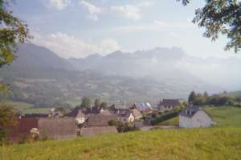

Code Markdown  
# Titre 1  
## Titre 2  
### Titre 3  
#### Titre 4  
##### Titre 5  

---
_italique_ normal **gras** **_gras-italique_** ~~barré~~ 

--- 
Une liste :
- A
- B
- C

---
Une autre liste :
1. D
2. E 
3. F 

---
Un lien :
[Homère](https://fr.wikipedia.org/wiki/Hom%C3%A8re)

Un lien qui s'ouvre dans un nouvel onglet ou fenêtre: 
[Homère](https://fr.wikipedia.org/wiki/Hom%C3%A8re){:target="_blank"}  

---
2 liens (Titre 5) :

##### [Homère](https://fr.wikipedia.org/wiki/Hom%C3%A8re)  
#####  [L'Iliade - Traduction (1955) de Robert Flacelière](https://www.academia.edu/69615506/Hom%C3%A8re_LIliade_et_LOdyss%C3%A9e_tr_Robert_Flaceli%C3%A8re_et_Victor_B%C3%A9rard_1955_)  
##### 8e siècle av. J.-C.
---
2 liens en liste : 
- [Homère](https://fr.wikipedia.org/wiki/Hom%C3%A8re)
- [L'Iliade - Traduction (1955) de Robert Flacelière](https://www.academia.edu/69615506/Hom%C3%A8re_LIliade_et_LOdyss%C3%A9e_tr_Robert_Flaceli%C3%A8re_et_Victor_B%C3%A9rard_1955_)  
- 8e siècleeee av. J.-C.  

---
Citation:
> La route est longue mais la voie est libre…
Enfin...  
Oui...  
Non...

---

Lien : 
[Site](http://gerard.paresys.free.fr)

Image : 

Image et texteTexteeee

Lien image : 

Lien texte + image [Baratin ](http://gerard.paresys.free.fr)

---

Un encart !
 

---

 Emoji et symboles :  📅  📝  ✉️ 

---
Code html :

<a href="https://fr.wikipedia.org/wiki/Mythologie_m%C3%A9sopotamienne" target="_blank">Mythologie mésopotamienne</a> 
<a href="https://fr.wikipedia.org/wiki/Mythe_d%27Atrahasis" target="_blank">Mythe d'Atrahasis</a> - Traduction de <a href="https://fr.wikipedia.org/wiki/Jean_Bott%C3%A9ro" target="_blank">Jean
Bottéro</a>&nbsp;? 
cité dans : <a href="https://theses.hal.science/tel-00770955v1/document" target="_blank">Bruit et émotion dans la littérature akkadienne</a> de
Anne-Caroline Rendu Loisel 
1600 av. J.-C. 
 
"Il ne s’était pas encore écoulé 1200 ans, que le pays augmenta, et le peuple devint trop nombreux. Comme un boeuf, le pays mugissait. Par leur vacarme, le dieu fut troublé. Enlil, ayant entendu leur tapage, déclara aux grands dieux : « le tapage de l’humanité est devenu trop pesant pour moi. Par leur vacarme, je suis privé de sommeil... qu’il y ait une peste. »"
 

 

<a href="https://fr.wikipedia.org/wiki/Hom%C3%A8re" target="_blank">  Homère</a>

<a href="https://philo-labo.fr/fichiers/Hom%C3%A8re_Odyssee.pdf" target="_blank">  Odyssée</a>

<a href="https://philo-labo.fr/fichiers/Hom%C3%A8re_Odyssee.pdf" target="_blank">&nbsp;Odyssée</a>   

Image Largeur 100%:   

---

<select>
<option value="Le roi de la pampa retourne sa chemise">Le roi de la pampa retourne sa chemise</option>
<option value="Lorsque tout est fini lorsque l'on agonise">Lorsque tout est fini lorsque l'on agonise</option>
<option value="Le cheval Parthénon s'énerve sur sa frise">Le cheval Parthénon s'énerve sur sa frise</option>
<option value="Le vieux marin breton de tabac prit sa prise">Le vieux marin breton de tabac prit sa prise</option>
<option value="C'était à cinq o'clock que sortait la marquise">C'était à cinq o'clock que sortait la marquise</option>            
<option value="Du jeune avantageux la nymphe était éprise">Du jeune avantageux la nymphe était éprise</option>
<option value="Il se penche il voudrait attraper sa valise">Il se penche il voudrait attraper sa valise</option>
<option value="Quand l'un avecque l'autre aussitôt sympathise">Quand l'un avecque l'autre aussitôt sympathise</option>
<option selected value="Lorsqu'un jour exalté l'aède prosaïse">Lorsqu'un jour exalté l'aède prosaïse</option>
<option value="Le marbre pour l'acide est une friandise">Le marbre pour l'acide est une friandise</option>
</select>
 
<select>
<option value="pour la mettre à sécher aux cornes des taureaux">pour la mettre à sécher aux cornes des taureaux</option>  
<option value="lorsque le marbrier astique nos tombeaux">lorsque le marbrier astique nos tombeaux</option>   
<option value="depuis que lord Elgin négligea ses naseaux">depuis que lord Elgin négligea ses naseaux</option>  
<option selected value="pour du fin fond du nez exciter les arceaux">pour du fin fond du nez exciter les arceaux</option>  
<option value="pour consommer un thé puis des petits gâteaux">pour consommer un thé puis des petits gâteaux</option>
<option value="snob un peu sur les bords des bords fondamentaux">snob un peu sur les bords des bords fondamentaux</option> 
<option value="que convoitait c'est sûr une horde d'escrocs">que convoitait c'est sûr une horde d'escrocs</option> 
<option value="se faire il pourrait bien que ce soit des jumeaux">se faire il pourrait bien que ce soit des jumeaux</option>
<option value="pour déplaire au profane aussi bien qu'aux idiots">pour déplaire au profane aussi bien qu'aux idiots</option>
<option value="d'aucuns par dessus tout prisent les escargots">d'aucuns par dessus tout prisent les escargots</option>  
</select>
 
<select>
<option value="le cornédbif en boîte empeste la remise">le cornédbif en boîte empeste la remise</option> 
<option selected value="des êtres indécis vous parlent sans franchise">des êtres indécis vous parlent sans franchise</option> 
<option value="le Turc de ce temps-là pataugeait dans sa crise">le Turc de ce temps-là pataugeait dans sa crise</option>  
<option value="sur l'antique bahut il choisit sa cerise">sur l'antique bahut il choisit sa cerise</option>   
<option value="le chauffeur indigène attendait dans la brise">le chauffeur indigène attendait dans la brise</option> 
<option value="une toge il portait qui n'était pas de mise">une toge il portait qui n'était pas de mise</option>  
<option value="il se penche et alors à sa grande surprise">il se penche et alors à sa grande surprise</option>  
<option value="la découverte alors voilà qui traumatise">la découverte alors voilà qui traumatise</option> 
<option value="la critique lucide aperçoit ce qu'il vise">la critique lucide aperçoit ce qu'il vise</option> 
<option value="sur la place un forain de feu se gargarise">sur la place un forain de feu se gargarise</option> 
</select>
 
<select>
<option value="et fermentent de même et les cuirs et les peaux">et fermentent de même et les cuirs et les peaux</option>
<option value="et tout vient signifier la fin des haricots">et tout vient signifier la fin des haricots</option>
<option value="il chantait tout de même oui mais il chantait faux">il chantait tout de même oui mais il chantait faux</option>
<option value="il n'avait droit qu'à une et le jour des Rameaux">il n'avait droit qu'à une et le jour des Rameaux</option>
<option value="elle soufflait bien fort par dessus les côteaux">elle soufflait bien fort par dessus les côteaux</option>
<option value="des narcisses on cueille ou bien on est des veaux">des narcisses on cueille ou bien on est des veaux</option>
<option value="il ne trouve aussi sec qu'un sac de vieux fayots">il ne trouve aussi sec qu'un sac de vieux fayots</option>
<option value="on espère toujours être de vrais normaux">on espère toujours être de vrais normaux</option>
<option selected value="il donne à la tribu des cris aux sens nouveaux">il donne à la tribu des cris aux sens nouveaux</option>
<option value="qui sait si le requin boulotte les turbots ?">qui sait si le requin boulotte les turbots ?</option>
</select>
 
 
<select>
<option value="Je me souviens encor de cette heure exeuquise">Je me souviens encor de cette heure exeuquise</option>
<option value="On vous fait devenir une orde marchandise">On vous fait devenir une orde marchandise</option> 
<option value="Le cheval Parthénon frissonait sous la bise">Le cheval Parthénon frissonait sous la bise</option>
<option value="Souvenez-vous amis de ces îles de Frise">Souvenez-vous amis de ces îles de Frise</option> 
<option value="On était bien surpris par cette plaine grise">On était bien surpris par cette plaine grise</option> 
<option value="Quand on prend des photos de cette tour de Pise">Quand on prend des photos de cette tour de Pise</option> 
<option selected value="Il déplore il déplore une telle mainmise">Il déplore il déplore une telle mainmise</option>
<option value="Et pourtant c'était lui le frère de feintise">Et pourtant c'était lui le frère de feintise</option> 
<option value="L'un et l'autre a raison non la foule insoumise">L'un et l'autre a raison non la foule insoumise</option> 
<option value="Du voisin le Papou suçote l'apophyse">Du voisin le Papou suçote l'apophyse</option> 
</select>
 
<select>
<option value="les gauchos dans la plaine agitaient leurs drapeaux">les gauchos dans la plaine agitaient leurs drapeaux</option> 
<option value="on prépare la route aux pensers sépulcraux">on prépare la route aux pensers sépulcraux</option> 
<option value="du client londonien où s'ébattent les beaux">du client londonien où s'ébattent les beaux</option>
<option value="où venaient par milliers s'échouer les harenceaux">où venaient par milliers s'échouer les harenceaux</option>
<option value="quand se carbonisait la fureur des châteaux">quand se carbonisait la fureur des châteaux</option> 
<option value="d'où Galilée jadis jeta ses petits pots">d'où Galilée jadis jeta ses petits pots</option>
<option value="qui se plaît à flouer de pauvres provinciaux">qui se plaît à flouer de pauvres provinciaux</option>
<option value="qui clochard devenant jetait ses oripeaux">qui clochard devenant jetait ses oripeaux</option> 
<option selected value="le vulgaire s'entête à vouloir des vers beaux">le vulgaire s'entête à vouloir des vers beaux</option>
<option value="que n'a pas dévoré la horde des mulots ?">que n'a pas dévoré la horde des mulots ?</option> 
</select>
 
<select>
<option value="nous avions aussi froids que nus sur la banquise">nous avions aussi froids que nus sur la banquise</option> 
<option value="de la mort on vous greffe une orde b&acirc;tardise">de la mort on vous greffe une orde bâtardise</option> 
<option selected value="il grelottait le pauvre aux bords de la Tamise">il grelottait le pauvre aux bords de la Tamise</option> 
<option value="nous regrettions un peu ce tas de marchandise">nous regrettions un peu ce tas de marchandise</option> 
<option value="un audacieux baron empoche toute accise">un audacieux baron empoche toute accise</option>
<option value="d'une &eacute;trusque inscription la pierre &eacute;tait incise"> d'une étrusque inscription la pierre était incise</option> 
<option value="aller &agrave; la grande ville est bien une entreprise">aller à la grande ville est bien une entreprise</option>
<option value="un fr&egrave;re m&ecirc;me bas est la part ind&eacute;cise">un frère même bas est la part indécise</option>
<option value="l'un et l'autre ont raison non la foule impr&eacute;cise">l'un et l'autre ont raison non la foule imprécise</option>   
<option value="le gourmet en salade avale la cytise">le gourmet en salade avale la cytise</option>   
</select>
 
<select>
<option value="lorsque pour nous distraire y plantions nos tr&eacute;teaux">lorsque pour nous distraire y plantions nos tréteaux</option>  
<option value="la mite a grignot&eacute; tissus os et rideaux">la mite a grignoté tissus os et rideaux</option>  
<option value="quand les gr&eacute;lons gin mars mitraillent les bateaux">quand les grélons gin mars mitraillent les bateaux</option> 
<option value="lorsqu'on voyait au loin flamber les arbrisseaux">lorsqu'on voyait au loin flamber les arbrisseaux</option> 
<option value="lorsque vient le pompier avec ces grandes eaux">lorsque vient le pompier avec ces grandes eaux</option> 
<option selected value="les Grecs et les Romains en vain cherchent leurs mots">les Grecs et les Romains en vain cherchent leurs mots</option> 
<option value="elle effraie le Berry comme les Morvandiaux">elle effraie le Berry comme les Morvandiaux</option>
<option value="que les parents f&eacute;conds offrent aux purs berceaux">Qque les parents féconds offrent aux purs berceaux</option> 
<option value="à tous n'est pas donn&eacute; d'aimer les chocs verbaux">à tous n'est pas donné d'aimer les chocs verbaux</option> 
<option value="l'enfant pur aux yeux bleus aime les berlingots">l'enfant pur aux yeux bleus aime les berlingots</option> 
</select>
 
 
<select>
<option value="Du p&ocirc;le &agrave; Rosario fait une belle trotte">Du p&ocirc;le &agrave; Rosario fait une belle trotte</option> 
<option selected value="Le brave a beau crier ah cr&eacute; non saperlotte">Le brave a beau crier ah cr&eacute; non saperlotte</option> 
<option value="La Gr&egrave;ce de Platon &agrave; coup s&ucirc;r n'est point sotte">La Gr&egrave;ce de Platon &agrave; coup s&ucirc;r n'est point sotte</option>
<option value="On s&egrave;che le poisson dorade ou molve lotte">On s&egrave;che le poisson dorade ou molve lotte</option>   
<option value="Du Gange au Malabar le lord anglais zozotte">Du Gange au Malabar le lord anglais zozotte</option>
<option value="L'esprit souffle et resouffle au-dessous de la botte">L'esprit souffle et resouffle au-dessous de la botte</option> 
<option value="Devant la boue urbaine on retrousse sa cotte">Devant la boue urbaine on retrousse sa cotte</option>
<option value="Le g&eacute;n&eacute;alogiste observe leur bouillotte">Le g&eacute;n&eacute;alogiste observe leur bouillotte</option>  
<option value="Le po&egrave;te inspir&eacute; n'est point une polyglotte">Le po&egrave;te inspir&eacute; n'est point une polyglotte</option>
<option value="Le loup est amateur de coq et de cocotte">Le loup est amateur de coq et de cocotte</option>
</select>
 
<select>
<option value="aventures on eut qui s'y pique s'y frotte">aventures on eut qui s'y pique s'y frotte</option>  
<option value="le l&acirc;che peut arguer de sa mine p&acirc;lotte">le l&acirc;che peut arguer de sa mine p&acirc;lotte</option> 
<option value="on comptait les esprits ac&eacute;r&eacute;s &agrave; la hotte">on comptait les esprits ac&eacute;r&eacute;s &agrave; la hotte</option> 
<option value="on sale le requin on fume &agrave; l'&eacute;chalotte">on sale le requin on fume &agrave; l'&eacute;chalotte</option>  
<option value="comme &agrave; Chandernagor le manant sent la crotte">comme &agrave; Chandernagor le manant sent la crotte</option> 
<option value="le touriste &agrave; Florence ignoble charibotte">le touriste &agrave; Florence ignoble charibotte</option>   
<option value="on gifle le marmot qui plonge sa menotte">on gifle le marmot qui plonge sa menotte</option>  
<option value="gratter le parchemin deviendra sa marotte">gratter le parchemin deviendra sa marotte</option>      
<option selected value="une langue suffit pour emplir sa cagnotte">une langue suffit pour emplir sa cagnotte</option> 
<option value="le chat fait un festin de t&ecirc;tes de linotte">le chat fait un festin de t&ecirc;tes de linotte</option> 
</select>
 
<select>
<option value="lorsqu'on boit du mat&eacute; l'on devient argentin">lorsqu'on boit du mat&eacute; l'on devient argentin</option>
<option value="les croque-morts sont l&agrave; pour se mettre au turbin">les croque-morts sont l&agrave; pour se mettre au turbin</option>
<option value="lorsque Socrate mort passait pour un lutin">lorsque Socrate mort passait pour un lutin</option> 
<option value="lorsqu'on revient au port en essuyant un grain">lorsqu'on revient au port en essuyant un grain</option> 
<option value="le colonel s'&eacute;ponge un blason dans la main">le colonel s'&eacute;ponge un blason dans la main</option>
<option selected value="l'autocar &eacute;crabouille un peu l'esprit latin">l'autocar &eacute;crabouille un peu l'esprit latin</option> 
<option value="lorsqu'il voit la gadoue il cherche le purin">lorsqu'il voit la gadoue il cherche le purin</option> 
<option value="il voudra retrouver le germe adult&eacute;rin">il voudra retrouver le germe adult&eacute;rin</option> 
<option value="m&ecirc;me s'il prend son sel au celte c'est son bien">m&ecirc;me s'il prend son sel au celte c'est son bien</option>
<option value="le chemin vicinal se nourrit de crottin">le chemin vicinal se nourrit de crottin</option> 
</select>
 
 
<select>
<option  value="L'Am&eacute;rique du Sud s&eacute;duit les &eacute;quivoques">L'Am&eacute;rique du Sud s&eacute;duit les &eacute;quivoques</option>
<option value="Cela consid&eacute;rant &ocirc; lecteur tu suffoques">Cela consid&eacute;rant &ocirc; lecteur tu suffoques</option>
<option value="Sa sculpture est illustre et dans le fond des coques">Sa sculpture est illustre et dans le fond des coques</option> 
<option value="Enfin on vend le tout homards et salicoques">Enfin on vend le tout homards et salicoques</option> 
<option selected value="Ne fallait pas si loin agiter les breloques">Ne fallait pas si loin agiter les breloques</option>
<option value="Les rapports transalpins sont-ils biunivoques ?">Les rapports transalpins sont-ils biunivoques ?</option>  
<option value="On regrette &agrave; la fin les agrestes bicoques">On regrette &agrave; la fin les agrestes bicoques</option> 
<option value="Fr&egrave;re je te comprends si parfois tu d&eacute;bloques">Fr&egrave;re je te comprends si parfois tu d&eacute;bloques</option> 
<option value="Barde que tu me plais toujours tu soliloques">Barde que tu me plais toujours tu soliloques</option>
<option value="On a bu du pinard &agrave; toutes les &eacute;poques">On a bu du pinard &agrave; toutes les &eacute;poques</option>
</select>
 
<select>
<option selected value="exaltent l'espagnol les oreilles baroques">exaltent l'espagnol les oreilles baroques</option> 
<option value="comptant tes abattis lecteur tu te disloques">comptant tes abattis lecteur tu te disloques</option> 
<option value="on transporte et le marbre et d&eacute;bris et d&eacute;froques">on transporte et le marbre et d&eacute;bris et d&eacute;froques</option>
<option value="on s'excuse il n'y a ni baleines ni phoques">on s'excuse il n'y a ni baleines ni phoques</option>
<option value="les Indes ont assez sans &ccedil;a de pendeloques">les Indes ont assez sans &ccedil;a de pendeloques</option> 
<option value="les banquiers d'Avignon changent-ils les ba&iuml;ques ?">les banquiers d'Avignon changent-ils les ba&iuml;ques ?</option> 
<option value="on mettait sans fa&ccedil;on ses plus infectes loques">on mettait sans fa&ccedil;on ses plus infectes loques</option> 
<option value="fr&egrave;re je t'absoudrai si tu m'emberlucoques">fr&egrave;re je t'absoudrai si tu m'emberlucoques</option> 
<option value="tu me stup&eacute;fies plus que tous les ventriloques">tu me stup&eacute;fies plus que tous les ventriloques</option>
<option value="grignoter des bretzels distrait bien des colloques">grignoter des bretzels distrait bien des colloques</option>  
</select>
 
<select>
<option selected value="si la cloche se tait et son terlintintin">si la cloche se tait et son terlintintin</option>
<option value="toute chose pourtant doit avoir une fin">toute chose pourtant doit avoir une fin</option>
<option value="si l'Europe le veut l'Europe ou son destin">si l'Europe le veut l'Europe ou son destin</option>
<option value="le mammif&egrave;re est roi nous sommes son cousin">le mammif&egrave;re est roi nous sommes son cousin</option>
<option value="l'&eacute;cu de vair ou d'or ne dure qu'un matin">l'&eacute;cu de vair ou d'or ne dure qu'un matin</option>
<option value="le Beaune et le Chianti sont-ils le m&ecirc;me vin ?">le Beaune et le Chianti sont-ils le m&ecirc;me vin ?</option>
<option value="mais on n'aurait pas vu le m&eacute;tropolitain">mais on n'aurait pas vu le m&eacute;tropolitain</option>
<option value="la g&eacute;mellit&eacute; vraie accuse son destin">la g&eacute;mellit&eacute; vraie accuse son destin</option>
<option value="le m&eacute;tromane &agrave; force incarne le devin">le m&eacute;tromane &agrave; force incarne le devin</option>
<option value="mais rien de vaut grill&eacute; le morceau de boudin">mais rien de vaut grill&eacute; le morceau de boudin</option>
</select>
 

---
Player Audio mp3:

<audio style="width: 100%" controls="controls"><source type="audio/mpeg" src="audio/Goch-Dwa-CreoleHaitien.mp3"> 
</source></audio>   Goch-Dwa-CreoleHaitien.mp3

Placer le fichier "Goch-Dwa-CreoleHaitien.mp3" dans un dossier "audio"

---
SoundCloud:

<iframe width="100%" height="166" scrolling="no" frameborder="no" allow="autoplay" src="https://w.soundcloud.com/player/?url=https%3A//api.soundcloud.com/tracks/soundcloud%253Atracks%253A300549733&color=%23ff5500&auto_play=false&hide_related=true&show_comments=false&show_user=false&show_reposts=false&show_teaser=false"></iframe>
<a href="https://soundcloud.com/gerard-paresys" title="Gerard Paresys" target="_blank" style="color: #cccccc; text-decoration: none;">Gerard Paresys</a> · <a href="https://soundcloud.com/gerard-paresys/bird1" title="Bird1" target="_blank" style="color: #cccccc; text-decoration: none;">Bird1</a>

--- 
Player Video  
<video controls width="100%">
<source src="video/Bruges-0673-640x480-Handbrake.mp4" type="video/mp4" />
</video>

Bruges-0673-640x480-Handbrake.mp4  

---   

Player Vimeo Ancien

<iframe src="//player.vimeo.com/video/109319992?title=0&amp;byline=0&amp;portrait=0" frameborder="0" height="439" width="600"></iframe>

Player Vimeo Nouveau

<iframe src="https://player.vimeo.com/video/109319992?badge=0&amp;autopause=0&amp;player_id=0&amp;app_id=58479" frameborder="0" allow="autoplay; fullscreen; picture-in-picture; clipboard-write; encrypted-media; web-share" referrerpolicy="strict-origin-when-cross-origin" style="position:absolute;top:0;left:0;width:100%;height:100%;" title="echelle1"></iframe>

---  
YouTube:

<iframe width="560" height="315" src="https://www.youtube.com/embed/e5l6jFGavMU?si=_I93L_wmlJl7gJbR" title="YouTube video player" frameborder="0" allow="accelerometer; autoplay; clipboard-write; encrypted-media; gyroscope; picture-in-picture; web-share" referrerpolicy="strict-origin-when-cross-origin" allowfullscreen></iframe>

Fin 